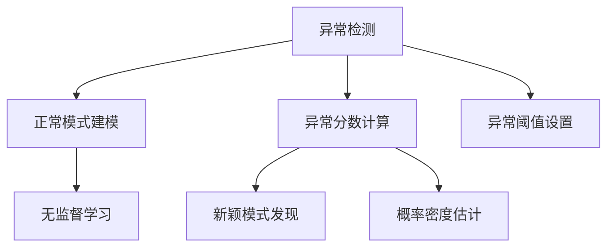

# Python机器学习实战：机器学习中的异常检测技术

## 1.背景介绍

在现实世界中,异常情况无处不在。无论是网络入侵检测、制造业产品质量检测,还是金融欺诈识别,异常检测都扮演着至关重要的角色。异常检测技术旨在从大量数据中识别出那些不符合预期行为模式的"异常"数据点或事件,从而发现潜在的问题、威胁或新的机会。

随着数据量的不断增长和复杂性的提高,传统的基于规则的异常检测方法已经不再有效。机器学习算法为异常检测提供了新的解决方案,能够自动从历史数据中学习正常模式,并对新数据进行评分和异常排名。Python作为流行的数据科学编程语言,提供了丰富的机器学习库,使得开发异常检测模型变得高效便捷。

## 2.核心概念与联系

异常检测的核心概念包括:

1. **正常模式建模**:利用机器学习算法从正常数据中学习正常行为模式。
2. **异常分数计算**:对新数据点计算异常分数,表示其与正常模式的偏离程度。
3. **异常阈值设置**:根据异常分数设置阈值,将数据划分为正常和异常两类。

异常检测与其他机器学习任务有着密切联系:

- **无监督学习**:大多数异常检测算法属于无监督学习范畴,因为训练数据通常不包含异常标签。
- **新颖模式发现**:异常检测可视为新颖模式发现的一种特例,旨在发现偏离正常模式的新颖数据。
- **概率密度估计**:许多异常检测算法基于概率密度估计,将低概率密度区域标记为异常。



## 3.核心算法原理具体操作步骤

异常检测算法可分为多种类型,每种类型都有其特定的原理和操作步骤。以下是几种常见算法的核心原理和具体步骤:

### 3.1 基于统计的异常检测

**原理**:基于统计的异常检测算法假设正常数据服从某种已知的概率分布(如高斯分布),异常数据点则位于分布的低概率密度区域。

**步骤**:

1. 选择合适的概率分布模型(如高斯分布)。
2. 从训练数据估计概率分布的参数(如均值和协方差)。
3. 对新数据点计算概率密度值或马氏距离。
4. 设置异常阈值,低于阈值的数据点被标记为异常。

### 3.2 基于聚类的异常检测

**原理**:基于聚类的异常检测算法将数据划分为多个簇,离簇心较远的数据点被视为异常。

**步骤**:

1. 选择合适的聚类算法(如K-Means或DBSCAN)。
2. 在训练数据上运行聚类算法,得到簇心和簇分配。
3. 计算每个数据点到其所属簇心的距离。
4. 设置异常阈值,超过阈值的数据点被标记为异常。

### 3.3 基于隔离的异常检测

**原理**:基于隔离的异常检测算法(如Isolation Forest)通过随机分割特征空间,将异常点隔离到较小的区域中。异常点需要更少的分割步骤即可被隔离。

**步骤**:

1. 构建隔离树集合,每棵树通过随机选择特征和分割值对数据进行递归分割。
2. 计算每个数据点的路径长度(分割步骤数)。
3. 将较短路径长度的数据点标记为异常,因为它们更容易被隔离。

### 3.4 基于神经网络的异常检测

**原理**:基于神经网络的异常检测算法(如自编码器)通过训练神经网络从正常数据中学习潜在表示,将重构误差较大的数据点视为异常。

**步骤**:

1. 构建神经网络模型(如自编码器),包括编码器和解码器部分。
2. 在正常训练数据上训练神经网络,使其学习正常数据的潜在表示。
3. 对新数据点进行前向传播,计算输入与重构输出之间的误差。
4. 设置异常阈值,误差较大的数据点被标记为异常。

## 4.数学模型和公式详细讲解举例说明

异常检测算法通常涉及一些数学模型和公式,以下将详细讲解其中几个重要概念:

### 4.1 马氏距离

马氏距离(Mahalanobis Distance)是一种测量数据点与分布中心的距离的方法,它考虑了分布的协方差结构。对于d维随机向量$\mathbf{x}$,其与均值向量$\boldsymbol{\mu}$的马氏距离定义为:

$$D_M(\mathbf{x}) = \sqrt{(\mathbf{x}-\boldsymbol{\mu})^T\Sigma^{-1}(\mathbf{x}-\boldsymbol{\mu})}$$

其中$\Sigma$是协方差矩阵。马氏距离可用于基于统计的异常检测算法,将距离较大的数据点标记为异常。

**示例**:假设我们有一个二维数据集,其均值为$\boldsymbol{\mu} = (0, 0)$,协方差矩阵为$\Sigma = \begin{bmatrix}1&0.5\\0.5&1\end{bmatrix}$。对于数据点$\mathbf{x} = (2, 1)$,其马氏距离为:

$$D_M(\mathbf{x}) = \sqrt{(2, 1)\begin{bmatrix}1&-0.5\\-0.5&1\end{bmatrix}\begin{bmatrix}2\\1\end{bmatrix}} = \sqrt{2.5} \approx 1.58$$

### 4.2 核密度估计

核密度估计(Kernel Density Estimation, KDE)是一种非参数密度估计方法,它通过将核函数(如高斯核)叠加在每个数据点上,从而估计数据的概率密度函数。对于d维数据集$\{\mathbf{x}_1, \mathbf{x}_2, \ldots, \mathbf{x}_n\}$,其核密度估计为:

$$\hat{f}_h(\mathbf{x}) = \frac{1}{n}\sum_{i=1}^n K_h(\mathbf{x}-\mathbf{x}_i)$$

其中$K_h(\cdot)$是带宽为$h$的核函数,通常选择高斯核:

$$K_h(\mathbf{x}) = \frac{1}{(2\pi)^{d/2}h^d} \exp\left(-\frac{1}{2}\left\|\frac{\mathbf{x}}{h}\right\|^2\right)$$

KDE可用于基于统计的异常检测算法,将低概率密度区域的数据点标记为异常。

**示例**:假设我们有一个一维数据集$\{1, 2, 3, 4, 5\}$,使用高斯核进行核密度估计,带宽$h=1$。对于数据点$x=6$,其概率密度估计为:

$$\begin{aligned}
\hat{f}_1(6) &= \frac{1}{5}\left[\frac{1}{\sqrt{2\pi}}\exp\left(-\frac{(6-1)^2}{2}\right) + \frac{1}{\sqrt{2\pi}}\exp\left(-\frac{(6-2)^2}{2}\right) + \cdots + \frac{1}{\sqrt{2\pi}}\exp\left(-\frac{(6-5)^2}{2}\right)\right]\\
&\approx 0.0301
\end{aligned}$$

由于$x=6$位于数据集的边缘,其概率密度较低,因此可能被标记为异常。

### 4.3 隔离森林

隔离森林(Isolation Forest)是一种基于隔离的异常检测算法,它通过随机分割特征空间,将异常点隔离到较小的区域中。对于每个数据点$\mathbf{x}$,算法计算其路径长度$c(\mathbf{x})$,即将其隔离所需的分割步骤数。路径长度的期望值为:

$$E(c(\mathbf{x})) = 2H(n-1)$$

其中$n$是数据集大小,$H(\cdot)$是$n$的平方根的无偏估计。异常分数定义为:

$$s(\mathbf{x}, n) = 2^{-\frac{E(c(\mathbf{x}))}{c(\mathbf{x})}}$$

异常分数越小,数据点越可能是异常。

**示例**:假设我们有一个二维数据集,包含10个数据点。对于数据点$\mathbf{x} = (10, 10)$,其路径长度为$c(\mathbf{x}) = 8$。由于$n=10$,因此$E(c(\mathbf{x})) = 2H(9) \approx 5.25$。则异常分数为:

$$s(\mathbf{x}, 10) = 2^{-\frac{5.25}{8}} \approx 0.37$$

由于异常分数较小,因此$\mathbf{x}$可能是一个异常点。

## 5.项目实践:代码实例和详细解释说明

在本节中,我们将通过一个实际项目案例,演示如何使用Python中的机器学习库(如scikit-learn和PyOD)实现异常检测算法。

### 5.1 数据准备

我们将使用scikit-learn内置的一个玩具数据集,它模拟了一个包含异常点的高斯分布。

```python
from sklearn.datasets import make_blobs
import matplotlib.pyplot as plt

# 生成模拟数据
X, y = make_blobs(n_samples=1000, centers=1, n_features=2, center_box=(-10, 10), cluster_std=0.5, random_state=42)

# 绘制数据散点图
plt.scatter(X[:, 0], X[:, 1], s=5)
plt.show()
```

### 5.2 基于统计的异常检测

我们将使用scikit-learn中的EllipticEnvelope类实现基于统计的异常检测算法。

```python
from sklearn.covariance import EllipticEnvelope

# 初始化EllipticEnvelope对象
ee = EllipticEnvelope(contamination=0.1)

# 训练模型
ee.fit(X)

# 预测异常分数
anomaly_scores = ee.decision_function(X)

# 绘制异常分数直方图
plt.hist(anomaly_scores, bins=50)
plt.show()
```

### 5.3 基于隔离的异常检测

接下来,我们将使用PyOD库中的IsolationForest类实现基于隔离的异常检测算法。

```python
from pyod.models.iforest import IsolationForest

# 初始化IsolationForest对象
if_model = IsolationForest(contamination=0.1)

# 训练模型
if_model.fit(X)

# 预测异常分数
anomaly_scores = if_model.decision_function(X)

# 绘制异常分数直方图
plt.hist(anomaly_scores, bins=50)
plt.show()
```

### 5.4 评估结果

最后,我们将使用scikit-learn中的roc_auc_score函数评估异常检测模型的性能。

```python
from sklearn.metrics import roc_auc_score

# 计算ROC AUC分数
auc_score_ee = roc_auc_score(y, anomaly_scores_ee)
auc_score_if = roc_auc_score(y, anomaly_scores_if)

print(f"EllipticEnvelope ROC AUC: {auc_score_ee:.3f}")
print(f"IsolationForest ROC AUC: {auc_score_if:.3f}")
```

通过上述代码示例,您可以看到如何使用Python中的机器学习库实现异常检测算法,包括数据准备、模型训练、异常分数计算和性能评估等步骤。您还可以尝试其他算法,如基于聚类或神经网络的异常检测算法,并根据具体需求调整参数和预处理步骤。

## 6.实际应用场景

异常检测技术在许多领域都有广泛的应用,以下是一些典型的应用场景:

1. **网络安全**:通过异常检测可以识别网络入侵行为、恶意软件活动等安全威胁。
2. **金融欺诈检测**:异常检测可用于发现信用卡欺诈、洗钱活动等金融犯罪。
3. **制造业质量控制**:在生产线上,异常检测可以发现产品缺陷和制造过