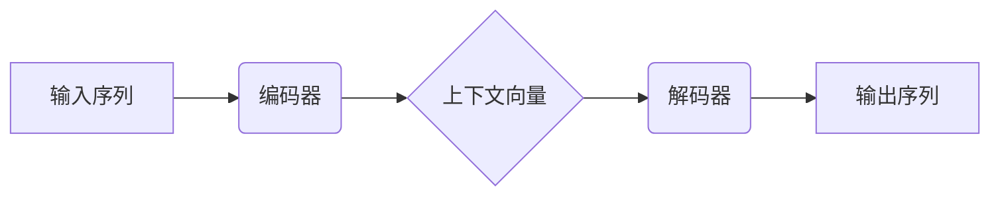
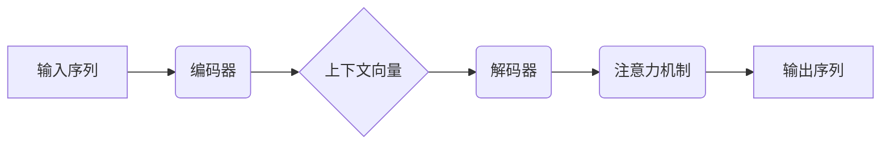

# Python机器学习实战：构建序列到序列(Seq2Seq)模型处理翻译任务

## 1.背景介绍

### 1.1 机器翻译的重要性

在当今全球化的世界中,有效的跨语言沟通对于促进文化交流、商业往来和国际合作至关重要。机器翻译技术的发展为克服语言障碍提供了强有力的支持,使得人类能够轻松地获取和理解不同语言的信息。

### 1.2 机器翻译发展历程

早期的机器翻译系统主要基于规则和词典,通过语法分析和词语替换实现翻译。但这种方法存在局限性,难以处理复杂的语义和语境信息。近年来,随着深度学习和神经网络技术的飞速发展,序列到序列(Sequence-to-Sequence,Seq2Seq)模型应运而生,为机器翻译带来了革命性的突破。

### 1.3 Seq2Seq模型的优势

Seq2Seq模型能够自动学习源语言和目标语言之间的映射关系,无需人工制定复杂的规则。它可以端到端地将一个序列(如源语言句子)映射到另一个序列(如目标语言句子),并能较好地捕捉语义和上下文信息。这种数据驱动的方法显著提高了翻译质量,使机器翻译更加智能和人性化。

## 2.核心概念与联系

### 2.1 编码器-解码器架构

Seq2Seq模型采用了编码器-解码器(Encoder-Decoder)架构,如下图所示:



编码器将输入序列(如源语言句子)编码为上下文向量,捕获其语义和上下文信息。解码器则根据上下文向量生成输出序列(如目标语言句子)。

### 2.2 注意力机制

为了更好地捕捉长期依赖关系,Seq2Seq模型引入了注意力机制(Attention Mechanism)。注意力机制允许解码器在生成每个目标词时,selectively关注源序列中的不同部分,从而提高了翻译质量。



### 2.3 Beam Search

在生成目标序列时,Beam Search算法常被用于寻找可能的最优译文。它通过并行探索多个候选译文,并基于概率分数保留前K个最可能的候选项,从而提高了翻译质量和效率。

## 3.核心算法原理具体操作步骤

### 3.1 数据预处理

在构建Seq2Seq模型之前,需要对输入数据进行预处理,包括分词、构建词典、填充序列等步骤,以将原始文本转换为模型可识别的数字序列。

### 3.2 嵌入层

将输入序列中的每个词映射为一个固定长度的向量表示,称为词嵌入(Word Embedding)。这种分布式表示能够捕捉词与词之间的语义关系。

### 3.3 编码器

编码器通常由多层递归神经网络(如LSTM或GRU)组成,对输入序列进行编码,生成上下文向量。每个时间步的隐藏状态都会被传递到下一时间步,从而捕获序列的长期依赖关系。

### 3.4 解码器

解码器也是一个递归神经网络,它根据上下文向量和注意力机制生成目标序列。在每个时间步,解码器会输出一个概率分布,表示下一个词的可能性。通过选择概率最大的词或使用Beam Search算法,可以得到最终的译文。

### 3.5 注意力机制

注意力机制允许解码器在生成每个目标词时,selectively关注源序列中的不同部分。它通过计算查询向量(来自解码器)和键向量(来自编码器)之间的相似性得分,从而确定应该关注源序列的哪些部分。

### 3.6 模型训练

Seq2Seq模型通常使用最大似然估计(Maximum Likelihood Estimation)进行训练,目标是最小化训练数据中目标序列与模型输出序列之间的交叉熵损失。常用的优化算法包括随机梯度下降(SGD)、Adam等。

## 4.数学模型和公式详细讲解举例说明

### 4.1 序列建模

给定一个源语言序列 $X = (x_1, x_2, ..., x_T)$ 和目标语言序列 $Y = (y_1, y_2, ..., y_{T'})$,Seq2Seq模型的目标是学习条件概率分布 $P(Y|X)$。根据链式法则,我们可以将其分解为:

$$P(Y|X) = \prod_{t=1}^{T'} P(y_t|y_{<t}, X)$$

其中 $y_{<t}$ 表示目标序列中位于时间步 $t$ 之前的所有词。

### 4.2 编码器

编码器的目标是将输入序列 $X$ 映射为上下文向量 $c$,捕获其语义和上下文信息。常用的编码器是递归神经网络(如LSTM或GRU),其隐藏状态在每个时间步都会被更新:

$$h_t = f(x_t, h_{t-1})$$

其中 $f$ 是递归函数,如LSTM或GRU。最终的上下文向量 $c$ 通常取自最后一个时间步的隐藏状态,即 $c = h_T$。

### 4.3 注意力机制

注意力机制允许解码器在生成每个目标词时,selectively关注源序列中的不同部分。具体来说,在时间步 $t$,注意力权重 $\alpha_{t,i}$ 表示解码器对源序列第 $i$ 个位置的关注程度,可以通过以下公式计算:

$$\alpha_{t,i} = \frac{\exp(e_{t,i})}{\sum_{j=1}^T \exp(e_{t,j})}$$

$$e_{t,i} = a(s_t, h_i)$$

其中 $s_t$ 是解码器在时间步 $t$ 的隐藏状态, $h_i$ 是编码器在位置 $i$ 的隐藏状态, $a$ 是一个对齐模型(如多层感知机)。

然后,注意力向量 $a_t$ 可以通过对编码器隐藏状态的加权求和得到:

$$a_t = \sum_{i=1}^T \alpha_{t,i} h_i$$

注意力向量 $a_t$ 将与解码器的隐藏状态 $s_t$ 一起,用于预测下一个目标词 $y_t$。

### 4.4 解码器

解码器的目标是根据上下文向量 $c$ 和注意力向量 $a_t$ 生成目标序列。常用的解码器也是一个递归神经网络,其隐藏状态在每个时间步都会被更新:

$$s_t = f(y_{t-1}, s_{t-1}, c, a_t)$$

其中 $f$ 是递归函数,如LSTM或GRU。解码器在每个时间步会输出一个概率分布 $P(y_t|y_{<t}, X)$,表示下一个目标词的可能性。通过选择概率最大的词或使用Beam Search算法,可以得到最终的译文。

### 4.5 模型训练

Seq2Seq模型通常使用最大似然估计(Maximum Likelihood Estimation)进行训练,目标是最小化训练数据中目标序列与模型输出序列之间的交叉熵损失:

$$\mathcal{L}(\theta) = -\frac{1}{N} \sum_{n=1}^N \sum_{t=1}^{T_n'} \log P(y_t^{(n)}|y_{<t}^{(n)}, X^{(n)}; \theta)$$

其中 $N$ 是训练样本数, $T_n'$ 是第 $n$ 个样本的目标序列长度, $\theta$ 是模型参数。常用的优化算法包括随机梯度下降(SGD)、Adam等。

## 5.项目实践：代码实例和详细解释说明

以下是使用PyTorch构建Seq2Seq模型处理英语到法语翻译任务的代码示例,并对关键步骤进行了详细解释。

### 5.1 数据预处理

```python
import torch
from torchtext.legacy import data, datasets

# 加载数据集
train_data, valid_data, test_data = datasets.Multi30k(language_pair=('en', 'fr'))

# 构建词典
EN = data.Field(tokenize='spacy', init_token='<sos>', eos_token='<eos>')
FR = data.Field(tokenize='spacy', init_token='<sos>', eos_token='<eos>')

fields = {'en': ('en', EN), 'fr': ('fr', FR)}
train_data, valid_data, test_data = data.TabularDataset.splits(
    path='data/', train='train.csv', validation='val.csv', test='test.csv', format='csv', fields=fields)

EN.build_vocab(train_data, max_size=50000)
FR.build_vocab(train_data, max_size=50000)
```

解释:
- 首先加载Multi30k数据集,包含英语和法语句子对
- 构建英语和法语的词典(vocabulary),用于将词映射为数字索引
- 使用spaCy进行分词,并添加起始和结束标记
- 将数据集划分为训练集、验证集和测试集

### 5.2 定义模型

```python
import torch.nn as nn

class Encoder(nn.Module):
    def __init__(self, input_dim, emb_dim, enc_hid_dim, dec_hid_dim, dropout):
        super().__init__()
        self.embedding = nn.Embedding(input_dim, emb_dim)
        self.rnn = nn.GRU(emb_dim, enc_hid_dim, bidirectional=True)
        self.fc = nn.Linear(enc_hid_dim * 2, dec_hid_dim)
        self.dropout = nn.Dropout(dropout)

    def forward(self, src):
        embedded = self.dropout(self.embedding(src))
        outputs, hidden = self.rnn(embedded)
        hidden = torch.tanh(self.fc(torch.cat((hidden[-2,:,:], hidden[-1,:,:]), dim=1)))
        return outputs, hidden

class Attention(nn.Module):
    def __init__(self, enc_hid_dim, dec_hid_dim):
        super().__init__()
        self.attn = nn.Linear((enc_hid_dim * 2) + dec_hid_dim, dec_hid_dim)
        self.v = nn.Linear(dec_hid_dim, 1, bias=False)

    def forward(self, hidden, encoder_outputs):
        batch_size = encoder_outputs.shape[1]
        src_len = encoder_outputs.shape[0]
        hidden = hidden.unsqueeze(1).repeat(1, src_len, 1)
        encoder_outputs = encoder_outputs.permute(1, 0, 2)
        energy = torch.tanh(self.attn(torch.cat((hidden, encoder_outputs), dim=2)))
        attention = self.v(energy).squeeze(2)
        return torch.softmax(attention, dim=1)

class Decoder(nn.Module):
    def __init__(self, output_dim, emb_dim, enc_hid_dim, dec_hid_dim, dropout, attention):
        super().__init__()
        self.output_dim = output_dim
        self.attention = attention
        self.embedding = nn.Embedding(output_dim, emb_dim)
        self.rnn = nn.GRU((enc_hid_dim * 2) + emb_dim, dec_hid_dim)
        self.fc_out = nn.Linear((enc_hid_dim * 2) + dec_hid_dim + emb_dim, output_dim)
        self.dropout = nn.Dropout(dropout)

    def forward(self, input, hidden, encoder_outputs):
        input = input.unsqueeze(0)
        embedded = self.dropout(self.embedding(input))
        a = self.attention(hidden, encoder_outputs)
        a = a.unsqueeze(1)
        encoder_outputs = encoder_outputs.permute(1, 0, 2)
        weighted = torch.bmm(a, encoder_outputs)
        weighted = weighted.permute(1, 0, 2)
        rnn_input = torch.cat((embedded, weighted), dim=2)
        output, hidden = self.rnn(rnn_input, hidden.unsqueeze(0))
        embedded = embedded.squeeze(0)
        output = output.squeeze(0)
        weighted = weighted.squeeze(0)
        prediction = self.fc_out(torch.cat((output, weighted, embedded), dim=1))
        return prediction, hidden.squeeze(0)

class Seq2Seq(nn.Module):
    def __init__(self, encoder, decoder, device):
        super().__init__()
        self.encoder = encoder
        self.decoder = decoder
        self.device = device

    def forward(self, src, trg, teacher_forcing_ratio=0.5):
        batch_size = src.shape[1]
        trg_len = trg.shape[0]
        trg_vocab_size = self.decoder.output_dim
        outputs = torch.zeros(trg_len, batch_size, trg_