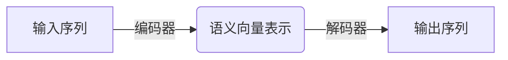
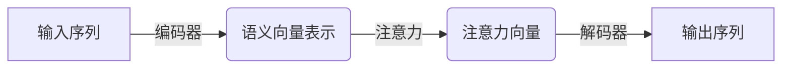
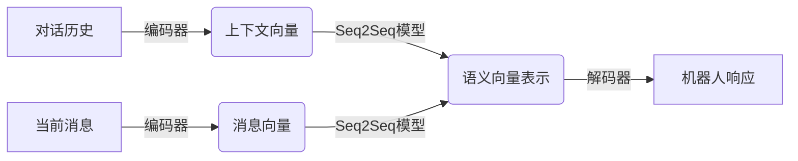
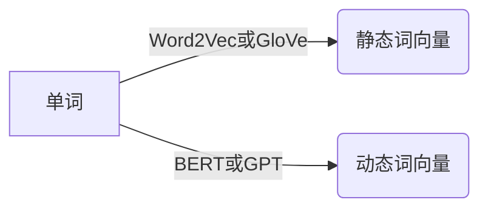
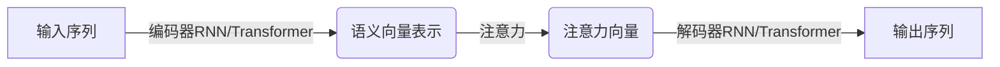
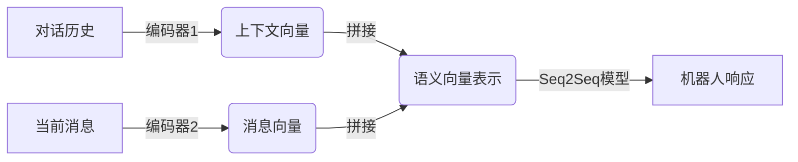
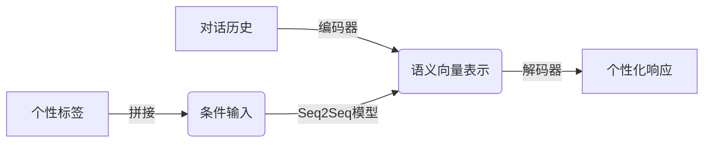
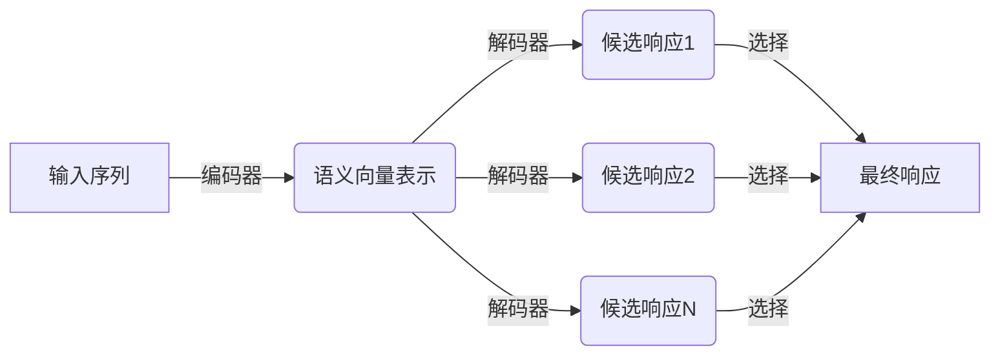

# Python深度学习实践：基于深度学习的个性化聊天机器人

## 1.背景介绍

随着人工智能技术的飞速发展,聊天机器人应用已经渗透到各个领域,成为人机交互的重要桥梁。传统的基于规则的聊天机器人存在响应僵硬、无法处理开放域对话等缺陷,而基于深度学习的聊天机器人能够通过大规模数据训练,理解自然语言的语义,生成更加人性化、个性化的响应。

### 1.1 聊天机器人的发展历程

聊天机器人最早可追溯到1966年麻省理工学院的Weizenbaum教授开发的ELIZA系统。ELIZA通过模式匹配和预设的响应规则来模拟一个心理咨询师。虽然ELIZA看似"智能",但实际上只是简单的字符串匹配和替换。

20世纪90年代,基于规则的聊天机器人系统如A.L.I.C.E、Jabberwacky等开始出现,通过大量的知识库和语义规则来匹配输入并生成响应。然而,这些系统的响应质量依赖于预设规则的覆盖面,难以处理开放域对话。

### 1.2 深度学习驱动聊天机器人革新

近年来,benefitting from大数据和算力的飞速发展,深度学习技术在自然语言处理领域取得了突破性进展,推动了聊天机器人的革新。基于序列到序列(Seq2Seq)模型、注意力机制(Attention Mechanism)和上下文表征等技术,聊天机器人能够更好地理解对话语义,生成更加人性化、个性化的响应。

本文将重点介绍如何利用Python生态中的深度学习框架(如PyTorch、TensorFlow等),结合开源对话数据集,构建一个基于深度学习的个性化聊天机器人系统。我们将探讨核心模型原理、训练策略、实践技巧等,并介绍在实际场景中的应用案例。

## 2.核心概念与联系

构建基于深度学习的聊天机器人涉及多个核心概念,下面我们将逐一介绍并阐明它们之间的联系。

### 2.1 序列到序列模型(Seq2Seq)

Seq2Seq模型是聊天机器人的核心模型,能够将一个序列(如对话历史)映射为另一个序列(如机器人响应)。它包含两个主要组件:

1. **编码器(Encoder)**: 将输入序列(如用户消息)编码为语义向量表示。
2. **解码器(Decoder)**: 根据语义向量生成输出序列(如机器人回复)。

### 2.2 注意力机制(Attention Mechanism)

传统的Seq2Seq模型会将整个输入序列编码为一个固定长度的语义向量,这在处理长序列时可能会失去部分信息。注意力机制允许解码器在生成每个输出token时,专注于输入序列的不同部分,从而提高了模型性能。

### 2.3 上下文表征(Context Representation)

在对话系统中,单纯依赖当前消息是不够的,我们需要考虑对话历史上下文。上下文表征技术能够将之前的对话历史编码为语义向量,并与当前消息一同输入到Seq2Seq模型,以生成更加贴切的响应。

### 2.4 个性化响应生成

为了使聊天机器人具有个性化特征,我们需要在模型训练阶段融入个性化信息。常见的方法包括:

1. **个性化数据集**: 使用带有特定个性标签的对话数据进行训练。
2. **条件响应生成**: 在生成响应时,将个性化标签作为条件输入到模型中。
3. **元学习**: 通过元学习算法,使模型能够快速适应新的个性,并生成个性化响应。

这些技术将使聊天机器人能够根据不同的个性特征(如性格、兴趣爱好等),生成与之匹配的个性化响应。

## 3.核心算法原理具体操作步骤

接下来,我们将介绍基于深度学习的个性化聊天机器人系统的核心算法原理和具体实现步骤。

### 3.1 数据预处理

构建聊天机器人的第一步是准备训练数据。常用的开源对话数据集包括:

- **Cornell Movie Dialogs Corpus**: 包含617,000+行对白,标注了角色元数据。
- **OpenSubtitles**: 从电影字幕抽取的大规模对话数据集。
- **PersonaChat**: 具有人工编写的个性描述的多轮对话数据集。

数据预处理步骤通常包括:

1. **文本清洗**: 去除HTML标签、特殊字符、标点符号等。
2. **标记化(Tokenization)**: 将文本切分为单词(词汇)序列。
3. **词汇构建**: 构建词汇表,将单词映射为数值索引。
4. **填充(Padding)**: 将序列统一长度,以批量输入模型。

### 3.2 词向量和语言模型

为了更好地表征词语的语义信息,我们需要将单词映射为向量表示,即词向量(Word Embedding)。常用的词向量技术包括Word2Vec、GloVe等。除了静态词向量,我们还可以使用预训练语言模型(如BERT、GPT等)来获取上下文相关的动态词向量表示。

### 3.3 序列到序列模型

Seq2Seq模型的编码器通常使用RNN(循环神经网络)或Transformer等架构来编码输入序列。解码器则根据编码器的输出,结合注意力机制,生成输出序列。

### 3.4 上下文表征

为了捕获对话历史上下文,我们可以使用分层编码器或记忆网络等架构。分层编码器使用两个编码器分别编码对话历史和当前消息,并将它们的输出拼接作为Seq2Seq模型的输入。记忆网络则使用外部记忆模块来存储对话历史信息。

### 3.5 个性化响应生成

要生成个性化响应,我们可以在训练阶段融入个性信息,或在生成阶段将个性标签作为条件输入。

1. **个性化数据集训练**: 使用带有个性标签的对话数据集(如PersonaChat)训练Seq2Seq模型。
2. **条件生成**: 在生成响应时,将个性标签拼接到输入序列,作为条件输入到模型中。
3. **元学习**: 使用元学习算法(如MAML、reptile等),使模型能够快速适应新的个性标签,并生成个性化响应。

### 3.6 模型训练

在训练Seq2Seq模型时,我们通常使用教师强制(Teacher Forcing)和最大似然估计(Maximum Likelihood Estimation)的方式。教师强制将上一个时间步的正确输出作为当前时间步的输入,而最大似然估计则最小化模型输出与真实响应之间的交叉熵损失。

此外,我们还可以采用其他训练策略,如:

- **注意力正则化**: 通过惩罚注意力权重的熵,使注意力更加集中。
- **对抗训练**: 使用对抗生成网络(GAN)的思路,提高响应的多样性和相关性。
- **强化学习**: 将对话过程建模为强化学习任务,使用策略梯度等方法优化模型。

### 3.7 响应生成

在生成响应时,我们可以使用贪婪搜索或柱搜索(Beam Search)等解码策略。柱搜索能够生成多个候选响应,并选择概率最大或最优化某一指标(如长度、多样性等)的响应作为输出。

### 3.8 评估指标

评估聊天机器人的性能是一个挑战,常用的自动评估指标包括:

- **困惑度(Perplexity)**: 衡量模型对数据的概率分布估计的好坏。
- **BLEU分数**: 基于n-gram精确匹配计算的指标,常用于机器翻译评估。
- **词向量相似度**: 计算生成响应与参考响应的词向量之间的相似度。

除了自动评估,我们还需要进行人工评估,如考察响应的相关性、多样性、个性化程度等。

## 4.数学模型和公式详细讲解举例说明

接下来,我们将介绍基于深度学习的聊天机器人系统中的一些核心数学模型和公式,并结合具体例子进行详细讲解。

### 4.1 Seq2Seq模型

Seq2Seq模型的目标是将一个输入序列 $X = (x_1, x_2, ..., x_n)$ 映射为一个输出序列 $Y = (y_1, y_2, ..., y_m)$。在机器翻译任务中,输入序列是源语言句子,输出序列是目标语言句子;在对话系统中,输入序列是对话历史,输出序列是机器人响应。

Seq2Seq模型的核心思想是首先使用编码器将输入序列编码为一个语义向量 $c$,然后使用解码器根据 $c$ 生成输出序列。编码器和解码器通常使用RNN(循环神经网络)或Transformer等架构实现。

对于RNN编码器,我们可以使用如下公式计算语义向量 $c$:

$$c = q(h_1, h_2, ..., h_n)$$

其中 $h_i$ 是时间步 $i$ 的隐状态,可以通过如下递推公式计算:

$$h_i = f(x_i, h_{i-1})$$

$f$ 是RNN的递归函数,如LSTM或GRU。$q$ 是一个将所有隐状态编码为固定长度向量的函数,如取最后一个隐状态或所有隐状态的平均值。

解码器则根据语义向量 $c$ 和上一个时间步的输出 $y_{t-1}$ 生成当前时间步的输出 $y_t$:

$$y_t = g(s_t, c)$$

其中 $s_t$ 是解码器的隐状态,可以通过如下递推公式计算:

$$s_t = f(y_{t-1}, s_{t-1}, c)$$

$g$ 是一个将隐状态 $s_t$ 和语义向量 $c$ 映射为输出分布的函数,通常使用softmax层实现。

在训练阶段,我们通过最大化输出序列 $Y$ 的条件对数似然来优化模型参数:

$$\max_\theta \sum_{(X, Y)} \log P(Y|X