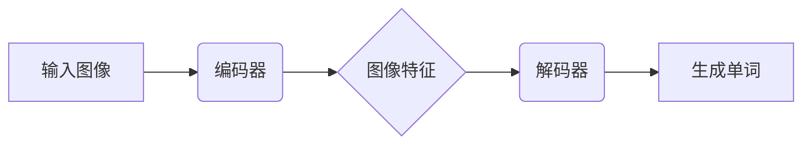

# Python深度学习实践：生成文字描述从图像识别迈向图像理解

## 1.背景介绍

在计算机视觉领域,图像识别是一个基础且重要的任务。传统的图像识别模型通常只能识别图像中的物体类别,例如"这是一只狗"或"这是一辆车"。然而,仅仅识别物体类别并不足以真正理解图像的内容和语义信息。为了更好地理解图像,我们需要一种能够生成自然语言描述的模型,描述图像中的物体、场景、动作等丰富信息。这就是图像描述(Image Captioning)任务的目标。

图像描述任务的挑战在于,它需要同时理解图像内容和自然语言之间的映射关系。这是一个复杂的人工智能问题,需要将计算机视觉和自然语言处理两个领域的技术相结合。近年来,随着深度学习技术的快速发展,基于深度神经网络的图像描述模型取得了突破性的进展,能够生成更加准确、流畅和丰富的图像描述。

### 1.1 图像描述任务的重要性

图像描述技术在许多领域具有广泛的应用前景:

- **视觉辅助系统**: 为视觉障碍人士提供图像内容的自然语言描述,帮助他们更好地理解周围环境。
- **人机交互**: 通过自然语言描述图像内容,实现人机之间更加自然流畅的交互方式。
- **内容理解和检索**: 利用图像描述技术对图像内容进行理解和索引,提高图像检索的准确性和效率。
- **自动化描述生成**: 自动生成新闻图片、产品图片等的文字描述,减轻人工工作量。

### 1.2 传统方法的局限性

在深度学习时代之前,图像描述任务主要采用基于规则的方法或利用手工设计的视觉特征。这些传统方法存在以下局限性:

1. **泛化能力差**: 基于规则的方法缺乏灵活性,难以适应复杂多变的图像场景。
2. **描述质量低**: 生成的描述通常简单、单调,缺乏丰富的语义信息。
3. **特征表达能力有限**: 手工设计的视觉特征无法充分捕捉图像的高层次语义信息。

## 2.核心概念与联系

### 2.1 编码器-解码器框架

基于深度学习的图像描述模型通常采用编码器-解码器(Encoder-Decoder)框架。该框架由两个主要组件构成:

1. **编码器(Encoder)**: 负责从输入图像中提取视觉特征,将图像编码为一个固定长度的向量表示。常用的编码器包括卷积神经网络(CNN)和注意力机制等。

2. **解码器(Decoder)**: 接收编码器输出的向量表示,并将其解码为自然语言描述。解码器通常采用循环神经网络(RNN)或Transformer等序列模型。

编码器和解码器通过端到端的训练,学习图像和文字描述之间的映射关系。

### 2.2 注意力机制

注意力机制(Attention Mechanism)是图像描述模型中一个关键的技术,它允许模型在生成每个单词时,选择性地关注图像的不同区域。这样可以捕捉图像和单词之间的对应关系,生成更加准确和相关的描述。

注意力机制通常与编码器-解码器框架相结合,在解码器的每个时间步,计算注意力权重,指示解码器应该关注图像的哪些区域。这种选择性关注机制大大提高了模型的性能。

### 2.3 端到端训练

图像描述模型通常采用端到端(End-to-End)的训练方式。模型的输入是原始图像,输出是对应的自然语言描述。在训练过程中,模型会自动学习从图像到文字描述的映射,无需人工设计复杂的特征提取和规则。

端到端训练的优势在于,它可以最大限度地利用数据,自动发现图像和文字之间的内在关联,从而获得更好的泛化能力。同时,也避免了传统方法中错误传播和人工偏差的问题。

## 3.核心算法原理具体操作步骤 

### 3.1 数据预处理

在训练图像描述模型之前,需要对图像和文字数据进行适当的预处理,以确保模型的输入格式正确。

1. **图像预处理**:
   - 调整图像大小,确保所有图像具有统一的分辨率。
   - 对图像进行标准化,将像素值缩放到特定范围(如0到1)。
   - 根据需要,可以进行数据增强,如随机裁剪、翻转、旋转等操作,以增加数据多样性。

2. **文字预处理**:
   - 将文字描述Tokenize为单词序列。
   - 构建词汇表,将每个单词映射为唯一的整数索引。
   - 添加特殊标记,如起始标记(`<start>`)和结束标记(`<end>`)。
   - 对文字序列进行填充或截断,使其具有固定长度。

预处理后的图像和文字数据将被输入到编码器-解码器模型中进行训练。

### 3.2 编码器:提取图像特征

编码器的主要任务是从输入图像中提取视觉特征,并将其编码为一个固定长度的向量表示。常用的编码器包括:

1. **卷积神经网络(CNN)**:
   - 利用多层卷积和池化操作,从图像中提取层次化的视觉特征。
   - 常用的CNN模型包括VGG、ResNet、Inception等。
   - CNN的输出通常是一个特征向量或特征映射(feature map)。

2. **注意力机制**:
   - 在CNN的基础上,引入注意力机制,使模型能够选择性地关注图像的不同区域。
   - 常用的注意力机制包括加性注意力(Additive Attention)和乘性注意力(Multiplicative Attention)等。

编码器的输出将被传递给解码器,用于生成自然语言描述。

### 3.3 解码器:生成自然语言描述

解码器的任务是根据编码器提供的图像特征向量,生成对应的自然语言描述。常用的解码器包括:

1. **循环神经网络(RNN)**:
   - 利用RNN(如LSTM或GRU)的序列建模能力,逐个生成单词。
   - 在每个时间步,RNN会根据当前隐藏状态和上一个生成的单词,预测下一个单词。
   - 可以与注意力机制相结合,使RNN能够选择性地关注图像的不同区域。

2. **Transformer**:
   - 基于自注意力(Self-Attention)机制,捕捉序列中单词之间的长程依赖关系。
   - 相比RNN,Transformer在并行计算和长距离依赖建模方面具有优势。
   - 常见的Transformer模型包括原始Transformer、BERT等。

在生成过程中,解码器会逐步输出单词序列,直到遇到结束标记(`<end>`)或达到最大长度。生成的单词序列就是图像的自然语言描述。

## 4.数学模型和公式详细讲解举例说明

### 4.1 编码器:CNN特征提取

卷积神经网络(CNN)是图像描述模型中常用的编码器,用于从图像中提取视觉特征。CNN通过多层卷积和池化操作,逐步提取图像的局部和全局特征。

假设输入图像的尺寸为$H \times W \times C$,其中$H$和$W$分别表示高度和宽度,$C$表示通道数(如RGB图像的$C=3$)。CNN的基本操作包括卷积(Convolution)和池化(Pooling)。

**卷积操作**:

卷积操作通过滤波器(也称卷积核)在图像上滑动,提取局部特征。对于一个大小为$k \times k$的滤波器$\mathbf{W}$,在位置$(i, j)$处的卷积输出$y_{i,j}$可表示为:

$$y_{i,j} = \sum_{m=0}^{k-1} \sum_{n=0}^{k-1} \mathbf{W}_{m,n} \cdot \mathbf{X}_{i+m, j+n} + b$$

其中,$\mathbf{X}$表示输入特征映射,$b$是偏置项。通过在整个图像上滑动滤波器,可以获得一个新的特征映射。

**池化操作**:

池化操作用于降低特征映射的空间维度,同时保留重要的特征信息。常见的池化操作包括最大池化(Max Pooling)和平均池化(Average Pooling)。

对于一个大小为$k \times k$的池化窗口,最大池化的输出$y_{i,j}$为:

$$y_{i,j} = \max_{m=0, \dots, k-1} \max_{n=0, \dots, k-1} \mathbf{X}_{i+m, j+n}$$

即取池化窗口内的最大值作为输出。

通过多层卷积和池化操作,CNN可以逐步提取图像的高级语义特征,并将其编码为一个固定长度的向量表示,作为解码器的输入。

### 4.2 解码器:RNN生成描述

循环神经网络(RNN)是图像描述模型中常用的解码器,用于根据编码器提供的图像特征向量,生成对应的自然语言描述。

假设图像的特征向量为$\mathbf{v}$,目标描述为单词序列$\{y_1, y_2, \dots, y_T\}$,其中$T$是序列长度。RNN的基本思想是在每个时间步$t$,根据当前隐藏状态$\mathbf{h}_t$和上一个生成的单词$y_{t-1}$,预测下一个单词$y_t$。

**RNN单元**:

RNN的核心是一个循环单元,例如长短期记忆(LSTM)或门控循环单元(GRU)。以LSTM为例,在时间步$t$,LSTM单元的计算过程如下:

$$\begin{aligned}
\mathbf{f}_t &= \sigma(\mathbf{W}_f \cdot [\mathbf{h}_{t-1}, \mathbf{x}_t] + \mathbf{b}_f) \\
\mathbf{i}_t &= \sigma(\mathbf{W}_i \cdot [\mathbf{h}_{t-1}, \mathbf{x}_t] + \mathbf{b}_i) \\
\mathbf{o}_t &= \sigma(\mathbf{W}_o \cdot [\mathbf{h}_{t-1}, \mathbf{x}_t] + \mathbf{b}_o) \\
\mathbf{c}_t &= \mathbf{f}_t \odot \mathbf{c}_{t-1} + \mathbf{i}_t \odot \tanh(\mathbf{W}_c \cdot [\mathbf{h}_{t-1}, \mathbf{x}_t] + \mathbf{b}_c) \\
\mathbf{h}_t &= \mathbf{o}_t \odot \tanh(\mathbf{c}_t)
\end{aligned}$$

其中,$\mathbf{f}_t$、$\mathbf{i}_t$和$\mathbf{o}_t$分别表示遗忘门、输入门和输出门,$\mathbf{c}_t$是细胞状态,$\mathbf{h}_t$是隐藏状态,$\mathbf{W}$和$\mathbf{b}$是可学习的权重和偏置,$\sigma$是sigmoid激活函数,$\odot$表示元素wise乘积。

**生成描述**:

在生成描述的过程中,RNN将图像特征向量$\mathbf{v}$作为初始隐藏状态$\mathbf{h}_0$,并在每个时间步$t$,根据当前隐藏状态$\mathbf{h}_t$和上一个生成的单词$y_{t-1}$,计算输出概率分布:

$$P(y_t | y_1, \dots, y_{t-1}, \mathbf{v}) = \text{softmax}(\mathbf{W}_o \cdot \mathbf{h}_t + \mathbf{b}_o)$$

其中,$\mathbf{W}_o$和$\mathbf{b}_o$是可学习的权重和偏置。然后,根据输出概率分布,采样