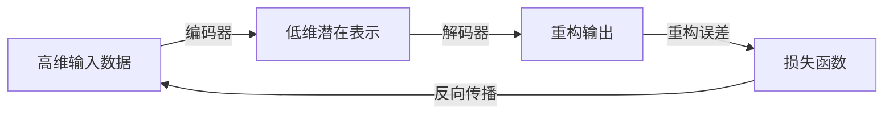

# Python深度学习实践：自动编码器在数据降维中的应用

## 1.背景介绍

在当今大数据时代,海量高维数据的存在给数据处理和分析带来了巨大挑战。高维数据不仅占用大量存储空间,而且增加了数据处理的复杂性和计算开销。因此,数据降维成为了一种重要的技术手段,能够有效地减少数据维度,提高数据处理效率,同时保留数据的主要特征信息。

自动编码器(Autoencoder)是一种基于深度学习的无监督学习技术,可用于数据降维。它通过训练神经网络来学习数据的低维表示,从而实现有效的数据压缩和降维。自动编码器具有自适应性强、无需人工参与特征选择等优点,在图像处理、推荐系统、异常检测等领域得到了广泛应用。

## 2.核心概念与联系

### 2.1 自动编码器的基本原理

自动编码器是一种对称的神经网络,由编码器(Encoder)和解码器(Decoder)两部分组成。编码器将高维输入数据映射到低维潜在空间,而解码器则将低维潜在表示重构为与原始输入数据接近的高维输出。

在训练过程中,自动编码器会最小化输入数据与重构输出之间的差异,从而学习到能够有效表示输入数据的低维潜在表示。这种无监督学习方式使得自动编码器能够自动发现数据的内在结构和特征,而无需人工标注或特征工程。

### 2.2 自动编码器与降维的关系

自动编码器的编码器部分实现了从高维输入空间到低维潜在空间的映射,这一过程实际上就是数据降维。通过训练,编码器学习到了一种有效的低维表示方式,能够最大限度地保留输入数据的主要信息。

与传统的线性降维方法(如PCA)不同,自动编码器是一种非线性降维技术,能够捕捉数据的非线性结构。此外,自动编码器还可以通过添加正则化项或约束来引导网络学习所需的特定属性,如稀疏性、可解释性等,使得降维结果更加符合实际需求。



上图展示了自动编码器的基本工作流程。编码器将高维输入数据映射到低维潜在表示,解码器则将低维表示重构为与原始输入接近的高维输出。通过最小化重构误差,自动编码器学习到了一种有效的低维表示方式,实现了数据降维。

## 3.核心算法原理具体操作步骤

自动编码器的训练过程可以概括为以下几个步骤:

1. **初始化网络权重**:使用常见的初始化方法(如Xavier初始化)对编码器和解码器的权重进行初始化。

2. **前向传播**:将输入数据 $\boldsymbol{x}$ 传递给编码器,得到低维潜在表示 $\boldsymbol{z}=f(\boldsymbol{x})$,其中 $f(\cdot)$ 表示编码器的映射函数。然后将 $\boldsymbol{z}$ 传递给解码器,得到重构输出 $\boldsymbol{\hat{x}}=g(\boldsymbol{z})$,其中 $g(\cdot)$ 表示解码器的映射函数。

3. **计算重构误差**:使用合适的损失函数(如均方误差)计算输入数据 $\boldsymbol{x}$ 与重构输出 $\boldsymbol{\hat{x}}$ 之间的差异,得到重构误差 $L(\boldsymbol{x}, \boldsymbol{\hat{x}})$。

4. **反向传播**:根据重构误差,使用优化算法(如梯度下降)计算网络参数的梯度,并更新编码器和解码器的权重,以最小化重构误差。

5. **重复训练**:重复步骤2-4,直到模型收敛或达到预定的训练轮数。

通过上述步骤,自动编码器可以学习到一种有效的低维表示方式,实现数据降维。值得注意的是,为了获得更好的降维效果,我们可以在训练过程中添加正则化项或约束,例如:

- **稀疏自动编码器**:通过 $L_1$ 正则化项或 $K_L$ 散度约束,使得潜在表示具有稀疏性,从而提高可解释性。
- **去噪自动编码器**:在输入数据中引入噪声,强制网络学习数据的鲁棒表示,提高泛化能力。
- **变分自动编码器**:将潜在表示空间约束为服从某种概率分布(如高斯分布),使得潜在表示具有更好的统计性质。

## 4.数学模型和公式详细讲解举例说明

### 4.1 自动编码器的数学模型

假设输入数据为 $\boldsymbol{x} \in \mathbb{R}^{d}$,编码器的映射函数为 $f(\cdot)$,解码器的映射函数为 $g(\cdot)$,则自动编码器的数学模型可以表示为:

$$\boldsymbol{\hat{x}} = g(f(\boldsymbol{x}))$$

其中,编码器 $f(\cdot)$ 将高维输入 $\boldsymbol{x}$ 映射到低维潜在表示 $\boldsymbol{z}=f(\boldsymbol{x})$,解码器 $g(\cdot)$ 则将低维潜在表示 $\boldsymbol{z}$ 重构为高维输出 $\boldsymbol{\hat{x}}=g(\boldsymbol{z})$。

在训练过程中,我们需要最小化输入数据 $\boldsymbol{x}$ 与重构输出 $\boldsymbol{\hat{x}}$ 之间的差异,即最小化重构误差:

$$L(\boldsymbol{x}, \boldsymbol{\hat{x}}) = \| \boldsymbol{x} - g(f(\boldsymbol{x})) \|^2$$

通常采用均方误差作为损失函数,但也可以使用其他损失函数,如交叉熵等。

### 4.2 稀疏自动编码器

为了提高潜在表示的稀疏性和可解释性,我们可以在自动编码器的损失函数中添加 $L_1$ 正则化项:

$$L(\boldsymbol{x}, \boldsymbol{\hat{x}}, \boldsymbol{z}) = \| \boldsymbol{x} - g(f(\boldsymbol{x})) \|^2 + \lambda \| \boldsymbol{z} \|_1$$

其中 $\lambda$ 是正则化系数,用于控制稀疏程度。$L_1$ 正则化项会使得部分潜在表示元素趋近于0,从而提高潜在表示的稀疏性。

另一种常见的稀疏约束方法是使用 $K_L$ 散度,将潜在表示 $\boldsymbol{z}$ 约束为服从某种稀疏先验分布(如拉普拉斯分布):

$$L(\boldsymbol{x}, \boldsymbol{\hat{x}}, \boldsymbol{z}) = \| \boldsymbol{x} - g(f(\boldsymbol{x})) \|^2 + \lambda K_L(q(\boldsymbol{z}) \| p(\boldsymbol{z}))$$

其中 $q(\boldsymbol{z})$ 是潜在表示的实际分布,而 $p(\boldsymbol{z})$ 是稀疏先验分布。通过最小化 $K_L$ 散度,我们可以使得潜在表示的分布接近于稀疏先验分布,从而实现稀疏性约束。

### 4.3 变分自动编码器

变分自动编码器(Variational Autoencoder, VAE)是一种基于变分推断的自动编码器模型。它将潜在表示空间约束为服从某种连续概率分布(通常为高斯分布),从而使得潜在表示具有更好的统计性质。

VAE的损失函数包括两个部分:重构误差和 $K_L$ 散度项。重构误差与普通自动编码器相同,而 $K_L$ 散度项用于约束潜在表示的分布:

$$L(\boldsymbol{x}, \boldsymbol{\hat{x}}, \boldsymbol{z}) = \| \boldsymbol{x} - g(f(\boldsymbol{x})) \|^2 + \lambda K_L(q(\boldsymbol{z} | \boldsymbol{x}) \| p(\boldsymbol{z}))$$

其中 $q(\boldsymbol{z} | \boldsymbol{x})$ 是潜在表示 $\boldsymbol{z}$ 的后验分布,而 $p(\boldsymbol{z})$ 是高斯先验分布。通过最小化 $K_L$ 散度,我们可以使得潜在表示的后验分布接近于高斯先验分布,从而获得具有良好统计性质的潜在表示。

VAE的训练过程需要使用变分推断技术,例如重参数化技巧(reparameterization trick)。具体细节超出了本文的讨论范围,感兴趣的读者可以参考相关文献。

## 5.项目实践:代码实例和详细解释说明

下面是一个使用PyTorch实现的简单自动编码器示例,用于对MNIST手写数字图像进行降维:

```python
import torch
import torch.nn as nn
import torchvision.datasets as datasets
import torchvision.transforms as transforms

# 定义自动编码器模型
class Autoencoder(nn.Module):
    def __init__(self):
        super(Autoencoder, self).__init__()
        
        # 编码器
        self.encoder = nn.Sequential(
            nn.Linear(28 * 28, 512),
            nn.ReLU(),
            nn.Linear(512, 256),
            nn.ReLU(),
            nn.Linear(256, 64)  # 低维潜在表示
        )
        
        # 解码器
        self.decoder = nn.Sequential(
            nn.Linear(64, 256),
            nn.ReLU(),
            nn.Linear(256, 512),
            nn.ReLU(),
            nn.Linear(512, 28 * 28),
            nn.Sigmoid()  # 输出范围为 [0, 1]
        )

    def forward(self, x):
        z = self.encoder(x.view(-1, 28 * 28))  # 编码
        x_hat = self.decoder(z)  # 解码
        return x_hat, z

# 加载MNIST数据集
train_dataset = datasets.MNIST(root='./data', train=True, transform=transforms.ToTensor(), download=True)
train_loader = torch.utils.data.DataLoader(train_dataset, batch_size=128, shuffle=True)

# 实例化自动编码器模型
model = Autoencoder()

# 定义损失函数和优化器
criterion = nn.MSELoss()
optimizer = torch.optim.Adam(model.parameters(), lr=0.001)

# 训练模型
num_epochs = 20
for epoch in range(num_epochs):
    for data in train_loader:
        img, _ = data
        img = img.view(img.size(0), -1)
        
        output, _ = model(img)
        loss = criterion(output, img)
        
        optimizer.zero_grad()
        loss.backward()
        optimizer.step()
    
    print(f'Epoch [{epoch+1}/{num_epochs}], Loss: {loss.item():.4f}')

# 对新数据进行降维
test_img = train_dataset[0][0].view(1, -1)
_, z = model(test_img)
print(f'Original image shape: {test_img.shape}')
print(f'Latent representation shape: {z.shape}')
```

代码解释:

1. 定义自动编码器模型:编码器由三个全连接层组成,将 $28 \times 28$ 的输入图像编码为64维的潜在表示;解码器也由三个全连接层组成,将64维的潜在表示解码为 $28 \times 28$ 的重构输出。
2. 加载MNIST数据集,并创建数据加载器。
3. 实例化自动编码器模型,定义损失函数(均方误差)和优化器(Adam)。
4. 训练模型:对每个批次的输入数据,计算重构输出和损失,并通过反向传播更新模型参数。
5. 对新数据进行降维:将测试图像输入到编码器,获取64维的潜在表示。

通过上述示例,我们可以看到如何使用PyTorch实现一个简单的自动编码器模型,并对MNIST数据集进行降维。在实际应用中,我们可以根据具体需求调整模型结构、损失函数和训练策略,以获得更好的降维效果。

## 6.实际应用场景

自动编码器在数据降维领域有着广