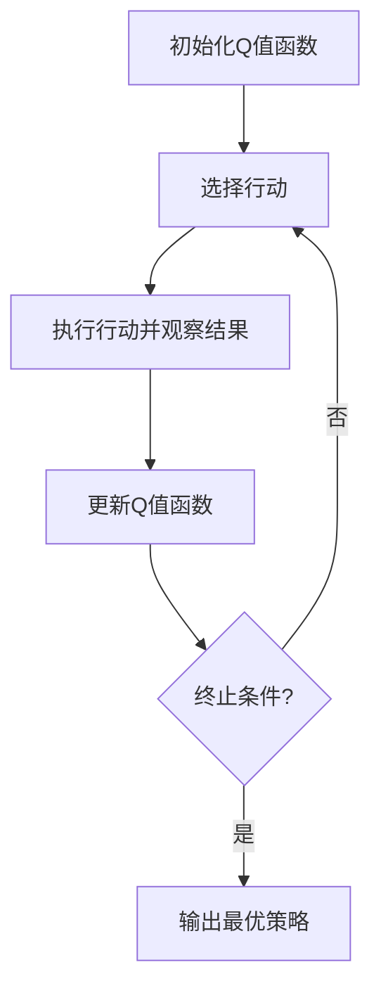

# Q-学习与其他机器学习方法的比较

## 1.背景介绍

机器学习是人工智能领域的一个重要分支,旨在使计算机能够从数据中自动学习模式,并基于这些模式做出预测或决策。近年来,机器学习在各个领域都取得了广泛的应用,包括计算机视觉、自然语言处理、推荐系统等。

在机器学习的众多算法中,强化学习是一种特殊的学习范式,它通过与环境的交互来学习如何采取最优行为。Q-学习作为强化学习中的一种重要算法,在很多领域都有着广泛的应用。本文将重点介绍Q-学习算法,并与其他机器学习算法进行比较,阐明它们的异同及适用场景。

## 2.核心概念与联系

### 2.1 Q-学习概念

Q-学习是一种基于值函数的强化学习算法,它试图通过与环境交互来学习一个最优的行为策略。在Q-学习中,智能体通过观察当前状态和采取的行动,获得相应的奖励或惩罚,并更新一个Q值函数,该函数估计在特定状态下采取某个行动所能获得的长期累积奖励。

Q-学习算法的核心思想是通过不断尝试和学习,逐步优化Q值函数,最终找到一个最优策略,使得在任何给定状态下,智能体都能够采取获得最大长期累积奖励的行动。

### 2.2 其他机器学习算法

除了Q-学习之外,机器学习领域还有许多其他算法,包括监督学习、非监督学习和半监督学习等。

- **监督学习**:监督学习算法通过学习已标记的训练数据,建立输入和输出之间的映射关系。常见的监督学习算法包括线性回归、逻辑回归、支持向量机等。
- **非监督学习**:非监督学习算法则不需要标记数据,它们通过发现数据内在的模式和结构来进行学习。常见的非监督学习算法包括聚类算法(如K-Means)和关联规则挖掘算法。
- **半监督学习**:半监督学习算法结合了监督学习和非监督学习的优点,它们利用少量标记数据和大量未标记数据进行训练,以提高模型的性能。

### 2.3 Q-学习与其他算法的联系

Q-学习与其他机器学习算法有一些相似之处,但也存在显著差异。

- 与监督学习相比,Q-学习不需要提前标记的训练数据,而是通过与环境的交互来学习。
- 与非监督学习相比,Q-学习具有明确的目标,即最大化长期累积奖励。
- 与半监督学习相比,Q-学习不需要任何标记数据,完全依赖于与环境的交互。

尽管存在差异,但Q-学习也可以与其他机器学习算法相结合,形成更强大的混合模型。例如,可以使用深度神经网络来近似Q值函数,从而提高Q-学习的性能。

## 3.核心算法原理具体操作步骤

Q-学习算法的核心思想是通过不断尝试和学习,逐步优化Q值函数,最终找到一个最优策略。具体的操作步骤如下:

1. **初始化Q值函数**:为每个状态-行动对初始化一个Q值,通常可以将所有Q值初始化为0或随机值。

2. **选择行动**:在当前状态下,根据一定的策略(如ε-贪婪策略)选择一个行动。

3. **执行行动并观察结果**:执行选择的行动,观察到新的状态和获得的即时奖励。

4. **更新Q值函数**:根据观察到的新状态、即时奖励和Q值函数的当前估计,使用下面的更新规则更新Q值函数:

$$Q(s_t, a_t) \leftarrow Q(s_t, a_t) + \alpha \left[ r_t + \gamma \max_a Q(s_{t+1}, a) - Q(s_t, a_t) \right]$$

其中:
- $s_t$是当前状态
- $a_t$是在当前状态下选择的行动
- $r_t$是执行该行动后获得的即时奖励
- $\alpha$是学习率,控制新信息对Q值函数的影响程度
- $\gamma$是折扣因子,控制未来奖励的重要程度
- $\max_a Q(s_{t+1}, a)$是在新状态下可获得的最大Q值

5. **重复步骤2-4**:重复执行步骤2-4,直到达到终止条件(如最大迭代次数或收敛)。

通过不断更新Q值函数,Q-学习算法可以逐步找到一个最优策略,使得在任何给定状态下,智能体都能够采取获得最大长期累积奖励的行动。



## 4.数学模型和公式详细讲解举例说明

Q-学习算法的核心是Q值函数的更新,其数学模型和公式如下:

$$Q(s_t, a_t) \leftarrow Q(s_t, a_t) + \alpha \left[ r_t + \gamma \max_a Q(s_{t+1}, a) - Q(s_t, a_t) \right]$$

这个更新规则由两部分组成:

1. **即时奖励**:$r_t$表示在当前状态$s_t$下执行行动$a_t$后获得的即时奖励。

2. **未来最大预期奖励**:$\gamma \max_a Q(s_{t+1}, a)$表示在新状态$s_{t+1}$下,执行最优行动所能获得的最大预期奖励,其中$\gamma$是折扣因子,用于控制未来奖励的重要程度。

通过将即时奖励和未来最大预期奖励相加,我们可以获得在当前状态下执行行动$a_t$所能获得的长期累积奖励的估计值。

为了使Q值函数逐步收敛到最优值,我们需要引入学习率$\alpha$,它控制了新信息对Q值函数的影响程度。具体来说,更新规则中的$\alpha \left[ r_t + \gamma \max_a Q(s_{t+1}, a) - Q(s_t, a_t) \right]$部分就是Q值函数的变化量,它会被加到原有的Q值上,从而使Q值函数逐步调整到最优值。

让我们通过一个简单的示例来说明Q-学习算法的工作原理。假设我们有一个简单的环境,智能体可以在一个二维网格中移动,目标是从起点到达终点。每次移动都会获得一个小的负奖励(代表移动的代价),到达终点时会获得一个大的正奖励。

初始时,我们将所有状态-行动对的Q值初始化为0。然后,智能体开始与环境交互,根据当前状态选择一个行动,执行该行动并观察到新的状态和即时奖励。根据更新规则,我们可以更新相应的Q值。

例如,假设智能体从状态$s_t$执行行动$a_t$,到达新状态$s_{t+1}$,获得即时奖励$r_t=-1$(代表移动的代价)。如果在新状态$s_{t+1}$下,执行最优行动所能获得的最大预期奖励为10(即$\max_a Q(s_{t+1}, a) = 10$),那么根据更新规则,我们可以计算出$Q(s_t, a_t)$的新值:

$$Q(s_t, a_t) \leftarrow Q(s_t, a_t) + \alpha \left[ -1 + \gamma \times 10 - Q(s_t, a_t) \right]$$

假设$\alpha=0.1$且$\gamma=0.9$,那么$Q(s_t, a_t)$的新值将变为:

$$Q(s_t, a_t) \leftarrow Q(s_t, a_t) + 0.1 \left[ -1 + 0.9 \times 10 - Q(s_t, a_t) \right]$$

通过不断重复这个过程,Q值函数将逐步收敛到最优值,从而使智能体能够找到从起点到达终点的最优路径。

## 5.项目实践:代码实例和详细解释说明

为了更好地理解Q-学习算法,我们将通过一个简单的示例来实现它。这个示例是一个基于Python的简单网格世界,智能体需要从起点到达终点。

```python
import numpy as np

# 定义网格世界
WORLD = np.array([
    [0, 0, 0, 0, 0, 0, 0, 0],
    [0, 0, 0, 0, 0, 0, 0, 0],
    [0, 0, 0, 0, 0, 0, 0, 0],
    [0, 0, 0, 0, 0, 0, 0, 0],
    [0, 0, 0, 0, 0, 0, 0, 0],
    [0, 0, 0, 0, 0, 0, 0, 0],
    [0, 0, 0, 0, 0, 0, 0, 0],
    [0, 0, 0, 0, 0, 0, 0, 1]
])

# 定义状态空间和行动空间
STATES = [(i, j) for i in range(WORLD.shape[0]) for j in range(WORLD.shape[1])]
ACTIONS = [(-1, 0), (1, 0), (0, -1), (0, 1)]  # 上下左右

# 定义奖励函数
def reward(state, action, next_state):
    if WORLD[next_state] == 1:
        return 10  # 到达终点
    elif WORLD[next_state] == 0:
        return -1  # 移动代价
    else:
        return -100  # 撞墙

# 定义Q值函数
Q = {}
for state in STATES:
    for action in ACTIONS:
        Q[(state, action)] = 0.0

# 定义Q-学习算法
def q_learning(alpha=0.1, gamma=0.9, episodes=1000):
    for episode in range(episodes):
        state = (0, 0)  # 起点
        done = False
        while not done:
            action = epsilon_greedy(state, Q)
            next_state = move(state, action)
            r = reward(state, action, next_state)
            Q[(state, action)] += alpha * (r + gamma * max([Q[(next_state, a)] for a in ACTIONS]) - Q[(state, action)])
            state = next_state
            if WORLD[state] == 1:
                done = True

# 定义epsilon-贪婪策略
def epsilon_greedy(state, Q, epsilon=0.1):
    if np.random.uniform() < epsilon:
        return np.random.choice(ACTIONS)
    else:
        return max((action, Q[(state, action)]) for action in ACTIONS)[1]

# 定义移动函数
def move(state, action):
    next_state = (state[0] + action[0], state[1] + action[1])
    if next_state[0] < 0 or next_state[0] >= WORLD.shape[0] or next_state[1] < 0 or next_state[1] >= WORLD.shape[1]:
        return state  # 撞墙
    else:
        return next_state

# 运行Q-学习算法
q_learning()

# 输出最优路径
state = (0, 0)
path = []
while state != (7, 7):
    action = max((action, Q[(state, action)]) for action in ACTIONS)[1]
    path.append(action)
    state = move(state, action)

print("最优路径:", path)
```

在这个示例中,我们首先定义了网格世界、状态空间和行动空间。然后,我们定义了奖励函数、Q值函数和Q-学习算法。

在`q_learning`函数中,我们实现了Q-学习算法的核心逻辑。每个episode中,智能体从起点开始,根据epsilon-贪婪策略选择行动,执行行动并观察到新的状态和即时奖励。然后,根据更新规则更新相应的Q值。

在`epsilon_greedy`函数中,我们实现了epsilon-贪婪策略。这个策略在一定概率下会选择随机行动(探索),在其他情况下会选择当前状态下Q值最大的行动(利用)。这种探索和利用的平衡对于Q-学习算法的收敛非常重要。

在`move`函数中,我们实现了智能体在网格世界中移动的逻辑。如果移动后的新状态超出了网格边界,则智能体保持原状态(相当于撞墙)。

最后,我们运行Q-学习算法,并输出从起点到终点的最优路径。

通过这个示例,我