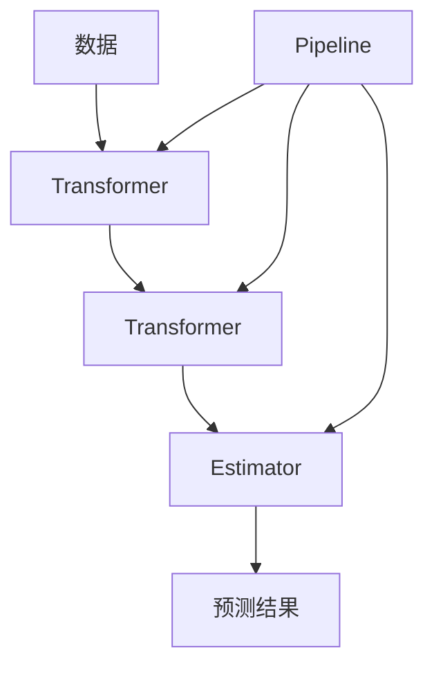

# Scikit-Learn 原理与代码实战案例讲解

## 1.背景介绍

在当今数据主导的世界中,机器学习已成为各行各业不可或缺的工具。无论是金融预测、医疗诊断,还是推荐系统和自动驾驶,机器学习都发挥着关键作用。作为Python生态系统中最受欢迎的机器学习库之一,Scikit-Learn为数据科学家和开发人员提供了全面的机器学习算法集合,涵盖了分类、回归、聚类等多种任务。

Scikit-Learn的核心设计理念是简单性、一致性和高效性。它提供了一套清晰统一的API,使得各种算法的使用方式保持一致,大大降低了学习曲线。同时,Scikit-Learn也注重性能优化,确保算法能够高效地运行,即使在大规模数据集上也能保持较快的计算速度。

## 2.核心概念与联系

在深入探讨Scikit-Learn的具体算法之前,我们需要了解一些核心概念,这些概念贯穿于整个库的设计之中。

### 2.1 Estimator(估计器)

Estimator是Scikit-Learn中最重要的API之一,它是一个描述机器学习任务的Python对象。无论是分类器(Classifier)、回归器(Regressor)还是聚类器(Clusterer),都是Estimator的具体实现。

Estimator对象需要实现两个核心方法:

- `fit(X, y)`: 根据训练数据(X和y)构建模型
- `predict(X)`: 使用训练好的模型对新数据X进行预测

此外,Estimator还可以提供诸如`score()`、`get_params()`等辅助方法,用于评估模型性能或获取模型参数。

### 2.2 Transformer(转换器)

Transformer是另一个重要的API,它用于对数据进行预处理和特征工程。常见的Transformer包括`StandardScaler`(标准化)、`OneHotEncoder`(one-hot编码)等。

Transformer需要实现两个核心方法:

- `fit(X)`: 根据训练数据X计算所需的统计信息
- `transform(X)`: 使用计算出的统计信息对新数据X进行转换

Transformer通常与Estimator组合使用,构建机器学习管道(Pipeline),实现端到端的数据处理和模型训练。

### 2.3 Pipeline(管道)

Pipeline是Scikit-Learn中的另一个核心概念,它将多个Transformer和一个Estimator串联起来,形成一个完整的工作流程。Pipeline的优势在于简化了机器学习过程,使得数据预处理、特征工程和模型训练可以一次性完成。

Pipeline需要实现以下方法:

- `fit(X, y)`: 对所有Transformer和Estimator进行fit操作
- `predict(X)`: 对输入数据X执行转换和预测操作

Pipeline还支持交叉验证、网格搜索等功能,方便进行模型选择和参数调优。

### 2.4 Mermaid 流程图

Scikit-Learn的核心概念之间的关系可以用下面的Mermaid流程图来表示:



## 3.核心算法原理具体操作步骤

Scikit-Learn提供了广泛的机器学习算法,包括监督学习算法(如线性回归、逻辑回归、决策树、支持向量机等)和无监督学习算法(如K-Means聚类、主成分分析等)。这些算法的具体原理和操作步骤如下:

### 3.1 线性回归

线性回归是一种简单但有效的监督学习算法,用于预测连续型目标变量。它的基本思想是找到一条最佳拟合直线,使得数据点到直线的残差平方和最小。

线性回归的操作步骤:

1. 导入所需的库和数据集
2. 将数据集划分为训练集和测试集
3. 创建`LinearRegression`对象
4. 使用`fit()`方法训练模型
5. 使用`predict()`方法进行预测
6. 评估模型性能(如均方根误差)

```python
from sklearn.linear_model import LinearRegression
from sklearn.metrics import mean_squared_error

# 创建线性回归对象
lr = LinearRegression()

# 训练模型
lr.fit(X_train, y_train)

# 进行预测
y_pred = lr.predict(X_test)

# 评估模型性能
mse = mean_squared_error(y_test, y_pred)
```

### 3.2 逻辑回归

逻辑回归是一种监督学习算法,用于解决二分类问题。它通过对数据进行逻辑函数转换,将输入映射到0到1之间的概率值,从而实现分类。

逻辑回归的操作步骤:

1. 导入所需的库和数据集
2. 将数据集划分为训练集和测试集
3. 创建`LogisticRegression`对象
4. 使用`fit()`方法训练模型
5. 使用`predict()`或`predict_proba()`方法进行预测
6. 评估模型性能(如准确率、精确率、召回率等)

```python
from sklearn.linear_model import LogisticRegression
from sklearn.metrics import accuracy_score

# 创建逻辑回归对象
lr = LogisticRegression()

# 训练模型
lr.fit(X_train, y_train)

# 进行预测
y_pred = lr.predict(X_test)

# 评估模型性能
accuracy = accuracy_score(y_test, y_pred)
```

### 3.3 决策树

决策树是一种监督学习算法,可用于解决分类和回归问题。它通过构建一个决策树模型,根据特征值的不同组合将数据划分为不同的子集,从而进行预测。

决策树的操作步骤:

1. 导入所需的库和数据集
2. 将数据集划分为训练集和测试集
3. 创建`DecisionTreeClassifier`(分类)或`DecisionTreeRegressor`(回归)对象
4. 使用`fit()`方法训练模型
5. 使用`predict()`方法进行预测
6. 评估模型性能(如准确率、均方根误差等)

```python
from sklearn.tree import DecisionTreeClassifier
from sklearn.metrics import accuracy_score

# 创建决策树分类器对象
dt = DecisionTreeClassifier()

# 训练模型
dt.fit(X_train, y_train)

# 进行预测
y_pred = dt.predict(X_test)

# 评估模型性能
accuracy = accuracy_score(y_test, y_pred)
```

### 3.4 K-Means聚类

K-Means是一种无监督学习算法,用于将数据划分为K个聚类。它的基本思想是通过迭代计算,不断优化聚类中心,使得每个数据点到其所属聚类中心的距离之和最小。

K-Means聚类的操作步骤:

1. 导入所需的库和数据集
2. 创建`KMeans`对象
3. 使用`fit()`方法训练模型
4. 使用`predict()`方法对新数据进行聚类
5. 可选:评估聚类性能(如轮廓系数)

```python
from sklearn.cluster import KMeans

# 创建K-Means对象
kmeans = KMeans(n_clusters=3)

# 训练模型
kmeans.fit(X)

# 对新数据进行聚类
labels = kmeans.predict(X_new)
```

### 3.5 主成分分析(PCA)

主成分分析是一种无监督学习算法,用于降维和特征提取。它通过线性变换,将高维数据投影到一个低维空间,同时尽可能保留原始数据的方差。

PCA的操作步骤:

1. 导入所需的库和数据集
2. 创建`PCA`对象
3. 使用`fit()`方法训练模型
4. 使用`transform()`方法将数据投影到低维空间

```python
from sklearn.decomposition import PCA

# 创建PCA对象
pca = PCA(n_components=2)

# 训练模型
pca.fit(X)

# 将数据投影到低维空间
X_transformed = pca.transform(X)
```

以上只是Scikit-Learn中一小部分算法的示例,还有许多其他算法(如支持向量机、随机森林、梯度提升树等)可供选择,具体使用方式类似。

## 4.数学模型和公式详细讲解举例说明

在机器学习算法的背后,往往有着复杂的数学模型和公式支撑。理解这些数学原理对于更好地掌握算法、调优参数、解释结果至关重要。接下来,我们将详细讲解几种常见算法的数学模型和公式。

### 4.1 线性回归

线性回归的目标是找到一条最佳拟合直线,使得数据点到直线的残差平方和最小。具体来说,给定一个数据集 $\{(x_i, y_i)\}_{i=1}^{n}$,我们需要找到参数 $\theta_0$ 和 $\theta_1$,使得以下代价函数最小化:

$$J(\theta_0, \theta_1) = \frac{1}{2n} \sum_{i=1}^{n} (y_i - \theta_0 - \theta_1 x_i)^2$$

其中,$(y_i - \theta_0 - \theta_1 x_i)$是第i个数据点到拟合直线的残差。

通过对代价函数求导并令其等于0,我们可以得到闭式解:

$$\theta_1 = \frac{\sum_{i=1}^{n} (x_i - \bar{x})(y_i - \bar{y})}{\sum_{i=1}^{n} (x_i - \bar{x})^2}$$
$$\theta_0 = \bar{y} - \theta_1 \bar{x}$$

其中,$ \bar{x} $和$ \bar{y} $分别表示$ x $和$ y $的均值。

### 4.2 逻辑回归

逻辑回归用于解决二分类问题。给定一个数据集 $\{(x_i, y_i)\}_{i=1}^{n}$,其中 $y_i \in \{0, 1\}$,我们需要找到参数 $\theta$,使得以下对数似然函数最大化:

$$J(\theta) = \frac{1}{n} \sum_{i=1}^{n} [y_i \log h_\theta(x_i) + (1 - y_i) \log (1 - h_\theta(x_i))]$$

其中,$ h_\theta(x) $是sigmoid函数,定义为:

$$h_\theta(x) = \frac{1}{1 + e^{-\theta^T x}}$$

通过梯度上升法,我们可以迭代更新参数 $\theta$,直到收敛。

### 4.3 K-Means聚类

K-Means聚类的目标是将 $n$ 个数据点划分为 $K$ 个聚类 $C = \{C_1, C_2, \dots, C_K\}$,使得以下目标函数最小化:

$$J(C) = \sum_{k=1}^{K} \sum_{x \in C_k} \|x - \mu_k\|^2$$

其中,$ \mu_k $是第 $k$ 个聚类的质心,定义为:

$$\mu_k = \frac{1}{|C_k|} \sum_{x \in C_k} x$$

K-Means算法通过迭代的方式不断优化聚类中心和数据点的划分,直到收敛。

### 4.4 主成分分析(PCA)

主成分分析的目标是找到一组正交基 $\{u_1, u_2, \dots, u_d\}$,使得原始高维数据在这组基上的投影方差最大。具体来说,给定一个数据矩阵 $X \in \mathbb{R}^{n \times p}$,我们需要找到 $U \in \mathbb{R}^{p \times d}$,使得:

$$\max_{U^TU=I} \frac{1}{n} \sum_{i=1}^{n} \|U^T(x_i - \bar{x})\|^2$$

其中,$ \bar{x} $是数据的均值向量。

通过对协方差矩阵 $\Sigma = \frac{1}{n} \sum_{i=1}^{n} (x_i - \bar{x})(x_i - \bar{x})^T$ 进行特征值分解,我们可以得到主成分 $U$,它由协方差矩阵的前 $d$ 个特征向量构成。

以上只是一小部分算法的数学模型和公式,还有许多其他算法(如支持向量机、随机森林、梯度提升树等)也有着复杂的数学理论支撑。掌握这些数学原理有助于我们更好地理解和应用机器学习算法。

## 5.项目实践:代码实例和详细解释说明

理