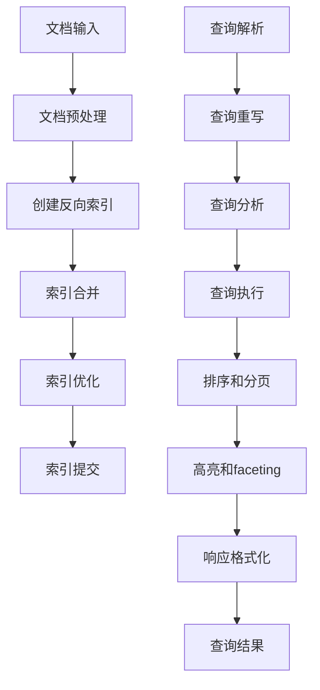
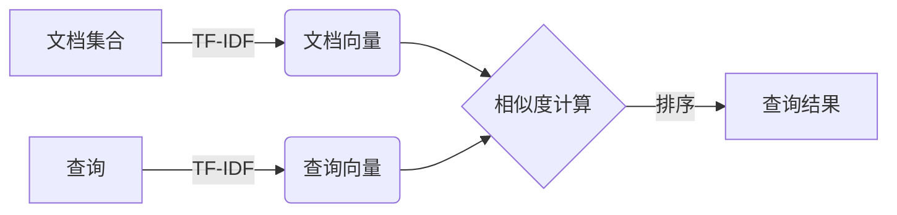

# Solr原理与代码实例讲解

## 1.背景介绍

在当今数据爆炸式增长的时代,搜索引擎技术成为了一种重要的工具,能够帮助我们快速从海量数据中检索出所需的信息。Apache Solr作为一款流行的开源搜索平台,凭借其高性能、可扩展性和易用性,在企业级搜索应用中得到了广泛应用。

Solr是一个基于Apache Lucene的搜索服务器,它提供了分布式索引、搜索和导航功能,支持全文检索、高亮显示、面向对象检索、动态聚类等特性。Solr的架构设计使其能够轻松地集成到其他应用程序中,并且支持XML、JSON和HTTP等多种访问接口。

无论是电子商务网站的产品搜索、知识库的内容检索,还是日志分析和监控系统,Solr都可以发挥重要作用。它的灵活性和可扩展性使其能够适应各种规模的数据量和查询需求,成为企业级搜索解决方案的首选。

## 2.核心概念与联系

### 2.1 索引(Index)

索引是Solr的核心概念之一,它是一种数据结构,用于存储和组织文档数据,以便快速检索。索引由一个或多个字段组成,每个字段都包含一个或多个术语(term)。在索引过程中,Solr会将文档数据分词(tokenize)、标准化(normalize)并存储到索引中。

### 2.2 文档(Document)

在Solr中,每个被索引的数据单元都被称为一个文档。文档由一组字段组成,每个字段都包含特定类型的数据,如文本、数字或日期等。文档是Solr索引和搜索的基本单位。

### 2.3 核心(Core)

Solr核心是一个独立的索引和配置环境,它包含了索引数据、配置文件、日志文件等。一个Solr实例可以包含多个核心,每个核心都可以独立运行,互不干扰。这种设计使得Solr能够在同一个服务器上运行多个搜索应用。

### 2.4 集群(Cluster)

为了实现高可用性和负载均衡,Solr支持集群部署模式。一个Solr集群由多个Solr实例组成,这些实例可以位于不同的物理机器上。集群中的每个实例都包含完整的索引数据副本,查询可以在任意一个实例上执行。

### 2.5 Mermaid流程图


上图展示了Solr的核心概念之间的关系。文档首先被索引到索引数据结构中,然后索引被组织到核心中。多个核心可以组成一个Solr集群,实现高可用性和负载均衡。

## 3.核心算法原理具体操作步骤

### 3.1 索引创建流程

Solr的索引创建流程包括以下几个主要步骤:

1. **文档输入**:首先,需要将待索引的文档数据输入到Solr中。文档可以通过多种方式输入,如HTTP POST请求、XML文件、数据库等。

2. **文档预处理**:Solr会对输入的文档进行预处理,包括字符过滤、分词、标准化等操作。这个过程由配置文件`schema.xml`中定义的字段类型和分词器(Tokenizer)决定。

3. **创建反向索引**:经过预处理后,Solr会为每个字段创建反向索引,即将术语与文档ID相关联。反向索引是Solr快速检索的关键数据结构。

4. **索引合并**:随着新文档不断被索引,Solr会定期将多个小的索引段合并成较大的索引段,以提高查询效率。

5. **索引优化**:合并后的索引段可能会存在一些冗余数据,Solr会对索引进行优化,删除这些冗余数据,从而减小索引的磁盘占用空间。

6. **索引提交**:经过上述步骤后,新建的索引会被提交到核心中,供搜索使用。

### 3.2 搜索查询流程

当用户发出搜索查询时,Solr会执行以下步骤:

1. **查询解析**:Solr会首先解析查询语句,将其转换为内部查询表示。

2. **查询重写**:Solr会根据配置文件中的规则对查询进行重写,以优化查询性能。

3. **查询分析**:与索引创建过程类似,Solr会对查询语句进行分词和标准化处理。

4. **查询执行**:Solr会在反向索引中查找与查询条件匹配的文档ID。

5. **排序和分页**:根据排序规则对查询结果进行排序,并根据分页要求返回部分结果。

6. **高亮和faceting**:如果配置了高亮或faceting功能,Solr会对结果进行相应的处理。

7. **响应格式化**:最后,Solr会将查询结果格式化为指定的响应格式(如XML、JSON等),并返回给客户端。

### 3.3 Mermaid流程图



上图展示了Solr的索引创建和搜索查询两个核心流程。索引创建流程包括文档输入、预处理、创建反向索引、索引合并、优化和提交等步骤。搜索查询流程包括查询解析、重写、分析、执行、排序、高亮等步骤,最终返回格式化的查询结果。

## 4.数学模型和公式详细讲解举例说明

在Solr中,有几个重要的数学模型和公式,对于理解其内部机制和优化查询性能非常有帮助。

### 4.1 术语频率-逆向文档频率(TF-IDF)

TF-IDF是一种用于评估一个词对于一个文档集或一个语料库的重要程度的统计方法。它由两个部分组成:

- **术语频率(Term Frequency, TF)**: $$TF(t,d) = \frac{n_{t,d}}{\sum_{k}n_{k,d}}$$
  
  其中$n_{t,d}$表示术语$t$在文档$d$中出现的次数,$\sum_{k}n_{k,d}$表示文档$d$中所有术语的总数。TF反映了一个术语在文档中出现的频率,频率越高,术语越重要。

- **逆向文档频率(Inverse Document Frequency, IDF)**: $$IDF(t,D) = \log\frac{|D|}{|\{d\in D:t\in d\}|}$$
  
  其中$|D|$表示语料库中文档的总数,$|\{d\in D:t\in d\}|$表示包含术语$t$的文档数。IDF反映了一个术语在整个语料库中的稀有程度,稀有程度越高,术语越重要。

TF-IDF的计算公式为:

$$\mathrm{TF\text-IDF}(t,d,D) = TF(t,d)\times IDF(t,D)$$

TF-IDF值越高,表示该术语对于该文档越重要。Solr在计算相关性分数时会使用TF-IDF模型。

### 4.2 布尔模型(Boolean Model)

布尔模型是一种基于集合论和布尔代数的简单查询模型。它将文档集合视为一个集合,查询条件视为对集合的限制。查询结果是满足所有限制条件的文档集合。

布尔模型中常用的操作符包括AND、OR和NOT,它们对应着集合的交集、并集和补集运算。例如,查询"apple AND computer"会返回同时包含"apple"和"computer"两个术语的文档。

尽管布尔模型简单直观,但它无法对结果进行排序,也不能很好地处理同义词和相关词。因此,在Solr中通常会结合其他模型使用。

### 4.3 向量空间模型(Vector Space Model)

向量空间模型将文档和查询表示为向量,并根据它们之间的相似度计算相关性分数。具体来说:

1. 每个文档被表示为一个向量$\vec{d} = (w_{1,d},w_{2,d},...,w_{t,d})$,其中$w_{i,d}$表示第$i$个术语在文档$d$中的权重,通常使用TF-IDF计算。

2. 查询也被表示为一个向量$\vec{q} = (w_{1,q},w_{2,q},...,w_{t,q})$,其中$w_{i,q}$表示第$i$个术语在查询中的权重。

3. 文档向量和查询向量的相似度可以用它们的夹角余弦值(cosine similarity)来衡量:
   $$\mathrm{sim}(\vec{d},\vec{q}) = \cos(\theta) = \frac{\vec{d}\cdot\vec{q}}{|\vec{d}||\vec{q}|} = \frac{\sum_{i=1}^{t}w_{i,d}w_{i,q}}{\sqrt{\sum_{i=1}^{t}w_{i,d}^2}\sqrt{\sum_{i=1}^{t}w_{i,q}^2}}$$

相似度分数越高,文档与查询越相关。Solr使用向量空间模型计算相关性分数,并根据分数对结果进行排序。

### 4.4 Mermaid流程图



上图展示了Solr中向量空间模型的工作流程。文档集合和查询首先被转换为向量表示,然后计算文档向量与查询向量之间的相似度,根据相似度对结果进行排序,最终返回排序后的查询结果。

## 5.项目实践:代码实例和详细解释说明

为了更好地理解Solr的使用方式,我们将通过一个电子商务网站的产品搜索示例,展示如何使用Solr进行索引和搜索。

### 5.1 安装和配置

首先,我们需要下载并安装Solr。可以从官方网站下载最新版本的二进制包,解压后即可使用。

接下来,我们创建一个名为"products"的核心。在Solr的`server/solr`目录下,执行以下命令:

```bash
bin/solr create -c products
```

这将创建一个新的核心,并自动生成必要的配置文件。

### 5.2 定义Schema

接下来,我们需要定义索引的Schema,即指定要索引的字段及其类型。打开`server/solr/products/conf/schema.xml`文件,添加以下字段定义:

```xml
<field name="id" type="string" indexed="true" stored="true" required="true" multiValued="false" />
<field name="name" type="text_general" indexed="true" stored="true"/>
<field name="description" type="text_general" indexed="true" stored="true"/>
<field name="price" type="float" indexed="true" stored="true"/>
<field name="category" type="string" indexed="true" stored="true" multiValued="true"/>
<field name="inStock" type="boolean" indexed="true" stored="true"/>
```

这里我们定义了产品ID、名称、描述、价格、类别和库存状态等字段。

### 5.3 索引产品数据

接下来,我们需要将产品数据索引到Solr中。可以使用Solr提供的多种索引方式,如HTTP POST请求、XML文件或者直接调用Java API等。

这里我们使用HTTP POST请求的方式,通过curl命令行工具发送JSON格式的数据:

```bash
curl 'http://localhost:8983/solr/products/update?commit=true' --data-binary '
[
  {
    "id": "1",
    "name": "Apple iPhone 13 Pro",
    "description": "Apple iPhone 13 Pro smartphone with 5G, A15 Bionic chip, and advanced camera system.",
    "price": 999.99,
    "category": ["Electronics", "Smartphones"],
    "inStock": true
  },
  {
    "id": "2",
    "name": "Samsung Galaxy S22 Ultra",
    "description": "Samsung Galaxy S22 Ultra 5G smartphone with 108MP camera and S Pen support.",
    "price": 1199.99,
    "category": ["Electronics", "Smartphones"],
    "inStock": false
  }
]