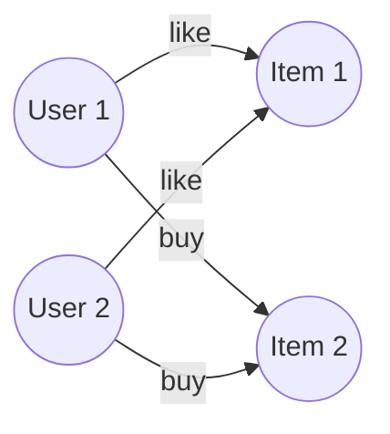
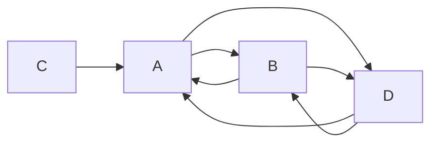
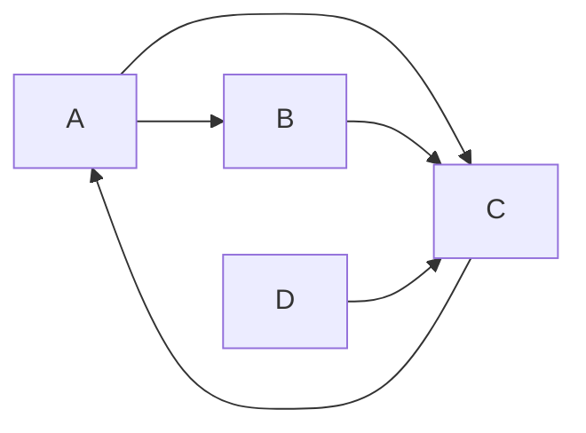

# Spark GraphX原理与代码实例讲解

## 1. 背景介绍

### 1.1 大数据时代下的图计算需求

在当今大数据时代,各行各业都在产生海量的数据。这些数据中蕴含着丰富的关联信息,传统的数据分析方法难以充分挖掘其中的价值。图计算作为一种新兴的数据分析范式,能够高效地分析数据间的复杂关系,在社交网络、电商推荐、金融风控等领域有广泛应用。

### 1.2 Spark生态系统中的GraphX

Apache Spark作为当前最流行的大数据处理框架,提供了完整的大数据处理生态。其中,GraphX是Spark的图计算组件,它将图计算引擎与Spark的分布式计算框架无缝集成,支持海量图数据的高效处理。GraphX在保证性能的同时,还提供了灵活的图计算编程接口,大大简化了复杂图算法的开发。

### 1.3 GraphX的应用场景

GraphX在诸多领域都有成功应用,比如:

- 社交网络分析:利用GraphX分析社交网络结构,发现影响力节点,检测社区等。
- 推荐系统:通过GraphX构建用户商品二部图,实现基于图的协同过滤推荐。  
- 欺诈检测:使用GraphX分析交易网络,识别异常交易模式,防范金融欺诈。
- 知识图谱:利用GraphX存储和查询海量的实体关系知识图谱。

## 2. 核心概念与联系

### 2.1 Property Graph

GraphX使用Property Graph(属性图)来建模图数据。属性图是一个带属性的有向多重图,它包含以下要素:

- 顶点(Vertex):图中的节点,每个顶点有唯一的ID和属性。
- 边(Edge):连接顶点的有向边,每条边有源顶点、目标顶点和属性。

下图展示了一个简单的属性图:



### 2.2 RDD

GraphX是基于Spark的RDD(Resilient Distributed Dataset)构建的。RDD是Spark的基石,它是一个不可变、可分区、里面的元素可并行计算的集合。GraphX将图的顶点和边都用RDD来表示,顶点RDD的元素类型是`(VertexId, VD)`,边RDD的元素类型是`Edge[ED]`。

### 2.3 Graph

`Graph`是GraphX的核心抽象,它包含了顶点和边的RDD:

```scala
class Graph[VD, ED] {
  val vertices: VertexRDD[VD]
  val edges: EdgeRDD[ED]
}
```

GraphX的图计算就是在`Graph`上通过一系列转换操作(transformation)来完成的。`Graph`提供了丰富的转换算子,如`mapVertices`、`mapEdges`、`subgraph`、`aggregateMessages`等,通过这些算子可以方便地进行图的结构和属性的转换。

### 2.4 Pregel

Pregel是Google提出的大规模图计算框架,它采用了"思考像顶点"(Think Like A Vertex)的编程范式,即用户只需要定义顶点程序,就可以自动完成大规模图的并行计算。GraphX的`aggregateMessages`算子就是受Pregel启发而设计的,用户可以通过该算子方便地实现基于Pregel的图算法。

## 3. 核心算法原理具体操作步骤

下面我们以PageRank算法为例,讲解GraphX的核心原理和操作步骤。

### 3.1 PageRank算法原理

PageRank是Google用于网页排序的经典算法,它的基本思想是:如果一个网页被很多其他网页链接到的话说明这个网页比较重要,也就是PageRank值会相对较高。PageRank通过迭代计算收敛每个网页的重要性得分,计算公式为:

$$PR(i) = \frac{1-d}{N} + d \sum_{j \in B(i)} \frac{PR(j)}{L(j)}$$

其中:
- $PR(i)$:网页$i$的PageRank值
- $N$:所有网页的总数  
- $d$:阻尼系数,一般取0.85
- $B(i)$:存在指向网页$i$的链接的网页集合
- $L(j)$:网页$j$的出链数

### 3.2 构建图

首先我们需要将网页链接关系构建为图。我们定义顶点类型为`(VertexId, Double)`,其中`VertexId`表示网页ID,`Double`表示`PageRank`值;边类型为`Edge`,表示网页间的链接关系。

```scala
// 定义顶点RDD
val vertices: RDD[(VertexId, Double)] = sc.parallelize(Array(
  (1L, 0.0),
  (2L, 0.0),
  (3L, 0.0),
  (4L, 0.0)
))

// 定义边RDD
val edges: RDD[Edge[Int]] = sc.parallelize(Array(
  Edge(1L, 2L, 1),
  Edge(1L, 4L, 1),
  Edge(2L, 1L, 1),
  Edge(2L, 4L, 1),
  Edge(3L, 1L, 1), 
  Edge(4L, 1L, 1),
  Edge(4L, 2L, 1)
))

// 构建图
val graph = Graph(vertices, edges)
```

### 3.3 初始化权重

将每个网页的初始PageRank值都设为1.0:

```scala
val rankGraph = graph.mapVertices((id, _) => 1.0)
```

### 3.4 迭代计算

使用Pregel API迭代计算每个网页的PageRank值,直到收敛:

```scala
val tol = 0.0001 // 收敛阈值
val numIter = 20 // 最大迭代次数
val resetProb = 0.15 // 阻尼系数

def vertexProgram(id: VertexId, attr: Double, msgSum: Double): Double = {
  resetProb / (1.0 - resetProb) * msgSum
}

def sendMessage(edge: EdgeTriplet[Double, Int]): Iterator[(VertexId, Double)] = {
  Iterator((edge.dstId, edge.srcAttr / edge.srcNeighbors))  
}

def messageCombiner(a: Double, b: Double): Double = a + b

val rankGraph = graph.mapVertices((id, _) => resetProb)

val pageRanks = rankGraph.pregel(0.0, numIter, activeDirection = EdgeDirection.Out)(
  vertexProgram,
  sendMessage,
  messageCombiner
)
```

其中:
- `vertexProgram`定义了顶点程序,它根据收到的消息更新顶点的PageRank值。
- `sendMessage`定义了消息发送函数,每个顶点将当前PageRank值除以出度,发送给它的邻居。
- `messageCombiner`定义了消息合并函数,对发送给同一顶点的消息进行求和。

### 3.5 结果输出

```scala
println(pageRanks.vertices.collect.mkString("\n"))
```

最终得到每个网页的PageRank值。可以看到,经过20轮迭代后,算法基本收敛。

## 4. 数学模型和公式详细讲解举例说明

前面我们在PageRank算法中用到了以下数学公式:

$$PR(i) = \frac{1-d}{N} + d \sum_{j \in B(i)} \frac{PR(j)}{L(j)}$$

下面我们详细解释该公式的含义。

### 4.1 随机游走模型

PageRank的数学原理可以用随机游走(Random Walk)来解释。我们把网页看作一个有向图,页面是顶点,超链接是边。想象一下,一个随机浏览者,它从一个页面开始,沿着超链接不断随机访问下一个页面。那么,访问每个页面的概率是多少呢?

我们定义$PR(i)$为访问页面$i$的概率。假设网页总数为$N$,阻尼系数为$d$。那么,要计算$PR(i)$,需要考虑两种情况:

- 以$1-d$的概率,访问任意一个页面。这对应公式中的$\frac{1-d}{N}$
- 以$d$的概率,访问页面$i$的邻居,并且按照链接数均分。这对应公式中的$d \sum_{j \in B(i)} \frac{PR(j)}{L(j)}$

可以看到,PageRank本质上是马尔可夫链的平稳分布。$d$称为阻尼系数,它的物理意义是:在任意时刻,用户访问一个页面,有$d$的概率继续沿着链接访问下一个页面,有$1-d$的概率访问任意一个页面。$d$一般取值0.85。

### 4.2 迭代计算

由于PageRank值依赖于所有页面,所以需要迭代计算。我们可以给每个页面一个初始的PageRank值,然后重复计算公式,直到得到稳定的结果。

举个例子,假设有下图所示的四个网页,箭头代表链接关系:



初始时,每个页面的PageRank值为1,即:
- $PR(A) = 1$  
- $PR(B) = 1$
- $PR(C) = 1$
- $PR(D) = 1$

我们取$d=0.85$,则第一轮迭代后:

- $PR(A) = \frac{1-d}{4} + d (\frac{PR(B)}{2} + \frac{PR(C)}{1} + \frac{PR(D)}{2}) = 0.15 + 0.85 \times (0.5+1+0.5) = 1.85$ 
- $PR(B) = 0.15 + 0.85 \times (0.5+0.5) = 1$
- $PR(C) = 0.15 + 0.85 \times 0 = 0.15$
- $PR(D) = 0.15 + 0.85 \times (0.5+0.5) = 1$

重复迭代多次后,最终会得到收敛的PageRank值。可以看到,PageRank值最高的页面是A,其次是B和D,最低的是C。这和我们的直觉是一致的,因为A有最多的入链。

## 5. 项目实践：代码实例和详细解释说明

下面我们用Scala实现一个完整的PageRank计算的例子。

### 5.1 导入依赖

```scala
import org.apache.spark.graphx._
import org.apache.spark.rdd.RDD
```

### 5.2 准备数据

我们构造一个如下的网页链接关系图:



用边RDD表示:

```scala
val edges: RDD[Edge[Double]] = sc.parallelize(Seq(
  Edge(1L, 2L, 1.0),
  Edge(1L, 3L, 1.0),
  Edge(2L, 3L, 1.0),
  Edge(3L, 1L, 1.0),
  Edge(4L, 3L, 1.0)
))
```

### 5.3 构图

```scala
val graph: Graph[Double, Double] = Graph.fromEdges(edges, 1.0)
```

这里用`fromEdges`方法从边RDD构造图,顶点的初始PageRank值为1.0。

### 5.4 计算PageRank

```scala
val numIter = 10
val resetProb = 0.15

def vertexProgram(id: VertexId, attr: Double, msgSum: Double): Double = {
  resetProb + (1.0 - resetProb) * msgSum
}

def sendMessage(edge: EdgeTriplet[Double, Double]): Iterator[(VertexId, Double)] = {
  Iterator((edge.dstId, edge.srcAttr / edge.srcNeighbors))  
}

def messageCombiner(a: Double, b: Double): Double = a + b

val pageRanks = graph.pregel(0.0, numIter, activeDirection = EdgeDirection.Out)(
  vertexProgram,
  sendMessage,
  messageCombiner
)
```

这里使用`pregel`API实现PageRank的迭代计算。`vertexProgram`定义了顶点程序,它根据收到的消息更新PageRank值。`sendMessage`定义了消息发送函数,每个顶点将当前PageRank值除以出度后发送给邻居。`messageCombiner`定义了消息合并函数,对发送给同一顶点的消息求和。

### 5.5 显示结果

```scala
println(pageRanks.vertices.collect.mkString("\n"))
```

最终得到每个顶点的PageRank值:

```
(4,0.15)
(1,1.1925)
(3,1.46)
(2,0.6375)
```

可以看到,顶点1的PageRank值最高,这和我们预期的一致,因为顶点