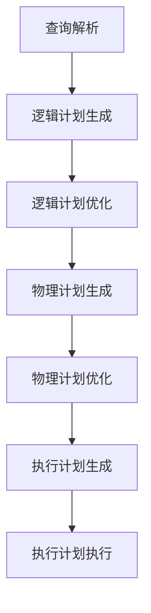

# Spark SQL结构化数据处理原理与代码实例讲解

## 1.背景介绍

在大数据处理领域，Apache Spark已经成为了一个不可或缺的工具。其高效的内存计算能力和丰富的API使得它在处理大规模数据时表现出色。Spark SQL是Spark生态系统中的一个重要组件，它提供了对结构化数据的支持，使得用户可以使用SQL查询语言来操作数据，同时也可以利用Spark的强大计算能力。

Spark SQL不仅支持SQL查询，还支持DataFrame和Dataset API，这使得它在处理结构化数据时更加灵活和高效。本文将深入探讨Spark SQL的结构化数据处理原理，并通过具体的代码实例来讲解其实际应用。

## 2.核心概念与联系

在深入探讨Spark SQL之前，我们需要了解一些核心概念：

### 2.1 DataFrame

DataFrame是Spark SQL中最基本的数据结构，它类似于关系数据库中的表。DataFrame是分布式的、不可变的集合，包含了行和列。每一列都有一个名称和类型。

### 2.2 Dataset

Dataset是DataFrame的扩展，它提供了类型安全的操作。Dataset结合了RDD的强类型和DataFrame的优化执行计划，使得它在处理大规模数据时更加高效。

### 2.3 Catalyst优化器

Catalyst是Spark SQL的查询优化器，它通过一系列的规则和策略来优化查询计划。Catalyst优化器的目标是生成一个高效的物理执行计划，以最小化数据处理的时间和资源消耗。

### 2.4 Tungsten引擎

Tungsten是Spark SQL的执行引擎，它通过一系列的内存管理和代码生成技术来提高数据处理的效率。Tungsten引擎的目标是最大化CPU和内存的利用率，从而提高数据处理的性能。

## 3.核心算法原理具体操作步骤

在理解了核心概念之后，我们来探讨Spark SQL的核心算法原理和具体操作步骤。

### 3.1 查询解析

查询解析是Spark SQL处理的第一步，它将用户输入的SQL查询解析成一个抽象语法树（AST）。这个过程包括词法分析和语法分析。

### 3.2 逻辑计划生成

在解析完成后，Catalyst优化器会生成一个逻辑计划。逻辑计划是一个抽象的表示，它描述了数据处理的步骤，但不包含具体的执行细节。

### 3.3 逻辑计划优化

Catalyst优化器会对逻辑计划进行一系列的优化，包括谓词下推、列裁剪和子查询消除等。这些优化的目的是减少数据处理的开销，提高查询的执行效率。

### 3.4 物理计划生成

在逻辑计划优化完成后，Catalyst优化器会生成一个物理计划。物理计划是一个具体的执行计划，它描述了数据处理的具体步骤和操作。

### 3.5 物理计划优化

物理计划生成后，Catalyst优化器还会对物理计划进行一系列的优化，包括选择最优的执行策略和操作顺序等。

### 3.6 执行计划生成

在物理计划优化完成后，Tungsten引擎会生成一个执行计划。执行计划是一个具体的执行指令，它描述了数据处理的具体操作和步骤。

### 3.7 执行计划执行

最后，Tungsten引擎会执行生成的执行计划，完成数据的处理和计算。

以下是Spark SQL处理流程的Mermaid流程图：



## 4.数学模型和公式详细讲解举例说明

在数据处理过程中，数学模型和公式是不可或缺的。下面我们通过一个具体的例子来讲解Spark SQL中的数学模型和公式。

### 4.1 例子：计算平均值

假设我们有一个包含学生成绩的DataFrame，我们需要计算每个学生的平均成绩。

```scala
val df = spark.read.json("students.json")
df.createOrReplaceTempView("students")
val result = spark.sql("SELECT name, AVG(score) as avg_score FROM students GROUP BY name")
result.show()
```

在这个例子中，我们使用了SQL查询来计算每个学生的平均成绩。具体的数学公式如下：

$$
\text{avg\_score} = \frac{\sum \text{score}}{n}
$$

其中，$\sum \text{score}$表示所有成绩的总和，$n$表示成绩的数量。

### 4.2 例子：线性回归

假设我们有一个包含房屋价格和面积的数据集，我们需要使用线性回归模型来预测房屋价格。

```scala
import org.apache.spark.ml.regression.LinearRegression
val data = spark.read.format("libsvm").load("housing_data.txt")
val lr = new LinearRegression()
val model = lr.fit(data)
val predictions = model.transform(data)
predictions.show()
```

在这个例子中，我们使用了线性回归模型来预测房屋价格。具体的数学公式如下：

$$
y = \beta_0 + \beta_1 x
$$

其中，$y$表示房屋价格，$x$表示房屋面积，$\beta_0$和$\beta_1$是模型的参数。

## 5.项目实践：代码实例和详细解释说明

在这一部分，我们将通过一个具体的项目实例来讲解Spark SQL的实际应用。

### 5.1 项目背景

假设我们有一个包含用户行为数据的数据集，我们需要分析用户的行为模式，并生成相应的报告。

### 5.2 数据准备

首先，我们需要准备数据。假设我们的数据存储在一个JSON文件中。

```scala
val df = spark.read.json("user_behavior.json")
df.createOrReplaceTempView("user_behavior")
```

### 5.3 数据分析

接下来，我们使用Spark SQL来分析用户的行为模式。

```scala
val result = spark.sql("SELECT user_id, COUNT(*) as behavior_count FROM user_behavior GROUP BY user_id")
result.show()
```

在这个例子中，我们使用了SQL查询来计算每个用户的行为次数。

### 5.4 数据可视化

最后，我们将分析结果进行可视化展示。

```scala
import org.apache.spark.sql.functions._
val result = df.groupBy("user_id").agg(count("*").as("behavior_count"))
result.show()
```

## 6.实际应用场景

Spark SQL在实际应用中有广泛的应用场景，以下是一些典型的应用场景：

### 6.1 数据仓库

Spark SQL可以用作数据仓库，支持大规模数据的存储和查询。通过与Hive的集成，Spark SQL可以直接查询Hive表，并利用Spark的计算能力进行高效的数据处理。

### 6.2 实时数据分析

Spark SQL支持实时数据分析，可以与Spark Streaming结合，处理实时数据流。通过使用Structured Streaming API，用户可以使用SQL查询实时数据，并生成实时报告。

### 6.3 机器学习

Spark SQL可以与Spark MLlib结合，支持大规模机器学习任务。通过使用DataFrame和Dataset API，用户可以方便地准备和处理数据，并使用MLlib的算法进行模型训练和预测。

## 7.工具和资源推荐

在使用Spark SQL进行数据处理时，以下工具和资源可以帮助你提高效率：

### 7.1 工具

- **Apache Zeppelin**：一个基于Web的笔记本工具，支持Spark SQL查询和数据可视化。
- **Jupyter Notebook**：一个流行的笔记本工具，支持多种编程语言，包括Python和Scala。
- **Databricks**：一个基于云的Spark平台，提供了丰富的Spark SQL功能和数据处理工具。

### 7.2 资源

- **Spark官方文档**：提供了详细的Spark SQL使用指南和API文档。
- **Spark SQL编程指南**：一本详细介绍Spark SQL编程的书籍，适合初学者和高级用户。
- **在线课程**：如Coursera和edX上的Spark SQL课程，提供了系统的学习资源和实践机会。

## 8.总结：未来发展趋势与挑战

Spark SQL作为大数据处理的重要工具，具有广泛的应用前景和发展潜力。未来，随着数据规模的不断增长和计算需求的不断增加，Spark SQL将面临以下发展趋势和挑战：

### 8.1 发展趋势

- **性能优化**：随着硬件和软件技术的不断进步，Spark SQL将继续优化其性能，提高数据处理的效率。
- **功能扩展**：Spark SQL将不断扩展其功能，支持更多的数据源和查询类型，满足用户的多样化需求。
- **智能化**：随着人工智能技术的发展，Spark SQL将引入更多的智能化功能，如自动查询优化和智能数据分析。

### 8.2 挑战

- **数据安全**：随着数据隐私和安全问题的日益重要，Spark SQL需要加强数据安全和隐私保护措施，确保用户数据的安全性。
- **复杂性管理**：随着数据规模和复杂性的增加，Spark SQL需要提供更好的工具和方法，帮助用户管理和处理复杂的数据。
- **资源管理**：在大规模数据处理环境中，