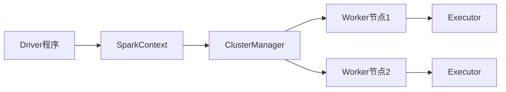
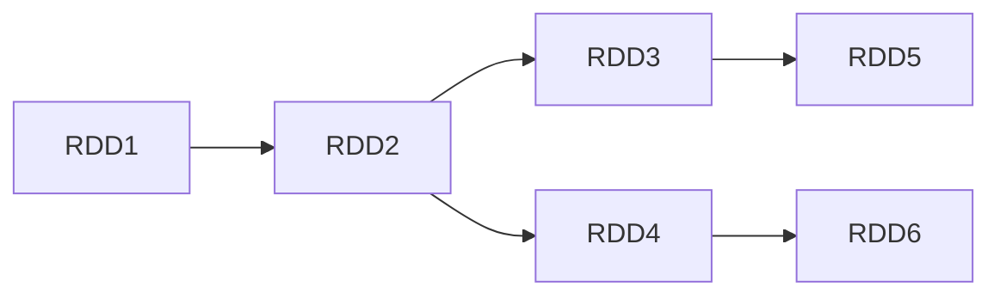

# Spark原理与代码实例讲解

## 1.背景介绍

Apache Spark是一种快速、通用、可扩展的大数据分析计算引擎。它最初是由加州大学伯克利分校的AMPLab所开发,后来捐赠给Apache软件基金会,成为Apache开源项目的一部分。Spark的设计目标是支持迭代式算法和交互式数据挖掘,并且能够高效运行于内存中。

Spark的核心是弹性分布式数据集(Resilient Distributed Dataset,RDD),一种分布式内存抽象。RDD是一种分布式数据结构,可以并行操作,并且具有容错能力。Spark可以在集群中的多个节点上运行,并在内存中高效缓存数据,从而加快了迭代式算法和交互式数据挖掘的速度。

与传统的MapReduce框架相比,Spark具有以下优势:

1. **通用性**:Spark不仅支持批处理,还支持流处理、机器学习、图计算等多种数据处理场景。
2. **内存计算**:Spark基于内存计算,可以显著提高数据处理速度。
3. **容错性**:Spark的RDD具有容错能力,可以自动恢复丢失的分区数据。
4. **易用性**:Spark提供了Python、Java、Scala和R等多种编程语言的API,易于上手和使用。

Spark已经成为大数据处理领域最受欢迎的开源项目之一,被广泛应用于各种领域,如金融、电信、医疗、零售等。

## 2.核心概念与联系

### 2.1 RDD (Resilient Distributed Dataset)

RDD是Spark的核心抽象,它代表一个不可变、分区的记录集合,可以并行操作。RDD可以从HDFS、HBase、Cassandra等数据源创建,也可以通过现有RDD转换而来。

RDD有以下特点:

- **不可变性**:RDD中的数据是只读的,不能直接修改。
- **分区**:RDD由多个分区组成,每个分区存储在集群的不同节点上。
- **容错性**:RDD具有容错能力,可以自动恢复丢失的分区数据。
- **惰性计算**:RDD的转换操作是惰性的,只有在执行Action操作时才会触发实际计算。

### 2.2 Transformation和Action

Spark提供了两种类型的操作:Transformation和Action。

- **Transformation**:对RDD进行转换,生成新的RDD,如map、filter、flatMap等。这些操作是惰性的,不会立即执行。
- **Action**:触发RDD的计算,并返回结果,如count、collect、reduce等。Action操作会强制执行所有之前的Transformation操作。

```scala
val rdd = sc.textFile("path/to/file")
val flattenedRdd = rdd.flatMap(line => line.split(" ")) // Transformation
val count = flattenedRdd.count() // Action
```

### 2.3 Spark运行架构

Spark运行架构包括以下几个核心组件:

1. **Driver程序**:运行应用程序的主入口,负责创建SparkContext、RDD、Transformation和Action操作。
2. **SparkContext**:Spark应用程序的入口点,用于创建RDD和广播变量。
3. **ClusterManager**:负责资源分配和任务调度,常见的有Standalone、YARN和Mesos等。
4. **Worker节点**:执行任务的工作节点,由Executor进程运行在Worker节点上。
5. **Executor**:负责执行任务,并将结果返回给Driver程序。



## 3.核心算法原理具体操作步骤

### 3.1 RDD的创建

RDD可以通过以下几种方式创建:

1. **从文件系统或其他数据源创建**:使用SparkContext的`textFile`、`wholeTextFiles`等方法从文件系统或其他数据源创建RDD。

```scala
val rdd = sc.textFile("path/to/file")
```

2. **从集合创建**:使用SparkContext的`parallelize`方法从集合创建RDD。

```scala
val data = Seq(1, 2, 3, 4, 5)
val rdd = sc.parallelize(data)
```

3. **从其他RDD转换而来**:通过对现有RDD执行Transformation操作,生成新的RDD。

```scala
val rdd = sc.textFile("path/to/file")
val flattenedRdd = rdd.flatMap(line => line.split(" "))
```

### 3.2 RDD的Transformation操作

常见的Transformation操作包括:

- **map**:对RDD中的每个元素应用函数,生成新的RDD。
- **filter**:返回RDD中满足条件的元素,生成新的RDD。
- **flatMap**:对RDD中的每个元素应用函数,并将结果拼接成一个新的RDD。
- **union**:将两个RDD合并成一个新的RDD。
- **join**:根据键值对的键进行连接操作,生成新的RDD。

```scala
val rdd = sc.textFile("path/to/file")
val wordsRdd = rdd.flatMap(line => line.split(" "))
val lengthsRdd = wordsRdd.map(word => word.length)
val filteredRdd = lengthsRdd.filter(length => length > 5)
```

### 3.3 RDD的Action操作

常见的Action操作包括:

- **reduce**:使用函数对RDD中的元素进行聚合,返回最终结果。
- **collect**:将RDD中的所有元素收集到Driver程序中,返回一个数组。
- **count**:返回RDD中元素的个数。
- **take**:返回RDD中的前n个元素。
- **saveAsTextFile**:将RDD的内容保存到文件系统中。

```scala
val rdd = sc.textFile("path/to/file")
val count = rdd.count() // 返回RDD中元素的个数
val first10 = rdd.take(10) // 返回RDD中的前10个元素
rdd.saveAsTextFile("path/to/output") // 将RDD保存到文件系统
```

### 3.4 RDD的依赖关系

RDD之间存在依赖关系,形成了一个有向无环图(DAG)。Spark会根据这个DAG来优化执行计划,并进行任务调度。



## 4.数学模型和公式详细讲解举例说明

在Spark中,一些常见的数学模型和公式包括:

### 4.1 MapReduce模型

MapReduce是一种流行的大数据处理模型,由Google提出。它将计算过程分为两个阶段:Map和Reduce。

Map阶段:

$$
\text{Map}(k_1, v_1) \rightarrow \text{list}(k_2, v_2)
$$

Map函数将输入的键值对$(k_1, v_1)$映射为一个中间的键值对列表$\text{list}(k_2, v_2)$。

Reduce阶段:

$$
\text{Reduce}(k_2, \text{list}(v_2)) \rightarrow \text{list}(v_3)
$$

Reduce函数将Map阶段的输出按照键$k_2$进行聚合,生成最终的结果列表$\text{list}(v_3)$。

在Spark中,可以使用`map`和`reduceByKey`等操作来实现MapReduce模型。

### 4.2 矩阵分解

矩阵分解是一种常见的机器学习技术,用于降维和推荐系统等场景。常见的矩阵分解算法包括奇异值分解(SVD)和非负矩阵分解(NMF)。

假设有一个$m \times n$的矩阵$A$,我们希望将其分解为两个矩阵$U$和$V$的乘积,即:

$$
A \approx UV^T
$$

其中$U$是$m \times r$的矩阵,$V$是$n \times r$的矩阵,$r$是一个小于$m$和$n$的正整数,称为矩阵的秩。

在Spark中,可以使用MLlib库中的`pca`和`als`等算法来实现矩阵分解。

### 4.3 PageRank算法

PageRank是一种用于计算网页权重的算法,被广泛应用于网页排名和图计算等领域。

PageRank算法的基本思想是:一个网页的权重取决于链接到它的其他网页的权重之和。具体公式如下:

$$
PR(p_i) = \frac{1-d}{N} + d \sum_{p_j \in M(p_i)} \frac{PR(p_j)}{L(p_j)}
$$

其中:

- $PR(p_i)$表示网页$p_i$的PageRank值。
- $N$是网络中所有网页的总数。
- $M(p_i)$是链接到网页$p_i$的所有网页集合。
- $L(p_j)$是网页$p_j$的出链接数量。
- $d$是一个阻尼系数,通常取值为0.85。

在Spark中,可以使用GraphX库来实现PageRank算法。

## 5.项目实践:代码实例和详细解释说明

下面是一个使用Spark进行单词计数的简单示例:

```scala
import org.apache.spark.SparkContext
import org.apache.spark.SparkConf

object WordCount {
  def main(args: Array[String]): Unit = {
    // 创建SparkConf对象
    val conf = new SparkConf().setAppName("WordCount")
    // 创建SparkContext对象
    val sc = new SparkContext(conf)

    // 从文件系统读取文本文件,创建RDD
    val textFile = sc.textFile("path/to/file.txt")

    // 将每一行拆分为单词,生成新的RDD
    val wordsRDD = textFile.flatMap(line => line.split(" "))

    // 对单词进行计数
    val wordCounts = wordsRDD.map(word => (word, 1)).reduceByKey((a, b) => a + b)

    // 将结果收集到Driver程序并打印
    val result = wordCounts.collect()
    result.foreach(println)

    // 停止SparkContext
    sc.stop()
  }
}
```

代码解释:

1. 首先创建`SparkConf`对象,用于配置Spark应用程序。
2. 使用`SparkConf`创建`SparkContext`对象,作为Spark应用程序的入口点。
3. 调用`textFile`方法从文件系统读取文本文件,创建初始的RDD。
4. 对RDD执行`flatMap`操作,将每一行拆分为单词,生成新的RDD。
5. 对单词RDD执行`map`操作,将每个单词映射为键值对`(word, 1)`。
6. 使用`reduceByKey`操作,对相同的单词进行计数,生成`(word, count)`形式的RDD。
7. 调用`collect`方法将结果收集到Driver程序中,并打印输出。
8. 最后调用`stop`方法停止SparkContext。

运行上述程序,输出结果类似于:

```
(hello,2)
(world,1)
(spark,3)
```

## 6.实际应用场景

Spark由于其通用性、高效性和易用性,被广泛应用于各种大数据处理场景,包括但不限于:

1. **批处理**:Spark可以高效地处理大规模的批量数据,如日志分析、ETL等。
2. **流处理**:Spark Streaming可以实时处理数据流,如实时监控、在线推荐等。
3. **机器学习**:Spark MLlib提供了多种机器学习算法,可用于构建预测模型、推荐系统等。
4. **图计算**:Spark GraphX支持图计算,可应用于社交网络分析、路径规划等场景。
5. **SQL查询**:Spark SQL支持使用SQL语句查询结构化数据。
6. **数据科学**:Spark可与Python、R等数据科学工具集成,用于数据探索和建模。

下面是一些具体的应用场景示例:

- **电商网站**:使用Spark进行用户行为分析、商品推荐、广告投放等。
- **金融机构**:使用Spark进行风险模型构建、欺诈检测、实时交易监控等。
- **社交网络**:使用Spark进行社交关系分析、内容推荐、用户画像构建等。
- **物联网**:使用Spark进行实时数据处理、异常检测、预测性维护等。

## 7.工具和资源推荐

在使用Spark进行开发和学习时,可以利用以下工具和资源:

1. **Apache Spark官网**:https://spark.apache.org/
   官网提供了Spark的文档、下载、社区支持等资源。

2. **Spark编程指南**:https://spark.apache.org