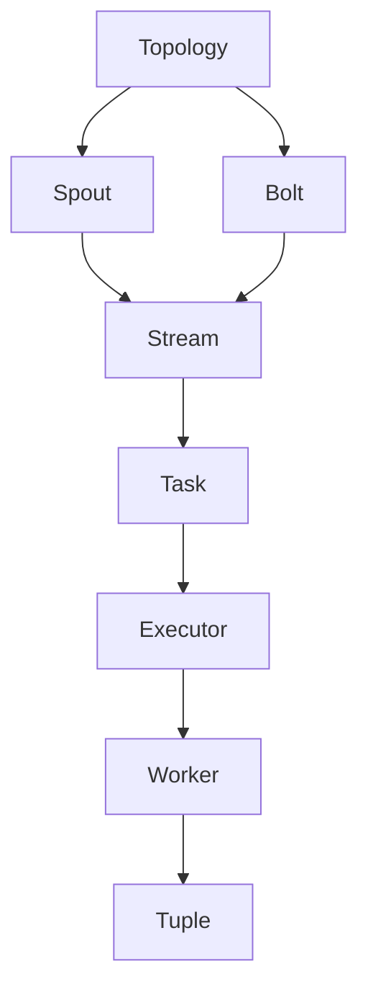

# Storm原理与代码实例讲解

## 1.背景介绍

在当今大数据时代,实时流数据处理成为了一个非常重要的课题。Apache Storm作为一个分布式实时计算系统,它可以在低延迟的情况下实现高吞吐量和高可伸缩性,被广泛应用于实时分析、在线机器学习、持续计算、分布式RPC等场景。

Storm的设计思想源于Hadoop的MapReduce模型,但是MapReduce主要用于离线批处理,而Storm则专注于流式数据的实时处理。Storm通过将数据流建模为一个无限流的有向无环图(DAG),并将计算过程并行化到集群中,从而实现了低延迟、高吞吐量和高可伸缩性。

### 1.1 Storm的应用场景

- 实时分析: 对大量实时流数据进行实时分析,如网络日志分析、用户行为分析等。
- 在线机器学习: 持续从流数据中学习模型,并实时做出预测和决策。
- 连续计算: 对无限流数据进行持续不断的计算和处理。
- 分布式RPC: 通过Storm实现低延迟的分布式远程过程调用。

### 1.2 Storm的优势

- 低延迟: 通过分布式流处理,Storm可以在毫秒级延迟内处理数据。
- 高吞吐量: 可以通过水平扩展来线性提高系统吞吐量。
- 高可靠性: 通过检查点机制和消息重发机制,Storm能够保证数据处理的可靠性。
- 容错性: Storm集群中的节点发生故障时,能够自动从故障中恢复并重新分配任务。
- 编程简单: Storm提供了简单易用的编程接口,降低了开发难度。

## 2.核心概念与联系

为了更好地理解Storm的工作原理,我们首先需要了解Storm中的一些核心概念及它们之间的关系。

### 2.1 核心概念

1. **Topology(拓扑)**: 一个Storm应用程序被称为Topology,它定义了数据流的有向无环图(DAG)。

2. **Spout(喷口)**: 是数据源,用于向Topology中注入数据流。

3. **Bolt(bolt任务)**: 是数据处理单元,用于对数据流进行处理和转换。Bolt可以订阅一个或多个Spout或Bolt的输出流。

4. **Stream(数据流)**: 是一个无界的、连续的数据流,由Spout或Bolt生成。

5. **Task(任务)**: 是Spout或Bolt的具体执行实例。

6. **Worker(工作进程)**: 是一个JVM进程,用于执行一个或多个Task。

7. **Executor(执行器)**: 是一个线程,用于执行一个Task的所有线程。

8. **Tuple(数据元组)**: 是Storm中传输的基本数据单元,由一系列键值对组成。

### 2.2 核心组件关系

Storm的核心组件之间的关系可以用以下流程图来表示:



- Topology定义了整个数据流处理的拓扑结构,包含Spout和Bolt。
- Spout作为数据源,向Topology中注入数据流(Stream)。
- Bolt订阅一个或多个Spout或Bolt的输出Stream,对数据流进行处理和转换。
- Task是Spout或Bolt的具体执行实例,由Executor线程执行。
- Executor是一个线程,用于执行一个Task的所有线程。
- Worker是一个JVM进程,用于执行一个或多个Task。
- Tuple是Storm中传输的基本数据单元,由一系列键值对组成。

## 3.核心算法原理具体操作步骤

Storm的核心算法主要包括数据流分组、任务调度、容错机制等,下面我们将详细介绍这些算法的原理和具体操作步骤。

### 3.1 数据流分组(Stream Grouping)

数据流分组决定了如何将数据流从上游(Spout或Bolt)分发到下游(Bolt)的Task中。Storm提供了多种数据流分组策略,包括随机分组(Shuffle Grouping)、字段分组(Fields Grouping)、全局分组(Global Grouping)等。

1. **随机分组(Shuffle Grouping)**

随机分组是Storm的默认分组策略。它会将上游的Tuple随机分发到下游Bolt的Task中,从而实现负载均衡。具体操作步骤如下:

   1) 计算下游Bolt的Task数量N。
   2) 使用一个随机数生成器生成一个0到N-1之间的随机数。
   3) 将Tuple发送到对应编号的Task中。

2. **字段分组(Fields Grouping)**

字段分组根据Tuple中的某些字段的值,将相同值的Tuple发送到同一个Task中。这种分组策略常用于需要对相同字段值的数据进行聚合或处理的场景。具体操作步骤如下:

   1) 从Tuple中提取指定字段的值。
   2) 对这些字段值进行哈希运算,得到一个哈希值。
   3) 根据哈希值和下游Task数量N,计算出目标Task的编号: `taskId = hash(fields) % N`。
   4) 将Tuple发送到对应的Task中。

3. **全局分组(Global Grouping)**

全局分组将所有的Tuple都发送到同一个Task中进行处理。这种分组策略适用于需要对所有数据进行全局计算或聚合的场景,但也存在单点故障和性能瓶颈的风险。具体操作步骤如下:

   1) 计算下游Bolt的Task数量N。
   2) 选择一个固定的Task编号,例如0。
   3) 将所有Tuple都发送到编号为0的Task中。

### 3.2 任务调度(Task Scheduling)

Storm采用了一种称为"工作窃取"(Work Stealing)的任务调度算法,用于在集群中动态地分配和调度Task。该算法的核心思想是,当某个Worker处理能力较低时,可以从其他繁忙的Worker那里"窃取"一些Task过来执行,从而实现更好的负载均衡和资源利用率。

具体操作步骤如下:

1) 每个Worker都会定期向Nimbus(Storm的主控节点)发送心跳信号,报告自己的负载情况。
2) Nimbus会根据所有Worker的负载情况,计算出集群的平均负载。
3) 如果某个Worker的负载远低于平均负载,Nimbus会尝试从其他繁忙的Worker那里"窃取"一些Task,并将它们重新分配给空闲的Worker。
4) 在"窃取"Task时,Nimbus会优先选择那些可以在本地磁盘上恢复状态的Task,以减少数据传输开销。
5) 如果本地磁盘上没有可用的Task,Nimbus会选择从远程Worker那里"窃取"Task,并将其状态通过网络传输到新的Worker上。

这种"工作窃取"算法可以有效地实现集群中的负载均衡,提高资源利用率,并且具有很好的容错能力和可扩展性。

### 3.3 容错机制

Storm采用了一种基于检查点(Checkpoint)和消息重发(Message Replay)的容错机制,以确保数据处理的可靠性和容错性。

1. **检查点(Checkpoint)**

Storm会定期将Topology的状态(包括Spout和Bolt的状态)保存到检查点中。当发生故障时,Storm可以从最近的检查点恢复Topology的状态,并重新处理未完成的数据。

具体操作步骤如下:

   1) Storm会为每个Topology创建一个专用的ZooKeeper节点,用于存储检查点信息。
   2) 定期(默认每10分钟)将Topology的状态保存到ZooKeeper中。
   3) 当发生故障时,Storm会从ZooKeeper中读取最近的检查点,并根据检查点信息重新创建Topology的状态。

2. **消息重发(Message Replay)**

除了检查点机制,Storm还采用了消息重发机制,以确保数据处理的可靠性。当某个Bolt处理失败时,Storm会自动将未处理的Tuple重新发送给该Bolt,以便重新处理。

具体操作步骤如下:

   1) 每个Spout和Bolt都会维护一个队列,用于缓存已发送但未被确认的Tuple。
   2) 当下游的Bolt成功处理了一个Tuple后,会向上游发送一个确认消息(Ack)。
   3) 如果上游在一定时间内没有收到确认消息,就会认为该Tuple处理失败,并将其重新发送给下游的Bolt。
   4) 下游的Bolt会根据Tuple的ID来判断是否为重复的Tuple,从而避免重复处理。

通过检查点和消息重发机制的结合,Storm可以在发生故障时自动从故障中恢复,并保证数据处理的可靠性和容错性。

## 4.数学模型和公式详细讲解举例说明

在Storm中,一些核心算法和机制涉及到一些数学模型和公式,下面我们将详细讲解这些模型和公式,并给出具体的例子说明。

### 4.1 数据流分组的哈希函数

在字段分组(Fields Grouping)中,Storm需要根据Tuple中的某些字段值计算出一个哈希值,然后根据这个哈希值将Tuple分发到对应的Task中。Storm使用了一种高效的哈希函数,称为Murmur3哈希函数。

Murmur3哈希函数的计算公式如下:

$$
h = \text{fmix}\left(\text{fmix}\left(\text{fmix}\left(k_1, c_1\right), k_2, c_2\right), k_3, c_3\right)
$$

其中:

- $k_1, k_2, k_3$是输入的三个32位数据块。
- $c_1, c_2, c_3$是三个预定义的常数。
- $\text{fmix}$是一个混合函数,用于将输入数据块与常数混合,并进行位操作和乘法运算。

例如,假设我们有一个Tuple,其中包含两个字段`user_id`和`product_id`,我们希望根据这两个字段的值进行字段分组。首先,我们需要将这两个字段的值转换为32位整数:

```java
int userId = Integer.parseInt(tuple.getValueByField("user_id"));
int productId = Integer.parseInt(tuple.getValueByField("product_id"));
```

然后,我们可以使用Murmur3哈希函数计算出一个哈希值:

```java
int hash = murmur3_32(userId, productId);
```

其中,`murmur3_32`是Murmur3哈希函数的Java实现。最后,我们可以根据这个哈希值和下游Bolt的Task数量N,计算出目标Task的编号:

```java
int targetTaskId = hash % N;
```

通过这种方式,具有相同`user_id`和`product_id`值的Tuple将被发送到同一个Task中进行处理。

### 4.2 任务调度的负载均衡模型

在Storm的任务调度算法中,我们需要计算出集群的平均负载,并根据Worker的负载情况进行任务的动态分配和调度。我们可以使用一个简单的负载均衡模型来描述这个过程。

假设集群中有N个Worker,每个Worker的负载分别为$l_1, l_2, \ldots, l_N$,则集群的平均负载可以计算为:

$$
\overline{l} = \frac{1}{N}\sum_{i=1}^{N}l_i
$$

我们的目标是使每个Worker的负载都尽可能接近于平均负载$\overline{l}$,从而实现负载均衡。

具体来说,对于任意一个Worker $i$,如果它的负载$l_i$远小于平均负载$\overline{l}$,我们就需要从其他繁忙的Worker那里"窃取"一些Task,并将它们分配给Worker $i$。假设我们从Worker $j$那里"窃取"了$m_{ij}$个Task,则Worker $i$和Worker $j$的新负载分别为:

$$
l_i' = l_i + \sum_{j=1}^{N}m_{ij}
$$

$$
l_j' = l_j - \sum_{i=1}^{N}m_{ji}
$$

我们的目标是找到一组合适的$m_{ij}$值,使得所有Worker的新负载$l_i'$都尽可能接近于平均负载$\overline{l}$。这可以通过一些优化算法或启发式算法来实现,例如最小二乘法或模拟退火算法等。

例如