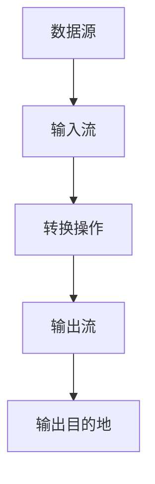

## 1. 背景介绍

随着大数据时代的到来，数据处理和分析变得越来越重要。传统的批处理方式已经无法满足实时性和交互性的需求。因此，流处理技术应运而生。Structured Streaming是Apache Spark 2.0版本中引入的一种流处理技术，它可以将流数据当做一张表来处理，提供了与批处理相同的API和语义，使得流处理变得更加简单和易于理解。

## 2. 核心概念与联系

Structured Streaming的核心概念是“流式DataFrame”，它是一种基于时间的数据流，可以看作是一张无限增长的表。Structured Streaming将流数据分成一系列的微批次，每个微批次都是一个DataFrame，可以使用Spark SQL的API进行处理。Structured Streaming的API与Spark SQL的API非常相似，因此可以很容易地进行转换。

Structured Streaming的流程如下图所示：



## 3. 核心算法原理具体操作步骤

Structured Streaming的核心算法原理是基于Spark SQL的Catalyst优化器和Tungsten执行引擎。Catalyst优化器可以将DataFrame转换为物理执行计划，Tungsten执行引擎可以将物理执行计划转换为字节码，从而提高执行效率。

Structured Streaming的具体操作步骤如下：

1. 定义输入流：使用Spark Streaming的API定义输入流，可以从Kafka、Flume、HDFS等数据源中读取数据。

2. 转换操作：使用Spark SQL的API对输入流进行转换操作，可以进行过滤、聚合、排序等操作。

3. 输出流：将转换后的数据输出到指定的目的地，可以是Kafka、HDFS、数据库等。

## 4. 数学模型和公式详细讲解举例说明

Structured Streaming的数学模型和公式比较简单，主要是基于Spark SQL的DataFrame和SQL语法。下面是一个简单的例子：

```sql
SELECT word, count(*) as count
FROM input
GROUP BY word
```

这个SQL语句可以对输入流中的单词进行计数，并输出每个单词出现的次数。

## 5. 项目实践：代码实例和详细解释说明

下面是一个使用Structured Streaming进行实时日志分析的代码示例：

```python
from pyspark.sql import SparkSession

spark = SparkSession.builder.appName("StructuredStreamingExample").getOrCreate()

# 定义输入流
inputDF = spark.readStream.format("text").load("logs")

# 转换操作
words = inputDF.selectExpr("split(value, ' ') as words")
wordCounts = words.selectExpr("explode(words) as word").groupBy("word").count()

# 输出流
query = wordCounts.writeStream.outputMode("complete").format("console").start()

query.awaitTermination()
```

这个代码示例从“logs”目录中读取日志文件，对日志中的单词进行计数，并将结果输出到控制台。

## 6. 实际应用场景

Structured Streaming可以应用于各种实时数据处理场景，例如实时日志分析、实时推荐、实时监控等。它可以处理大规模的数据流，并提供与批处理相同的API和语义，使得流处理变得更加简单和易于理解。

## 7. 工具和资源推荐

- Apache Spark官网：https://spark.apache.org/
- Structured Streaming官方文档：https://spark.apache.org/docs/latest/structured-streaming-programming-guide.html

## 8. 总结：未来发展趋势与挑战

Structured Streaming是流处理技术的一个重要进展，它提供了与批处理相同的API和语义，使得流处理变得更加简单和易于理解。未来，随着大数据时代的到来，流处理技术将会越来越重要，Structured Streaming将会成为一个重要的工具。

然而，Structured Streaming也面临着一些挑战，例如性能、可靠性、容错性等方面的问题。未来，需要不断地进行优化和改进，以满足不断增长的数据处理需求。

## 9. 附录：常见问题与解答

Q: Structured Streaming与Spark Streaming有什么区别？

A: Structured Streaming是Spark 2.0版本中引入的一种流处理技术，它可以将流数据当做一张表来处理，提供了与批处理相同的API和语义。Spark Streaming是Spark 1.x版本中引入的一种流处理技术，它基于微批次处理，提供了DStream API。

Q: Structured Streaming支持哪些数据源？

A: Structured Streaming支持各种数据源，例如Kafka、Flume、HDFS、文件系统、Socket等。

Q: Structured Streaming的性能如何？

A: Structured Streaming的性能取决于数据源、转换操作、输出目的地等因素。在一些基准测试中，Structured Streaming的性能比Spark Streaming要好。

作者：禅与计算机程序设计艺术 / Zen and the Art of Computer Programming