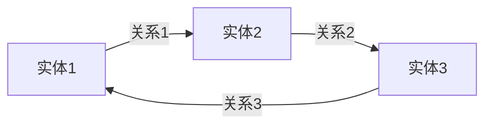
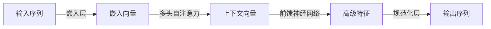

# Transformer与知识图谱:强强联手的威力

## 1.背景介绍

在当今的信息时代,数据的爆炸性增长带来了新的挑战和机遇。传统的信息检索和自然语言处理技术已经难以满足人们对知识发现和语义理解的需求。因此,知识图谱(Knowledge Graph)和Transformer等新兴技术应运而生,为智能系统提供了强大的知识表示和语义理解能力。

知识图谱是一种结构化的知识表示形式,它将现实世界中的实体、概念及其关系以图的形式进行组织和存储。知识图谱能够捕捉和表达复杂的语义信息,为智能系统提供丰富的背景知识。然而,构建和维护高质量的知识图谱是一项艰巨的任务,需要大量的人工努力和领域专家的参与。

另一方面,Transformer是一种革命性的深度学习模型,在自然语言处理、计算机视觉等多个领域取得了卓越的成绩。Transformer基于自注意力(Self-Attention)机制,能够有效地捕捉输入序列中的长程依赖关系,从而更好地理解和生成自然语言。然而,Transformer模型通常需要大量的训练数据和计算资源,并且缺乏对结构化知识的利用。

将Transformer与知识图谱相结合,可以充分发挥两者的优势,实现强强联手的威力。一方面,知识图谱为Transformer模型提供了丰富的背景知识,有助于提高语义理解和生成的准确性。另一方面,Transformer模型可以利用自注意力机制从文本中自动挖掘知识,并将其融入知识图谱中,从而扩充和完善知识图谱。这种融合不仅能够提高智能系统的性能,还能够降低构建和维护知识图谱的成本。

## 2.核心概念与联系

### 2.1 知识图谱

知识图谱是一种结构化的知识表示形式,它将现实世界中的实体、概念及其关系以图的形式进行组织和存储。知识图谱通常由三个核心组件构成:

1. **实体(Entity)**: 表示现实世界中的对象、人物、地点等概念。每个实体都有唯一的标识符(URI)。

2. **关系(Relation)**: 描述实体之间的语义联系,例如"出生地"、"导师"等。

3. **事实三元组(Fact Triple)**: 由两个实体和一个关系构成,表示一个具体的事实,例如`(张三, 出生地, 北京)`。

知识图谱可以用一个有向图来表示,其中节点代表实体,边代表关系。知识图谱能够捕捉和表达复杂的语义信息,为智能系统提供丰富的背景知识。

### 2.2 Transformer

Transformer是一种革命性的深度学习模型,主要应用于自然语言处理领域。它基于自注意力(Self-Attention)机制,能够有效地捕捉输入序列中的长程依赖关系,从而更好地理解和生成自然语言。

Transformer的核心组件包括:

1. **嵌入层(Embedding Layer)**: 将输入的词语或字符映射到连续的向量空间中。

2. **多头自注意力(Multi-Head Self-Attention)**: 通过计算输入序列中每个元素与其他元素的相关性,捕捉序列中的长程依赖关系。

3. **前馈神经网络(Feed-Forward Neural Network)**: 对自注意力的输出进行非线性变换,提取更高级的特征表示。

4. **规范化层(Normalization Layer)**: 用于稳定训练过程,提高模型的收敛性和泛化能力。

Transformer模型通过堆叠多个编码器(Encoder)和解码器(Decoder)层,可以实现各种自然语言处理任务,如机器翻译、文本生成、问答系统等。

### 2.3 Transformer与知识图谱的联系

将Transformer与知识图谱相结合,可以充分发挥两者的优势,实现强强联手的威力。一方面,知识图谱为Transformer模型提供了丰富的背景知识,有助于提高语义理解和生成的准确性。另一方面,Transformer模型可以利用自注意力机制从文本中自动挖掘知识,并将其融入知识图谱中,从而扩充和完善知识图谱。

具体来说,Transformer与知识图谱的结合可以应用于以下几个方面:

1. **知识感知的语言模型**: 将知识图谱中的结构化知识融入Transformer模型,提高语言模型的语义理解和生成能力。

2. **关系抽取**: 利用Transformer模型从自然语言文本中自动抽取实体和关系,构建或扩充知识图谱。

3. **知识图谱嵌入**: 将知识图谱中的实体和关系映射到低维连续向量空间,方便Transformer模型进行计算和推理。

4. **知识图谱推理**: 基于Transformer模型对知识图谱进行推理,发现隐含的知识和规律。

5. **知识驱动的对话系统**: 将知识图谱与Transformer模型相结合,构建具有丰富背景知识的对话系统。

## 3.核心算法原理具体操作步骤

### 3.1 知识图谱构建

构建高质量的知识图谱是一项艰巨的任务,需要大量的人工努力和领域专家的参与。常见的知识图谱构建方法包括:

1. **人工构建**: 由领域专家手工收集和组织知识,形成知识图谱。这种方法质量较高,但成本昂贵且难以扩展。

2. **自动抽取**: 利用自然语言处理和信息抽取技术,从大规模的非结构化文本数据(如网页、新闻、书籍等)中自动抽取实体、关系和事实三元组,构建知识图谱。这种方法可以大规模扩展,但质量相对较低。

3. **半自动构建**: 结合人工和自动抽取的方式,先利用自动抽取技术从文本数据中获取初步的知识图谱,然后由人工进行校验、修正和补充,提高知识图谱的质量。

无论采用何种方式,知识图谱构建的核心步骤包括:

1. **实体识别(Entity Identification)**: 从非结构化文本中识别出实体,如人物、地点、组织机构等。

2. **实体链接(Entity Linking)**: 将识别出的实体与知识库中的现有实体进行链接和disambiguate。

3. **关系抽取(Relation Extraction)**: 从文本中抽取实体之间的语义关系,如"出生地"、"就职于"等。

4. **事实三元组构建(Fact Triple Construction)**: 将抽取出的实体和关系组合成事实三元组,形成知识图谱的基本单元。

5. **知识融合(Knowledge Fusion)**: 从多个异构数据源抽取的知识进行融合、去重和补全,形成一致的知识图谱。

6. **知识图谱存储(Knowledge Graph Storage)**: 将构建好的知识图谱持久化存储,以便后续的查询、推理和应用。

在这个过程中,Transformer模型可以发挥重要作用,特别是在实体识别、关系抽取和事实三元组构建等步骤中。Transformer模型能够利用自注意力机制从文本中自动挖掘实体和关系,提高知识图谱构建的效率和质量。

### 3.2 知识感知的语言模型

传统的语言模型通常基于n-gram或神经网络,仅依赖于文本的表面形式,缺乏对语义和背景知识的理解。知识感知的语言模型(Knowledge-Aware Language Model)则试图将知识图谱中的结构化知识融入语言模型,提高语义理解和生成的准确性。

知识感知的语言模型通常采用以下步骤:

1. **知识图谱嵌入(Knowledge Graph Embedding)**: 将知识图谱中的实体和关系映射到低维连续向量空间,以便于神经网络模型进行计算和推理。常用的嵌入方法包括TransE、DistMult、ComplEx等。

2. **语言模型与知识图谱融合(Language Model and Knowledge Graph Fusion)**: 将知识图谱嵌入与Transformer等语言模型相结合,形成知识感知的语言模型。fusion的方式有多种,如将知识嵌入作为输入、注入注意力机制、作为辅助损失函数等。

3. **联合训练(Joint Training)**: 在大规模语料库和知识图谱上进行联合训练,使语言模型同时学习文本表达和结构化知识。

4. **知识感知的生成(Knowledge-Aware Generation)**: 在生成文本时,语言模型不仅考虑上下文信息,还融入了知识图谱中的结构化知识,从而生成更加准确、连贯和信息丰富的文本。

知识感知的语言模型可以应用于多种自然语言处理任务,如机器翻译、对话系统、问答系统等,提高这些系统的语义理解和生成能力。

### 3.3 关系抽取

关系抽取(Relation Extraction)是知识图谱构建的关键步骤之一,旨在从非结构化文本中自动抽取实体之间的语义关系。传统的关系抽取方法通常基于特征工程和统计模型,需要大量的人工标注数据和领域专家知识。

近年来,基于Transformer的神经关系抽取模型逐渐成为主流,它们能够自动从数据中学习特征表示,降低了人工参与的需求。神经关系抽取模型通常包括以下几个核心步骤:

1. **输入表示(Input Representation)**: 将输入文本转换为向量表示,通常采用Transformer的编码器层或预训练语言模型(如BERT)获取上下文敏感的词向量表示。

2. **实体标注(Entity Annotation)**: 在输入文本中标注出实体的位置和类型,可以利用命名实体识别(Named Entity Recognition, NER)模型或基于规则的方法。

3. **关系分类(Relation Classification)**: 对于每一对标注的实体,预测它们之间的语义关系类型。这通常被建模为一个多分类问题,可以使用Transformer的解码器层或前馈神经网络进行关系分类。

4. **训练与优化(Training and Optimization)**: 在标注的数据集上训练神经关系抽取模型,通常采用交叉熵损失函数和梯度下降优化算法。

除了基于监督学习的方法,还有一些半监督或无监督的神经关系抽取模型,它们能够从大规模的未标注数据中自动发现实体和关系,减轻人工标注的负担。

通过神经关系抽取模型,我们可以从大规模的非结构化文本数据中自动抽取出实体和关系,构建或扩充知识图谱。这不仅提高了知识图谱构建的效率,还能够发现传统方法难以捕捉的隐含知识。

### 3.4 知识图谱推理

知识图谱推理(Knowledge Graph Reasoning)旨在从已有的知识图谱中发现隐含的知识和规律。推理是知识图谱应用的关键环节,能够帮助我们回答复杂的查询,发现新的事实和关联,甚至预测未来的趋势。

传统的知识图谱推理方法主要基于符号逻辑和规则推理,如描述逻辑(Description Logics)、Datalog等。这些方法具有严格的理论基础,但缺乏对不确定性和模糊性的处理能力。

近年来,基于Transformer的神经知识图谱推理模型逐渐兴起,它们能够从数据中自动学习推理规律,处理不确定性和模糊性。神经知识图谱推理模型通常包括以下几个核心步骤:

1. **知识图谱嵌入(Knowledge Graph Embedding)**: 将知识图谱中的实体和关系映射到低维连续向量空间,以便于神经网络模型进行计算和推理。

2. **推理模型(Reasoning Model)**: 设计神经网络架构来捕捉知识图谱中的结