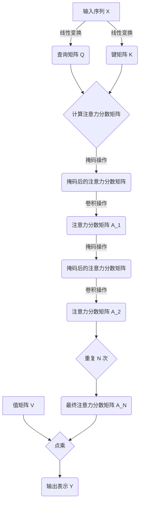

# Transformer中的自注意力机制:一种计算效率的改进

## 1.背景介绍

在自然语言处理(NLP)和序列建模任务中,Transformer架构是一种非常成功和广泛使用的模型。它主要由编码器(Encoder)和解码器(Decoder)两个模块组成,其中自注意力(Self-Attention)机制是Transformer的核心组成部分。

自注意力机制允许模型捕捉输入序列中任意两个位置之间的依赖关系,而不受位置之间距离的限制。这使得Transformer在捕捉长期依赖关系方面表现出色,并在许多NLP任务中取得了优异的性能。

然而,标准的自注意力机制存在一个主要缺陷,即计算复杂度随着序列长度的增加而呈现平方级增长,这在处理长序列时会带来巨大的计算开销。为了解决这个问题,研究人员提出了多种改进方法,其中一种有效且广为人知的方法就是线性transformer(Linear Transformer)。

### 1.1 线性Transformer的动机

标准的自注意力机制需要计算每个位置与所有其他位置之间的注意力分数,这导致了 $\mathcal{O}(n^2)$ 的计算复杂度,其中 $n$ 是序列长度。当序列长度增加时,计算成本会迅速增长,从而限制了Transformer在处理长序列时的应用。

为了解决这个问题,线性Transformer旨在将自注意力机制的计算复杂度降低到线性级别 $\mathcal{O}(n)$,同时保持模型的有效性和表现力。这不仅可以提高计算效率,还能使Transformer能够处理更长的序列,从而扩展其应用范围。

## 2.核心概念与联系

### 2.1 标准自注意力机制回顾

在介绍线性Transformer之前,我们先回顾一下标准的自注意力机制。给定一个长度为 $n$ 的输入序列 $X = (x_1, x_2, \dots, x_n)$,其中每个 $x_i$ 是一个向量,自注意力机制的计算过程如下:

1. 将输入序列 $X$ 分别通过三个线性变换,得到查询(Query)矩阵 $Q$、键(Key)矩阵 $K$ 和值(Value)矩阵 $V$。
2. 计算查询 $Q$ 和键 $K$ 的点积,得到注意力分数矩阵 $A$:

$$A = \text{softmax}\left(\frac{QK^T}{\sqrt{d_k}}\right)$$

其中 $d_k$ 是缩放因子,用于防止内积值过大导致梯度消失或爆炸。

3. 将注意力分数矩阵 $A$ 与值矩阵 $V$ 相乘,得到输出表示 $Y$:

$$Y = AV$$

这种标准的自注意力机制允许模型捕捉输入序列中任意两个位置之间的依赖关系,但是计算复杂度为 $\mathcal{O}(n^2d)$,其中 $d$ 是向量维度。当序列长度 $n$ 增加时,计算开销会迅速增长。

### 2.2 线性Transformer的核心思想

为了降低计算复杂度,线性Transformer采用了一种新颖的注意力机制,称为线性注意力(Linear Attention)。线性注意力的核心思想是将标准的软性注意力(Softmax Attention)替换为一种硬性注意力(Hard Attention),从而避免计算全序列的注意力分数。

具体来说,线性注意力通过一个可学习的卷积核(Convolutional Kernel)来近似全局注意力,而不是直接计算全序列的注意力分数。这种方法可以将计算复杂度降低到线性级别 $\mathcal{O}(n)$,同时保持了模型的有效性和表现力。

## 3.核心算法原理具体操作步骤

线性Transformer的核心算法原理可以分为以下几个步骤:

### 3.1 线性注意力机制

给定一个长度为 $n$ 的输入序列 $X = (x_1, x_2, \dots, x_n)$,其中每个 $x_i$ 是一个向量,线性注意力机制的计算过程如下:

1. 将输入序列 $X$ 分别通过两个线性变换,得到查询(Query)矩阵 $Q$ 和键(Key)矩阵 $K$。
2. 计算查询 $Q$ 和键 $K$ 的点积,得到注意力分数矩阵 $A$:

$$A = QK^T$$

3. 对注意力分数矩阵 $A$ 进行掩码操作,使得每个位置只关注其左右相邻的 $r$ 个位置,得到掩码后的注意力分数矩阵 $\tilde{A}$。
4. 将掩码后的注意力分数矩阵 $\tilde{A}$ 通过一个可学习的卷积核 $\phi$ 进行卷积,得到最终的注意力分数矩阵 $\hat{A}$:

$$\hat{A} = \phi * \tilde{A}$$

其中 $*$ 表示卷积操作。

5. 将最终的注意力分数矩阵 $\hat{A}$ 与值矩阵 $V$ 相乘,得到输出表示 $Y$:

$$Y = \hat{A}V$$

通过这种方式,线性Transformer避免了计算全序列的注意力分数,从而将计算复杂度降低到了线性级别 $\mathcal{O}(n)$。

### 3.2 EVO注意力机制

为了进一步提高线性Transformer的表现力,研究人员提出了一种改进的注意力机制,称为EVO注意力(EVO Attention)。EVO注意力机制在线性注意力的基础上,引入了一种新颖的注意力分数计算方式,以及一种基于内核的注意力分数更新策略。

具体来说,EVO注意力机制的计算过程如下:

1. 将输入序列 $X$ 分别通过两个线性变换,得到查询(Query)矩阵 $Q$ 和键(Key)矩阵 $K$。
2. 计算查询 $Q$ 和键 $K$ 的点积,得到初始注意力分数矩阵 $A_0$:

$$A_0 = QK^T$$

3. 对初始注意力分数矩阵 $A_0$ 进行掩码操作,使得每个位置只关注其左右相邻的 $r$ 个位置,得到掩码后的注意力分数矩阵 $\tilde{A}_0$。
4. 使用一个可学习的卷积核 $\phi_0$ 对掩码后的注意力分数矩阵 $\tilde{A}_0$ 进行卷积,得到第一个注意力分数矩阵 $A_1$:

$$A_1 = \phi_0 * \tilde{A}_0$$

5. 重复步骤3和步骤4,使用不同的可学习卷积核 $\phi_i$ 对注意力分数矩阵 $A_i$ 进行卷积,得到新的注意力分数矩阵 $A_{i+1}$:

$$A_{i+1} = \phi_i * \tilde{A}_i$$

其中 $\tilde{A}_i$ 是对 $A_i$ 进行掩码操作后的结果。

6. 重复步骤5共 $N$ 次,得到最终的注意力分数矩阵 $\hat{A} = A_N$。
7. 将最终的注意力分数矩阵 $\hat{A}$ 与值矩阵 $V$ 相乘,得到输出表示 $Y$:

$$Y = \hat{A}V$$

通过这种方式,EVO注意力机制不仅保持了线性Transformer的线性计算复杂度,而且通过引入多个可学习的卷积核,增强了模型的表现力和建模能力。

## 4.数学模型和公式详细讲解举例说明

在线性Transformer中,注意力分数矩阵的计算过程可以用数学公式更精确地表示。我们将详细讲解相关的数学模型和公式,并给出具体的例子说明。

### 4.1 线性注意力机制

给定一个长度为 $n$ 的输入序列 $X = (x_1, x_2, \dots, x_n)$,其中每个 $x_i \in \mathbb{R}^{d_x}$ 是一个 $d_x$ 维向量,线性注意力机制的计算过程如下:

1. 将输入序列 $X$ 分别通过两个线性变换 $W_q$ 和 $W_k$,得到查询矩阵 $Q \in \mathbb{R}^{n \times d_k}$ 和键矩阵 $K \in \mathbb{R}^{n \times d_k}$:

$$Q = XW_q, \quad K = XW_k$$

其中 $W_q \in \mathbb{R}^{d_x \times d_k}$ 和 $W_k \in \mathbb{R}^{d_x \times d_k}$ 是可学习的权重矩阵。

2. 计算查询 $Q$ 和键 $K$ 的点积,得到注意力分数矩阵 $A \in \mathbb{R}^{n \times n}$:

$$A = QK^T$$

3. 对注意力分数矩阵 $A$ 进行掩码操作,使得每个位置只关注其左右相邻的 $r$ 个位置,得到掩码后的注意力分数矩阵 $\tilde{A} \in \mathbb{R}^{n \times n}$。掩码操作可以用一个掩码矩阵 $M \in \mathbb{R}^{n \times n}$ 表示,其中 $M_{ij} = 1$ 当 $|i-j| \leq r$ 时,否则 $M_{ij} = -\infty$。然后,我们有:

$$\tilde{A} = A \odot M$$

其中 $\odot$ 表示元素wise乘积。

4. 将掩码后的注意力分数矩阵 $\tilde{A}$ 通过一个可学习的卷积核 $\phi \in \mathbb{R}^{2r+1}$ 进行卷积,得到最终的注意力分数矩阵 $\hat{A} \in \mathbb{R}^{n \times n}$:

$$\hat{A}_{ij} = \sum_{k=-r}^{r} \phi_k \tilde{A}_{i,j+k}$$

其中 $\phi_k$ 是卷积核 $\phi$ 的第 $k$ 个元素。

5. 将最终的注意力分数矩阵 $\hat{A}$ 与值矩阵 $V \in \mathbb{R}^{n \times d_v}$ 相乘,得到输出表示 $Y \in \mathbb{R}^{n \times d_v}$:

$$Y = \hat{A}V$$

其中 $V$ 可以通过另一个线性变换 $W_v$ 从输入序列 $X$ 得到,即 $V = XW_v$。

通过这种方式,线性Transformer避免了计算全序列的注意力分数,从而将计算复杂度降低到了线性级别 $\mathcal{O}(n)$。

### 4.2 EVO注意力机制

EVO注意力机制在线性注意力的基础上,引入了一种新颖的注意力分数计算方式,以及一种基于内核的注意力分数更新策略。

具体来说,EVO注意力机制的计算过程如下:

1. 将输入序列 $X$ 分别通过两个线性变换 $W_q$ 和 $W_k$,得到查询矩阵 $Q \in \mathbb{R}^{n \times d_k}$ 和键矩阵 $K \in \mathbb{R}^{n \times d_k}$:

$$Q = XW_q, \quad K = XW_k$$

2. 计算查询 $Q$ 和键 $K$ 的点积,得到初始注意力分数矩