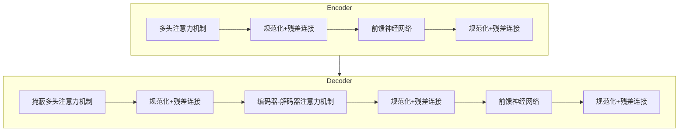

# Transformer在文本生成任务中的表现解析

## 1.背景介绍

在自然语言处理(NLP)领域,文本生成一直是一个具有挑战性的任务。传统的基于统计机器翻译(SMT)和基于规则的方法在处理长距离依赖关系和复杂语义结构时存在局限性。2017年,Transformer模型的出现为文本生成任务带来了革命性的变化。

Transformer是一种基于注意力机制的全新网络架构,它完全摒弃了循环神经网络(RNN)和卷积神经网络(CNN)中的递归计算,使用多头自注意力机制来捕获输入序列中的长距离依赖关系。这种全新的架构设计使Transformer在处理长序列时表现出色,同时具有更好的并行计算能力,从而大大提高了训练效率。

自从Transformer被提出以来,它已经在机器翻译、文本摘要、对话系统等多个文本生成任务中取得了卓越的成绩,成为NLP领域的主流模型之一。本文将深入探讨Transformer在文本生成任务中的应用,剖析其核心原理和算法细节,并分析其在实际应用中的表现和挑战。

## 2.核心概念与联系

### 2.1 Transformer架构

Transformer的核心架构由编码器(Encoder)和解码器(Decoder)两个子模块组成,如下图所示:



编码器的主要作用是将输入序列(如源语言句子)映射为一系列连续的表示向量,这些向量捕获了输入序列中的重要信息。解码器则根据编码器的输出以及之前生成的tokens,一步步预测出目标序列(如目标语言句子)。

编码器和解码器内部都采用了多头自注意力机制、前馈神经网络和残差连接等关键组件,这些组件的紧密结合赋予了Transformer强大的表示能力和建模能力。

### 2.2 注意力机制

注意力机制是Transformer的核心,它允许模型在编码输入序列和生成输出序列时,能够选择性地关注输入序列中的不同部分。

在编码器中,多头自注意力机制用于捕获输入序列内部的长距离依赖关系。每个单词都可以通过注意力机制关注到与之相关的其他单词,从而更好地建模序列的语义表示。

在解码器中,除了编码器中的自注意力机制外,还引入了掩蔽多头自注意力机制和编码器-解码器注意力机制。掩蔽多头自注意力机制确保解码器在生成每个单词时,只关注之前已生成的单词,而不会违反因果关系。编码器-解码器注意力机制则允许解码器关注编码器输出的表示,从而融合输入序列的信息。

### 2.3 位置编码

由于Transformer完全放弃了RNN和CNN中的递归计算,因此需要一种机制来注入序列的位置信息。Transformer采用了位置编码的方式,将序列中每个单词的位置信息编码为一个向量,并将其加入到对应单词的嵌入向量中。这种简单而有效的位置编码方式,使Transformer能够很好地捕获序列的位置信息。

## 3.核心算法原理具体操作步骤

### 3.1 注意力计算过程

Transformer中的注意力机制是整个模型的核心,其计算过程可以分为以下几个步骤:

1. **线性投影**:将输入向量(查询向量Q、键向量K和值向量V)分别投影到注意力维度:

$$Q = XW^Q,\ K = XW^K,\ V = XW^V$$

其中$X$是输入序列的嵌入表示,$W^Q$、$W^K$、$W^V$分别是查询、键和值的线性投影矩阵。

2. **计算注意力分数**:通过查询向量Q和键向量K的点积运算,计算出每个位置对应的注意力分数:

$$\text{Attention}(Q, K, V) = \text{softmax}\left(\frac{QK^T}{\sqrt{d_k}}\right)V$$

其中$d_k$是缩放因子,用于防止点积值过大导致梯度消失或爆炸。

3. **多头注意力**:为了捕获不同子空间的信息,Transformer采用了多头注意力机制。输入序列被分别投影到$h$个不同的注意力子空间,每个子空间计算出一个注意力表示,最后将所有子空间的注意力表示拼接起来作为最终的注意力输出:

$$\text{MultiHead}(Q, K, V) = \text{Concat}(head_1, ..., head_h)W^O$$
$$\text{where }head_i = \text{Attention}(QW_i^Q, KW_i^K, VW_i^V)$$

其中$W_i^Q$、$W_i^K$、$W_i^V$和$W^O$是可学习的线性投影矩阵。

### 3.2 前馈神经网络

除了注意力子层之外,Transformer的编码器和解码器中还包含了前馈神经网络子层,用于进一步提取序列的高阶特征表示。前馈神经网络的计算过程如下:

$$\text{FFN}(x) = \max(0, xW_1 + b_1)W_2 + b_2$$

其中$W_1$、$W_2$、$b_1$、$b_2$是可学习的参数,ReLU激活函数用于引入非线性。

### 3.3 残差连接和层归一化

为了缓解深度神经网络中的梯度消失和梯度爆炸问题,Transformer在每个子层之后都引入了残差连接和层归一化操作。残差连接通过将输入和子层的输出相加,确保梯度可以直接传递到较浅层。层归一化则通过对每个样本的特征进行归一化,加快了模型的收敛速度。

## 4.数学模型和公式详细讲解举例说明

### 4.1 注意力分数计算

在注意力机制中,注意力分数的计算是关键步骤之一。给定一个查询向量$q$和一组键向量$K = \{k_1, k_2, ..., k_n\}$,注意力分数的计算公式如下:

$$\text{Attention}(q, K, V) = \text{softmax}\left(\frac{qK^T}{\sqrt{d_k}}\right)V$$

其中$V = \{v_1, v_2, ..., v_n\}$是对应的值向量集合,$d_k$是缩放因子,用于防止点积值过大导致梯度消失或爆炸。

让我们通过一个具体的例子来理解注意力分数的计算过程。假设我们有一个长度为3的查询向量$q = [0.1, 0.2, 0.3]$,以及两个长度为3的键向量$k_1 = [0.4, 0.5, 0.6]$和$k_2 = [0.7, 0.8, 0.9]$,对应的值向量为$v_1 = [1.0, 1.1, 1.2]$和$v_2 = [2.0, 2.1, 2.2]$。我们假设缩放因子$d_k = 3$。

首先,我们计算查询向量和每个键向量的点积:

$$q \cdot k_1 = 0.1 \times 0.4 + 0.2 \times 0.5 + 0.3 \times 0.6 = 0.38$$
$$q \cdot k_2 = 0.1 \times 0.7 + 0.2 \times 0.8 + 0.3 \times 0.9 = 0.62$$

然后,我们对点积结果进行缩放并应用softmax函数,得到注意力分数:

$$\text{score}_1 = \text{softmax}\left(\frac{0.38}{\sqrt{3}}\right) = 0.3238$$
$$\text{score}_2 = \text{softmax}\left(\frac{0.62}{\sqrt{3}}\right) = 0.6762$$

最后,我们根据注意力分数对值向量进行加权求和,得到注意力输出:

$$\text{Attention}(q, K, V) = 0.3238 \times [1.0, 1.1, 1.2] + 0.6762 \times [2.0, 2.1, 2.2] = [1.6762, 1.7524, 1.8286]$$

通过这个例子,我们可以看到注意力机制如何根据查询向量和键向量的相似性,自适应地分配不同的注意力权重,从而生成注意力输出。

### 4.2 多头注意力机制

为了捕获不同子空间的信息,Transformer采用了多头注意力机制。多头注意力机制的计算过程如下:

$$\text{MultiHead}(Q, K, V) = \text{Concat}(head_1, ..., head_h)W^O$$
$$\text{where }head_i = \text{Attention}(QW_i^Q, KW_i^K, VW_i^V)$$

其中$W_i^Q$、$W_i^K$、$W_i^V$和$W^O$是可学习的线性投影矩阵,用于将输入向量投影到不同的注意力子空间。

让我们以一个具体的例子来说明多头注意力机制的工作原理。假设我们有一个长度为4的输入序列$X = [x_1, x_2, x_3, x_4]$,我们将其投影到查询向量$Q$、键向量$K$和值向量$V$,并设置注意力头数$h=2$。

首先,我们将$Q$、$K$和$V$分别投影到两个注意力子空间:

$$Q_1 = QW_1^Q,\ K_1 = KW_1^K,\ V_1 = VW_1^V$$
$$Q_2 = QW_2^Q,\ K_2 = KW_2^K,\ V_2 = VW_2^V$$

然后,在每个子空间中计算注意力输出:

$$head_1 = \text{Attention}(Q_1, K_1, V_1)$$
$$head_2 = \text{Attention}(Q_2, K_2, V_2)$$

最后,我们将两个子空间的注意力输出拼接起来,并通过线性投影矩阵$W^O$得到最终的多头注意力输出:

$$\text{MultiHead}(Q, K, V) = \text{Concat}(head_1, head_2)W^O$$

通过多头注意力机制,Transformer能够从不同的子空间捕获输入序列的不同特征,从而提高模型的表示能力和建模能力。

## 5.项目实践:代码实例和详细解释说明

为了更好地理解Transformer在文本生成任务中的应用,我们将通过一个基于PyTorch实现的代码示例来演示如何构建和训练一个简单的Transformer模型,用于机器翻译任务。

### 5.1 数据预处理

首先,我们需要对机器翻译数据集进行预处理,将文本序列转换为模型可以接受的数字序列表示。我们使用PyTorch提供的`torchtext`库来加载和预处理数据。

```python
from torchtext.data import Field, BucketIterator, TabularDataset

# 定义字段
SRC = Field(tokenize='spacy', init_token='<sos>', eos_token='<eos>', lower=True)
TRG = Field(tokenize='spacy', init_token='<sos>', eos_token='<eos>', lower=True)

# 加载数据集
train_data, valid_data, test_data = TabularDataset.splits(
    path='path/to/data', train='train.csv', validation='val.csv', test='test.csv',
    format='csv', fields={'src': ('src', SRC), 'trg': ('trg', TRG)}
)

# 构建词表
SRC.build_vocab(train_data, min_freq=2)
TRG.build_vocab(train_data, min_freq=2)

# 创建数据迭代器
train_iter, valid_iter, test_iter = BucketIterator.splits(
    (train_data, valid_data, test_data), batch_size=32, sort_key=lambda x: len(x.src)
)
```

### 5.2 模型定义

接下来,我们定义Transformer模型的编码器和解码器模块。

```python
import torch
import torch.nn as nn
import math

class TransformerEncoder(