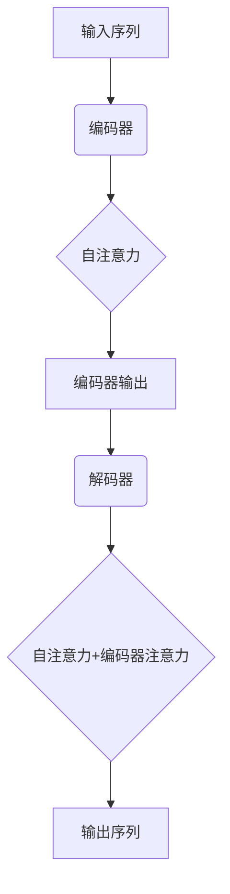

# Transformer大模型实战 使用多语言模型

## 1.背景介绍

在自然语言处理(NLP)领域,Transformer模型凭借其卓越的性能和并行计算能力,成为了当前主流的模型架构。Transformer模型通过自注意力机制捕捉输入序列中元素之间的长程依赖关系,从而有效地解决了传统循环神经网络在长序列处理中的梯度消失和爆炸问题。

随着深度学习算力的不断增强和大规模语料库的出现,Transformer模型也逐渐演化为大规模的预训练语言模型,如GPT、BERT、XLNet等。这些大模型通过在海量无标注语料上预训练,学习到了丰富的语义和语法知识,为下游的NLP任务提供了强大的迁移能力。

特别是近年来,多语言预训练模型(Multilingual Pre-trained Models)的出现,使得单一模型能够支持跨语种的泛化,大大降低了针对每种语言分别训练模型的成本。这些多语言模型不仅在机器翻译、文本分类等传统NLP任务上表现优异,而且还展现出了强大的多模态能力,可以同时处理文本、图像、语音等不同模态的数据,为多模态人工智能系统的构建提供了有力支持。

## 2.核心概念与联系

### 2.1 Transformer模型

Transformer是一种全新的基于注意力机制的序列到序列(Seq2Seq)模型,其核心组件包括:

1. **编码器(Encoder)**: 将输入序列映射为高维向量表示。
2. **解码器(Decoder)**: 根据编码器的输出和之前生成的输出序列,预测下一个输出元素。
3. **自注意力机制(Self-Attention)**: 计算输入序列中每个元素与其他元素的相关性,捕捉长程依赖关系。
4. **多头注意力(Multi-Head Attention)**: 将注意力机制分成多个并行计算的头,以获得更丰富的表示能力。

Transformer模型通过自注意力机制直接建模输入和输出序列之间的依赖关系,避免了RNN的递归计算,从而具有更好的并行计算能力和更长的依赖捕捉范围。

### 2.2 预训练语言模型

预训练语言模型(Pre-trained Language Model, PLM)是近年来NLP领域的一大突破。PLM通过在大规模无标注语料上进行自监督预训练,学习通用的语言表示,然后将这些表示迁移到下游的NLP任务上,从而显著提高了模型的性能。

常见的PLM包括:

- **BERT**: 基于Transformer的双向编码器,通过掩码语言模型(Masked LM)和下一句预测(Next Sentence Prediction)任务进行预训练。
- **GPT**: 基于Transformer的单向解码器,通过语言模型(Language Modeling)任务进行预训练。
- **XLNet**: 改进的自回归语言模型,通过排列语言模型(Permutation LM)任务预训练,避免了BERT的输入噪声问题。

预训练语言模型为NLP任务提供了强大的迁移学习能力,大大缩短了模型训练时间,提高了模型性能。

### 2.3 多语言模型

多语言模型(Multilingual Model)是一种在多种语言的语料库上联合训练的单一模型,能够支持跨语种的泛化。与为每种语言分别训练模型相比,多语言模型具有以下优势:

1. **参数高效共享**: 不同语言共享大部分参数,减少了模型大小和计算开销。
2. **跨语言迁移**: 模型可以从高资源语言向低资源语言迁移知识,提高低资源语言的性能。
3. **多语言能力**: 单一模型可以同时支持多种语言,方便构建多语种NLP系统。

常见的多语言预训练模型包括mBERT、XLM、XLM-R等。这些模型通过在多语言语料上联合预训练,学习到了跨语种的语义和语法知识,在机器翻译、命名实体识别等多语言NLP任务上表现出色。

## 3.核心算法原理具体操作步骤

### 3.1 Transformer模型原理

Transformer模型的核心思想是通过自注意力机制捕捉输入序列中元素之间的长程依赖关系,避免了RNN的递归计算。下面我们详细介绍Transformer的编码器和解码器的工作原理。

#### 3.1.1 编码器(Encoder)

编码器的主要作用是将输入序列映射为高维向量表示。它由多个相同的层组成,每一层包含两个子层:

1. **多头自注意力子层(Multi-Head Self-Attention Sublayer)**
2. **前馈全连接子层(Feed-Forward Fully-Connected Sublayer)**

**多头自注意力子层**计算输入序列中每个元素与其他元素的相关性,生成注意力向量表示。具体操作步骤如下:

1. 将输入序列 $X = (x_1, x_2, ..., x_n)$ 线性映射为查询(Query)、键(Key)和值(Value)向量: $Q=XW^Q, K=XW^K, V=XW^V$
2. 计算查询和所有键的点积,对点积结果缩放处理以获得注意力分数: $\text{Attention}(Q, K, V) = \text{softmax}(\frac{QK^T}{\sqrt{d_k}})V$
3. 对注意力分数执行多头注意力操作,捕捉不同子空间的相关性: $\text{MultiHead}(Q, K, V) = \text{Concat}(head_1, ..., head_h)W^O$
4. 残差连接和层归一化: $\text{output} = \text{LayerNorm}(X + \text{MultiHead}(Q, K, V))$

**前馈全连接子层**对序列中的每个元素进行独立的全连接变换,以引入非线性:

$$\text{FFN}(x) = \max(0, xW_1 + b_1)W_2 + b_2$$

同样执行残差连接和层归一化操作。

通过堆叠多个编码器层,输入序列在层与层之间传递,最终映射为高维向量表示。

#### 3.1.2 解码器(Decoder)

解码器的作用是根据编码器的输出和之前生成的输出序列,预测下一个输出元素。解码器的结构与编码器类似,也包含多头自注意力子层、编码器-解码器注意力子层和前馈全连接子层。

**多头自注意力子层**用于捕捉输出序列中元素之间的依赖关系,与编码器中的自注意力机制类似。

**编码器-解码器注意力子层**则是将解码器的查询向量与编码器的键和值向量进行注意力计算,获取编码器序列的相关性信息:

$$\text{Attention}(Q, K, V) = \text{softmax}(\frac{QK^T}{\sqrt{d_k}})V$$

其中,Q来自解码器,K和V来自编码器输出。

**前馈全连接子层**与编码器中的操作相同。

在自回归生成过程中,解码器会自回归地生成输出序列,并将已生成的部分输入到下一步的自注意力计算中,以捕捉输出序列内部的依赖关系。

通过编码器-解码器注意力机制,解码器可以关注编码器输出的不同部分,生成与输入序列相关的输出序列。

### 3.2 预训练语言模型原理

预训练语言模型的核心思想是在大规模无标注语料上进行自监督预训练,学习通用的语言表示,然后将这些表示迁移到下游的NLP任务上。常见的预训练任务包括:

1. **掩码语言模型(Masked Language Modeling, MLM)**: 随机掩码输入序列中的一些词元,模型需要预测被掩码的词元。
2. **下一句预测(Next Sentence Prediction, NSP)**: 判断两个句子是否相邻。
3. **语言模型(Language Modeling, LM)**: 给定前缀,预测下一个词元。
4. **排列语言模型(Permutation Language Modeling, PLM)**: 对输入序列进行随机排列,模型需要预测原始序列。

以BERT为例,它的预训练过程包括以下步骤:

1. **输入表示**: 将输入序列(句子对)转换为词元序列,添加特殊词元(如[CLS]和[SEP])。
2. **掩码**: 随机选择一些词元进行掩码,替换为特殊的[MASK]词元。
3. **输入编码器**: 将输入序列输入到BERT的Transformer编码器中。
4. **MLM头**: 对于被掩码的词元位置,使用编码器输出的对应向量,通过一个分类层预测该位置的词元。
5. **NSP头**: 使用[CLS]位置的编码器输出,通过一个二分类层预测句子对是否相邻。
6. **损失函数**: 将MLM损失和NSP损失相加,作为最终的损失函数。
7. **优化**: 使用梯度下降等优化算法,最小化损失函数,更新BERT模型参数。

通过上述自监督预训练,BERT学习到了丰富的语义和语法知识,可以为下游的NLP任务提供强大的迁移能力。

### 3.3 多语言模型原理

多语言模型的核心思想是在多种语言的语料库上联合训练单一模型,使模型能够同时支持多种语言。常见的多语言预训练方法包括:

1. **语言特征标记**: 在输入序列中添加语言特征标记,指示当前词元所属的语言。
2. **共享词表**: 将不同语言的词元映射到同一个共享词表中,实现词表级别的参数共享。
3. **语言对特定词表**: 为每种语言对(如英语-法语)构建单独的词表,模型需要学习语言对之间的映射。
4. **语言特定子网络**: 为每种语言训练单独的子网络,最后将子网络的输出合并。

以mBERT(Multilingual BERT)为例,它的预训练过程与BERT类似,但输入序列中添加了语言特征标记,用于指示每个词元所属的语言。在预训练过程中,mBERT会在多种语言的语料库上联合训练,学习到跨语种的语义和语法知识。

预训练完成后,mBERT可以直接应用于多语言NLP任务,或者通过在特定语言的数据上进行微调(fine-tuning),进一步提高性能。

## 4.数学模型和公式详细讲解举例说明

在Transformer模型中,自注意力机制是最核心的组件。下面我们详细介绍自注意力机制的数学原理。

### 4.1 缩放点积注意力

给定查询(Query) $Q \in \mathbb{R}^{n \times d_q}$、键(Key) $K \in \mathbb{R}^{n \times d_k}$和值(Value) $V \in \mathbb{R}^{n \times d_v}$,其中$n$是序列长度,$d_q$、$d_k$、$d_v$分别是查询、键和值的维度。

缩放点积注意力的计算过程如下:

1. 计算查询和键的点积,获得注意力分数矩阵:

$$\text{Attention}(Q, K) = \text{softmax}(\frac{QK^T}{\sqrt{d_k}})$$

其中,$\sqrt{d_k}$是用于缩放点积的因子,防止点积过大导致softmax函数的梯度较小。

2. 将注意力分数矩阵与值矩阵相乘,获得注意力输出:

$$\text{Attention}(Q, K, V) = \text{softmax}(\frac{QK^T}{\sqrt{d_k}})V$$

注意力输出是查询对值的加权求和,权重由注意力分数决定。

### 4.2 多头注意力

单一的注意力机制只能从一个子空间捕捉相关性,为了获得更丰富的表示能力,Transformer引入了多头注意力机制。

具体操作如下:

1. 线性投影分头: 将查询、键和值分别投影到$h$个子空间,获得$head_i = \text{Attention}(QW_i^Q, KW_i^K, VW_i^V)$,其中$W_i^Q \in \mathbb{R}^{