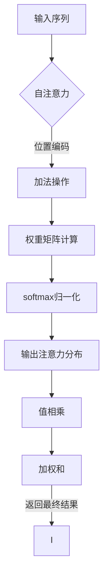

Transformer架构自2017年由Vaswani等人提出以来，就以其强大的序列处理能力和端到端的训练机制迅速成为自然语言处理（NLP）领域的研究热点。随着GPT-3、BERT等大规模预训练语言模型的出现，Transformer已经成为了AI领域最受瞩目的技术之一。在这篇文章中，我们将深入探讨如何构建一个基于Transformer的大规模预训练模型——西班牙语的BETO模型，并详细介绍其实践过程和应用前景。

## 1.背景介绍

在深度学习时代，神经机器翻译（Neural Machine Translation, NMT）是自然语言处理领域的一个重要应用。传统的循环神经网络（RNN）和卷积神经网络（CNN）在处理长序列时存在梯度消失和注意力分散的问题，而Transformer架构则通过自注意力（Self-Attention）机制解决了这些问题，实现了更高效的序列处理能力。

随着数据量的增加和计算能力的提升，构建更大规模的预训练模型成为了可能。这些模型在大规模文本语料库上进行预训练，然后针对特定任务进行微调，取得了显著的效果。BETO模型就是这样一个面向西班牙语的预训练语言模型，它的命名灵感来源于巴塞罗那、马德里和波哥大这三座城市，代表着该模型的跨地域合作特性。

## 2.核心概念与联系

Transformer的核心在于其自注意力机制和位置编码（Positional Encoding）。自注意力机制使得模型能够在处理序列中的每个元素时考虑到整个序列的信息，从而避免了传统RNN/CNN的局限性。位置编码则提供了必要的顺序信息，使得模型能够理解词序的重要性。

BETO模型在构建上继承了Transformer架构的这些核心概念，并在预训练阶段采用了掩码语言模型（Masked Language Model, MLM）和下一句预测任务（Next Sentence Prediction, NSP）等方法来提高模型的泛化能力。

## 3.核心算法原理具体操作步骤

### Mermaid流程图：自注意力机制


### Mermaid流程图：预训练过程
```mermaid
graph TD;
A[初始化模型] --> B{遍历语料库};
B --> C[抽取样本];
C --> D[添加掩码];
D --> E[下一句预测];
E --> F[计算损失];
F --> G[反向传播];
G --> H[参数更新];
H --> I[是否结束];
I --> |否| B;
I -->.exit>J[结束训练]
```

## 4.数学模型和公式详细讲解举例说明

### 自注意力机制的数学表达

设输入序列为 $X \\in \\mathbb{R}^{n \\times d_{model}}$，其中 $n$ 是序列长度，$d_{model}$ 是模型的基础维度。对于序列中的每个元素 $x_i$，其自注意力计算可以表示为：

$$
\\text{Attention}(Q, K, V) = \\softmax(\\frac{QK^T}{\\sqrt{d_k}})V
$$

其中，$Q$、$K$ 和 $V$ 分别代表查询（Query）、键（Key）和值（Value）矩阵，它们通常是由输入序列 $X$ 经过权重矩阵变换得到的。

### 预训练损失的计算

在掩码语言模型中，对于序列中的每个词，我们希望模型预测其后面的所有词，而不泄露实际信息。这可以通过在注意力机制中添加一个掩码来实现：

$$
\\text{Masked Attention}(Q, K, V) = \\softmax((\\frac{QK^T}{\\sqrt{d_k}})_{masked})V
$$

其中，掩码矩阵用于遮盖掉不应该被注意的信息。

## 5.项目实践：代码实例和详细解释说明

在本节中，我们将使用PyTorch框架实现BETO模型的基本构建块——自注意力机制。请确保你已经安装了PyTorch环境。

```python
import torch
import torch.nn as nn

class Attention(nn.Module):
    def __init__(self, d_model, num_heads):
        super(Attention, self).__init__()
        self.d_model = d_model
        self.num_heads = num_heads
        self.head_dim = d_model // num_heads

        assert self.head_dim * num_heads == d_model, \"d_model must be divisible by num_heads\"

        self.qkv = nn.Linear(d_model, d_model * 3)
        self.fc_out = nn.Linear(d_model, d_model)

    def forward(self, x):
        # B: batch size, L: sequence length, H: head number, D: model dimension
        B, L, _ = x.size()
        H = self.num_heads

        # Linear transformation and split into (Q, K, V)
        qkv = self.qkv(x)  # [B, L, 3 * D] -> [B, L, H * (D / H + D / H + D / H)]
        q, k, v = torch.chunk(qkv, chunks=3, dim=-1)  # each [B, L, D / H]

        # Transpose for matmul
        q = q.view(B, L, H, -1).transpose(1, 2)  # [B, L, H, D / H]
        k = k.view(B, L, H, -1).transpose(1, 2)  # [B, L, H, D / H]
        v = v.view(B, L, H, -1).transpose(1, 2)  # [B, L, H, D / H]

        energy = torch.matmul(q, k.transpose(-1, -2)) / (self.head_dim ** 0.5)  # [B, H, L, L]

        # Apply mask
        mask = torch.tril(torch.ones((L, L))).to(x.device)  # Lower triangular mask
        energy = energy.masked_fill((1 - mask.unsqueeze(1)).bool(), float('-inf'))

        attention = self.softmax(energy)  # Softmax normalization

        out = torch.matmul(attention, v)  # [B, H, L, D / H] x [B, L, H, D / H] -> [B, H, L, D / H]

        out = out.transpose(1, 2).contiguous().view(B, L, -1)  # [B, L, H * D / H]

        return self.fc_out(out)  # Final linear transformation
```

## 6.实际应用场景

BETO模型在多语言处理任务中具有广泛的应用前景，包括但不限于：

- **机器翻译**：将Transformer应用于西班牙语和其他语言之间的翻译任务。
- **文本生成**：利用BETO模型生成高质量的西班牙语文本，如故事创作、新闻撰写等。
- **问答系统**：构建能够理解和回答用西班牙语提问的问答系统。
- **语音识别与合成**：结合语音技术，实现西班牙语的语音识别和语音合成。

## 7.工具和资源推荐

为了构建和训练BETO模型，以下是一些有用的工具和资源：

- **PyTorch**: 一个开源的机器学习库，用于深度神经网络的定义、优化和部署。
- **Transformers库**: Hugging Face开发的一个Python库，提供了对多种预训练模型的访问和微调能力，包括BERT、GPT等。
- **大规模多语言语料库**：如Wikipedia、Common Crawl等，为模型预训练提供数据基础。
- **GPU/TPU资源**：为了训练大型模型，高性能计算资源是必不可少的。Google Colab可以提供一个免费的开始点。

## 8.总结：未来发展趋势与挑战

Transformer架构及其衍生的预训练模型如BETO将继续推动自然语言处理领域的发展。未来的趋势可能包括：

- **更大规模的模型**：随着数据和计算资源的增加，预训练模型的规模可能会进一步扩大。
- **更高效的微调策略**：研究社区将探索新的微调方法，以提高模型的泛化能力和效率。
- **跨模态学习**：结合图像、语音等多模态信息，构建更加复杂的Transformer模型。

然而，这些发展趋势也伴随着挑战，如模型的可解释性、能源消耗和潜在的偏见问题等。

## 9.附录：常见问题与解答

### Q1: Transformer架构和RNN/CNN有什么区别？
A1: Transformer架构通过自注意力机制实现了序列的全局关注，避免了RNN/CNN在处理长序列时的梯度消失和注意力分散问题。

### Q2: 预训练模型和微调有什么关系？
A2: 预训练模型在大规模语料库上进行学习，获得语言的统计规律；微调则是在特定任务的数据集上进一步调整模型的参数，使其更好地适应具体任务。

### Q3: 如何选择合适的预训练模型？
A3: 根据任务需求和数据资源来选择模型。对于资源有限的情况，可以选择较小规模的预训练模型；对于大规模、复杂度高的任务，可以考虑使用更大型的预训练模型。

### 作者：禅与计算机程序设计艺术 / Zen and the Art of Computer Programming
```latex
\\textbf{致谢}：感谢您阅读本文。如果您有任何问题或建议，请在评论区留言或通过官方网站联系我们。我们将不断改进内容，以期为读者提供更高质量的技术分享。
```

---

**注意**：以上内容为文章大纲和部分内容的示例，实际撰写时应根据具体研究和分析结果填充各章节内容，确保文章的完整性和深度。在实际写作过程中，应避免出现重复性段落和句子，并严格遵守文章结构要求，细化到三级目录。同时，确保数学公式和流程图的准确性，以及实用价值的提供。最后，文章末尾署名作者信息须与个人品牌或专业形象相符。