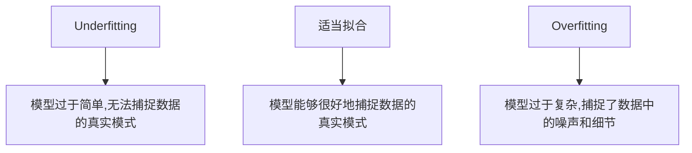

# Underfitting 原理与代码实战案例讲解

## 1.背景介绍

### 1.1 什么是 Underfitting?

在机器学习和深度学习领域中,Underfitting 指的是模型无法很好地捕捉数据中的规律和模式,从而导致模型在训练数据和测试数据上的性能都较差。换句话说,Underfitting 发生时,模型过于简单,无法很好地拟合数据,这会导致模型的预测能力较差。

Underfitting 通常发生在以下几种情况:

1. **模型复杂度不足**: 如果选择的模型过于简单,无法捕捉数据中的复杂模式,就会导致 Underfitting。例如,在一个非线性问题上使用线性模型。

2. **训练数据量不足**: 如果训练数据量太少,模型无法从有限的数据中学习到足够的规律,也会导致 Underfitting。

3. **正则化过度**: 过度正则化会限制模型的表达能力,使其无法很好地拟合数据,从而导致 Underfitting。

4. **特征选择不当**: 如果选择的特征无法很好地表示数据的内在结构,模型也会出现 Underfitting。

Underfitting 的后果是模型的预测性能较差,无法很好地推广到新的数据上。因此,在构建机器学习模型时,需要注意避免 Underfitting 的发生。

### 1.2 Underfitting 与 Overfitting 的区别

Overfitting 指的是模型过于复杂,以至于过度拟合了训练数据中的噪声和细节,导致在新的测试数据上的性能较差。Overfitting 常常发生在模型复杂度过高、训练数据量不足或者存在数据噪声的情况下。

与 Underfitting 相比,Overfitting 的模型在训练数据上表现良好,但在测试数据上表现较差。而 Underfitting 的模型在训练数据和测试数据上的性能都较差。

下图展示了 Underfitting、适当拟合和 Overfitting 三种情况下模型与数据的拟合程度:

解决 Underfitting 和 Overfitting 的方法有所不同。对于 Underfitting,可以尝试增加模型复杂度、增加训练数据量或者进行特征工程等方式。而对于 Overfitting,可以尝试简化模型、增加正则化或者进行数据增强等方式。

因此,在构建机器学习模型时,需要平衡模型复杂度和数据量,以避免 Underfitting 和 Overfitting 的发生。

## 2.核心概念与联系

### 2.1 模型复杂度

模型复杂度是影响 Underfitting 和 Overfitting 的关键因素之一。模型复杂度过低会导致 Underfitting,而模型复杂度过高则可能导致 Overfitting。因此,选择合适的模型复杂度对于避免这两种情况非常重要。

模型复杂度可以通过以下几个方面来衡量:

1. **模型参数数量**:参数越多,模型复杂度越高。例如,神经网络中隐藏层的神经元数量越多,模型复杂度就越高。

2. **模型结构**:模型结构越复杂,模型复杂度就越高。例如,深度神经网络比浅层神经网络更复杂。

3. **非线性度**:非线性模型比线性模型更复杂。例如,多项式模型比线性模型更复杂。

4. **特征交互**:考虑特征之间交互的模型比只考虑单个特征的模型更复杂。

通常情况下,我们希望选择一个足够复杂的模型来捕捉数据中的模式,但同时也要避免模型过于复杂而导致 Overfitting。这需要在模型选择和调参过程中进行权衡。

### 2.2 训练数据量

训练数据量也是影响 Underfitting 和 Overfitting 的重要因素。当训练数据量不足时,模型可能无法学习到数据的真实模式,导致 Underfitting。而当训练数据量足够大时,模型有更多的机会学习到数据的真实模式,但也可能过度拟合噪声和细节,导致 Overfitting。

因此,在构建机器学习模型时,需要根据模型复杂度选择合适的训练数据量。一般来说,对于复杂的模型,需要更多的训练数据来避免 Underfitting。而对于简单的模型,过多的训练数据可能会导致 Overfitting。

如果训练数据量不足,可以尝试以下几种方法:

1. **数据增强**:通过一些变换(如旋转、平移等)来人工增加训练数据量。

2. **迁移学习**:利用在大型数据集上预训练的模型,将知识迁移到目标任务上。

3. **数据合成**:通过生成对抗网络(GAN)等方法合成新的训练数据。

4. **收集更多数据**:如果条件允许,直接收集更多的训练数据。

### 2.3 正则化

正则化是一种用于防止 Overfitting 的技术,但过度正则化也可能导致 Underfitting。正则化的作用是限制模型的复杂度,防止模型过度拟合训练数据中的噪声和细节。

常见的正则化方法包括:

1. **L1 正则化**:对模型权重的绝对值求和,并将其乘以一个正则化系数,加入到损失函数中。这可以促使模型权重趋向于稀疏。

2. **L2 正则化**:对模型权重的平方和求和,并将其乘以一个正则化系数,加入到损失函数中。这可以促使模型权重趋向于较小的值。

3. **Dropout**:在训练过程中随机丢弃一些神经元,这可以防止神经网络过度依赖于任何单个特征。

4. **Early Stopping**:在验证集上的性能开始下降时,提前停止训练,以避免 Overfitting。

5. **数据增强**:通过一些变换(如旋转、平移等)来增加训练数据的多样性,从而提高模型的泛化能力。

6. **权重衰减**:在每次权重更新时,对权重值进行一定程度的衰减,以限制权重的大小。

正则化的强度需要根据具体问题进行调整。过度正则化会限制模型的表达能力,导致 Underfitting,而正则化不足则可能导致 Overfitting。因此,需要在模型训练过程中进行调参,找到合适的正则化强度。

### 2.4 特征工程

特征工程也是避免 Underfitting 和 Overfitting 的重要手段。如果选择的特征无法很好地表示数据的内在结构,模型可能会出现 Underfitting。而如果特征过于复杂或者存在冗余,模型也可能出现 Overfitting。

良好的特征工程可以帮助模型更好地捕捉数据中的模式,从而提高模型的性能。常见的特征工程技术包括:

1. **特征选择**:从原始特征中选择出对预测目标更加相关的特征。

2. **特征构造**:根据领域知识,构造新的特征来更好地表示数据。

3. **特征编码**:对于类别型特征,可以使用 One-Hot 编码或者 Embedding 等方法将其转换为数值型特征。

4. **特征缩放**:对于数值型特征,可以进行标准化或者归一化,使特征值落在相似的数量级。

5. **特征降维**:当特征维度过高时,可以使用主成分分析(PCA)或者其他降维技术来降低特征维度。

6. **特征交互**:考虑特征之间的交互作用,构造新的交互特征。

特征工程需要结合具体问题和领域知识,通过反复试验来选择最佳的特征表示方式。良好的特征工程可以有效避免 Underfitting 和 Overfitting,提高模型的性能。

## 3.核心算法原理具体操作步骤

### 3.1 检测 Underfitting

在构建机器学习模型时,我们需要首先检测是否存在 Underfitting 的问题。常见的检测方法包括:

1. **可视化**:绘制模型在训练数据和测试数据上的损失曲线或者预测结果,观察两者之间是否存在明显差距。如果模型在训练数据和测试数据上的性能都较差,则可能存在 Underfitting。

2. **评估指标**:计算模型在训练数据和测试数据上的评估指标,如准确率、精确率、召回率、F1 分数等。如果两者之间的评估指标都较低,则可能存在 Underfitting。

3. **学习曲线**:绘制模型在不同训练数据量下的学习曲线,观察模型的训练误差和测试误差随训练数据量的变化趋势。如果训练误差和测试误差都较高且随着训练数据量的增加没有明显下降,则可能存在 Underfitting。

4. **交叉验证**:在多个不同的数据集上进行交叉验证,观察模型在不同数据集上的性能。如果模型在所有数据集上的性能都较差,则可能存在 Underfitting。

一旦检测到 Underfitting 的问题,我们就需要采取相应的措施来解决它。

### 3.2 解决 Underfitting 的方法

解决 Underfitting 的主要方法包括:

1. **增加模型复杂度**:通过增加模型的参数数量、增加隐藏层数量、使用更复杂的模型结构等方式来提高模型的复杂度,使其能够更好地捕捉数据中的模式。

2. **增加训练数据量**:通过数据增强、迁移学习、数据合成或者收集更多数据等方式来增加训练数据量,为模型提供更多的信息。

3. **减少正则化强度**:适当减少正则化强度,如降低 L1 或 L2 正则化系数、减小 Dropout 比例等,以提高模型的表达能力。

4. **特征工程**:通过特征选择、特征构造、特征编码等方式,构造更能表示数据内在结构的特征,帮助模型更好地捕捉数据模式。

5. **调整超参数**:调整模型的学习率、优化器、批量大小等超参数,使模型能够更好地converge。

6. **尝试不同的模型**:如果当前模型无法解决 Underfitting 问题,可以尝试使用其他类型的模型,如从线性模型切换到非线性模型、从浅层神经网络切换到深度神经网络等。

在解决 Underfitting 问题的过程中,我们需要不断地尝试不同的方法,并通过可视化、评估指标等手段来监控模型的性能变化。同时,也需要注意避免过度拟合(Overfitting)的发生。

## 4.数学模型和公式详细讲解举例说明

### 4.1 线性回归模型

线性回归是一种常见的机器学习模型,它试图通过一个线性函数来拟合数据。线性回归模型的数学表达式如下:

$$
y = w_0 + w_1x_1 + w_2x_2 + \cdots + w_nx_n
$$

其中:

- $y$ 是模型的预测输出
- $x_1, x_2, \cdots, x_n$ 是输入特征
- $w_0, w_1, w_2, \cdots, w_n$ 是模型的权重参数

线性回归模型的目标是通过最小化损失函数来学习最优的权重参数 $w$。常用的损失函数是均方误差(Mean Squared Error, MSE):

$$
\text{MSE} = \frac{1}{N}\sum_{i=1}^{N}(y_i - \hat{y}_i)^2
$$

其中:

- $N$ 是训练样本的数量
- $y_i$ 是第 $i$ 个样本的真实标签
- $\hat{y}_i$ 是第 $i$ 个样本的预测值

通过梯度下降等优化算法,我们可以不断更新权重参数 $w$,使得损失函数 MSE 最小化。

线性回归模型