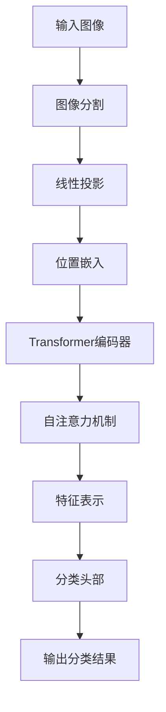

# "ViT在物联网中的应用"

## 1.背景介绍

随着5G技术的发展和物联网(IoT)设备的广泛部署,海量的物联网数据需要被高效处理和分析。传统的基于卷积神经网络(CNN)的计算机视觉模型在处理高分辨率图像时,计算量和内存占用都较大,难以满足物联网场景下的实时性和高效性要求。为了解决这一问题,谷歌大脑团队在2020年提出了基于纯Transformer的视觉Transformer(Vision Transformer,ViT)模型。

ViT模型借鉴了自然语言处理(NLP)领域的Transformer结构,将图像分割为若干个patch(图像块),并将这些patch投射到一个线性embedding空间中,作为Transformer的输入序列。通过自注意力机制,ViT能够有效地捕获全局信息和长程依赖关系,同时避免了CNN中的一些局限性,如感受野的限制和不变性的缺乏。

尽管ViT在大型数据集上表现出色,但由于其巨大的模型规模和对大量标注数据的依赖,直接将其应用于物联网场景存在一些挑战。因此,研究人员提出了多种改进方法,以提高ViT在物联网中的适用性和效率。

## 2.核心概念与联系

### 2.1 Transformer架构

Transformer是一种基于自注意力机制的序列到序列模型,最初被应用于机器翻译任务。它由编码器(Encoder)和解码器(Decoder)两个主要部分组成。

编码器的作用是将输入序列映射为一系列连续的表示,而解码器则根据编码器的输出生成目标序列。两者都由多个相同的层组成,每一层包含了多头自注意力(Multi-Head Attention)和前馈神经网络(Feed-Forward Neural Network)两个子层。

在ViT中,只使用了Transformer的编码器部分。输入图像被分割成一系列patch,并被投射到一个线性embedding空间中,作为Transformer编码器的输入序列。通过自注意力机制,ViT能够捕获图像中的全局信息和长程依赖关系。

### 2.2 自注意力机制

自注意力机制是Transformer的核心部分,它允许模型在计算目标序列的表示时,关注输入序列中的所有位置。具体来说,对于每个目标位置,自注意力机制会计算一个注意力分数,表示该位置对输入序列中每个位置的关注程度。

在ViT中,自注意力机制被用于捕获图像patch之间的相关性。通过计算每个patch与其他patch之间的注意力分数,ViT能够建立一个全局的表示,捕获长程依赖关系和空间信息。

### 2.3 位置嵌入

由于Transformer本身没有对输入序列的位置信息进行编码,因此需要引入位置嵌入(Positional Embedding)来提供位置信息。在ViT中,位置嵌入被添加到每个patch的线性embedding中,以保留空间位置信息。

### 2.4 图像分类与表示

在图像分类任务中,ViT的输出是一个向量,表示整个图像的表示。这个向量通常被称为[CLS]token,它是在输入序列中添加的一个特殊token,用于捕获整个序列的全局表示。

为了进行图像分类,ViT的输出[CLS]token被馈送到一个简单的多层感知机(MLP)头部,对不同类别进行预测。

## 3.核心算法原理具体操作步骤

ViT的核心算法原理可以概括为以下几个步骤:

1. **图像分割**: 将输入图像分割成一系列固定大小的patch(图像块)。每个patch的大小通常为16x16或32x32像素。

2. **线性投影**: 将每个patch映射到一个线性embedding空间中,生成一系列patch embedding。

3. **位置嵌入**: 为每个patch embedding添加相应的位置嵌入,以保留空间位置信息。

4. **Transformer编码器**: 将包含位置信息的patch embedding序列输入到Transformer编码器中。编码器由多个相同的层组成,每一层包含多头自注意力和前馈神经网络两个子层。

5. **自注意力机制**: 在每一层中,自注意力机制计算每个patch与其他patch之间的注意力分数,捕获长程依赖关系和空间信息。

6. **特征表示**: Transformer编码器的输出是一系列表示,对应于每个patch的最终特征表示。

7. **分类头部**: 将Transformer编码器的输出[CLS]token(表示整个图像的全局特征)馈送到一个简单的多层感知机(MLP)头部,对不同类别进行预测。

以下是ViT模型的工作流程图:



## 4.数学模型和公式详细讲解举例说明

### 4.1 线性投影

在ViT中,每个patch被线性投影到一个D维的embedding空间中,生成patch embedding。具体地,对于一个patch $x \in \mathbb{R}^{H \times W \times C}$,其线性投影可表示为:

$$x_e = x \cdot E$$

其中,$E \in \mathbb{R}^{C \times D}$是一个可学习的投影矩阵,将$C$维的patch映射到$D$维的embedding空间。

### 4.2 位置嵌入

为了保留patch的位置信息,ViT在每个patch embedding中添加了相应的位置嵌入。具体地,对于第$i$个patch embedding $x_{e_i}$,其位置嵌入为$p_{e_i}$,则包含位置信息的patch embedding为:

$$z_i = x_{e_i} + p_{e_i}$$

位置嵌入$p_{e_i}$是一个可学习的向量,对应于patch在图像中的空间位置。

### 4.3 多头自注意力

多头自注意力是Transformer的核心部分,它允许模型在计算目标序列的表示时,关注输入序列中的所有位置。具体地,对于一个查询向量$q$,键向量$k$和值向量$v$,单头自注意力计算如下:

$$\text{Attention}(q, k, v) = \text{softmax}\left(\frac{qk^T}{\sqrt{d_k}}\right)v$$

其中,$d_k$是缩放因子,用于防止内积过大导致的梯度不稳定问题。

在ViT中,查询$q$、键$k$和值$v$都是从输入序列的embedding中计算得到的。多头自注意力则是将多个单头自注意力的结果拼接在一起:

$$\text{MultiHead}(Q, K, V) = \text{Concat}(head_1, \dots, head_h)W^O$$

$$\text{where } head_i = \text{Attention}(QW_i^Q, KW_i^K, VW_i^V)$$

其中,$W_i^Q \in \mathbb{R}^{D \times d_q}$、$W_i^K \in \mathbb{R}^{D \times d_k}$和$W_i^V \in \mathbb{R}^{D \times d_v}$是可学习的投影矩阵,用于将embedding投影到查询、键和值空间。$W^O \in \mathbb{R}^{hd_v \times D}$是另一个可学习的投影矩阵,用于将多头注意力的结果投影回embedding空间。

通过自注意力机制,ViT能够捕获图像patch之间的相关性,建立一个全局的表示。

### 4.4 前馈神经网络

除了多头自注意力子层,Transformer编码器中的每一层还包含一个前馈神经网络子层,用于进一步处理序列的表示。具体地,对于一个输入向量$x$,前馈神经网络计算如下:

$$\text{FFN}(x) = \max(0, xW_1 + b_1)W_2 + b_2$$

其中,$W_1 \in \mathbb{R}^{D \times d_{ff}}$、$b_1 \in \mathbb{R}^{d_{ff}}$、$W_2 \in \mathbb{R}^{d_{ff} \times D}$和$b_2 \in \mathbb{R}^D$都是可学习的参数,$d_{ff}$是前馈神经网络的隐藏层大小。

前馈神经网络的作用是对序列的表示进行非线性映射,提供更丰富的表示能力。

### 4.5 分类头部

在图像分类任务中,ViT的输出是一个向量,表示整个图像的表示。这个向量通常被称为[CLS]token,它是在输入序列中添加的一个特殊token,用于捕获整个序列的全局表示。

为了进行图像分类,ViT的输出[CLS]token被馈送到一个简单的多层感知机(MLP)头部,对不同类别进行预测。具体地,对于[CLS]token $z_0$,分类头部计算如下:

$$y = \text{softmax}(z_0W_c + b_c)$$

其中,$W_c \in \mathbb{R}^{D \times C}$和$b_c \in \mathbb{R}^C$是可学习的参数,用于将[CLS]token映射到$C$个类别的概率分布上,$C$是分类任务中的类别数。

## 5.项目实践:代码实例和详细解释说明

以下是一个使用PyTorch实现的简化版ViT模型示例,用于图像分类任务:

```python
import torch
import torch.nn as nn

class PatchEmbedding(nn.Module):
    def __init__(self, img_size, patch_size, embed_dim):
        super().__init__()
        self.img_size = img_size
        self.patch_size = patch_size
        self.embed_dim = embed_dim
        self.num_patches = (img_size // patch_size) ** 2
        self.proj = nn.Conv2d(3, embed_dim, kernel_size=patch_size, stride=patch_size)

    def forward(self, x):
        x = self.proj(x)  # (batch_size, embed_dim, h, w)
        x = x.flatten(2).transpose(1, 2)  # (batch_size, num_patches, embed_dim)
        return x

class ViT(nn.Module):
    def __init__(self, img_size, patch_size, embed_dim, num_heads, num_layers, num_classes):
        super().__init__()
        self.patch_embedding = PatchEmbedding(img_size, patch_size, embed_dim)
        self.pos_embedding = nn.Parameter(torch.randn(1, self.patch_embedding.num_patches + 1, embed_dim))
        self.cls_token = nn.Parameter(torch.randn(1, 1, embed_dim))
        self.transformer = nn.Transformer(d_model=embed_dim, nhead=num_heads, num_encoder_layers=num_layers)
        self.mlp_head = nn.Linear(embed_dim, num_classes)

    def forward(self, x):
        batch_size = x.shape[0]
        patch_embeddings = self.patch_embedding(x)  # (batch_size, num_patches, embed_dim)
        cls_token = self.cls_token.repeat(batch_size, 1, 1)  # (batch_size, 1, embed_dim)
        embeddings = torch.cat((cls_token, patch_embeddings), dim=1)  # (batch_size, num_patches+1, embed_dim)
        embeddings += self.pos_embedding  # (batch_size, num_patches+1, embed_dim)
        x = self.transformer(embeddings)  # (batch_size, num_patches+1, embed_dim)
        cls_token = x[:, 0]  # (batch_size, embed_dim)
        x = self.mlp_head(cls_token)  # (batch_size, num_classes)
        return x
```

以上代码实现了一个简化版的ViT模型,包括以下几个主要部分:

1. `PatchEmbedding`模块:用于将输入图像分割成patch,并将每个patch线性投影到embedding空间中。

2. `ViT`模型:包含以下几个关键部分:
   - `patch_embedding`:用于生成patch embedding。
   - `pos_embedding`:可学习的位置嵌入,用于为每个patch embedding添加位置信息。
   - `cls_token`:可学习的[CLS]token,用于捕获整个序列的全局表示。
   - `transformer`:Transformer编码器,用于对包含位置信息的patch embedding序列进行编码。
   - `mlp_head`:多层感知机头部,用于将[CLS]token映射到分类概率分布上。

3. `forward`函数:定义了ViT模型的前向传播过程,包括以下步骤:
   - 使用`patch_embedding`模块将输入图像分割成patch,并生成patch embedding。
   - 将[CLS]token与patch embedding拼接在