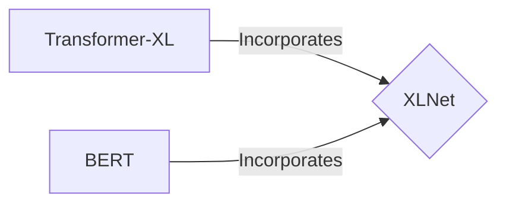

## 1.背景介绍

在深度学习领域，自然语言处理（NLP）是一个重要的研究方向。目前，Transformer模型已经成为NLP的标准模型，其中BERT（Bidirectional Encoder Representations from Transformers）模型的出现，使得NLP领域取得了显著的进步。然而，BERT模型存在一些问题，例如它不能很好地处理长期依赖问题。为了解决这些问题，Google Brain团队提出了一种新的模型，称为XLNet。

## 2.核心概念与联系

XLNet模型是一种基于Transformer-XL和BERT的混合模型。它结合了BERT的双向上下文建模能力和Transformer-XL的循环机制，从而在处理长期依赖问题上有所改进。



## 3.核心算法原理具体操作步骤

XLNet的训练过程包括以下步骤：

1. 首先，对输入序列进行置换，生成所有可能的置换序列。
2. 然后，使用Transformer-XL对每个置换序列进行编码。
3. 最后，利用BERT的双向上下文建模，对编码后的序列进行预测。

## 4.数学模型和公式详细讲解举例说明

XLNet的目标函数可以表示为：

$$
L = \sum_{i=1}^{N} \log P(x_{i} | x_{<i}; \theta)
$$

其中，$x_{i}$表示输入序列的第$i$个元素，$x_{<i}$表示在$x_{i}$之前的元素，$\theta$表示模型参数，$N$表示输入序列的长度。

## 5.项目实践：代码实例和详细解释说明

以下是一个简单的XLNet模型训练的代码示例：

```python
import torch
from transformers import XLNetModel, XLNetTokenizer

# 初始化模型和分词器
model = XLNetModel.from_pretrained('xlnet-base-cased')
tokenizer = XLNetTokenizer.from_pretrained('xlnet-base-cased')

# 对输入数据进行编码
input_ids = torch.tensor(tokenizer.encode("Hello, my dog is cute")).unsqueeze(0)

# 前向传播计算输出
outputs = model(input_ids)
```

## 6.实际应用场景

XLNet模型在各种NLP任务中都有广泛的应用，包括情感分析、文本分类、命名实体识别（NER）等。

## 7.工具和资源推荐

推荐使用Hugging Face的Transformers库来实现XLNet模型，这是一个非常强大的深度学习库，支持各种预训练模型，包括BERT、XLNet等。

## 8.总结：未来发展趋势与挑战

尽管XLNet模型在处理长期依赖问题上有所改进，但仍存在一些挑战，例如计算复杂度高、训练数据需求大等。未来，我们期待看到更多的研究工作，以解决这些问题并进一步提升模型的性能。

## 9.附录：常见问题与解答

Q: XLNet和BERT有什么区别？

A: XLNet和BERT的主要区别在于，XLNet使用了Transformer-XL的循环机制，可以更好地处理长期依赖问题。而BERT则主要依赖于双向上下文建模。

作者：禅与计算机程序设计艺术 / Zen and the Art of Computer Programming