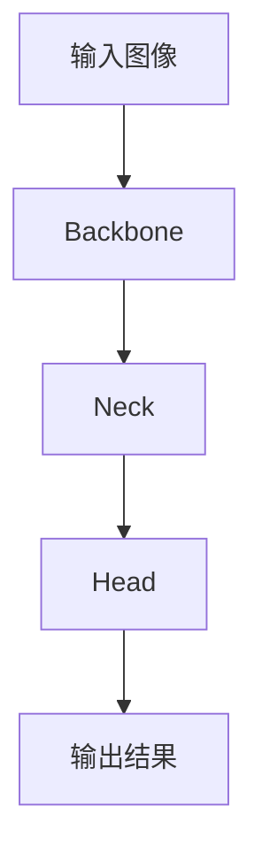

# YOLOv6原理与代码实例讲解

## 1.背景介绍

YOLO（You Only Look Once）系列是目标检测领域的一个重要分支，因其高效的实时性能和较高的检测精度而备受关注。YOLOv6是YOLO系列的最新版本，进一步优化了模型结构和算法，使其在速度和精度上都有显著提升。本文将深入探讨YOLOv6的原理、算法、数学模型，并通过代码实例展示其实际应用。

## 2.核心概念与联系

### 2.1 YOLO系列的演进

YOLO系列自YOLOv1发布以来，经历了多个版本的迭代，每个版本都在模型结构、损失函数、训练策略等方面进行了改进。YOLOv6在前几代的基础上，进一步优化了网络结构和训练方法。

### 2.2 YOLOv6的创新点

YOLOv6引入了新的特征提取网络和检测头，采用了更高效的Anchor-Free机制，并在训练过程中使用了多尺度训练和数据增强技术。这些创新点使得YOLOv6在保持高效的同时，进一步提升了检测精度。

### 2.3 YOLOv6与其他目标检测算法的对比

与Faster R-CNN、SSD等传统目标检测算法相比，YOLOv6在速度和精度上都有显著优势。其单阶段检测机制使得模型能够在一次前向传播中完成目标检测任务，极大地提高了检测速度。

## 3.核心算法原理具体操作步骤

### 3.1 网络结构

YOLOv6的网络结构主要包括三个部分：Backbone、Neck和Head。Backbone用于提取图像的基础特征，Neck用于特征融合和增强，Head用于目标分类和定位。



### 3.2 Anchor-Free机制

YOLOv6采用了Anchor-Free机制，即不再依赖预定义的Anchor Box，而是直接预测目标的中心点和边界框。这种机制简化了模型的设计，减少了计算量，并提高了检测精度。

### 3.3 多尺度训练

多尺度训练是YOLOv6的一大特点，通过在训练过程中随机调整输入图像的尺寸，使得模型能够适应不同尺度的目标，提高了模型的泛化能力。

### 3.4 数据增强技术

YOLOv6在训练过程中采用了多种数据增强技术，如随机裁剪、旋转、颜色变换等。这些技术可以增加训练数据的多样性，防止模型过拟合。

## 4.数学模型和公式详细讲解举例说明

### 4.1 损失函数

YOLOv6的损失函数由分类损失、定位损失和置信度损失组成。具体公式如下：

$$
L = L_{cls} + L_{loc} + L_{conf}
$$

其中，$L_{cls}$ 是分类损失，$L_{loc}$ 是定位损失，$L_{conf}$ 是置信度损失。

### 4.2 分类损失

分类损失采用交叉熵损失函数，公式如下：

$$
L_{cls} = -\sum_{i=1}^{N} y_i \log(p_i)
$$

其中，$N$ 是类别数，$y_i$ 是真实标签，$p_i$ 是预测概率。

### 4.3 定位损失

定位损失采用平滑L1损失函数，公式如下：

$$
L_{loc} = \sum_{i=1}^{N} smooth_{L1}(t_i - \hat{t}_i)
$$

其中，$t_i$ 是真实边界框参数，$\hat{t}_i$ 是预测边界框参数。

### 4.4 置信度损失

置信度损失采用二分类交叉熵损失函数，公式如下：

$$
L_{conf} = -\sum_{i=1}^{N} [y_i \log(p_i) + (1 - y_i) \log(1 - p_i)]
$$

其中，$y_i$ 是真实置信度，$p_i$ 是预测置信度。

## 5.项目实践：代码实例和详细解释说明

### 5.1 环境配置

首先，确保你的环境中安装了必要的库，如PyTorch、OpenCV等。

```bash
pip install torch torchvision opencv-python
```

### 5.2 数据准备

下载并准备COCO数据集，确保数据集的路径正确。

```python
import os
from torchvision import datasets, transforms

data_dir = 'path/to/coco'
transform = transforms.Compose([
    transforms.Resize((640, 640)),
    transforms.ToTensor(),
])

train_dataset = datasets.CocoDetection(root=os.path.join(data_dir, 'train2017'),
                                       annFile=os.path.join(data_dir, 'annotations/instances_train2017.json'),
                                       transform=transform)
```

### 5.3 模型定义

定义YOLOv6模型的网络结构，包括Backbone、Neck和Head。

```python
import torch
import torch.nn as nn

class YOLOv6(nn.Module):
    def __init__(self):
        super(YOLOv6, self).__init__()
        self.backbone = self._make_backbone()
        self.neck = self._make_neck()
        self.head = self._make_head()

    def _make_backbone(self):
        # 定义Backbone网络结构
        pass

    def _make_neck(self):
        # 定义Neck网络结构
        pass

    def _make_head(self):
        # 定义Head网络结构
        pass

    def forward(self, x):
        x = self.backbone(x)
        x = self.neck(x)
        x = self.head(x)
        return x
```

### 5.4 模型训练

定义训练过程，包括损失函数、优化器和训练循环。

```python
model = YOLOv6()
criterion = nn.CrossEntropyLoss()
optimizer = torch.optim.Adam(model.parameters(), lr=0.001)

for epoch in range(num_epochs):
    for images, targets in train_loader:
        outputs = model(images)
        loss = criterion(outputs, targets)
