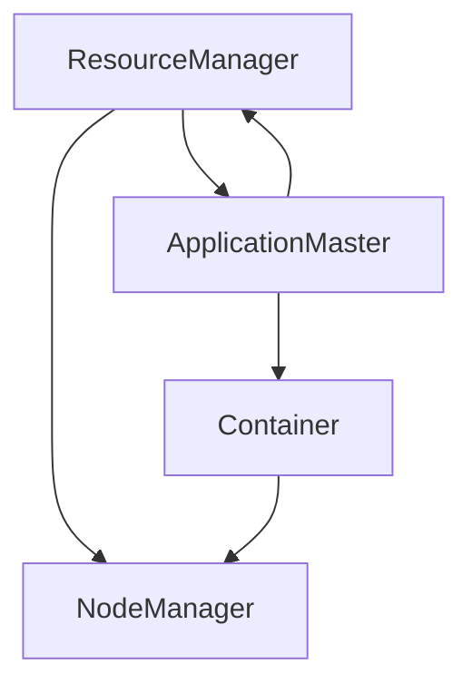

## 1. 背景介绍

随着大数据技术的快速发展，Hadoop已经成为了处理海量数据的标准工具。然而，Hadoop的一个缺点是它的资源管理器（ResourceManager）是单点故障，这意味着如果ResourceManager出现故障，整个Hadoop集群将无法正常工作。为了解决这个问题，Yarn（Yet Another Resource Negotiator）应运而生。

Yarn是一个分布式资源管理系统，它可以管理Hadoop集群中的资源，并为应用程序提供资源。Yarn的核心思想是将资源管理和任务调度分离开来，这样就可以实现更好的资源利用率和更高的集群利用率。Yarn的出现使得Hadoop集群更加稳定和可靠，同时也提高了集群的性能和可扩展性。

## 2. 核心概念与联系

Yarn的核心概念包括NodeManager、ResourceManager、ApplicationMaster和Container。

- NodeManager：NodeManager是运行在每个节点上的代理，它负责管理节点上的资源，包括内存、CPU和磁盘等。NodeManager会向ResourceManager汇报节点上的资源情况，并接收ResourceManager分配给它的任务。

- ResourceManager：ResourceManager是整个集群的资源管理器，它负责管理集群中的所有资源，并为应用程序提供资源。ResourceManager会根据应用程序的需求，将任务分配给可用的节点。

- ApplicationMaster：ApplicationMaster是每个应用程序的主管，它负责协调应用程序的执行，并向ResourceManager请求资源。ApplicationMaster会向ResourceManager申请一个或多个Container，然后将任务分配给这些Container。

- Container：Container是一个封装了资源的对象，它包括内存、CPU和磁盘等。每个Container都运行在一个节点上，并执行一个或多个任务。

Yarn的核心概念之间的联系如下图所示：



## 3. 核心算法原理具体操作步骤

Yarn的核心算法原理包括资源管理和任务调度两个方面。

### 资源管理

Yarn的资源管理算法主要包括资源分配和资源回收两个方面。

- 资源分配：ResourceManager会根据应用程序的需求，将任务分配给可用的节点。ResourceManager会维护一个资源池，其中包括所有可用的节点和它们的资源情况。当一个应用程序需要资源时，ResourceManager会从资源池中选择一个节点，并将任务分配给该节点。

- 资源回收：当一个任务完成时，NodeManager会将Container中的资源释放，并将Container的状态更新为“已完成”。ResourceManager会检测到Container的状态变化，并将资源回收到资源池中。

### 任务调度

Yarn的任务调度算法主要包括任务分配和任务优先级两个方面。

- 任务分配：ApplicationMaster会向ResourceManager申请一个或多个Container，然后将任务分配给这些Container。ApplicationMaster会根据任务的需求和节点的资源情况，选择最合适的节点来执行任务。

- 任务优先级：Yarn支持任务优先级，可以根据任务的优先级来调度任务。当多个任务同时申请资源时，ResourceManager会根据任务的优先级来决定哪个任务先执行。

## 4. 数学模型和公式详细讲解举例说明

Yarn的数学模型和公式比较复杂，这里不做详细讲解。需要注意的是，Yarn的数学模型和公式主要用于资源管理和任务调度，包括资源分配、资源回收、任务分配和任务优先级等方面。

## 5. 项目实践：代码实例和详细解释说明

下面是一个简单的Yarn应用程序的代码示例：

```java
public class YarnApplication {
    public static void main(String[] args) throws Exception {
        Configuration conf = new Configuration();
        YarnClient yarnClient = YarnClient.createYarnClient();
        yarnClient.init(conf);
        yarnClient.start();
        YarnClientApplication app = yarnClient.createApplication();
        ApplicationSubmissionContext appContext = app.getApplicationSubmissionContext();
        appContext.setApplicationName("Yarn Application");
        ContainerLaunchContext amContainer = ContainerLaunchContext.newInstance(
                null, null, null, null, null, null);
        Resource capability = Resource.newInstance(1024, 1);
        appContext.setResource(capability);
        appContext.setAMContainerSpec(amContainer);
        appContext.setPriority(Priority.newInstance(0));
        appContext.setQueue("default");
        yarnClient.submitApplication(appContext);
    }
}
```

这个应用程序会向Yarn提交一个任务，并等待任务执行完成。在这个应用程序中，我们使用了Yarn的Java API来创建一个YarnClient对象，并使用该对象来创建一个Yarn应用程序。然后，我们设置应用程序的名称、资源需求、容器启动上下文和优先级等信息，并将应用程序提交给Yarn。

## 6. 实际应用场景

Yarn的实际应用场景非常广泛，包括大数据处理、机器学习、图像处理、自然语言处理等领域。Yarn可以管理Hadoop集群中的资源，并为应用程序提供资源。Yarn的出现使得Hadoop集群更加稳定和可靠，同时也提高了集群的性能和可扩展性。

## 7. 工具和资源推荐

Yarn的官方文档提供了非常详细的介绍和使用指南，可以帮助开发者快速上手。此外，还有一些第三方工具和资源可以帮助开发者更好地使用Yarn，例如Apache Ambari、Apache Slider等。

## 8. 总结：未来发展趋势与挑战

Yarn作为一个分布式资源管理系统，已经成为了处理海量数据的标准工具。未来，随着大数据技术的不断发展，Yarn将会面临更多的挑战和机遇。Yarn需要不断地改进和优化，以满足不断变化的需求。

## 9. 附录：常见问题与解答

Q: Yarn的优点是什么？

A: Yarn的优点包括资源管理和任务调度分离、更好的资源利用率、更高的集群利用率、更稳定和可靠的集群等。

Q: Yarn的缺点是什么？

A: Yarn的缺点包括复杂的数学模型和公式、较高的学习成本、较长的部署时间等。

Q: Yarn适用于哪些场景？

A: Yarn适用于大数据处理、机器学习、图像处理、自然语言处理等领域。Yarn可以管理Hadoop集群中的资源，并为应用程序提供资源。

作者：禅与计算机程序设计艺术 / Zen and the Art of Computer Programming