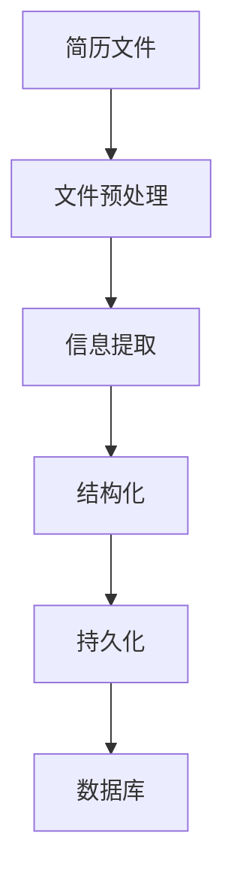
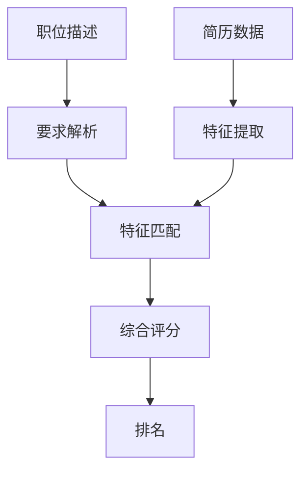
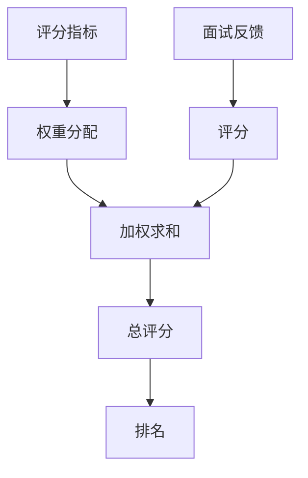

# springboot企业招聘系统

## 1.背景介绍

在当今快节奏的商业环境中，企业面临着吸引和留住优秀人才的巨大挑战。有效的招聘系统对于确保企业获得所需的人力资源至关重要。Spring Boot是一个广受欢迎的Java框架,它提供了快速开发、轻量级和易于部署的特性,使其成为构建企业级招聘系统的理想选择。

本文将探讨如何利用Spring Boot构建一个功能丰富、高效且易于扩展的企业招聘系统。我们将深入探讨系统的核心概念、架构设计、关键算法,以及实现细节。此外,还将介绍系统在实际场景中的应用、相关工具和资源,并对未来发展趋势和挑战进行总结。

### 1.1 招聘系统的重要性

一个优秀的招聘系统可以为企业带来以下好处:

- 吸引优秀人才
- 提高招聘效率
- 降低招聘成本
- 改善候选人体验
- 支持数据驱动的决策

### 1.2 为什么选择Spring Boot

Spring Boot凭借其以下优势,成为构建企业级招聘系统的理想选择:

- 快速开发:内置了大量自动配置,减少了样板代码
- 轻量级:只需引入所需的依赖,避免臃肿
- 易于部署:提供了多种部署方式,如传统WAR包、JAR包等
- 生态系统丰富:与Spring框架无缝集成,可利用大量现有库

## 2.核心概念与联系

在深入探讨系统实现之前,让我们先了解一些核心概念及其相互关系。

### 2.1 职位管理

职位管理是整个招聘系统的核心。它包括:

- 创建新职位
- 编辑现有职位
- 发布/关闭职位
- 设置职位要求和期望

### 2.2 简历管理

简历管理模块负责处理候选人的简历,包括:

- 上传简历
- 解析简历数据
- 匹配职位要求
- 评分和排名

### 2.3 面试管理

面试管理模块协调整个面试流程,包括:

- 安排面试时间和地点
- 分配面试官
- 记录面试反馈
- 生成面试总结

### 2.4 用户管理

用户管理模块负责管理系统用户,包括:

- 注册新用户
- 认证和授权
- 角色和权限管理

### 2.5 核心概念关系

这些核心概念紧密相连,形成了一个完整的招聘流程。简单来说,职位管理模块定义了企业的人才需求,简历管理模块收集和评估候选人,面试管理模块协调面试过程,而用户管理模块则确保系统安全性和访问控制。


## 3.核心算法原理具体操作步骤

### 3.1 简历解析算法

简历解析算法是整个招聘系统的核心,它从上传的简历文件(如PDF或Word文档)中提取关键信息,例如教育背景、工作经历、技能等。这些信息将被用于后续的匹配和评分过程。

算法的具体步骤如下:

1. **文件预处理**: 将上传的简历文件转换为统一的文本格式,例如纯文本或HTML。
2. **信息提取**: 使用自然语言处理(NLP)技术从文本中提取关键信息,如姓名、教育经历、工作经历等。
3. **结构化**: 将提取的信息组织成结构化的数据,例如将工作经历存储为一系列的职位对象,每个对象包含公司名称、职位名称、工作时间等字段。
4. **持久化**: 将结构化的简历数据存储在数据库中,以供后续的匹配和查询操作。



### 3.2 职位匹配算法

职位匹配算法负责将候选人的简历与职位要求进行匹配,并给出匹配分数。这是确保招聘过程高效和准确的关键。

算法的具体步骤如下:

1. **要求解析**: 从职位描述中提取关键要求,如教育程度、工作经验年限、技能等。
2. **特征提取**: 从候选人简历中提取相应的特征,如学历、工作年限、技能列表等。
3. **特征匹配**: 将职位要求与候选人特征进行匹配,给出匹配分数。可以使用多种匹配策略,如布尔匹配、语义匹配等。
4. **综合评分**: 将不同特征的匹配分数综合起来,得到候选人与职位的总体匹配分数。
5. **排名**: 根据匹配分数对候选人进行排名,方便招聘人员快速查看最合适的候选人。



### 3.3 面试评分算法

面试评分算法旨在根据面试官的反馈,对候选人的表现进行评分和排名。这有助于做出更加明智的hiring决策。

算法的具体步骤如下:

1. **指标确定**: 确定评分的关键指标,如沟通能力、技术能力、团队合作等。
2. **权重分配**: 为每个指标分配权重,反映其在总体评分中的重要性。
3. **评分**: 面试官根据每个指标对候选人进行评分,例如使用1-5分制。
4. **加权求和**: 将每个指标的评分乘以相应的权重,然后求和得到总评分。
5. **排名**: 根据总评分对候选人进行排名,协助做出hiring决策。



## 4.数学模型和公式详细讲解举例说明

在招聘系统中,我们可以使用多种数学模型和公式来量化和优化匹配和评分过程。

### 4.1 布尔匹配模型

布尔匹配模型是最简单的匹配模型,它将职位要求视为一系列必须满足的条件。如果候选人满足所有条件,则视为匹配;否则,不匹配。

设$R$为职位要求集合,$C$为候选人特征集合,则匹配函数可以表示为:

$$
match(R, C) = \begin{cases}
1, & \text{if } R \subseteq C \\
0, & \text{otherwise}
\end{cases}
$$

例如,如果一个职位要求计算机科学学士学位和3年以上的Java开发经验,而某候选人具有计算机科学学士学位和5年的Java开发经验,则该候选人与该职位匹配。

然而,布尔匹配模型过于严格,无法处理部分匹配的情况。

### 4.2 加权求和模型

加权求和模型为每个职位要求分配一个权重,表示其重要性。然后,计算候选人满足每个要求的程度,并将它们加权求和,得到总体匹配分数。

设$R = \{r_1, r_2, \ldots, r_n\}$为职位要求集合,$w_i$为要求$r_i$的权重,且$\sum_{i=1}^n w_i = 1$。$C = \{c_1, c_2, \ldots, c_m\}$为候选人特征集合。定义一个相似度函数$sim(r_i, c_j)$,表示要求$r_i$与特征$c_j$的相似程度。则匹配分数可以表示为:

$$
score(R, C) = \sum_{i=1}^n w_i \max_{1 \leq j \leq m} sim(r_i, c_j)
$$

例如,如果一个职位要求计算机科学学士学位(权重0.3)、3年以上Java开发经验(权重0.5)和英语流利(权重0.2),而某候选人具有计算机科学硕士学位、5年Java开发经验和良好的英语水平,则该候选人的匹配分数可能是$0.3 \times 1 + 0.5 \times 1 + 0.2 \times 0.8 = 0.86$(假设硕士学位完全满足学士学位要求,良好英语水平的相似度为0.8)。

### 4.3 语义匹配模型

语义匹配模型利用自然语言处理技术,计算职位要求和候选人特征之间的语义相似度。这比简单的关键词匹配更加准确和灵活。

设$r$为职位要求,$c$为候选人特征,我们可以将它们表示为向量$\vec{r}$和$\vec{c}$。然后,计算它们之间的余弦相似度作为语义相似度:

$$
sim(r, c) = \frac{\vec{r} \cdot \vec{c}}{|\vec{r}||\vec{c}|}
$$

向量可以使用诸如Word2Vec、BERT等embedding技术从文本中获得。

例如,如果一个职位要求"具有丰富的面向对象编程经验",而某候选人的简历中提到"熟练掌握Java和C++,有5年面向对象设计和开发经验",则这两个向量的余弦相似度可能很高,表明它们在语义上是匹配的。

通过将语义匹配模型与加权求和模型相结合,我们可以获得更加准确和灵活的匹配评分系统。

## 5.项目实践:代码实例和详细解释说明

在本节中,我们将通过一些代码示例来演示如何使用Spring Boot实现招聘系统的核心功能。

### 5.1 简历解析

下面是一个简单的示例,展示如何使用Apache PDFBox库从PDF文件中提取文本内容:

```java
import org.apache.pdfbox.pdmodel.PDDocument;
import org.apache.pdfbox.text.PDFTextStripper;
import java.io.File;
import java.io.IOException;

public class ResumeParser {
    public static String extractTextFromPDF(File pdfFile) throws IOException {
        PDDocument document = PDDocument.load(pdfFile);
        PDFTextStripper stripper = new PDFTextStripper();
        String text = stripper.getText(document);
        document.close();
        return text;
    }
}
```

在实际应用中,你可能需要使用更复杂的NLP技术(如命名实体识别、关系提取等)来从文本中提取结构化信息。

### 5.2 职位匹配

下面是一个使用加权求和模型进行职位匹配的示例:

```java
import java.util.HashMap;
import java.util.Map;

public class JobMatcher {
    private static final Map<String, Double> JOB_REQUIREMENTS = new HashMap<>();
    static {
        JOB_REQUIREMENTS.put("education", 0.3);
        JOB_REQUIREMENTS.put("experience", 0.5);
        JOB_REQUIREMENTS.put("skills", 0.2);
    }

    public static double matchScore(Candidate candidate) {
        double score = 0.0;
        score += JOB_REQUIREMENTS.get("education") * matchEducation(candidate.getEducation());
        score += JOB_REQUIREMENTS.get("experience") * matchExperience(candidate.getExperience());
        score += JOB_REQUIREMENTS.get("skills") * matchSkills(candidate.getSkills());
        return score;
    }

    private static double matchEducation(String education) {
        // 实现教育程度匹配逻辑
    }

    private static double matchExperience(String experience) {
        // 实现工作经验匹配逻辑
    }

    private static double matchSkills(List<String> skills) {
        // 实现技能匹配逻辑
    }
}
```

在这个示例中,我们定义了一个`JobMatcher`类,它维护了一个职位要求映射,其中包含了每个要求的权重。`matchScore`方法根据候选人的教育程度、工作经验和技能计算总体匹配分数。你需要实现`matchEducation`、`matchExperience`和`matchSkills`方法来定义具体的匹配逻辑。

### 5.3 面试评分

下面是一个使用加权求和模型进行面试评分的示例:

```java
import java.util.HashMap;
import java.util.Map;

public class InterviewScorer {
    private static final Map