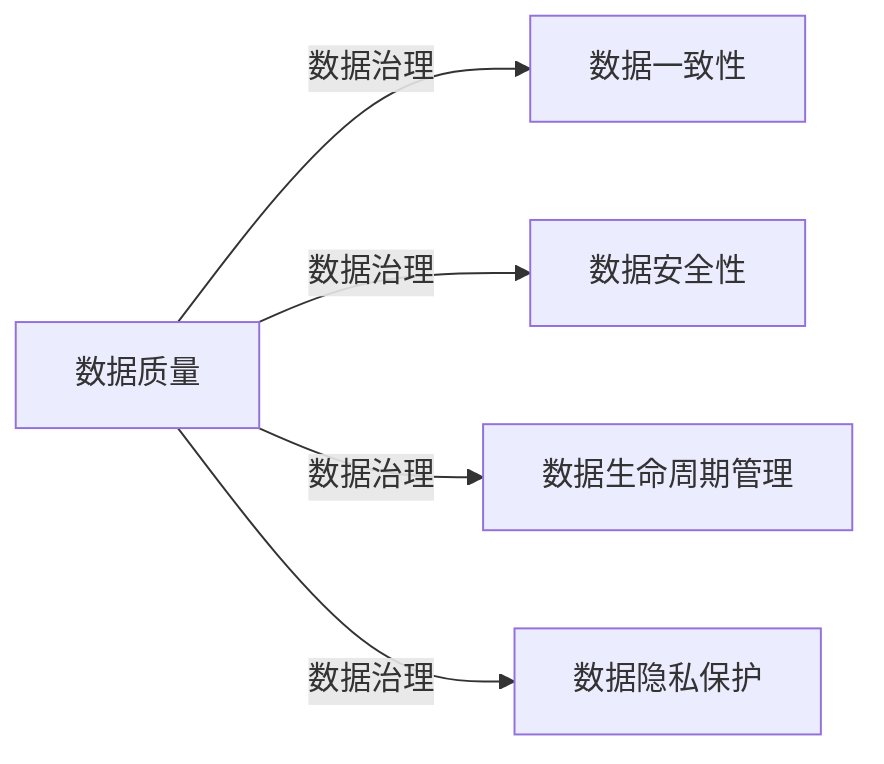

## 1.背景介绍

随着信息技术的发展和大数据时代的到来，数据已经成为企业的重要资产。然而，数据的质量、安全性、一致性、准确性和及时性等问题，已经成为企业面临的重大挑战。为此，数据治理作为一种管理数据的方式，其重要性日益凸显。

## 2.核心概念与联系

数据治理是指通过制定一系列的规则、策略和流程，对企业的数据进行全面管理，以提高数据的质量、安全性、一致性、准确性和及时性。数据治理的核心概念包括数据质量、数据一致性、数据安全性、数据生命周期管理、数据隐私保护等。



## 3.核心算法原理具体操作步骤

数据治理的实施步骤主要包括：数据治理策略制定、数据治理组织架构设定、数据治理流程设计、数据治理工具选择和数据治理执行与监控。下面将详细介绍每个步骤的具体操作。

## 4.数学模型和公式详细讲解举例说明

数据治理的效果评估是一个重要环节，我们可以通过一些数学模型和公式来进行评估。例如，我们可以通过数据质量维度模型来评估数据质量。该模型包括以下几个维度：准确性、完整性、一致性、可信度、及时性。对于每个维度，我们可以定义一个评估函数$f_i(x)$，其中$x$表示数据，$i$表示维度。最终的数据质量得分可以通过如下公式计算：

$$
Q(x) = \frac{1}{n}\sum_{i=1}^{n}f_i(x)
$$

其中，$n$表示维度的数量。

## 5.项目实践：代码实例和详细解释说明

在Python中，我们可以使用Pandas库来进行数据治理。以下是一些常见的数据治理操作的代码示例。

```python
import pandas as pd

# 加载数据
df = pd.read_csv('data.csv')

# 查看数据的基本信息
df.info()

# 查看数据的统计信息
df.describe()

# 数据清洗：删除重复值
df.drop_duplicates(inplace=True)

# 数据清洗：处理缺失值
df.fillna(df.mean(), inplace=True)

# 数据转换：标准化
df_norm = (df - df.min()) / (df.max() - df.min())

# 数据验证：检查数据的一致性
assert df['column1'].equals(df['column2'])
```

## 6.实际应用场景

数据治理在许多领域都有广泛的应用，例如金融、医疗、电商、政府等。在金融领域，数据治理可以帮助企业提高数据质量，从而提高决策的准确性。在医疗领域，数据治理可以帮助医院管理患者的医疗记录，提高医疗服务的质量。在电商领域，数据治理可以帮助企业管理商品和用户数据，提高业务运营的效率。在政府领域，数据治理可以帮助政府管理公共数据，提高公共服务的质量。

## 7.工具和资源推荐

在数据治理的实践中，有许多工具和资源可以帮助我们提高效率，例如Apache Atlas、Talend、Informatica等数据治理工具，以及《数据治理实战》、《数据治理权威指南》等专业书籍。

## 8.总结：未来发展趋势与挑战

随着数据的增长和技术的发展，数据治理的重要性将进一步提高。未来的数据治理将面临许多新的挑战，例如如何处理大规模的数据、如何保护数据隐私、如何适应新的数据类型和数据源等。同时，数据治理也将有许多新的发展趋势，例如AI驱动的数据治理、实时的数据治理、自动化的数据治理等。

## 9.附录：常见问题与解答

1. 问题：数据治理和数据管理有什么区别？
   答：数据管理是对数据进行全面的管理，包括数据的收集、存储、处理、分析、使用和销毁等。数据治理是数据管理的一个重要组成部分，主要关注数据的质量、安全性、一致性、准确性和及时性。

2. 问题：如何评估数据治理的效果？
   答：可以通过数据质量、数据一致性、数据安全性、数据生命周期管理、数据隐私保护等指标来评估数据治理的效果。

3. 问题：数据治理有哪些常见的工具？
   答：Apache Atlas、Talend、Informatica等是数据治理的常见工具。

作者：禅与计算机程序设计艺术 / Zen and the Art of Computer Programming