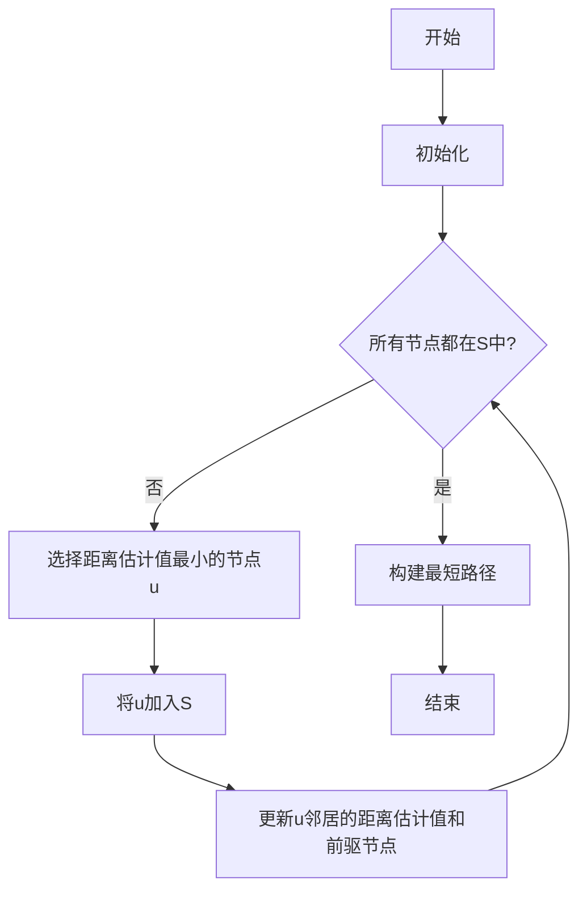
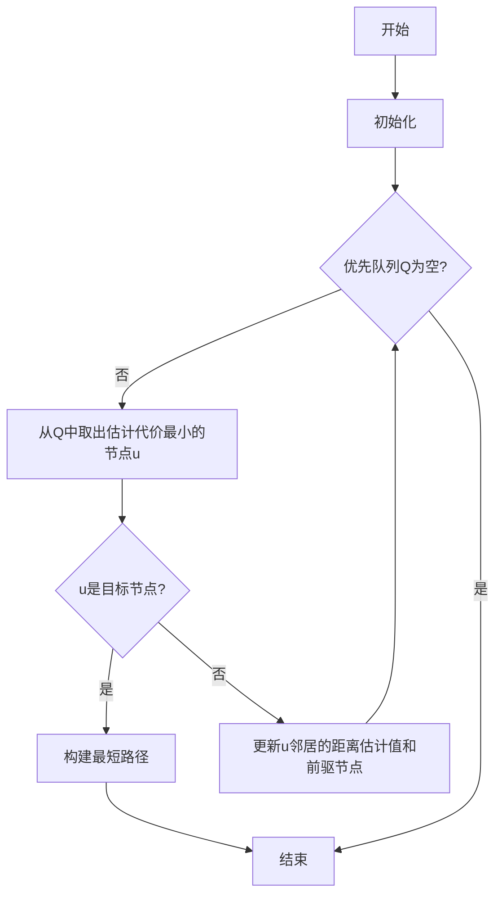

# 【AI大数据计算原理与代码实例讲解】最短路径

## 1.背景介绍

在现代计算机科学和人工智能领域中,寻找最短路径是一个非常重要和基础的问题。无论是网络路由、交通导航、机器人路径规划,还是一些复杂的组合优化问题,都可以转化为求解最短路径问题。因此,高效的最短路径算法对于提高计算效率、优化资源利用等方面具有重要意义。

### 1.1 最短路径问题的定义

最短路径问题可以形式化地描述为:给定一个加权图G(V,E),其中V表示节点集合,E表示边集合,每条边都有一个相关的权重或代价。最短路径问题的目标是找到从源节点s到目标节点t的一条路径,使得该路径上所有边的权重之和最小。

根据具体情况的不同,最短路径问题可以分为以下几种类型:

- 单源最短路径:计算从一个给定的源节点到图中所有其他节点的最短路径。
- 单目标最短路径:计算从图中所有节点到一个给定的目标节点的最短路径。
-单源单目标最短路径:计算从一个给定的源节点到一个给定的目标节点的最短路径。
- 所有节点对最短路径:计算图中任意两个节点之间的最短路径。

### 1.2 最短路径问题的应用

最短路径问题在许多现实应用中扮演着重要角色,例如:

- **网络路由**: 在计算机网络中,路由器需要找到从源主机到目标主机的最短路径来传输数据包。
- **导航系统**: 导航应用程序需要计算从出发地到目的地的最短路线,以提供行车路线指引。
- **运输优化**: 物流公司需要规划最优的运输路线,以降低运输成本和时间。
- **机器人路径规划**: 机器人需要计算从起点到终点的最短路径,以避免障碍物并优化运动轨迹。
- **网络分析**: 在社交网络、蛋白质互作网络等复杂网络中,最短路径算法可用于发现节点之间的关联关系。

## 2.核心概念与联系

### 2.1 图的表示

在讨论最短路径算法之前,我们需要先了解如何在计算机中表示图结构。常见的图表示方法有邻接矩阵和邻接表两种。

#### 2.1.1 邻接矩阵

邻接矩阵是一种用二维数组表示图的方式。对于一个有n个节点的图,我们使用一个n×n的矩阵来表示节点之间的连接关系。如果节点i和节点j之间有边相连,则矩阵中的元素A[i][j]和A[j][i]被赋予边的权重值;否则,这些元素被赋予无穷大或一个很大的数值,表示两个节点之间没有直接连接。

邻接矩阵的优点是可以快速查找两个节点之间是否有边相连,缺点是对于稀疏图(边的数量远小于节点数的平方)会浪费大量存储空间。

#### 2.1.2 邻接表

邻接表是一种更加节省空间的图表示方式。对于每个节点,我们使用一个链表或数组来存储与该节点相邻的节点及其对应的边权重。这种表示方法只需要存储实际存在的边,因此对于稀疏图更加高效。

邻接表的优点是节省存储空间,缺点是查找两个节点之间是否有边相连的时间复杂度为O(degree),其中degree是节点的度数(相邻节点的数量)。

### 2.2 最短路径算法分类

根据图的特征和问题的具体要求,最短路径算法可以分为以下几种类型:

1. **单源最短路径算法**:
   - 无权图:广度优先搜索(BFS)
   - 非负权重图:Dijkstra算法
   - 有负权重环的图:Bellman-Ford算法

2. **单源单目标最短路径算法**:
   - A*算法

3. **所有节点对最短路径算法**:
   - Floyd-Warshall算法
   - Johnson算法

4. **其他算法**:
   - 双向搜索
   - 分支定界算法
   - 遗传算法

在下面的章节中,我们将重点介绍几种经典的最短路径算法,包括Dijkstra算法、Bellman-Ford算法和A*算法。

## 3.核心算法原理具体操作步骤

### 3.1 Dijkstra算法

Dijkstra算法是解决单源最短路径问题的一种经典算法,它适用于有向或无向图,且边的权重必须为非负值。算法的基本思想是从源节点开始,逐步扩展到其他节点,并维护一个集合,记录从源节点到每个节点的最短路径估计值。

#### 3.1.1 算法步骤

1. 初始化:
   - 将源节点s加入集合S
   - 对于每个节点v,设置距离估计值dist[v]为无穷大,并将前驱节点pred[v]设置为None
   - 设置dist[s]为0

2. 循环:
   - 从剩余节点中选择距离估计值最小的节点u
   - 将u加入集合S
   - 对于每个u的邻居v:
     - 如果dist[v] > dist[u] + weight(u, v):
       - 更新dist[v] = dist[u] + weight(u, v)
       - 更新pred[v] = u

3. 终止条件:当所有节点都加入集合S时,算法结束。

4. 路径构建:通过pred数组,从目标节点出发,沿着前驱节点一直回溯到源节点,即可得到最短路径。

#### 3.1.2 算法复杂度

- 时间复杂度:
  - 使用二叉堆优化,时间复杂度为O((|E|+|V|)log|V|),其中|E|和|V|分别表示边和节点的数量。
  - 在密集图中,时间复杂度为O(|V|^2)。
- 空间复杂度:O(|V|+|E|),用于存储距离估计值、前驱节点和邻接表或邻接矩阵。

#### 3.1.3 算法流程图



### 3.2 Bellman-Ford算法

Bellman-Ford算法是解决单源最短路径问题的另一种经典算法,它可以处理有负权重边的情况,但不能处理存在负权重环的图。算法的基本思想是通过多次松弛操作,逐步更新从源节点到每个节点的最短路径估计值,直到所有边都被松弛且不再有更短路径为止。

#### 3.2.1 算法步骤

1. 初始化:
   - 对于每个节点v,设置距离估计值dist[v]为无穷大,并将前驱节点pred[v]设置为None
   - 设置dist[s]为0

2. 松弛操作:
   - 对所有边(u, v)进行|V|-1次松弛操作:
     - 如果dist[v] > dist[u] + weight(u, v):
       - 更新dist[v] = dist[u] + weight(u, v)
       - 更新pred[v] = u

3. 检测负权重环:
   - 再次对所有边(u, v)进行一次松弛操作
   - 如果存在dist[v] > dist[u] + weight(u, v),说明图中存在负权重环

4. 路径构建:通过pred数组,从目标节点出发,沿着前驱节点一直回溯到源节点,即可得到最短路径。

#### 3.2.2 算法复杂度

- 时间复杂度:O(|V||E|),其中|V|和|E|分别表示节点和边的数量。
- 空间复杂度:O(|V|+|E|),用于存储距离估计值、前驱节点和邻接表或邻接矩阵。

#### 3.2.3 算法流程图

```mermaid
graph TD
    A[开始] --> B[初始化]
    B --> C[对所有边进行|V|-1次松弛操作]
    C --> D{检测负权重环}
    D --存在负权重环--> E[报错]
    D --不存在负权重环--> F[构建最短路径]
    F --> G[结束]
    E --> G
```

### 3.3 A*算法

A*算法是一种常用的单源单目标最短路径算法,它利用了启发式函数来估计节点到目标节点的剩余代价,从而有效地减少了搜索空间,提高了算法效率。A*算法广泛应用于导航系统、机器人路径规划等领域。

#### 3.3.1 算法步骤

1. 初始化:
   - 将源节点s加入优先队列Q
   - 对于每个节点v,设置距离估计值g[v]为无穷大,并将前驱节点pred[v]设置为None
   - 设置g[s]为0
   - 计算每个节点v到目标节点t的启发式估计值h[v]

2. 循环:
   - 从优先队列Q中取出估计代价f[u] = g[u] + h[u]最小的节点u
   - 如果u是目标节点t,算法结束
   - 对于每个u的邻居v:
     - 计算从s到v经由u的新距离估计值g_new = g[u] + weight(u, v)
     - 如果g_new < g[v]:
       - 更新g[v] = g_new
       - 更新pred[v] = u
       - 如果v不在Q中,将v加入Q

3. 路径构建:通过pred数组,从目标节点出发,沿着前驱节点一直回溯到源节点,即可得到最短路径。

#### 3.3.2 算法复杂度

A*算法的时间复杂度取决于启发式函数的质量和图的特征。在最坏情况下,时间复杂度为O(|V|^2),但在实践中,A*算法通常比盲目搜索算法(如Dijkstra算法)更加高效。

#### 3.3.3 算法流程图



## 4.数学模型和公式详细讲解举例说明

在最短路径算法中,我们需要使用一些数学模型和公式来描述和求解问题。下面我们将详细介绍一些常见的数学模型和公式。

### 4.1 图的表示

#### 4.1.1 邻接矩阵

对于一个有n个节点的加权图G(V,E),我们可以使用一个n×n的邻接矩阵A来表示节点之间的连接关系和边的权重。矩阵元素A[i][j]表示从节点i到节点j的边的权重,如果两个节点之间没有直接连接,则对应的矩阵元素设置为无穷大或一个很大的数值。

邻接矩阵的数学表示如下:

$$
A = \begin{bmatrix}
0 & w_{12} & w_{13} & \cdots & w_{1n} \\
w_{21} & 0 & w_{23} & \cdots & w_{2n} \\
\vdots & \vdots & \ddots & \ddots & \vdots \\
w_{n1} & w_{n2} & \cdots & \cdots & 0
\end{bmatrix}
$$

其中,$w_{ij}$表示从节点i到节点j的边的权重,如果没有直接连接,则$w_{ij} = \infty$。

#### 4.1.2 邻接表

邻接表是另一种常用的图表示方法,它使用一个数组或链表来存储每个节点的邻居节点及其对应的边权重。对于节点i,我们使用一个列表$Adj[i]$来存储与它相邻的节点及其对应的边权重。

邻接表的数学表示如下:

$$
Adj[i] = \{