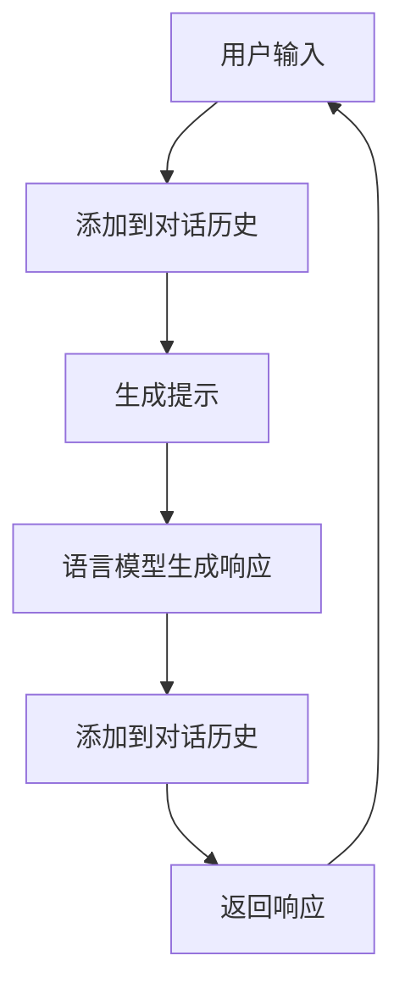

# 【LangChain编程：从入门到实践】ConversationBufferMemory

## 1. 背景介绍
### 1.1 LangChain简介
LangChain是一个用于开发由语言模型驱动的应用程序的开源框架。它提供了一套工具和组件,使开发人员能够轻松地将语言模型集成到他们的应用程序中,实现对话式AI、问答系统、文本摘要等功能。

### 1.2 ConversationBufferMemory的作用
在对话式AI系统中,记忆是一个关键组件。它允许系统在多轮对话中保持上下文,从而提供更加连贯和自然的交互体验。ConversationBufferMemory是LangChain中的一种记忆组件,用于存储和管理对话历史。

## 2. 核心概念与联系
### 2.1 对话历史(Conversation History) 
对话历史是指AI系统与用户之间所有过往的对话记录。它包含了用户的输入和系统的响应,是上下文信息的重要来源。

### 2.2 记忆(Memory)
记忆是AI系统存储和管理对话历史的机制。它负责将新的对话内容添加到历史中,并在需要时提供相关的上下文信息。

### 2.3 提示(Prompt)
提示是AI系统在生成响应时使用的输入。它通常包含当前用户输入和相关的对话历史,以提供足够的上下文for语言模型生成合适的响应。

### 2.4 语言模型(Language Model)
语言模型是一种基于深度学习的模型,用于理解和生成自然语言。在LangChain中,语言模型与记忆组件协同工作,根据当前输入和对话历史生成响应。

## 3. 核心算法原理与具体操作步骤
### 3.1 初始化ConversationBufferMemory
```python
from langchain.memory import ConversationBufferMemory

memory = ConversationBufferMemory()
```

### 3.2 存储对话
```python
memory.save_context({"input": "Hi, how are you?"}, {"output": "I'm doing well, thanks for asking!"})
memory.save_context({"input": "What did I just ask you?"}, {"output": "You asked me how I was doing."})
```

### 3.3 获取对话历史
```python
history = memory.load_memory_variables({})
print(history)
```

输出:
```
{
    'history': "Human: Hi, how are you?\nAssistant: I'm doing well, thanks for asking!\nHuman: What did I just ask you?\nAssistant: You asked me how I was doing."
}
```

### 3.4 生成提示
```python
prompt = memory.load_memory_variables({})["history"] + "\nHuman: What did I ask before that?\nAssistant:"
```

提示内容:
```
Human: Hi, how are you?
Assistant: I'm doing well, thanks for asking!
Human: What did I just ask you?
Assistant: You asked me how I was doing.
Human: What did I ask before that?
Assistant:
```

## 4. 数学模型和公式详细讲解举例说明
ConversationBufferMemory的核心是将对话历史存储为字符串,并在需要时将其插入到提示中。设对话历史为$H$,当前用户输入为$I$,系统响应为$R$,则更新后的对话历史$H'$为:

$$H' = H + "\nHuman: " + I + "\nAssistant: " + R$$

生成提示$P$时,将对话历史$H$与当前用户输入$I$拼接:

$$P = H + "\nHuman: " + I + "\nAssistant:"$$

语言模型根据提示$P$生成响应$R$。

## 5. 项目实践：代码实例和详细解释说明
下面是一个使用ConversationBufferMemory和OpenAI GPT-3模型进行对话的完整示例:

```python
from langchain.llms import OpenAI
from langchain.chains import ConversationChain
from langchain.memory import ConversationBufferMemory

# 初始化语言模型和记忆
llm = OpenAI(temperature=0.9) 
memory = ConversationBufferMemory()

# 创建对话链
conversation = ConversationChain(
    llm=llm, 
    memory = memory,
    verbose=True
)

# 开始对话
while True:
    user_input = input("Human: ")
    if user_input.lower() in ["bye", "quit"]:
        print("Assistant: Goodbye!")
        break
    
    response = conversation.predict(input=user_input)
    print(f"Assistant: {response}")
```

该示例首先初始化了OpenAI语言模型和ConversationBufferMemory。然后,创建一个ConversationChain,将语言模型和记忆组合在一起。

在对话循环中,程序从用户读取输入,并将其传递给ConversationChain的predict方法。该方法会自动将用户输入添加到对话历史中,生成提示,并使用语言模型生成响应。生成的响应会自动添加到对话历史中for下一轮对话使用。

## 6. 实际应用场景
ConversationBufferMemory在以下场景中非常有用:

- 客户服务聊天机器人:记录用户询问的问题和机器人的回答,提供上下文相关的响应。
- 个人助理:记住用户之前的请求和偏好,提供个性化的服务。  
- 教育辅导:根据学生的提问和回答历史,提供针对性的解释和反馈。
- 心理健康辅导:记录患者的倾诉内容,提供连贯的交流和支持。

## 7. 工具和资源推荐
- [LangChain官方文档](https://langchain.readthedocs.io/):提供了详细的API参考和使用指南。
- [LangChain Github仓库](https://github.com/hwchase17/langchain):包含源代码、示例和贡献指南。
- [OpenAI API](https://beta.openai.com/docs/):用于访问GPT-3等强大的语言模型。
- [Hugging Face Transformers](https://huggingface.co/transformers/):提供了大量预训练的语言模型。

## 8. 总结：未来发展趋势与挑战
ConversationBufferMemory是构建对话式AI系统的重要组件之一。未来,我们可以期待更多先进的记忆机制出现,如:

- 基于知识图谱的记忆:将对话历史组织为结构化的知识图谱,支持更复杂的推理和查询。  
- 层次化记忆:根据对话主题和时间跨度,将记忆分为不同的层次,提高检索效率和可扩展性。
- 个性化记忆:根据用户的身份和偏好,为每个用户维护独立的记忆,提供更加个性化的交互体验。

然而,实现这些先进的记忆机制也面临着挑战:

- 知识表示:如何将非结构化的对话历史转化为结构化的知识表示,是一个复杂的研究问题。
- 隐私保护:记录和存储用户的对话历史可能涉及隐私问题,需要采取适当的技术和政策来保护用户隐私。
- 可解释性:记忆机制的决策过程应该是可解释的,以建立用户对系统的信任。

## 9. 附录：常见问题与解答
### 9.1 ConversationBufferMemory可以存储多少轮对话?
ConversationBufferMemory可以存储任意轮对话。但是,为了提高效率和可读性,通常会对对话历史的长度进行限制,例如只保留最近的N轮对话。

### 9.2 ConversationBufferMemory支持多个用户吗?
默认情况下,ConversationBufferMemory不区分不同用户的对话。如果需要支持多个用户,可以为每个用户创建一个独立的ConversationBufferMemory实例。

### 9.3 ConversationBufferMemory可以与其他语言模型一起使用吗?
是的,ConversationBufferMemory与具体的语言模型无关。您可以将其与OpenAI GPT-3、Anthropic Claude、Hugging Face Transformers等任何语言模型一起使用。

### 9.4 ConversationBufferMemory的局限性是什么?
ConversationBufferMemory的主要局限性包括:
- 无法区分不同用户的对话历史。
- 对话历史以字符串形式存储,缺乏结构化的表示。
- 对话历史的长度受限于内存容量,长期记忆可能会丢失。

作者：禅与计算机程序设计艺术 / Zen and the Art of Computer Programming

## ConversationBufferMemory工作流程图
