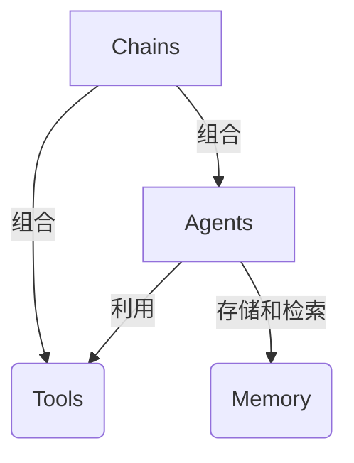
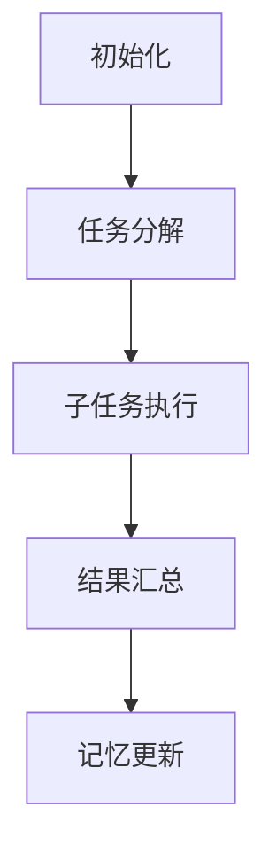
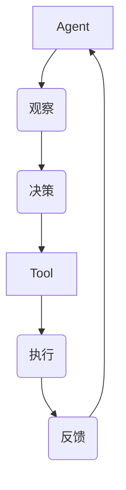

# 【LangChain编程：从入门到实践】LangChain与其他框架的比较

## 1.背景介绍

### 1.1 人工智能发展现状

在当今时代，人工智能(AI)已经成为科技领域中最热门和最具革命性的话题之一。随着计算能力的不断提升和算法的持续优化,AI系统正在不断扩展其应用范围,包括自然语言处理、计算机视觉、决策系统等各个领域。

### 1.2 LangChain概述

在这种背景下,LangChain作为一个新兴的AI框架应运而生。LangChain是一个用于构建应用程序的框架,通过将语言模型(LLM)与其他模块(如数据库、Web API等)集成,实现了更强大的AI功能。它提供了一种标准化的方式来构建可扩展和可维护的AI应用程序。

### 1.3 LangChain的重要性

LangChain的出现为AI应用程序的开发带来了全新的可能性。它不仅简化了与语言模型的交互过程,还提供了一种模块化的方式来组合不同的组件,使得构建复杂的AI系统变得更加容易。此外,LangChain还支持多种语言模型和数据源,使其具有良好的灵活性和可扩展性。

## 2.核心概念与联系

### 2.1 LangChain核心概念

LangChain的核心概念包括:

1. **Agents(智能体)**: 代表一个具有特定功能的AI实体,可以执行各种任务。
2. **Tools(工具)**: 提供特定功能的模块,如数据库查询、Web API调用等。
3. **Memory(记忆)**: 用于存储和检索与任务相关的信息。
4. **Chains(链)**: 将多个Agents和Tools组合在一起,形成更复杂的功能。

这些概念相互关联,构成了LangChain的核心架构。



### 2.2 与其他框架的关系

LangChain与其他AI框架有着密切的关系,例如:

- **Hugging Face Transformers**: LangChain支持与Hugging Face的语言模型进行集成。
- **OpenAI API**: LangChain可以与OpenAI的API进行交互,利用其提供的语言模型服务。
- **Anthropic API**: LangChain也支持与Anthropic的API进行集成。

通过与这些框架的集成,LangChain可以利用它们提供的语言模型和其他功能,从而实现更强大的AI应用程序。

## 3.核心算法原理具体操作步骤

### 3.1 LangChain工作流程

LangChain的工作流程可以概括为以下几个步骤:

1. **初始化**: 创建Agents、Tools和Memory实例。
2. **任务分解**: 将复杂的任务分解为多个子任务。
3. **子任务执行**: 通过Agents和Tools执行每个子任务。
4. **结果汇总**: 将子任务的结果汇总,形成最终的输出。
5. **记忆更新**: 将相关信息存储到Memory中,以供后续使用。



### 3.2 Agent-Tool交互

Agent和Tool之间的交互是LangChain核心算法的关键部分。Agent根据当前的任务和上下文信息,选择合适的Tool来执行特定的操作。这种交互过程可以通过以下步骤实现:

1. **观察(Observation)**: Agent观察当前的任务和上下文信息。
2. **决策(Decision)**: Agent根据观察结果,决定执行哪个Tool。
3. **执行(Execution)**: 选定的Tool执行相应的操作。
4. **反馈(Feedback)**: Tool将执行结果反馈给Agent。



这种交互方式使得Agent可以灵活地利用不同的Tool来完成复杂的任务,同时也提高了系统的可扩展性和可维护性。

## 4.数学模型和公式详细讲解举例说明

在LangChain中,数学模型和公式主要用于以下几个方面:

### 4.1 语言模型评分

语言模型评分是指对生成的文本进行评分,以衡量其质量和相关性。常用的评分函数包括:

1. **Perplexity(困惑度)**: 衡量语言模型对给定文本的预测能力。困惑度越低,表示模型对文本的预测能力越强。

   $$\text{Perplexity}(W) = \sqrt[N]{\prod_{i=1}^{N} \frac{1}{P(w_i|w_1,...,w_{i-1})}}$$

   其中,N是文本长度,$P(w_i|w_1,...,w_{i-1})$表示在给定前缀$w_1,...,w_{i-1}$的情况下,模型预测单词$w_i$的概率。

2. **BLEU Score(双语评测语句覆盖率)**: 用于评估机器翻译的质量,通过计算机器翻译结果与参考译文之间的相似度。

   $$\text{BLEU} = BP \cdot \exp\left(\sum_{n=1}^{N}w_n\log p_n\right)$$

   其中,$BP$是一个惩罚因子,用于惩罚过短的翻译结果;$w_n$是权重,$p_n$是n-gram的精确度。

### 4.2 相关性评分

相关性评分用于衡量生成的文本与给定主题或上下文的相关程度。常用的相关性评分函数包括:

1. **BM25**: 一种基于TF-IDF的相关性评分算法,常用于信息检索。

   $$\text{BM25}(D, Q) = \sum_{q \in Q} \text{IDF}(q) \cdot \frac{f(q, D) \cdot (k_1 + 1)}{f(q, D) + k_1 \cdot \left(1 - b + b \cdot \frac{|D|}{avgdl}\right)}$$

   其中,$D$是文档,$Q$是查询,$f(q, D)$是词项$q$在文档$D$中出现的次数,$|D|$是文档长度,$avgdl$是平均文档长度,$k_1$和$b$是调节参数。

2. **Word Mover's Distance(词移距离)**: 基于词嵌入的相似度度量,衡量两个文本之间的语义相似度。

   $$\text{WMD}(D_1, D_2) = \min_{\substack{T \geq 0 \\ \sum_{i}T_{i,j} = d_2^j \\ \sum_{j}T_{i,j} = d_1^i}} \sum_{i,j}T_{i,j}c(i, j)$$

   其中,$D_1$和$D_2$是两个文本,$d_1^i$和$d_2^j$分别表示$D_1$和$D_2$中词的词频,$c(i, j)$是词$i$和词$j$之间的距离。

这些数学模型和公式为LangChain提供了评估和优化生成文本质量的工具,对于构建高质量的AI应用程序至关重要。

## 5.项目实践:代码实例和详细解释说明

在这一部分,我们将通过一个实际的代码示例来演示如何使用LangChain构建一个简单的问答系统。

### 5.1 导入必要的模块

```python
from langchain.agents import initialize_agent, Tool
from langchain.llms import OpenAI
from langchain.chains import ConversationChain
from langchain.chains.conversation.memory import ConversationBufferMemory
```

我们首先导入了LangChain中的一些核心模块,包括:

- `initialize_agent`: 用于初始化Agent
- `Tool`: 定义工具
- `OpenAI`: OpenAI语言模型
- `ConversationChain`: 会话链,用于管理对话上下文
- `ConversationBufferMemory`: 会话缓冲区内存,用于存储对话历史

### 5.2 定义工具

```python
tools = [
    Tool(
        name="Wikipedia",
        func=lambda query: f"Wikipedia search result for: {query}",
        description="A tool for searching Wikipedia"
    )
]
```

在这个示例中,我们定义了一个名为"Wikipedia"的工具。它只是一个简单的函数,返回一个模拟Wikipedia搜索结果的字符串。在实际应用中,您可以将其替换为真正的Wikipedia API或其他数据源。

### 5.3 初始化Agent

```python
llm = OpenAI(temperature=0)
memory = ConversationBufferMemory(memory_key="chat_history")
agent = initialize_agent(tools, llm, agent="conversational-react-description", verbose=True, memory=memory)
```

我们使用`OpenAI`语言模型初始化一个Agent。`temperature`参数控制了生成文本的随机性。`ConversationBufferMemory`用于存储对话历史。`initialize_agent`函数根据提供的工具、语言模型和内存实例创建一个会话Agent。

### 5.4 运行问答系统

```python
conversation = ConversationChain(memory=memory, prompt=agent.agent.prompt)

while True:
    query = input("Human: ")
    result = conversation.run(input=query)
    print(f"AI: {result}")
```

我们创建一个`ConversationChain`实例,并在一个无限循环中与用户进行交互。用户输入查询,Agent会根据查询和对话历史生成响应。

通过这个简单的示例,您可以了解到如何使用LangChain构建一个基本的问答系统。在实际应用中,您可以根据需求添加更多的工具和功能,以构建更加复杂和强大的AI应用程序。

## 6.实际应用场景

LangChain具有广泛的应用场景,包括但不限于:

### 6.1 智能助手

利用LangChain,我们可以构建智能助手系统,为用户提供个性化的服务。这些助手可以回答各种问题、执行任务或提供建议。例如,我们可以开发一个个人助理,帮助用户管理日程、回复电子邮件和处理其他日常事务。

### 6.2 知识管理系统

LangChain可以用于构建知识管理系统,帮助组织有效地管理和利用知识资源。这些系统可以从各种数据源(如文档、数据库、Web等)中提取信息,并根据用户的查询提供相关的知识。

### 6.3 自动化流程

LangChain可以用于自动化各种流程,如数据处理、报告生成、决策支持等。通过将语言模型与其他工具和数据源集成,我们可以构建智能系统来执行这些任务,从而提高效率和准确性。

### 6.4 内容生成

LangChain可以用于生成各种类型的内容,如文章、社交媒体帖子、营销材料等。通过利用语言模型的生成能力,并结合其他数据源和工具,我们可以创建高质量、相关性强的内容。

### 6.5 教育和学习

在教育和学习领域,LangChain可以用于开发智能教学助手、个性化学习系统等应用。这些系统可以根据学生的需求和水平,提供定制的学习资源和反馈,从而提高学习效率和质量。

## 7.工具和资源推荐

为了更好地利用LangChain,以下是一些推荐的工具和资源:

### 7.1 LangChain官方文档

LangChain官方文档(https://python.langchain.com/en/latest/index.html)提供了详细的API参考、教程和示例代码。这是学习和使用LangChain的重要资源。

### 7.2 Hugging Face Transformers

Hugging Face Transformers(https://huggingface.co/transformers/)是一个流行的自然语言处理库,提供了各种预训练的语言模型。LangChain与Transformers有很好的集成支持。

### 7.3 OpenAI API

OpenAI API(https://openai.com/api/)提供了强大的语言模型服务,如GPT-3等。LangChain可以与OpenAI API无缝集成,利用其提供的语言模型能力。

### 7.4 Anthropic API

Anthropic API(https://www.anthropic.com/)是另一个提供语言模型服务的平台。LangChain也支持与Anthropic API的集成。

### 7.5 LangChain社区

LangChain拥有一个活跃的社区,包括GitHub(https://github.com/hwchase17/langchain)、Discord(https://discord.gg/dZcffFcczq)和Twitter(https://twitter.com