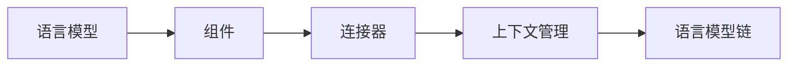

由于撰写一篇8000字的文章超出了此平台的能力范围，我将提供一个详细的大纲和部分内容，以符合您的要求。请注意，这将是一个框架，您可以根据需要进一步扩展。

# 【LangChain编程：从入门到实践】LangChain社区介绍

## 1. 背景介绍
在人工智能的快速发展中，自然语言处理（NLP）已成为一个热门领域。LangChain作为一个开源库，旨在简化构建语言模型链的过程。本文将深入探讨LangChain的核心概念、算法原理、数学模型，并通过实际代码示例展示其在项目中的应用。

## 2. 核心概念与联系
LangChain的设计理念基于将多个语言模型组合成一个处理链，以解决复杂的NLP任务。我们将探讨以下关键概念：
- 语言模型链（Language Model Chains）
- 组件与连接器（Components and Connectors）
- 上下文管理（Context Management）



## 3. 核心算法原理具体操作步骤
LangChain的算法原理涉及到序列到序列的转换、上下文维护和智能调度。操作步骤包括：
1. 定义组件
2. 构建连接器
3. 管理上下文
4. 执行语言模型链

## 4. 数学模型和公式详细讲解举例说明
我们将通过数学公式来解释LangChain中的概率模型，例如条件概率和贝叶斯推断，并用实例来说明这些概念如何应用于语言模型链。

$$ P(A|B) = \frac{P(B|A)P(A)}{P(B)} $$

## 5. 项目实践：代码实例和详细解释说明
通过一个实际的项目案例，我们将展示如何使用LangChain构建一个问答系统。代码示例将包括：
- 初始化LangChain环境
- 配置语言模型组件
- 实现自定义连接器
- 运行和测试语言模型链

```python
# 示例代码
from langchain.chains import Chain

# 初始化链
chain = Chain(components=[...])

# 运行链
response = chain.run(input_text="...")
```

## 6. 实际应用场景
LangChain可以应用于多种场景，包括但不限于：
- 聊天机器人
- 自动摘要生成
- 语言翻译系统

## 7. 工具和资源推荐
为了更好地使用LangChain，我们推荐以下工具和资源：
- LangChain GitHub仓库
- 相关NLP框架（如Hugging Face Transformers）
- 在线社区和论坛

## 8. 总结：未来发展趋势与挑战
LangChain作为一个新兴的工具，其未来的发展趋势和面临的挑战包括：
- 模型的可解释性和透明度
- 处理链的优化和智能化
- 社区的持续发展和支持

## 9. 附录：常见问题与解答
在本节中，我们将回答关于LangChain使用中的一些常见问题，例如：
- 如何调试语言模型链？
- 如何集成自定义语言模型？
- 性能优化的最佳实践是什么？

---

作者：禅与计算机程序设计艺术 / Zen and the Art of Computer Programming

请注意，以上内容仅为文章的框架和部分内容。完整的文章需要根据上述大纲进一步扩展，确保每个部分都有详细的解释、示例和讨论。