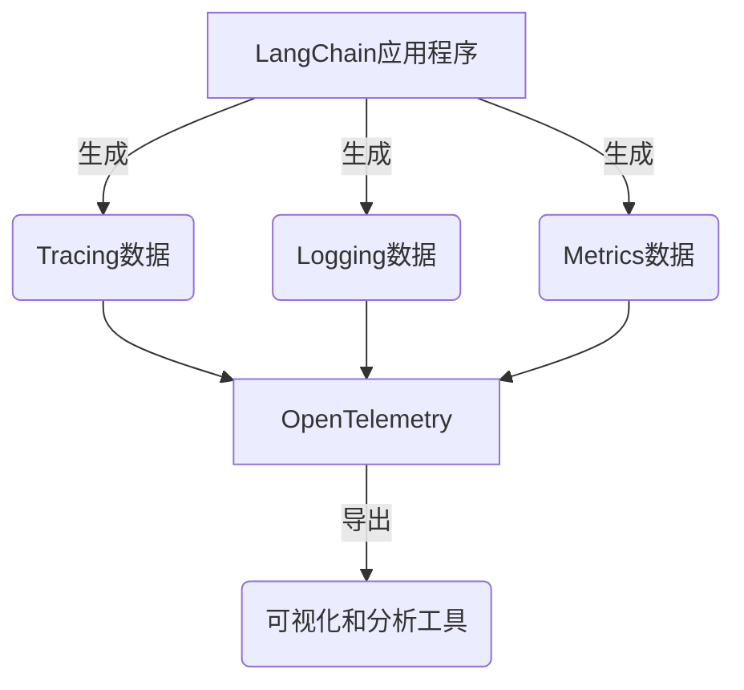

# 【LangChain编程：从入门到实践】实现可观测性插件

## 1.背景介绍

在当今快节奏的软件开发环境中，可观测性(Observability)已经成为一个关键概念。可观测性指的是系统在运行时能够提供足够的内部状态数据,以便开发人员了解系统的行为、诊断问题并优化性能。LangChain是一个强大的Python库,旨在构建可扩展和可维护的应用程序,将大型语言模型(LLM)与其他组件无缝集成。为了提高LangChain应用程序的可靠性和可维护性,实现可观测性插件是非常重要的。

### 1.1 什么是可观测性?

可观测性是一个涵盖多个方面的概念,包括监控(Monitoring)、日志记录(Logging)、分布式跟踪(Distributed Tracing)和指标(Metrics)。它使开发人员能够深入了解系统的内部运行状态,从而更好地管理和优化应用程序。

### 1.2 为什么需要可观测性插件?

在构建LangChain应用程序时,可观测性插件可以提供以下好处:

1. **调试和故障排除**: 通过记录LangChain组件的执行过程,可以更容易地识别和修复错误。
2. **性能监控**: 收集关键指标,如响应时间和资源利用率,有助于发现瓶颈并进行优化。
3. **成本控制**: 通过监控LLM的使用情况,可以更好地管理成本。
4. **可维护性**: 可观测性插件提供了一种标准化的方式来收集和分析系统数据,从而提高了代码的可维护性。

## 2.核心概念与联系

实现LangChain的可观测性插件涉及以下几个核心概念:

### 2.1 Tracing

Tracing是分布式系统中的一种技术,用于跟踪请求在不同组件之间的流动。在LangChain中,Tracing可以帮助我们了解链的执行过程,包括调用了哪些代理、工具和LLM,以及它们的输入和输出。

### 2.2 Logging

Logging是记录应用程序事件的过程,通常包括时间戳、严重级别和相关上下文信息。在LangChain中,Logging可以用于记录链的执行细节,如错误消息、警告和调试信息。

### 2.3 Metrics

Metrics是一组可测量的数据点,用于描述系统的性能和健康状况。在LangChain中,Metrics可以包括LLM调用次数、响应时间和成功/失败率等。

### 2.4 OpenTelemetry

OpenTelemetry是一个开源的可观测性框架,提供了一套标准的API和工具,用于收集和导出遥测数据(Tracing、Logging和Metrics)。LangChain的可观测性插件基于OpenTelemetry实现。



## 3.核心算法原理具体操作步骤

实现LangChain的可观测性插件主要包括以下步骤:

### 3.1 初始化OpenTelemetry

首先,需要初始化OpenTelemetry的Tracer、Logger和Meter组件。这些组件将负责收集和导出遥测数据。

```python
from opentelemetry import trace
from opentelemetry.sdk.trace import TracerProvider
from opentelemetry.sdk.trace.export import BatchSpanProcessor
from opentelemetry.exporter.jaeger.thrift import JaegerExporter

# 初始化Tracer
trace.set_tracer_provider(TracerProvider())
jaeger_exporter = JaegerExporter(
    service_name="langchain-app",
    agent_host_name="localhost",
    agent_port=6831,
)
trace.get_tracer_provider().add_span_processor(BatchSpanProcessor(jaeger_exporter))

# 初始化Logger
import logging
from opentelemetry.sdk.trace import TracerProvider
from opentelemetry.sdk.trace.export import BatchSpanProcessor

trace.set_tracer_provider(TracerProvider())
trace.get_tracer_provider().add_span_processor(BatchSpanProcessor(jaeger_exporter))

logger = logging.getLogger(__name__)
logger.setLevel(logging.INFO)

# 初始化Meter
from opentelemetry import metrics
meter = metrics.get_meter(__name__)
```

### 3.2 包装LangChain组件

接下来,需要使用OpenTelemetry的上下文管理器来包装LangChain的各个组件,从而自动收集遥测数据。

```python
from langchain.llms import OpenAI
from opentelemetry import trace

tracer = trace.get_tracer(__name__)

with tracer.start_as_current_span("llm_call"):
    llm = OpenAI(temperature=0)
    output = llm("What is the capital of France?")
    print(output)
```

在上面的示例中,我们使用`start_as_current_span`方法创建了一个名为"llm_call"的Span,用于跟踪LLM调用。在Span的上下文中,我们调用了OpenAI LLM并打印了输出结果。

类似地,我们可以为链、代理、工具等其他LangChain组件创建Span,以跟踪它们的执行过程。

### 3.3 记录日志和指标

除了跟踪,我们还可以使用OpenTelemetry记录日志和指标。

```python
import time
from opentelemetry import metrics

meter = metrics.get_meter(__name__)
requests_counter = meter.create_counter(
    name="requests",
    description="Number of requests",
    unit="1",
)

def handle_request():
    requests_counter.add(1)
    time.sleep(0.1)  # 模拟处理请求的时间
    return "Request handled"

while True:
    result = handle_request()
    logger.info(result)
```

在上面的示例中,我们创建了一个名为"requests"的计数器指标,用于统计请求数量。在`handle_request`函数中,我们增加计数器的值,并记录一条日志消息。

### 3.4 导出和可视化遥测数据

最后一步是将收集到的遥测数据导出到可视化和分析工具中。OpenTelemetry支持多种导出格式,如Jaeger、Zipkin和Prometheus。

```python
from opentelemetry.sdk.trace import TracerProvider
from opentelemetry.sdk.trace.export import BatchSpanProcessor
from opentelemetry.exporter.jaeger.thrift import JaegerExporter

# 初始化Jaeger导出器
jaeger_exporter = JaegerExporter(
    service_name="langchain-app",
    agent_host_name="localhost",
    agent_port=6831,
)

# 将Jaeger导出器添加到Tracer中
trace.get_tracer_provider().add_span_processor(BatchSpanProcessor(jaeger_exporter))
```

在上面的示例中,我们初始化了一个Jaeger导出器,并将其添加到Tracer中。这样,所有的Tracing数据都会被导出到Jaeger服务器,可以在Jaeger UI中进行可视化和分析。

对于Logging和Metrics数据,我们也可以选择合适的导出目标,如Elasticsearch、Prometheus或InfluxDB。

## 4.数学模型和公式详细讲解举例说明

在实现LangChain的可观测性插件时,我们可能需要使用一些数学模型和公式来量化和分析系统的性能。以下是一些常见的数学模型和公式:

### 4.1 响应时间模型

响应时间是衡量系统性能的一个关键指标。我们可以使用以下公式来计算平均响应时间:

$$
\text{Average Response Time} = \frac{\sum_{i=1}^{n} t_i}{n}
$$

其中$t_i$表示第$i$个请求的响应时间,$n$表示总请求数。

除了平均响应时间,我们还可以计算响应时间的百分位数,以了解延迟的分布情况。例如,95%的响应时间小于$T_{95}$,其中$T_{95}$可以通过以下公式计算:

$$
T_{95} = \inf\{t : P(X \leq t) \geq 0.95\}
$$

其中$X$是响应时间的随机变量,$P(X \leq t)$表示响应时间小于等于$t$的概率。

### 4.2 利用率模型

利用率是衡量系统资源使用情况的指标。对于单个资源,如CPU或内存,我们可以使用以下公式计算利用率:

$$
\text{Utilization} = \frac{\text{Used}}{\text{Total}}
$$

其中$\text{Used}$表示已使用的资源量,$\text{Total}$表示总资源量。

对于多个资源,我们可以计算综合利用率:

$$
\text{Overall Utilization} = \sum_{i=1}^{n} w_i \cdot \text{Utilization}_i
$$

其中$\text{Utilization}_i$表示第$i$个资源的利用率,$w_i$表示该资源的权重。

### 4.3 吞吐量模型

吞吐量是衡量系统处理能力的指标。我们可以使用以下公式计算吞吐量:

$$
\text{Throughput} = \frac{n}{T}
$$

其中$n$表示在时间段$T$内处理的请求数。

在实际应用中,我们通常关注系统在不同负载下的吞吐量变化情况。我们可以使用小顶堆或其他数据结构来维护一个滑动窗口,计算给定时间段内的吞吐量。

## 5.项目实践：代码实例和详细解释说明

在本节中,我们将提供一个完整的示例项目,演示如何在LangChain应用程序中集成可观测性插件。

### 5.1 项目结构

```
langchain-observability/
├── app.py
├── agents/
│   └── __init__.py
├── tools/
│   └── __init__.py
├── utils/
│   ├── __init__.py
│   └── observability.py
└── requirements.txt
```

- `app.py`: 应用程序的入口点
- `agents/`: 包含自定义代理的目录
- `tools/`: 包含自定义工具的目录
- `utils/observability.py`: 可观测性插件的实现
- `requirements.txt`: 项目依赖项

### 5.2 可观测性插件实现

在`utils/observability.py`文件中,我们实现了可观测性插件的核心功能。

```python
# utils/observability.py

from opentelemetry import trace
from opentelemetry.sdk.trace import TracerProvider
from opentelemetry.sdk.trace.export import BatchSpanProcessor
from opentelemetry.exporter.jaeger.thrift import JaegerExporter
import logging

# 初始化Tracer
trace.set_tracer_provider(TracerProvider())
jaeger_exporter = JaegerExporter(
    service_name="langchain-app",
    agent_host_name="localhost",
    agent_port=6831,
)
trace.get_tracer_provider().add_span_processor(BatchSpanProcessor(jaeger_exporter))

# 初始化Logger
logger = logging.getLogger(__name__)
logger.setLevel(logging.INFO)

def trace_llm_call(llm, query):
    tracer = trace.get_tracer(__name__)
    with tracer.start_as_current_span("llm_call"):
        output = llm(query)
        logger.info(f"LLM output: {output}")
    return output

def trace_tool_call(tool, query):
    tracer = trace.get_tracer(__name__)
    with tracer.start_as_current_span(f"tool_call_{tool.name}"):
        output = tool.run(query)
        logger.info(f"Tool output ({tool.name}): {output}")
    return output

def trace_agent_call(agent, inputs):
    tracer = trace.get_tracer(__name__)
    with tracer.start_as_current_span("agent_call"):
        output = agent.run(inputs)
        logger.info(f"Agent output: {output}")
    return output
```

在这个文件中,我们定义了三个函数,用于跟踪LLM、工具和代理的调用。每个函数都使用OpenTelemetry的`start_as_current_span`方法创建一个Span,并在Span的上下文中执行相应的操作。同时,我们还记录了相关的日志信息。

### 5.3 应用程序入口点

在`app.py`文件中,我们导入并使用了可观测性插件。

```python
# app.py

from langchain.agents import initialize_agent, AgentType
from langchain.llms import OpenAI
from langchain.tools import WikipediaQueryRun

from agents import CustomAgent
from tools import CustomTool
from utils.observability import trace_llm_call, trace_tool_call, trace_agent_call

# 初始化LLM
llm = OpenAI(temperature=0)

# 初始化工具
tools = [
    WikipediaQueryRun(),
    CustomTool(),
]

# 初始化代理
agent = initialize_agent(
    tools,
    llm,
    agent=AgentType.ZERO_SHOT_REACT_DESCRIPTION,
    verbose=True,
    agent_cls=CustomAgent,
)

# 示例查询
query = "What is the capital