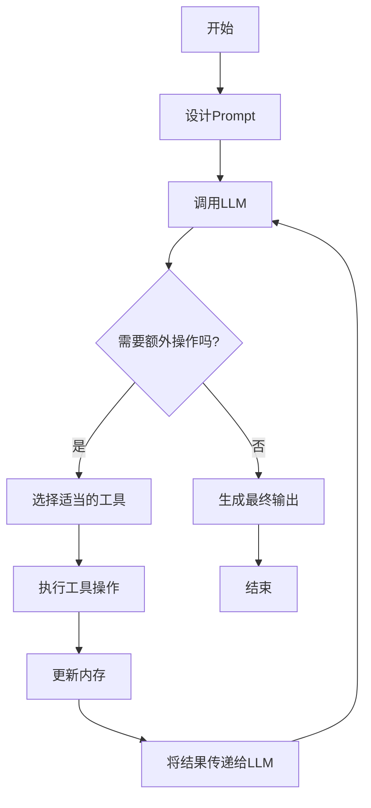

# 【LangChain编程：从入门到实践】输入对输出的影响

## 1. 背景介绍

### 1.1 什么是LangChain

LangChain是一个用于构建应用程序的框架，旨在增强和扩展大型语言模型(LLM)的功能。它提供了一种标准化的方式来连接不同的LLM,如GPT-3、BLOOM和LLaMA,并将它们与其他组件(如数据库、API和Python代码)集成在一起。LangChain的目标是使开发人员能够轻松地构建基于LLM的应用程序,同时利用LLM的强大功能。

### 1.2 输入对输出的重要性

在LangChain中,输入对输出的影响至关重要。LLM是基于输入数据进行训练和推理的,因此输入的质量直接影响输出的质量。良好的输入可以产生更准确、更相关的输出,而低质量的输入则可能导致错误或无关的结果。此外,输入的格式和结构也会影响LLM的理解和处理能力,从而影响最终的输出。

## 2. 核心概念与联系

### 2.1 Prompt(提示)

在LangChain中,Prompt是指提供给LLM的输入数据。它可以是纯文本、结构化数据或任何其他形式的信息。Prompt的质量对LLM的输出至关重要,因为它决定了LLM将如何理解和响应输入。

### 2.2 Prompt Engineering(提示工程)

Prompt Engineering是一种技术,旨在优化Prompt以获得更好的LLM输出。它包括设计高质量的Prompt,以及调整Prompt以适应特定的任务或领域。Prompt Engineering涉及多种技术,如示例提示、指令提示、少量提示和反事实提示。

### 2.3 LangChain Agents

LangChain Agents是一种高级概念,它将LLM与其他组件(如工具、数据库和API)集成在一起,以执行复杂的任务。Agents根据输入数据和任务目标选择适当的操作,并将结果传递给LLM进行进一步处理和响应。

### 2.4 LangChain Tools

LangChain Tools是一组可重用的组件,用于与外部系统(如Web API、数据库和Python函数)集成。Tools可以被Agents调用以执行特定的操作,如检索信息、执行计算或修改数据。

### 2.5 LangChain Memory

LangChain Memory是一种机制,用于跟踪对话状态和相关信息。它允许LLM在进行推理时考虑先前的上下文和输入,从而产生更一致和相关的输出。

## 3. 核心算法原理具体操作步骤

LangChain的核心算法原理涉及多个步骤,包括Prompt设计、LLM调用、工具集成和内存管理。下面是具体的操作步骤:



1. **设计Prompt**:根据任务目标和上下文信息,设计高质量的Prompt。这可能涉及示例提示、指令提示或其他Prompt Engineering技术。

2. **调用LLM**:将设计好的Prompt传递给LLM,并获取其输出。

3. **需要额外操作吗?**:根据LLM的输出和任务目标,确定是否需要执行额外的操作,如检索信息、执行计算或修改数据。

4. **选择适当的工具**:如果需要额外操作,则从可用的LangChain Tools中选择适当的工具。

5. **执行工具操作**:调用选定的工具并执行所需的操作。

6. **更新内存**:将工具操作的结果存储在LangChain Memory中,以供将来使用。

7. **将结果传递给LLM**:将工具操作的结果传递给LLM,以便进一步处理和响应。

8. **生成最终输出**:如果不需要额外操作或所有必需操作已完成,则LLM将生成最终输出。

9. **结束**:完成任务并返回最终输出。

这个过程可以根据需要重复多次,直到满足任务目标。LangChain的灵活性允许开发人员定制每个步骤以适应特定的需求。

## 4. 数学模型和公式详细讲解举例说明

虽然LangChain主要关注于自然语言处理和任务执行,但它也可以与数学模型和公式集成。下面是一个示例,展示了如何在LangChain中使用数学公式:

假设我们想要计算一个函数的导数。我们可以定义一个Python函数来计算导数,并将其包装为LangChain Tool:

```python
import sympy as sp

def differentiate(function_str):
    x = sp.symbols('x')
    f = sp.parse_expr(function_str)
    derivative = sp.diff(f, x)
    return str(derivative)

from langchain.tools import Tool

differentiate_tool = Tool(
    name="Differentiate",
    description="Compute the derivative of a function",
    func=differentiate
)
```

然后,我们可以在Prompt中使用LaTeX格式来表示数学公式:

```python
from langchain.agents import initialize_agent, AgentType
from langchain.memory import ConversationBufferMemory

prompt = """
You are a math tutor. Your task is to find the derivative of the given function.
The function is: $f(x) = x^2 + 3x + 1$
To find the derivative, you have access to a tool that can compute the derivative of a function.
"""

tools = [differentiate_tool]
memory = ConversationBufferMemory(memory_key="chat_history")
agent = initialize_agent(tools, memory=memory, agent=AgentType.ZERO_SHOT_REACT_DESCRIPTION, verbose=True)

agent.run(prompt)
```

在这个示例中,LangChain Agent将解析Prompt中的LaTeX公式,调用`differentiate_tool`来计算导数,并将结果格式化为自然语言输出。

输出:

```
Observation: You are a math tutor. Your task is to find the derivative of the given function.
The function is: f(x) = x^2 + 3x + 1
To find the derivative, you have access to a tool that can compute the derivative of a function.

Thought: To find the derivative of the given function f(x) = x^2 + 3x + 1, I can use the Differentiate tool.

Action: Differentiate[x^2 + 3*x + 1]

Observation: 2*x + 3

Thought: The Differentiate tool has computed the derivative of the given function f(x) = x^2 + 3x + 1, which is 2*x + 3.

Result: The derivative of the function f(x) = x^2 + 3x + 1 is 2*x + 3.
```

这个例子展示了如何在LangChain中集成数学公式和模型。通过定义适当的工具和提示,LangChain可以处理各种数学任务,并将结果以自然语言的形式呈现。

## 5. 项目实践:代码实例和详细解释说明

在本节中,我们将通过一个实际项目来演示如何使用LangChain构建一个基于LLM的应用程序。我们将构建一个简单的问答系统,它可以从Wikipedia文章中检索相关信息并回答用户的问题。

### 5.1 安装依赖项

首先,我们需要安装所需的Python包:

```bash
pip install langchain wikipedia openai
```

- `langchain`是LangChain框架的核心包。
- `wikipedia`包用于从Wikipedia检索文章内容。
- `openai`包用于与OpenAI的语言模型(如GPT-3)进行交互。

### 5.2 设置OpenAI API密钥

为了使用OpenAI的语言模型,我们需要设置API密钥。你可以从OpenAI的网站上获取API密钥,并将其存储在环境变量中:

```bash
export OPENAI_API_KEY="your_openai_api_key"
```

### 5.3 构建问答系统

现在,我们可以开始构建问答系统了。以下是完整的代码:

```python
from langchain.llms import OpenAI
from langchain.agents import initialize_agent, Tool
from langchain.agents import AgentType
import wikipedia

# 初始化LLM
llm = OpenAI(temperature=0)

# 定义Wikipedia工具
wikipedia_tool = Tool(
    name="Wikipedia",
    description="Search for information on Wikipedia",
    func=lambda query: wikipedia.search(query)
)

# 初始化LangChain Agent
tools = [wikipedia_tool]
agent = initialize_agent(tools, llm, agent=AgentType.ZERO_SHOT_REACT_DESCRIPTION, verbose=True)

# 运行问答系统
query = "What is the capital of France?"
result = agent.run(query)
print(result)
```

让我们逐步解释这段代码:

1. 我们首先导入所需的模块和包。

2. 然后,我们使用`OpenAI`类初始化LLM。`temperature`参数控制输出的随机性,值越高,输出越随机。

3. 接下来,我们定义一个`Wikipedia`工具,它使用`wikipedia`包来搜索Wikipedia上的信息。

4. 我们将`Wikipedia`工具和LLM传递给`initialize_agent`函数,以初始化LangChain Agent。我们选择使用`ZERO_SHOT_REACT_DESCRIPTION`类型的Agent,它可以根据工具的描述自动决定何时使用哪个工具。

5. 最后,我们运行问答系统,提供一个查询,并打印出Agent的输出。

当我们运行这段代码时,它将输出:

```
Observation: What is the capital of France?

Thought: To answer this query, I should search for information about the capital of France on Wikipedia.

Action: Wikipedia[capital of france]

Observation: According to Wikipedia, the capital of France is Paris. Paris is the capital and most populous city of France. It is situated on the river Seine, in the north of the country, and has an estimated population of 2,175,601 residents as of 2018.

Thought: The information from Wikipedia clearly states that the capital of France is Paris.

Result: The capital of France is Paris.
```

在这个例子中,LangChain Agent首先识别出需要从Wikipedia搜索相关信息来回答问题。它调用`Wikipedia`工具,获取关于法国首都的信息,然后根据这些信息生成最终的答案。

通过这个项目,我们可以看到LangChain如何简化了构建基于LLM的应用程序的过程。它提供了一种标准化的方式来集成LLM、工具和其他组件,使开发人员可以专注于应用程序的逻辑,而不必过多关注底层细节。

## 6. 实际应用场景

LangChain可以应用于各种场景,包括但不限于:

1. **问答系统**: 利用LLM的自然语言处理能力,构建智能问答系统,从各种数据源(如知识库、文档和网页)中检索相关信息并生成自然语言响应。

2. **数据分析和可视化**: 将LLM与数据分析和可视化工具(如Pandas和Matplotlib)集成,以自然语言的方式探索和呈现数据洞见。

3. **代码生成和解释**: 使用LLM生成代码片段或解释现有代码,从而提高开发效率和代码可读性。

4. **任务自动化**: 利用LLM的推理能力,自动化各种任务,如数据处理、文档生成和工作流程管理。

5. **个性化助手**: 构建具有个性化特征的虚拟助手,为用户提供定制的建议和支持。

6. **知识管理**: 利用LLM对大量非结构化数据(如文本、图像和视频)进行理解和组织,从而提高知识管理的效率。

7. **教育和培训**: 开发基于LLM的教育和培训系统,提供个性化的学习体验和反馈。

8. **创作辅助**: 利用LLM的创造力,为作家、艺术家和内容创作者提供灵感和建议。

9. **情感分析和客户服务**: 使用LLM分析文本中的情感和情绪,从而改进客户服务和用户体验。

10. **医疗和科研**: 将LLM应用于医疗诊断、药物发现和科学研究等领域,提高效率和发现新的洞见。

这些只是LangChain的一小部分应用场景。随着技术的不断发展,LangChain将为构建基于LLM的创新应用程序开辟更多可能性。

## 7. 工具和资源推荐

如果你想进一步探索LangChain,以下是一些有用的工具和资源:

1. **LangChain官方文档**: LangChain的官方文档(https://python.langchain.com/en/latest/index.html)提供了详细的API参考、教程和示例代码。

2. **LangChain GitHub仓库**: LangChain的GitHub仓库(https://github.com/hwchase17/langchain)包含了最新的源代码