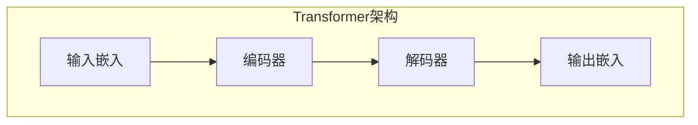
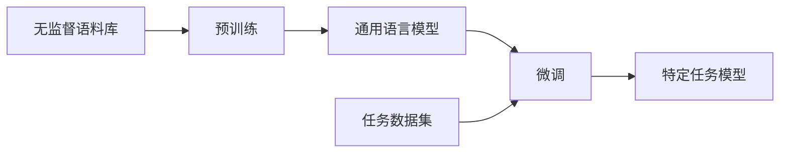
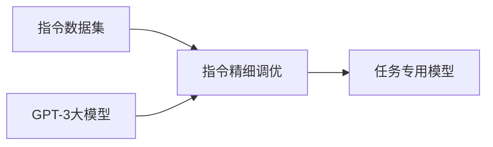

# 【大模型应用开发 动手做AI Agent】OpenAI公司的Assistants是什么

## 1.背景介绍

### 1.1 人工智能的发展历程

人工智能(Artificial Intelligence, AI)是当代科技发展的前沿领域,它旨在使机器能够模仿人类的认知功能,如学习、推理、感知、规划和问题解决等。人工智能的概念可以追溯到20世纪50年代,当时一些先驱者提出了"思考的机器"的设想。

经过数十年的发展,人工智能已经渗透到我们生活的方方面面,比如语音助手、推荐系统、自动驾驶、机器翻译等。这些应用的背后,都有着错综复杂的算法和模型支撑。

### 1.2 大模型的兴起

近年来,随着计算能力的飞速提升和海量数据的积累,大规模的人工智能模型(Large AI Model)开始崭露头角。这些庞大的模型通过对大量数据进行训练,学习到了丰富的知识和技能,展现出了惊人的能力。

OpenAI公司就是大模型领域的佼佼者。该公司于2015年成立,由著名企业家埃隆·马斯克(Elon Musk)和其他科技人士共同创办。OpenAI的使命是确保人工智能的安全发展,造福全人类。

### 1.3 OpenAI的Assistants

2022年11月,OpenAI推出了一款名为"Assistants"的人工智能助理产品,它基于公司自研的大型语言模型GPT-3。Assistants展现出了出色的自然语言理解和生成能力,可以就各种话题与人类进行对话交流、提供信息查询和任务辅助等服务。

Assistants的出现,标志着大模型技术在实际应用层面取得了重大突破。它不仅能完成传统的问答任务,还可以执行更加复杂的认知任务,如创意写作、代码编程、分析决策等,被视为通用人工智能(Artificial General Intelligence, AGI)的有力候选者。

## 2.核心概念与联系

### 2.1 大模型的核心概念

#### 2.1.1 自然语言处理(Natural Language Processing, NLP)

自然语言处理是人工智能的一个重要分支,旨在使计算机能够理解和生成人类语言。NLP技术广泛应用于机器翻译、文本摘要、问答系统、语音识别等领域。

大模型的核心就是基于NLP技术,通过学习海量的自然语言数据(如网页、书籍、新闻等),获取丰富的语言知识和认知能力。

#### 2.1.2 transformer架构

Transformer是一种全新的神经网络架构,它完全基于注意力(Attention)机制来捕捉输入序列中元素之间的依赖关系,而不再依赖于循环神经网络(RNN)和卷积神经网络(CNN)。

Transformer架构在2017年被提出后,迅速成为NLP领域的主流模型。它的出现,使得训练大规模语言模型成为可能,为大模型的兴起奠定了基础。

#### 2.1.3 预训练与微调(Pre-training & Fine-tuning)

传统的NLP模型通常是在特定的任务数据上从头开始训练,这种方式数据效率低下,且难以迁移到其他任务。

大模型采用了"预训练+微调"的范式。首先在大量无监督的文本数据上进行预训练,获取通用的语言知识;然后在特定的任务数据上进行微调,将通用知识转移到目标任务。这种方式大幅提高了数据利用效率和模型的泛化能力。

#### 2.1.4 参数规模

大模型所谓"大",主要体现在其巨大的参数规模上。以GPT-3为例,它拥有1750亿个参数,是之前最大模型的10倍以上。

大量的参数使得模型能够学习到更加丰富和复杂的知识表示,从而展现出更强的认知能力。但同时,大模型也面临着训练数据需求量大、计算资源消耗高等挑战。

### 2.2 OpenAI Assistants的核心技术

#### 2.2.1 GPT-3大模型

Assistants的核心是基于GPT-3(Generative Pre-trained Transformer 3)语言模型。GPT-3是OpenAI于2020年推出的一款大规模预训练模型,它在170亿个参数的基础上,进一步扩展到了1750亿个参数的规模。

GPT-3通过对大量互联网文本数据进行预训练,学习到了丰富的自然语言知识,可以在下游任务上展现出惊人的表现,如文本生成、问答、代码编写等。

#### 2.2.2 指令精细调优(Instruction Tuning)

尽管GPT-3已经学习到了大量的知识,但要将其应用到实际的任务场景中,还需要进一步的调优。OpenAI采用了一种名为"指令精细调优"(Instruction Tuning)的技术。

指令精细调优的核心思想是:通过大量的人工标注数据,指导模型理解并执行各种指令(Instruction),从而将通用的语言模型转化为专门的任务模型。

例如,对于写作任务,我们可以给模型提供大量的"写一篇关于XXX主题的文章"之类的指令和标准答案,使模型学会如何根据指令生成高质量的文本输出。

#### 2.2.3 对话交互和链式推理

Assistants不仅能够回答单一的问题,还能够进行持续的对话交互,并通过逻辑推理和知识综合来解决复杂的任务。

例如,在回答"如何做一份美味的苹果派"这个问题时,Assistants会首先列出所需的原料和工具,然后逐步讲解做派的步骤,并给出一些小贴士和注意事项。如果用户有进一步的疑问,它还能继续对话并作出解释和补充。

这种能力来源于GPT-3强大的语言理解和生成能力,以及指令精细调优赋予它的任务执行能力。同时,Assistants还融合了一些专门的对话管理和推理组件,使其对话更加自然和有针对性。

## 3.核心算法原理具体操作步骤

### 3.1 Transformer模型架构

Transformer是大模型的核心架构,我们先来了解一下它的工作原理。Transformer主要由编码器(Encoder)和解码器(Decoder)两部分组成。

#### 3.1.1 编码器(Encoder)

编码器的作用是对输入序列进行编码,获取其语义表示。编码器由多个相同的层组成,每一层都包含两个子层:

1. **多头注意力机制(Multi-Head Attention)**

   该机制允许模型同时关注输入序列中的不同位置,捕捉元素之间的依赖关系。每个注意力头关注输入的不同子空间,最后将所有头的结果拼接起来,形成最终的注意力表示。

2. **前馈神经网络(Feed-Forward Neural Network)**

   这是一个简单的全连接前馈神经网络,对注意力表示进行进一步的非线性变换,提取更高层次的特征。

在编码器中,每个位置的输出都是该位置的表示,与其他位置的表示相互关注。

#### 3.1.2 解码器(Decoder)

解码器的作用是根据编码器的输出和输入的条件,生成目标序列。解码器的结构与编码器类似,也是由多个相同的层组成,每一层包含三个子层:

1. **屏蔽的多头注意力机制(Masked Multi-Head Attention)**

   这个注意力机制用于捕捉输出序列中元素的依赖关系,但与编码器不同的是,它被"掩蔽"了,即每个位置只能关注其之前的位置,以保证生成的是符合自回归(Auto-Regressive)特性的序列。

2. **编码器-解码器注意力机制(Encoder-Decoder Attention)**

   该机制允许解码器关注编码器的输出,获取输入序列的语义表示,从而将输入序列的信息融入到输出序列的生成中。

3. **前馈神经网络(Feed-Forward Neural Network)**

   与编码器中的前馈网络类似,对注意力表示进行进一步的非线性变换。

通过上述步骤,解码器可以根据输入序列的语义表示,生成与之相关的目标序列。

### 3.2 GPT-3模型训练

GPT-3是一个基于Transformer的大型语言模型,它的训练过程可以分为两个阶段:预训练和微调。

#### 3.2.1 预训练

预训练阶段的目标是在大量无监督文本数据上,训练出一个通用的语言模型,捕获自然语言的统计规律和语义知识。

GPT-3采用的是自回归语言模型(Auto-Regressive Language Model)的训练方式。给定一个文本序列,模型的目标是最大化该序列的条件概率,即预测出现该序列的可能性。具体地,对于一个长度为N的序列$\{x_1, x_2, ..., x_N\}$,模型需要最大化如下条件概率:

$$
P(x_1, x_2, ..., x_N) = \prod_{t=1}^N P(x_t | x_1, x_2, ..., x_{t-1})
$$

其中,每一项$P(x_t | x_1, x_2, ..., x_{t-1})$表示基于前面的词预测第t个词的条件概率。通过最大化该条件概率,模型可以学习到语言的内在规律和知识。

在实际训练中,GPT-3采用了一种被称为"因果语言模型"(Causal Language Model)的变体。对于每个位置t,模型只关注其之前的上下文$x_{<t}$,预测$x_t$的条件概率为:

$$
P(x_t | x_{<t}) = \text{Transformer}(x_{<t})_t
$$

其中,$\text{Transformer}(\cdot)$表示Transformer模型,其输入是上下文序列$x_{<t}$,输出是一个概率分布,对应于第t个位置的词的预测概率。

通过上述自监督方式训练,GPT-3可以在大量无标注文本数据上学习到丰富的语言知识,为后续的微调奠定基础。

#### 3.2.2 微调

虽然经过预训练,GPT-3已经获得了通用的语言理解和生成能力,但要将其应用到特定的任务中,还需要进一步的微调(Fine-tuning)。

微调的过程是:在有标注的任务数据集上,继续训练预训练好的模型参数,使其适应目标任务的特征和要求。以文本生成任务为例,给定一个输入提示(Prompt),我们希望模型生成与之相关的目标文本序列。

设输入提示为$x$,目标序列为$y=\{y_1, y_2, ..., y_M\}$,微调的目标是最大化目标序列$y$的条件概率:

$$
P(y|x) = \prod_{t=1}^M P(y_t | y_{<t}, x)
$$

与预训练不同的是,这里的条件概率除了依赖之前的词$y_{<t}$,还依赖于输入提示$x$。通过最大化该条件概率,模型可以学习到将输入与输出关联起来的知识。

在实践中,微调通常采用监督学习的方式,将输入提示$x$和目标序列$y$一并输入到模型中,以最小化模型预测与真实标签之间的损失函数(如交叉熵损失)。通过大量的任务数据训练,模型可以逐步适应目标任务,提高其在该任务上的表现。

### 3.3 指令精细调优算法

指令精细调优(Instruction Tuning)是OpenAI在GPT