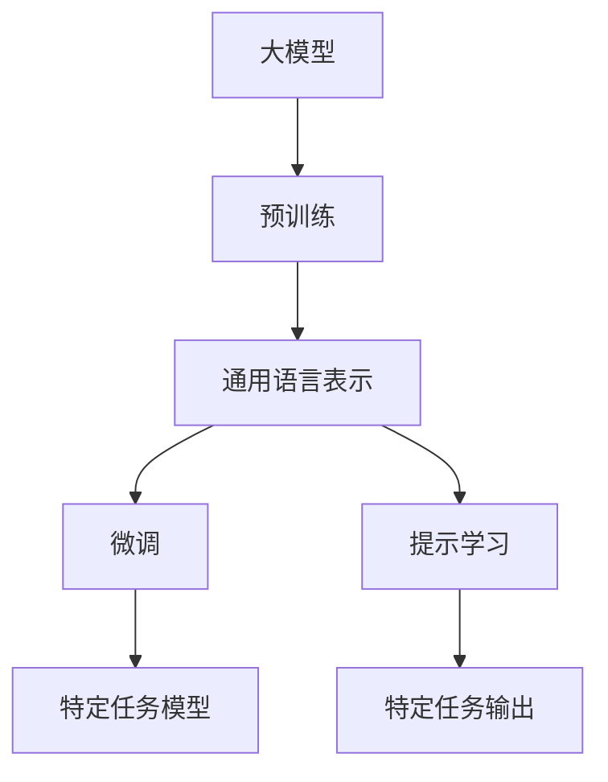

# 【大模型应用开发 动手做AI Agent】创建大模型实例

## 1.背景介绍

随着人工智能技术的不断发展,大型语言模型(Large Language Model,LLM)已经成为当前人工智能领域最受关注和应用最广泛的技术之一。LLM通过在海量文本数据上进行预训练,学习到丰富的语言知识和上下文理解能力,可以在自然语言处理任务上取得出色的表现。

近年来,以GPT-3、PanGu-Alpha、BLOOM等为代表的大模型不断刷新着参数量的纪录,展现出了强大的语言生成、问答、摘要、翻译等能力。大模型已经在多个行业和领域得到了广泛应用,如智能客服、内容创作、代码生成等,极大地提高了人类的工作效率。

然而,大模型的训练和部署仍然面临着诸多挑战,如海量计算资源需求、隐私和安全风险、模型可解释性等。因此,如何高效、安全、可解释地创建和应用大模型,是当前人工智能领域亟待解决的重要课题。

## 2.核心概念与联系

### 2.1 大模型概念

大模型指的是参数量极大(通常超过10亿个参数)、在大规模语料库上进行预训练的语言模型。相比传统的小型模型,大模型能够学习到更丰富、更复杂的语言表示,从而在下游任务上取得更好的性能表现。

大模型的核心思想是"用数据说话"。通过在海量无监督文本数据上预训练,大模型可以自主学习语言的语义和语法知识,而不需要人工设计复杂的特征工程。预训练过程中,大模型会自动挖掘数据中蕴含的统计规律,形成对语言的深层次理解。

### 2.2 预训练与微调

大模型通常采用两阶段的训练范式:预训练(Pretraining)和微调(Finetuning)。

预训练阶段是在大规模无监督文本数据上进行自监督学习,目标是获取通用的语言表示能力。常用的预训练目标包括掩码语言模型(Masked Language Model)、下一句预测(Next Sentence Prediction)等。经过预训练,大模型可以学习到丰富的语义和语法知识。

微调阶段是在特定的下游任务数据上进行有监督的模型调整,目标是将大模型的通用语言表示能力转移到特定的应用场景。微调过程通常只需要调整模型的部分参数,相比从头训练,可以大幅节省计算资源。

### 2.3 提示学习

提示学习(Prompting)是大模型应用中的一种新型范式。与传统的微调方式不同,提示学习不直接调整模型参数,而是通过设计特定的文本提示,引导大模型生成所需的输出。

提示学习的关键在于设计高质量的提示模板,使得大模型可以根据提示生成符合预期的输出。常用的提示模板包括:

- 前缀提示(Prefix Prompting):在输入序列前添加一段指令性的文本
- 示例提示(Example Prompting):给出一些输入-输出示例对,让模型模仿示例生成新的输出
- 混合提示(Hybrid Prompting):结合前缀提示和示例提示的优点

提示学习的优势在于无需微调模型参数,可以快速适用于新的应用场景,同时避免了微调可能带来的计算开销和隐私风险。

## 3.核心算法原理具体操作步骤

### 3.1 Transformer模型

Transformer是当前主流的大模型架构,也是诸如BERT、GPT等知名大模型的核心组件。Transformer完全基于注意力机制(Attention Mechanism)构建,摒弃了传统的循环神经网络(RNN)和卷积神经网络(CNN)结构。

Transformer的主要组成部分包括:

1. **嵌入层(Embedding Layer)**: 将输入的文本序列转换为向量表示
2. **编码器(Encoder)**: 通过多层自注意力(Self-Attention)和前馈神经网络(Feed-Forward Network),对输入序列进行编码
3. **解码器(Decoder)**: 与编码器结构类似,但额外引入了对编码器输出的注意力机制,用于生成目标序列

Transformer的自注意力机制使得模型可以同时关注输入序列中的任意两个位置,捕捉长距离依赖关系,从而更好地建模语言的语义和语法结构。

### 3.2 预训练算法

大模型预训练的核心算法主要包括:

1. **Masked Language Model(MLM)**: 在输入序列中随机掩码部分单词,模型需要预测被掩码的单词。MLM可以学习到双向的语义表示。
2. **Next Sentence Prediction(NSP)**: 判断两个输入句子是否为连续的句子,用于学习句子之间的关系和上下文理解能力。
3. **Permuted Language Model(PLM)**: 将输入序列打乱顺序,模型需要预测原始序列。PLM可以学习到序列的语义和语法结构。
4. **Span Corruption**: 在输入序列中随机替换或删除连续的span(短语),模型需要重建原始序列。
5. **Replaced Token Detection(RTD)**: 在输入序列中随机替换部分单词,模型需要检测被替换的位置。

上述算法通过不同的自监督学习目标,驱使大模型从海量无标注数据中挖掘语言的内在规律,形成通用的语言理解能力。

### 3.3 微调算法

大模型微调的核心思想是:在保留预训练得到的通用语言表示的基础上,对模型的部分参数进行进一步调整,使其适应特定的下游任务。

常见的微调算法包括:

1. **全模型微调(Full Model Finetuning)**: 对整个预训练模型的所有参数进行微调,适用于数据量较大的情况。
2. **前馈层微调(Feedforward Finetuning)**: 只微调模型的前馈层参数,保持其他参数(如注意力层)不变,适用于数据量较小的情况。
3. **层微调(Layer Finetuning)**: 逐层微调模型的部分层参数,通常从顶层开始微调,可以平衡计算代价和性能表现。
4. **前缀微调(Prefix Tuning)**: 在模型输入端添加一组可训练的前缀向量,作为模型的新参数进行微调,避免修改原有参数。
5. **Prompt Tuning**: 将提示模板也作为可训练的参数,与模型参数一起进行联合微调。

不同的微调算法在计算代价、性能表现和泛化能力上有所权衡,需要根据具体的任务场景和数据量进行选择。

### 3.4 提示学习算法

提示学习的核心在于设计高质量的提示模板,使得大模型可以根据提示生成所需的输出。常见的提示学习算法包括:

1. **前缀提示(Prefix Prompting)**: 在输入序列前添加一段指令性的文本,如"总结以下文本:"、"根据上下文回答问题:"等。
2. **示例提示(Example Prompting)**: 给出一些输入-输出示例对,让模型模仿示例生成新的输出。示例可以是人工构造的,也可以从现有数据中采样获得。
3. **混合提示(Hybrid Prompting)**: 结合前缀提示和示例提示的优点,通过前缀指令引导模型关注示例,从而更好地生成所需输出。
4. **反向提示(Reverse Prompting)**: 将输出作为提示,输入作为模型需要生成的目标,用于生成式任务(如机器翻译、文本续写等)。
5. **提示规范化(Prompt Normalization)**: 通过规范化操作(如投影、正则化等)对提示进行处理,以提高提示的质量和泛化能力。

提示学习算法的关键在于设计高质量、通用性强的提示模板,使得大模型可以根据提示准确理解任务需求,生成所需的输出。同时,提示模板的设计也需要考虑效率和可解释性等因素。

## 4.数学模型和公式详细讲解举例说明

### 4.1 Transformer注意力机制

Transformer模型中的自注意力(Self-Attention)机制是其核心组件之一,用于捕捉输入序列中任意两个位置之间的依赖关系。

给定一个长度为 $n$ 的输入序列 $\boldsymbol{X} = (x_1, x_2, \dots, x_n)$,其中 $x_i \in \mathbb{R}^{d_\text{model}}$ 表示第 $i$ 个位置的向量表示。自注意力机制的计算过程如下:

1. 通过线性投影,将输入序列 $\boldsymbol{X}$ 分别映射到查询(Query)、键(Key)和值(Value)空间:

$$
\begin{aligned}
\boldsymbol{Q} &= \boldsymbol{X} \boldsymbol{W}^Q \\
\boldsymbol{K} &= \boldsymbol{X} \boldsymbol{W}^K \\
\boldsymbol{V} &= \boldsymbol{X} \boldsymbol{W}^V
\end{aligned}
$$

其中 $\boldsymbol{W}^Q, \boldsymbol{W}^K, \boldsymbol{W}^V \in \mathbb{R}^{d_\text{model} \times d_k}$ 为可训练的投影矩阵。

2. 计算查询 $\boldsymbol{Q}$ 与所有键 $\boldsymbol{K}$ 之间的注意力分数:

$$
\text{Attention}(\boldsymbol{Q}, \boldsymbol{K}, \boldsymbol{V}) = \text{softmax}\left(\frac{\boldsymbol{Q}\boldsymbol{K}^\top}{\sqrt{d_k}}\right)\boldsymbol{V}
$$

其中 $d_k$ 为缩放因子,用于防止内积值过大导致梯度消失。

3. 对注意力分数进行软最大化(softmax)操作,得到注意力权重矩阵 $\boldsymbol{A} \in \mathbb{R}^{n \times n}$,其中 $a_{ij}$ 表示第 $i$ 个位置对第 $j$ 个位置的注意力权重。

4. 将注意力权重矩阵 $\boldsymbol{A}$ 与值矩阵 $\boldsymbol{V}$ 相乘,得到注意力输出:

$$
\text{Attention}(\boldsymbol{Q}, \boldsymbol{K}, \boldsymbol{V}) = \boldsymbol{A}\boldsymbol{V}
$$

注意力输出是对输入序列中每个位置的值向量进行加权求和,权重由注意力分数决定。通过自注意力机制,Transformer可以同时关注输入序列中的任意两个位置,捕捉长距离依赖关系,从而更好地建模语言的语义和语法结构。

### 4.2 Transformer解码器注意力

在Transformer的解码器(Decoder)中,除了对编码器(Encoder)输出进行注意力计算外,还需要对解码器自身的输出序列进行自注意力计算,以捕捉目标序列内部的依赖关系。

给定解码器的输入序列 $\boldsymbol{Y} = (y_1, y_2, \dots, y_m)$,其中 $y_i \in \mathbb{R}^{d_\text{model}}$ 表示第 $i$ 个位置的向量表示。解码器自注意力的计算过程如下:

1. 将输入序列 $\boldsymbol{Y}$ 分别映射到查询、键和值空间:

$$
\begin{aligned}
\boldsymbol{Q}_\text{dec} &= \boldsymbol{Y} \boldsymbol{W}^Q_\text{dec} \\
\boldsymbol{K}_\text{dec} &= \boldsymbol{Y} \boldsymbol{W}^K_\text{dec} \\
\boldsymbol{V}_\text{dec} &= \boldsymbol{Y} \boldsymbol{W}^V_\text{dec}
\end{aligned}
$$

2. 为了保证自回归(Autoregressive)属性,即在生成第 $i$ 个位置的输出时,只能依赖前 $i-1$ 个位置的信息,需要对键矩阵 $\boldsymbol{K}_\text{dec}$ 进