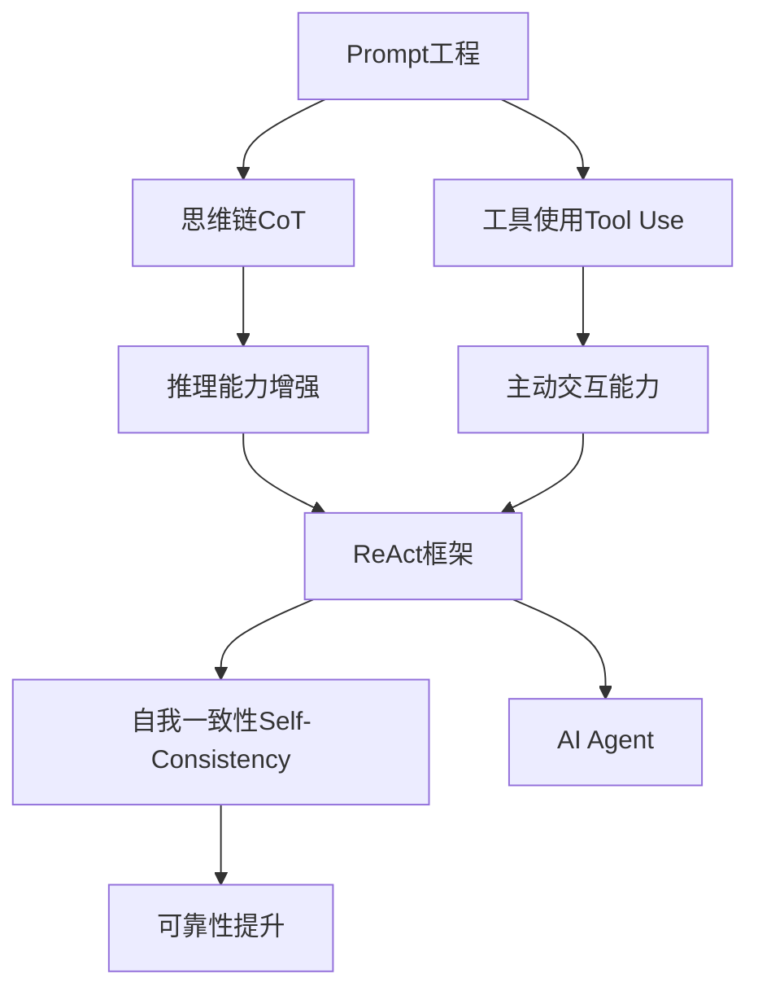

# 【大模型应用开发 动手做AI Agent】复习ReAct框架

## 1. 背景介绍

### 1.1 大语言模型的发展历程

近年来,自然语言处理(NLP)领域取得了巨大的进步,尤其是大语言模型(Large Language Models, LLMs)的出现,为NLP领域带来了革命性的变化。从GPT、BERT到GPT-3,再到最新的ChatGPT,LLMs展现出了令人惊叹的语言理解和生成能力。

### 1.2 LLMs在实际应用中的局限性

尽管LLMs在许多NLP任务上取得了优异的表现,但它们在实际应用中仍然存在一些局限性:

- 缺乏推理和决策能力:LLMs主要是基于统计模式进行语言生成,缺乏对语义的深入理解和推理能力。
- 难以适应特定领域:LLMs是在海量通用语料上训练的,对特定领域知识的掌握不足。
- 无法主动与环境交互:LLMs只能被动地响应输入,无法主动地与环境进行交互和信息搜集。

### 1.3 ReAct框架的提出

为了克服LLMs在实际应用中的局限性,Meta AI于2022年提出了ReAct(Reason+Act)框架。ReAct旨在赋予LLMs推理、决策和主动交互的能力,使其能够更好地适应实际应用场景,成为真正意义上的AI Agent。

## 2. 核心概念与联系

### 2.1 Prompt工程

Prompt工程是指设计合适的输入文本(Prompt),以引导LLMs生成期望的输出。一个优秀的Prompt需要包含任务描述、输入数据、期望输出格式等关键信息。Prompt工程是ReAct框架的基础,通过精心设计的Prompt,可以引导LLMs进行推理、决策和交互。

### 2.2 思维链(Chain-of-Thought, CoT)

思维链是一种Prompt工程技术,通过在Prompt中引入中间推理步骤,使LLMs能够生成更加合理、可解释的输出。ReAct框架借鉴了CoT的思想,通过引入推理步骤,增强LLMs的推理能力。

### 2.3 工具使用(Tool Use)

工具使用指LLMs能够调用外部工具或API来获取信息、执行操作。这是ReAct框架的核心思想之一,通过赋予LLMs使用工具的能力,使其能够主动与环境交互,突破传统LLMs的局限性。

### 2.4 自我一致性(Self-Consistency)

自我一致性指LLMs在生成输出时,能够保持前后逻辑的一致性,避免出现自相矛盾的陈述。ReAct框架通过引入自我一致性检查机制,提高了LLMs输出的可靠性。

### 2.5 概念之间的联系

下图展示了ReAct框架中各个核心概念之间的联系:



## 3. 核心算法原理具体操作步骤

### 3.1 ReAct推理过程

ReAct框架的核心是一个迭代的推理过程,主要分为以下几个步骤:

1. 接收用户输入的查询或任务描述
2. 根据Prompt模板生成初始Prompt
3. 将Prompt输入LLMs,生成初步的思维链和行动计划
4. 分析行动计划,确定是否需要调用外部工具
   - 如需调用工具,执行工具调用,获取结果
   - 将工具调用结果整合到思维链中
5. 重复步骤3-4,直到得到最终的输出
6. 对输出进行自我一致性检查,确保逻辑的连贯性
7. 将最终输出返回给用户

### 3.2 Prompt生成

ReAct框架使用一个通用的Prompt模板来生成初始Prompt,模板中包含以下关键要素:

- 任务描述:明确任务的目标和要求
- 输入数据:提供任务所需的初始信息
- 思维链:引导LLMs进行逐步推理
- 行动计划:引导LLMs生成可执行的操作序列
- 工具使用:说明可调用的外部工具及其功能
- 输出格式:规定期望的输出格式

以下是一个简化版的Prompt模板示例:

```
任务: {task_description}

给定信息:
{input_data}

思考过程:
1. {step1}
2. {step2}
3. {step3}

行动计划:
1. {action1}
2. {action2}
3. {action3}

可用工具:
- {tool1}: {tool1_description}
- {tool2}: {tool2_description}

输出格式:
{output_format}
```

### 3.3 工具调用

ReAct框架为LLMs提供了一组预定义的外部工具,包括搜索引擎、知识库、计算器等。LLMs可以在生成行动计划时,根据需要选择调用相应的工具。

工具调用的一般步骤如下:

1. 在行动计划中指定要调用的工具及其参数
2. 执行工具调用,获取返回结果
3. 将返回结果整合到思维链中,用于后续的推理

例如,如果LLMs在行动计划中指定了使用搜索引擎查询某个关键词,则ReAct框架会自动执行搜索,并将搜索结果返回给LLMs,用于生成下一步的思维链和行动计划。

### 3.4 自我一致性检查

为了提高输出的可靠性,ReAct框架引入了自我一致性检查机制。具体做法是,在生成最终输出后,将输出再次输入LLMs,并让LLMs判断输出是否与之前的推理过程相一致,是否存在逻辑矛盾或漏洞。

如果发现不一致之处,LLMs会尝试进行修正,直到输出通过自我一致性检查为止。这一机制有助于提高ReAct框架生成内容的质量和可信度。

## 4. 数学模型和公式详细讲解举例说明

### 4.1 思维链生成

ReAct框架中的思维链生成可以看作是一个序列到序列(Seq2Seq)的过程。设输入的Prompt为$X=(x_1,x_2,...,x_n)$,思维链为$Y=(y_1,y_2,...,y_m)$,则生成思维链的过程可以表示为:

$$P(Y|X) = \prod_{i=1}^m P(y_i|y_1,...,y_{i-1},X)$$

其中,$P(y_i|y_1,...,y_{i-1},X)$表示在给定输入$X$和之前生成的token $y_1,...,y_{i-1}$的条件下,生成下一个token $y_i$的概率。

在实践中,ReAct框架使用基于Transformer的语言模型(如GPT系列)来建模这个条件概率。Transformer的核心是注意力机制(Attention Mechanism),可以捕捉输入序列中不同位置之间的依赖关系。

具体来说,Transformer首先将输入序列$X$和之前生成的token序列$y_1,...,y_{i-1}$拼接起来,形成一个新的序列$\hat{X}=(\hat{x}_1,\hat{x}_2,...,\hat{x}_{n+i-1})$。然后,通过多头注意力(Multi-Head Attention)机制,计算每个位置上的token与其他位置token的相关性:

$$Attention(\hat{x}_i) = \sum_{j=1}^{n+i-1} \alpha_{ij} \cdot \hat{x}_j$$

其中,$\alpha_{ij}$表示位置$i$和位置$j$上的token之间的注意力权重。

最后,Transformer将注意力的结果传入前馈神经网络(Feed-Forward Network),生成下一个token的概率分布:

$$P(y_i|\hat{x}_1,...,\hat{x}_{n+i-1}) = softmax(FFN(Attention(\hat{x}_{n+i-1})))$$

通过这种方式,Transformer能够根据输入和之前生成的内容,动态地调整每个位置上的注意力权重,从而生成连贯、相关的思维链。

### 4.2 行动计划生成

行动计划的生成与思维链类似,也可以看作是一个Seq2Seq过程。不同之处在于,行动计划中可能包含对外部工具的调用。

设行动计划为$A=(a_1,a_2,...,a_k)$,其中$a_i$可以是普通的文本token,也可以是工具调用。假设有$T$个可用的外部工具,则生成行动计划的过程可以表示为:

$$P(A|X,Y) = \prod_{i=1}^k P(a_i|a_1,...,a_{i-1},X,Y)$$

$$P(a_i|a_1,...,a_{i-1},X,Y) = \begin{cases} 
P(a_i|a_1,...,a_{i-1},X,Y), & \text{if } a_i \text{ is a regular token} \\
P(t_j|a_1,...,a_{i-1},X,Y), & \text{if } a_i \text{ is a tool call for tool } t_j
\end{cases}$$

其中,$P(a_i|a_1,...,a_{i-1},X,Y)$表示生成普通token的概率,$P(t_j|a_1,...,a_{i-1},X,Y)$表示调用工具$t_j$的概率。

在实践中,ReAct框架使用一个特殊的token来表示工具调用,例如`[TOOL_j]`表示调用第$j$个工具。在生成行动计划时,如果LLMs输出了`[TOOL_j]`,则ReAct框架会自动执行相应的工具调用,并将结果插入到后续的token序列中。

### 4.3 自我一致性检查

自我一致性检查可以看作是一个二分类问题,即判断生成的输出是否与之前的推理过程一致。

设最终输出为$Z$,则自我一致性检查可以表示为:

$$P(consistent|Z,X,Y,A) = \sigma(f(Z,X,Y,A))$$

其中,$\sigma$是sigmoid函数,$f$是一个打分函数,用于计算输出$Z$与输入$X$、思维链$Y$和行动计划$A$之间的一致性得分。

在实践中,ReAct框架使用另一个语言模型(如BERT)来实现打分函数$f$。具体做法是,将$Z$、$X$、$Y$和$A$拼接起来,输入到BERT中,然后在BERT的输出上添加一个二分类层,预测$Z$是否与$X$、$Y$和$A$一致。

如果预测结果为不一致,则ReAct框架会尝试修正$Z$,具体策略包括:

1. 调整思维链$Y$和行动计划$A$,重新生成输出$Z$
2. 直接对$Z$进行编辑,使其与$X$、$Y$和$A$保持一致

ReAct框架会迭代地执行以上步骤,直到输出通过自我一致性检查为止。

## 5. 项目实践：代码实例和详细解释说明

下面是一个使用Python实现ReAct框架的简化示例。该示例使用GPT-2作为底层的语言模型,并提供了一个简单的搜索工具。

```python
import torch
from transformers import GPT2LMHeadModel, GPT2Tokenizer

# 加载预训练的GPT-2模型和tokenizer
model = GPT2LMHeadModel.from_pretrained('gpt2')
tokenizer = GPT2Tokenizer.from_pretrained('gpt2')

# 定义Prompt模板
prompt_template = '''
任务: {task_description}

给定信息:
{input_data}

思考过程:
1. {step1}
2. {step2}
3. {step3}

行动计划:
1. {action1}
2. {action2}
3. {action3}

可用工具:
- 搜索: 使用搜索引擎查询信息

输出格式:
{output_format}
'''

# 定义搜索工具
def search_tool(query):
    # 这里只是一个简单的示例,实际应用中需要调用真实的搜索API
    return f'搜索结果: {query}'

# ReAct推理过程
def react(task_description, input_data, output_format, max_steps=3):
    # 生成初始Prompt
    prompt = prompt_template.format(
        task_description=task_description,
        input_data=input_data,
        step1='', step2='', step3='',
        action1='', action2='', action3='',
        output_format=output_format