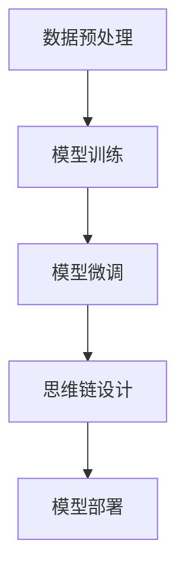

# 【大模型应用开发 动手做AI Agent】思维链

## 1.背景介绍

在人工智能领域，AI Agent（智能代理）已经成为一个重要的研究方向。随着大模型（如GPT-3、BERT等）的出现，AI Agent的能力得到了显著提升。这些大模型通过海量数据训练，具备了强大的自然语言处理和理解能力，使得AI Agent在各种应用场景中表现出色。

AI Agent的应用范围广泛，从智能客服、自动驾驶到医疗诊断、金融分析等领域，都能看到它们的身影。本文将深入探讨大模型在AI Agent开发中的应用，帮助读者理解核心概念、算法原理、数学模型，并通过实际项目实践，展示如何动手开发一个AI Agent。

## 2.核心概念与联系

### 2.1 大模型

大模型是指通过海量数据训练，具备强大自然语言处理能力的深度学习模型。常见的大模型包括GPT-3、BERT、T5等。这些模型通常具有数十亿甚至上千亿的参数，能够理解和生成自然语言文本。

### 2.2 AI Agent

AI Agent是一种能够自主感知环境、做出决策并执行动作的智能系统。AI Agent通常由感知模块、决策模块和执行模块组成。大模型在AI Agent中的应用，主要体现在感知和决策两个模块。

### 2.3 思维链

思维链（Chain of Thought）是指AI Agent在解决问题时，通过一系列逻辑推理和决策步骤，逐步接近目标的过程。思维链的质量直接影响AI Agent的表现。

### 2.4 核心联系

大模型为AI Agent提供了强大的感知和决策能力，而思维链则是AI Agent在实际应用中发挥作用的关键。通过合理设计思维链，可以充分发挥大模型的优势，使AI Agent在复杂任务中表现出色。

## 3.核心算法原理具体操作步骤

### 3.1 数据预处理

数据预处理是AI Agent开发的第一步。包括数据清洗、数据标注和数据增强等步骤。数据预处理的质量直接影响大模型的训练效果。

### 3.2 模型训练

模型训练是AI Agent开发的核心步骤。通过大规模数据训练大模型，使其具备强大的自然语言处理能力。常用的训练算法包括梯度下降、Adam优化器等。

### 3.3 模型微调

模型微调是指在预训练模型的基础上，使用特定任务的数据进行进一步训练。通过微调，可以使大模型更好地适应特定任务，提高AI Agent的表现。

### 3.4 思维链设计

思维链设计是AI Agent开发的关键步骤。通过合理设计思维链，可以使AI Agent在解决问题时，逐步接近目标。思维链设计需要考虑任务的复杂性、逻辑推理的步骤等因素。

### 3.5 模型部署

模型部署是AI Agent开发的最后一步。将训练好的模型部署到实际应用环境中，使其能够实时处理任务。常用的部署工具包括Docker、Kubernetes等。

以下是一个简单的Mermaid流程图，展示了AI Agent开发的核心步骤：



## 4.数学模型和公式详细讲解举例说明

### 4.1 大模型的数学基础

大模型的核心是深度神经网络。以Transformer为例，其基本结构包括自注意力机制和前馈神经网络。自注意力机制的数学公式如下：

$$
\text{Attention}(Q, K, V) = \text{softmax}\left(\frac{QK^T}{\sqrt{d_k}}\right)V
$$

其中，$Q$、$K$、$V$分别表示查询、键和值矩阵，$d_k$表示键的维度。

### 4.2 梯度下降算法

梯度下降是模型训练的核心算法。其基本思想是通过迭代更新模型参数，使损失函数逐步减小。梯度下降的数学公式如下：

$$
\theta_{t+1} = \theta_t - \eta \nabla_\theta J(\theta_t)
$$

其中，$\theta_t$表示第$t$次迭代的模型参数，$\eta$表示学习率，$J(\theta_t)$表示损失函数。

### 4.3 Adam优化器

Adam优化器是梯度下降的改进算法，通过自适应调整学习率，提高模型训练的效率。Adam优化器的数学公式如下：

$$
m_t = \beta_1 m_{t-1} + (1 - \beta_1) g_t
$$

$$
v_t = \beta_2 v_{t-1} + (1 - \beta_2) g_t^2
$$

$$
\hat{m}_t = \frac{m_t}{1 - \beta_1^t}
$$

$$
\hat{v}_t = \frac{v_t}{1 - \beta_2^t}
$$

$$
\theta_{t+1} = \theta_t - \eta \frac{\hat{m}_t}{\sqrt{\hat{v}_t} + \epsilon}
$$

其中，$m_t$和$v_t$分别表示一阶和二阶动量，$\beta_1$和$\beta_2$是动量衰减系数，$\epsilon$是一个小常数。

### 4.4 思维链的数学建模

思维链可以通过马尔可夫决策过程（MDP）进行建模。MDP的基本元素包括状态集合$S$、动作集合$A$、状态转移概率$P$和奖励函数$R$。MDP的目标是找到最优策略$\pi$，使得累积奖励最大化。MDP的数学公式如下：

$$
V^\pi(s) = \mathbb{E}^\pi \left[ \sum_{t=0}^\infty \gamma^t R(s_t, a_t) \mid s_0 = s \right]
$$

其中，$V^\pi(s)$表示状态$s$的价值函数，$\gamma$表示折扣因子。

## 5.项目实践：代码实例和详细解释说明

### 5.1 数据预处理

以下是一个简单的数据预处理示例，使用Python和Pandas库进行数据清洗和标注：

```python
import pandas as pd

# 读取数据
data = pd.read_csv('data.csv')

# 数据清洗
data = data.dropna()  # 删除缺失值
data = data[data['label'].isin(['positive', 'negative'])]  # 过滤无效标签

# 数据标注
data['label'] = data['label'].map({'positive': 1, 'negative': 0})

# 保存处理后的数据
data.to_csv('processed_data.csv', index=False)
```

### 5.2 模型训练

以下是一个使用PyTorch进行模型训练的示例：

```python
import torch
import torch.nn as nn
import torch.optim as optim
from torch.utils.data import DataLoader, Dataset

class CustomDataset(Dataset):
    def __init__(self, data):
        self.data = data

    def __len__(self):
        return len(self.data)

    def __getitem__(self, idx):
        return self.data[idx]

class SimpleModel(nn.Module):
    def __init__(self):
        super(SimpleModel, self).__init__()
        self.fc = nn.Linear(10, 1)

    def forward(self, x):
        return self.fc(x)

# 加载数据
data = pd.read_csv('processed_data.csv')
dataset = CustomDataset(data.values)
dataloader = DataLoader(dataset, batch_size=32, shuffle=True)

# 初始化模型
model = SimpleModel()
criterion = nn.BCEWithLogitsLoss()
optimizer = optim.Adam(model.parameters(), lr=0.001)

# 训练模型
for epoch in range(10):
    for inputs, labels in dataloader:
        optimizer.zero_grad()
        outputs = model(inputs.float())
        loss = criterion(outputs, labels.float())
        loss.backward()
        optimizer.step()
    print(f'Epoch {epoch+1}, Loss: {loss.item()}')
```

### 5.3 模型微调

以下是一个使用Hugging Face的Transformers库进行模型微调的示例：

```python
from transformers import BertTokenizer, BertForSequenceClassification, Trainer, TrainingArguments

# 加载预训练模型和分词器
tokenizer = BertTokenizer.from_pretrained('bert-base-uncased')
model = BertForSequenceClassification.from_pretrained('bert-base-uncased')

# 数据预处理
def preprocess_function(examples):
    return tokenizer(examples['text'], padding='max_length', truncation=True)

# 加载数据集
from datasets import load_dataset
dataset = load_dataset('imdb')
encoded_dataset = dataset.map(preprocess_function, batched=True)

# 训练参数
training_args = TrainingArguments(
    output_dir='./results',
    num_train_epochs=3,
    per_device_train_batch_size=8,
    per_device_eval_batch_size=8,
    warmup_steps=500,
    weight_decay=0.01,
    logging_dir='./logs',
)

# 训练模型
trainer = Trainer(
    model=model,
    args=training_args,
    train_dataset=encoded_dataset['train'],
    eval_dataset=encoded_dataset['test']
)

trainer.train()
```

### 5.4 思维链设计

以下是一个简单的思维链设计示例，使用Python实现一个基于规则的AI Agent：

```python
class AIAgent:
    def __init__(self):
        self.state = 'initial'

    def perceive(self, input):
        if 'hello' in input.lower():
            self.state = 'greeting'
        elif 'bye' in input.lower():
            self.state = 'farewell'
        else:
            self.state = 'unknown'

    def decide(self):
        if self.state == 'greeting':
            return 'Hello! How can I help you today?'
        elif self.state == 'farewell':
            return 'Goodbye! Have a nice day!'
        else:
            return 'I am sorry, I did not understand that.'

    def act(self, input):
        self.perceive(input)
        return self.decide()

# 使用示例
agent = AIAgent()
print(agent.act('Hello'))
print(agent.act('Bye'))
```

### 5.5 模型部署

以下是一个使用Flask进行模型部署的示例：

```python
from flask import Flask, request, jsonify
import torch

app = Flask(__name__)

# 加载训练好的模型
model = SimpleModel()
model.load_state_dict(torch.load('model.pth'))
model.eval()

@app.route('/predict', methods=['POST'])
def predict():
    data = request.json
    inputs = torch.tensor(data['inputs'])
    with torch.no_grad():
        outputs = model(inputs.float())
    return jsonify({'outputs': outputs.tolist()})

if __name__ == '__main__':
    app.run(host='0.0.0.0', port=5000)
```

## 6.实际应用场景

### 6.1 智能客服

智能客服是AI Agent的典型应用场景之一。通过大模型，智能客服能够理解用户的自然语言问题，并给出准确的回答。智能客服可以应用于电商、银行、医疗等多个领域，提高客户服务效率。

### 6.2 自动驾驶

在自动驾驶领域，AI Agent通过感知环境、决策和执行动作，实现车辆的自主驾驶。大模型在自动驾驶中的应用，主要体现在感知和决策两个方面。通过大模型，自动驾驶系统能够更准确地识别道路、车辆和行人，提高驾驶安全性。

### 6.3 医疗诊断

在医疗诊断领域，AI Agent通过分析患者的病历和症状，给出诊断建议。大模型在医疗诊断中的应用，主要体现在自然语言处理和图像识别两个方面。通过大模型，医疗诊断系统能够更准确地理解患者的病情，提高诊断准确性。

### 6.4 金融分析

在金融分析领域，AI Agent通过分析市场数据和新闻，给出投资建议。大模型在金融分析中的应用，主要体现在自然语言处理和时间序列分析两个方面。通过大模型，金融分析系统能够更准确地预测市场趋势，提高投资回报率。

## 7.工具和资源推荐

### 7.1 开发工具

- **PyTorch**：一个开源的深度学习框架，适用于大模型的训练和微调。
- **TensorFlow**：另一个流行的深度学习框架，提供了丰富的工具和资源。
- **Hugging Face Transformers**：一个开源的自然语言处理库，提供了预训练的大模型和微调工具。
- **Docker**：一个容器化工具，适用于模型的部署和管理。
- **Kubernetes**：一个容器编排工具，适用于大规模模型的部署和管理。

### 7.2 数据集

- **IMDB**：一个电影评论数据集，适用于情感分析任务。
- **COCO**：一个图像数据集，适用于图像识别和目标检测任务。
- **SQuAD**：一个问答数据集，适用于自然语言理解任务。

### 7.3 学习资源

- **《深度学习》**：一本经典的深度学习教材，适合初学者和进阶学习者。
- **Coursera**：一个在线学习平台，提供了丰富的人工智能和深度学习课程。
- **Kaggle**：一个数据科学竞赛平台，提供了丰富的数据集和竞赛机会。

## 8.总结：未来发展趋势与挑战

### 8.1 未来发展趋势

- **更大规模的大模型**：随着计算能力的提升和数据量的增加，大模型的规模将继续扩大，具备更强的自然语言处理能力。
- **多模态AI Agent**：未来的AI Agent将不仅限于自然语言处理，还将具备图像、语音等多模态感知和处理能力。
- **自适应学习**：未来的AI Agent将具备自适应学习能力，能够根据环境和任务的变化，自动调整自身的行为和策略。

### 8.2 挑战

- **数据隐私和安全**：大模型的训练需要大量数据，如何保护用户的隐私和数据安全是一个重要挑战。
- **模型解释性**：大模型的复杂性使得其决策过程难以解释，如何提高模型的解释性是一个重要研究方向。
- **计算资源和能耗**：大模型的训练和推理需要大量计算资源和能耗，如何提高计算效率和降低能耗是一个重要挑战。

## 9.附录：常见问题与解答

### 9.1 大模型的训练需要多长时间？

大模型的训练时间取决于模型的规模、数据量和计算资源。一般来说，训练一个大规模的大模型需要数天到数周的时间。

### 9.2 如何选择合适的大模型？

选择大模型时，需要考虑任务的具体需求、数据的类型和规模、计算资源等因素。常见的大模型包括GPT-3、BERT、T5等，可以根据任务的具体需求选择合适的模型。

### 9.3 如何提高大模型的训练效率？

提高大模型的训练效率可以从以下几个方面入手：
- 使用高效的优化算法，如Adam优化器。
- 使用分布式训练技术，如数据并行和模型并行。
- 使用混合精度训练技术，减少计算资源的消耗。

### 9.4 如何部署大模型？

大模型的部署可以使用容器化技术，如Docker和Kubernetes。通过容器化技术，可以方便地管理和扩展大模型的部署，提高系统的可靠性和可维护性。

### 9.5 如何保证大模型的安全性？

保证大模型的安全性可以从以下几个方面入手：
- 保护训练数据的隐私，使用数据加密和访问控制技术。
- 监控模型的行为，检测和防止异常行为。
- 定期更新和维护模型，修复已知的安全漏洞。

---

作者：禅与计算机程序设计艺术 / Zen and the Art of Computer Programming