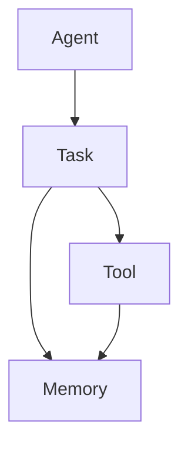

# 【大模型应用开发 动手做AI Agent】深挖AgentExecutor的运行机制

## 1.背景介绍

随着人工智能技术的快速发展,大型语言模型(Large Language Models, LLMs)已经在自然语言处理、问答系统、内容生成等领域展现出了令人惊叹的能力。然而,如何将这些强大的语言模型应用到实际的产品和服务中,仍然是一个巨大的挑战。

AgentExecutor是一个开源框架,旨在帮助开发者轻松地将大型语言模型集成到应用程序中,并赋予它们执行各种任务的能力。它提供了一种标准化的方式来定义任务、管理上下文信息,并与语言模型进行交互。通过AgentExecutor,开发者可以构建智能代理(Intelligent Agents),让它们根据用户的指令完成特定的工作流程。

### 1.1 什么是智能代理?

智能代理是一种软件实体,能够感知环境、处理信息、做出决策并采取行动,以实现特定目标。在AgentExecutor的背景下,智能代理是指由大型语言模型驱动的虚拟助手或机器人,它们可以理解自然语言指令、执行任务并与用户进行交互。

### 1.2 AgentExecutor的作用

AgentExecutor的主要作用是:

1. **任务编排**: 将复杂的工作流程分解为一系列可管理的任务,并协调这些任务的执行顺序和依赖关系。
2. **上下文管理**: 跟踪和维护与当前任务相关的上下文信息,确保语言模型可以根据上下文做出合理的响应。
3. **模型交互**: 与大型语言模型进行交互,提供指令并获取模型的输出,从而实现任务的执行。
4. **结果整合**: 将语言模型的输出进行解析和处理,并将结果整合到最终的应用程序中。

通过AgentExecutor,开发者可以更轻松地利用大型语言模型的强大能力,构建智能化的应用程序和服务。

## 2.核心概念与联系

在深入探讨AgentExecutor的运行机制之前,我们需要了解几个核心概念及它们之间的关系。

### 2.1 Agent(智能代理)

Agent是AgentExecutor中最核心的概念。它表示一个由大型语言模型驱动的虚拟助手或机器人,能够理解和执行特定的任务。每个Agent都有一个关联的语言模型,用于处理自然语言输入并生成响应。

### 2.2 Task(任务)

Task代表了Agent需要执行的具体工作单元。一个复杂的工作流程通常会被分解为多个Task,这些Task按照特定的顺序和依赖关系进行执行。每个Task都有一个描述性的名称和一组指令,用于指导Agent完成该任务。

### 2.3 Tool(工具)

Tool是Agent可以利用的外部资源或服务,例如网络API、数据库查询或文件操作等。Agent可以调用这些Tool来获取所需的信息或执行特定的操作,从而完成更复杂的任务。

### 2.4 Memory(记忆)

Memory用于存储与当前任务相关的上下文信息,例如之前的对话记录、中间结果或其他重要数据。Agent可以访问和更新Memory,以确保它们的响应是基于完整的上下文信息。

这些核心概念之间的关系如下所示:



- Agent负责执行Task,并可以利用Tool和Memory来完成任务。
- Task可以调用Tool来获取所需的资源或服务,也可以读写Memory以维护上下文信息。
- Tool可以向Memory写入数据,为后续的任务执行提供支持。

通过这种模块化的设计,AgentExecutor提供了一种灵活和可扩展的方式来构建基于大型语言模型的智能应用程序。

## 3.核心算法原理具体操作步骤

AgentExecutor的核心算法原理是基于一种称为"思考-行动-修正"(Think-Act-Revise)的循环过程。该过程可以概括为以下步骤:

1. **思考(Think)**: Agent根据当前的Task和Memory,生成一个初步的响应计划。
2. **行动(Act)**: Agent执行响应计划中的操作,例如调用Tool或更新Memory。
3. **修正(Revise)**: Agent评估执行结果,并根据需要修正响应计划或继续执行下一个Task。

这个循环会一直重复,直到所有的Task都被成功执行或者达到某个终止条件。下面是这个过程的具体步骤:

1. **初始化**: 创建一个Agent实例,并为其分配一个关联的语言模型。同时,也需要定义要执行的Task列表和可用的Tool集合。

2. **加载上下文**: 从Memory中加载与当前Task相关的上下文信息,例如之前的对话记录或中间结果。

3. **生成响应计划**: Agent将当前Task的描述和上下文信息输入到语言模型中,生成一个初步的响应计划。该计划可能包括调用特定的Tool、更新Memory或执行其他操作。

4. **执行响应计划**: Agent按照响应计划中的指令执行相应的操作,例如调用Tool获取数据或更新Memory中的信息。

5. **评估结果**: Agent评估执行结果,判断是否已经完成了当前Task。如果Task已经完成,则进入下一个Task;否则,Agent需要修正响应计划并重新执行。

6. **修正响应计划(可选)**: 如果当前Task未能完成,Agent可以根据执行结果和新的上下文信息,修正响应计划。这可能涉及到调用不同的Tool、更新Memory或重新生成响应计划。

7. **重复执行**: 返回步骤4,执行修正后的响应计划。

8. **终止条件**: 如果所有Task都已成功执行或达到其他终止条件(如达到最大迭代次数),则结束整个过程。

这种"思考-行动-修正"的循环过程赋予了Agent一定的自主性和适应能力。Agent可以根据执行结果和新的上下文信息不断调整和优化自己的响应计划,从而更好地完成复杂的任务。

## 4.数学模型和公式详细讲解举例说明

在AgentExecutor的运行过程中,可能会涉及到一些数学模型和公式,用于量化和优化Agent的行为。下面是一些常见的数学模型和公式,以及它们在AgentExecutor中的应用场景。

### 4.1 马尔可夫决策过程(Markov Decision Process, MDP)

马尔可夫决策过程是一种用于建模序列决策问题的数学框架。在AgentExecutor中,我们可以将Agent的行为视为一个MDP,其中:

- 状态($s$)表示当前的上下文信息和任务进度。
- 动作($a$)表示Agent可以采取的操作,如调用特定的Tool或更新Memory。
- 奖励($r$)表示完成当前Task的收益或惩罚。
- 转移概率($P(s' | s, a)$)表示在当前状态$s$下采取动作$a$后,转移到新状态$s'$的概率。
- 折现因子($\gamma$)用于平衡即时奖励和长期收益。

Agent的目标是找到一个策略($\pi$),即在每个状态下选择最优动作的映射,以最大化预期的累积奖励:

$$V^{\pi}(s) = \mathbb{E}_{\pi}\left[\sum_{t=0}^{\infty} \gamma^t r_{t+1} | s_0 = s\right]$$

其中$V^{\pi}(s)$是在策略$\pi$下,从状态$s$开始的预期累积奖励。

通过建模为MDP,我们可以应用强化学习算法(如Q-Learning或策略梯度)来优化Agent的策略,使其能够更好地完成复杂的任务。

### 4.2 序列到序列模型(Sequence-to-Sequence Model)

序列到序列模型是一种常用的神经网络架构,广泛应用于自然语言处理任务中,如机器翻译、文本摘要和对话系统等。在AgentExecutor中,我们可以将语言模型视为一个序列到序列模型,其中:

- 输入序列($X$)是当前Task的描述和上下文信息。
- 输出序列($Y$)是Agent生成的响应计划。

序列到序列模型的目标是学习一个条件概率分布$P(Y|X)$,即给定输入序列$X$,生成最可能的输出序列$Y$。

常见的序列到序列模型包括:

- 编码器-解码器模型(Encoder-Decoder Model)
- 注意力机制(Attention Mechanism)
- 转换器模型(Transformer Model)

这些模型通过神经网络的结构和训练方式,能够有效地捕获输入和输出序列之间的依赖关系,从而生成高质量的响应计划。

### 4.3 语义相似度计算

在AgentExecutor中,我们需要评估Agent生成的响应计划是否满足当前Task的要求。一种常见的方法是计算响应计划和Task描述之间的语义相似度。

假设我们有一个函数$sim(x, y)$,用于计算两个句子$x$和$y$之间的语义相似度分数。常见的语义相似度计算方法包括:

- 基于词袋模型的相似度(如余弦相似度)
- 基于词向量的相似度(如Word2Vec或GloVe)
- 基于预训练语言模型的相似度(如BERT或GPT)

我们可以将Task描述表示为$t$,响应计划表示为$r$,则语义相似度分数为$sim(t, r)$。如果该分数高于某个阈值,则认为响应计划满足Task要求;否则,Agent需要修正响应计划。

通过将这些数学模型和公式应用到AgentExecutor中,我们可以量化和优化Agent的行为,从而提高其完成复杂任务的能力。

## 5.项目实践:代码实例和详细解释说明

为了更好地理解AgentExecutor的运行机制,我们将通过一个简单的示例项目来进行实践。在这个示例中,我们将构建一个基于OpenAI的GPT-3语言模型的智能代理,用于执行一系列与Python编程相关的任务。

### 5.1 安装依赖项

首先,我们需要安装AgentExecutor和OpenAI的Python库:

```bash
pip install agentexecutor openai
```

### 5.2 定义任务和工具

接下来,我们定义要执行的任务列表和可用的工具集合:

```python
from agentexecutor import Task, Tool

# 定义任务
tasks = [
    Task("写一个Python函数,计算两个数字的和"),
    Task("写一个Python函数,对列表进行排序"),
    Task("写一个Python函数,将字符串转换为大写"),
]

# 定义工具
tools = [
    Tool("Python REPL", "运行Python代码并获取输出", lambda x: exec(x, globals())),
    Tool("搜索引擎", "在网上搜索相关信息", lambda x: "搜索结果: ...")
]
```

在这个例子中,我们定义了三个任务,分别是编写Python函数来计算和、排序列表和转换字符串大小写。我们还定义了两个工具:一个是Python REPL(Read-Eval-Print Loop),用于执行Python代码;另一个是搜索引擎,用于在网上查找相关信息。

### 5.3 创建Agent并执行任务

接下来,我们创建一个Agent实例,并为其分配OpenAI的GPT-3语言模型:

```python
from agentexecutor import Agent
import openai

# 设置OpenAI API密钥
openai.api_key = "YOUR_API_KEY"

# 创建Agent实例
agent = Agent(
    model="text-davinci-003",  # 使用OpenAI的GPT-3模型
    tasks=tasks,
    tools=tools,
    max_iterations=3,  # 最大迭代次数
    early_stopping_threshold=0.9  # 提前停止阈值
)

# 执行任务
result = agent.run()
print(result)
```

在这个示例中,我们使用OpenAI的`text-davinci-003`模型作为Agent的语言模型。我们将之前定义的任务和工具传递给Agent,并设置了最大迭代次数和提前停止阈值。

最后,我们调用`agent.run()`方法来执行任务。Agent将按照"思考-行动-修正"的循环过程,生成响应计划、执行操作并评估结果,直到所有任务完成或达到最大迭代次数。

### 5.4 示例输出

运行上述代码后,您将