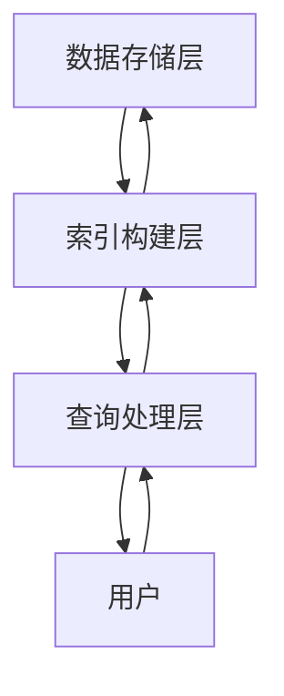

# 【大模型应用开发 动手做AI Agent】说说LlamaIndex

## 1.背景介绍

在人工智能领域，特别是自然语言处理（NLP）和生成式预训练模型（GPT）方面，近年来取得了显著的进展。大模型（Large Models）如GPT-3、BERT等已经在多个应用场景中展现了其强大的能力。然而，如何有效地利用这些大模型进行实际应用开发，特别是构建AI Agent，仍然是一个具有挑战性的问题。LlamaIndex作为一种新兴的技术框架，提供了一种高效、灵活的方式来管理和查询大规模数据集，从而支持AI Agent的开发。

## 2.核心概念与联系

### 2.1 LlamaIndex是什么

LlamaIndex是一种用于管理和查询大规模数据集的索引结构。它通过构建高效的索引，使得在大规模数据集上进行快速查询成为可能。LlamaIndex特别适用于需要高频率查询和实时响应的应用场景，如搜索引擎、推荐系统和AI Agent。

### 2.2 大模型与LlamaIndex的关系

大模型，如GPT-3，通常需要处理大量的数据来生成高质量的输出。LlamaIndex可以作为大模型的数据管理层，提供高效的数据查询和管理功能，从而提升大模型的性能和响应速度。

### 2.3 AI Agent的定义与作用

AI Agent是一种能够自主执行任务的智能系统。它可以通过与环境的交互，学习和适应新的情况，从而完成特定的任务。LlamaIndex在AI Agent中的作用主要体现在数据管理和查询方面，确保AI Agent能够快速、准确地获取所需的信息。

## 3.核心算法原理具体操作步骤

### 3.1 LlamaIndex的基本结构

LlamaIndex的基本结构包括以下几个部分：

- **数据存储层**：用于存储原始数据。
- **索引构建层**：用于构建索引。
- **查询处理层**：用于处理查询请求。

### 3.2 索引构建流程

1. **数据预处理**：对原始数据进行清洗和格式化。
2. **特征提取**：从预处理后的数据中提取特征。
3. **索引构建**：根据提取的特征构建索引。

### 3.3 查询处理流程

1. **查询解析**：将用户的查询请求解析为可处理的格式。
2. **索引查找**：在索引中查找与查询相关的数据。
3. **结果返回**：将查找结果返回给用户。

以下是LlamaIndex的基本结构和操作流程的Mermaid图：



## 4.数学模型和公式详细讲解举例说明

### 4.1 索引构建的数学模型

索引构建的核心在于特征提取和索引结构的设计。假设我们有一个数据集 $D = \{d_1, d_2, \ldots, d_n\}$，每个数据项 $d_i$ 可以表示为一个特征向量 $\mathbf{x}_i$。索引构建的目标是将这些特征向量组织成一种高效的数据结构，便于快速查询。

### 4.2 特征提取公式

特征提取可以表示为一个映射函数 $f$，将数据项 $d_i$ 映射到特征向量 $\mathbf{x}_i$：

$$
\mathbf{x}_i = f(d_i)
$$

### 4.3 索引查找公式

在查询过程中，我们需要找到与查询向量 $\mathbf{q}$ 最相似的特征向量 $\mathbf{x}_i$。这可以通过计算查询向量与特征向量之间的相似度来实现。常用的相似度度量包括欧氏距离、余弦相似度等。以余弦相似度为例，其计算公式为：

$$
\text{sim}(\mathbf{q}, \mathbf{x}_i) = \frac{\mathbf{q} \cdot \mathbf{x}_i}{\|\mathbf{q}\| \|\mathbf{x}_i\|}
$$

### 4.4 举例说明

假设我们有一个简单的数据集 $D = \{d_1, d_2, d_3\}$，其中每个数据项 $d_i$ 是一个文本。我们可以使用TF-IDF（词频-逆文档频率）作为特征提取方法，将每个文本表示为一个特征向量。然后，我们可以构建一个倒排索引来加速查询。

## 5.项目实践：代码实例和详细解释说明

### 5.1 数据预处理

```python
import pandas as pd
from sklearn.feature_extraction.text import TfidfVectorizer

# 加载数据
data = pd.read_csv('data.csv')

# 数据预处理
data['cleaned_text'] = data['text'].apply(lambda x: preprocess_text(x))
```

### 5.2 特征提取

```python
# 特征提取
vectorizer = TfidfVectorizer()
X = vectorizer.fit_transform(data['cleaned_text'])
```

### 5.3 索引构建

```python
from sklearn.neighbors import NearestNeighbors

# 构建索引
index = NearestNeighbors(n_neighbors=5, algorithm='auto').fit(X)
```

### 5.4 查询处理

```python
# 查询处理
query = "example query"
query_vec = vectorizer.transform([query])
distances, indices = index.kneighbors(query_vec)

# 返回结果
results = data.iloc[indices[0]]
print(results)
```

### 5.5 详细解释

上述代码展示了如何使用TF-IDF进行特征提取，并使用最近邻算法构建索引和处理查询。首先，我们加载并预处理数据，然后使用TF-IDF将文本数据转换为特征向量。接着，我们使用最近邻算法构建索引，并在查询时找到最相似的文本。

## 6.实际应用场景

### 6.1 搜索引擎

LlamaIndex可以用于构建高效的搜索引擎，通过快速查询大规模数据集，提供高质量的搜索结果。

### 6.2 推荐系统

在推荐系统中，LlamaIndex可以用于快速查找与用户兴趣相似的项目