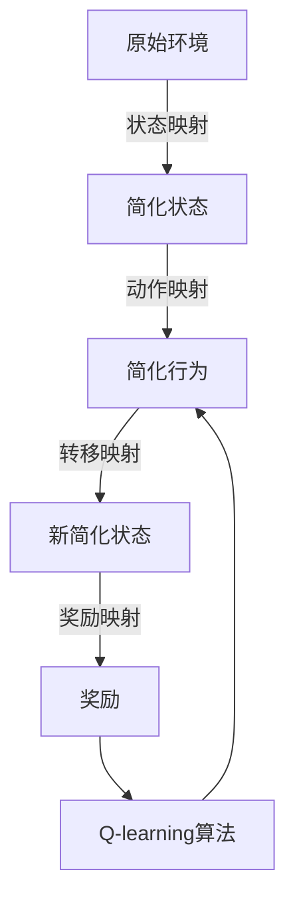

# 一切皆是映射：AI Q-learning环境模型建立

## 1. 背景介绍

在人工智能领域中,强化学习(Reinforcement Learning)是一种非常强大的机器学习范式,它允许智能体(Agent)通过与环境的交互来学习如何采取最优行为,以最大化长期累积奖励。Q-learning是强化学习中的一种经典算法,它通过估计每个状态-行为对的价值函数(Q值),来指导智能体选择最优行为。

然而,在复杂环境中,状态空间和行为空间往往是巨大的,导致传统的Q-learning算法在这种情况下效率低下。为了解决这个问题,研究人员提出了一种新的方法:将环境建模为一系列映射(Mapping),从而将复杂的环境简化为一系列简单的映射关系。这种方法被称为"Q-learning环境模型"(Q-learning Environment Model)。

## 2. 核心概念与联系

### 2.1 强化学习和Q-learning

强化学习是一种基于奖惩机制的学习方法,智能体通过与环境交互,获得奖励或惩罚,从而学习到最优策略。Q-learning是强化学习中的一种经典算法,它通过估计每个状态-行为对的价值函数(Q值),来指导智能体选择最优行为。

Q-learning算法的核心思想是,智能体在每个时间步都会观察到当前状态,并选择一个行为执行。根据执行该行为后的新状态和获得的奖励,智能体会更新相应的Q值。通过不断地与环境交互和更新Q值,智能体最终会收敛到一个最优策略。

### 2.2 Q-learning环境模型

传统的Q-learning算法在处理复杂环境时存在一些问题,例如状态空间和行为空间过大,导致计算效率低下。为了解决这个问题,研究人员提出了一种新的方法:将环境建模为一系列映射(Mapping)。

具体来说,Q-learning环境模型将环境分解为以下几个映射:

1. **状态映射(State Mapping)**: 将原始状态映射到一个简化的状态表示。
2. **动作映射(Action Mapping)**: 将原始行为映射到一个简化的行为表示。
3. **转移映射(Transition Mapping)**: 描述在执行某个行为后,从一个简化状态转移到另一个简化状态的概率。
4. **奖励映射(Reward Mapping)**: 描述在执行某个行为后,从一个简化状态转移到另一个简化状态所获得的奖励。

通过这些映射,复杂的环境被简化为一系列简单的映射关系,从而提高了Q-learning算法的计算效率。

### 2.3 Mermaid流程图

以下是Q-learning环境模型的Mermaid流程图:



在这个流程图中,原始环境首先通过状态映射被简化为一个简化状态。然后,智能体在当前简化状态下选择一个简化行为(通过动作映射)。执行该行为后,环境会根据转移映射转移到一个新的简化状态,并根据奖励映射获得相应的奖励。最后,Q-learning算法会基于新状态和奖励来更新Q值,并选择下一个行为。这个过程不断重复,直到智能体学习到最优策略。

## 3. 核心算法原理具体操作步骤

Q-learning环境模型的核心算法原理可以分为以下几个步骤:

1. **初始化**:
   - 初始化Q表,所有Q值设为0或一个较小的常数。
   - 初始化状态映射、动作映射、转移映射和奖励映射。

2. **选择行为**:
   - 将当前原始状态通过状态映射转换为简化状态。
   - 根据当前简化状态和Q表,选择一个简化行为(通常使用ε-贪婪策略)。
   - 将简化行为通过动作映射转换为原始行为。

3. **执行行为并获取反馈**:
   - 在原始环境中执行选择的原始行为。
   - 观察环境的新状态和获得的奖励。

4. **更新Q值**:
   - 将新状态通过状态映射转换为新的简化状态。
   - 根据转移映射和奖励映射,计算从当前简化状态执行选择的简化行为后,转移到新简化状态的概率和获得的奖励。
   - 根据Q-learning更新规则,更新Q表中相应的Q值。

5. **重复步骤2-4**,直到达到终止条件(如最大迭代次数或收敛)。

以下是Q-learning环境模型算法的伪代码:

```
初始化Q表和映射函数
repeat:
    将当前状态s通过状态映射转换为简化状态s'
    根据ε-贪婪策略,在s'下选择简化行为a'
    将a'通过动作映射转换为原始行为a
    在环境中执行a,观察新状态s_next和奖励r
    将s_next通过状态映射转换为简化状态s_next'
    根据转移映射和奖励映射,计算P(s_next'|s',a')和R(s_next'|s',a')
    根据Q-learning更新规则,更新Q(s',a')
    s = s_next
until 终止条件满足
```

## 4. 数学模型和公式详细讲解举例说明

在Q-learning环境模型中,我们需要定义几个关键的数学模型和公式:

### 4.1 Q值更新公式

Q-learning算法的核心是不断更新Q值,直到收敛到最优策略。Q值的更新公式如下:

$$Q(s_t, a_t) \leftarrow Q(s_t, a_t) + \alpha \left[ r_{t+1} + \gamma \max_{a} Q(s_{t+1}, a) - Q(s_t, a_t) \right]$$

其中:

- $Q(s_t, a_t)$是当前状态$s_t$下执行行为$a_t$的Q值估计。
- $\alpha$是学习率,控制了新信息对Q值更新的影响程度。
- $r_{t+1}$是执行行为$a_t$后获得的即时奖励。
- $\gamma$是折现因子,控制了未来奖励对当前Q值的影响程度。
- $\max_{a} Q(s_{t+1}, a)$是在下一状态$s_{t+1}$下,所有可能行为的最大Q值估计。

在Q-learning环境模型中,我们需要将原始状态和行为映射到简化的表示,因此Q值更新公式可以重写为:

$$Q(s'_t, a'_t) \leftarrow Q(s'_t, a'_t) + \alpha \left[ R(s'_{t+1}|s'_t, a'_t) + \gamma \max_{a'} Q(s'_{t+1}, a') - Q(s'_t, a'_t) \right]$$

其中:

- $s'_t$和$a'_t$分别是简化的状态和行为表示。
- $R(s'_{t+1}|s'_t, a'_t)$是根据奖励映射计算的,从简化状态$s'_t$执行简化行为$a'_t$后,转移到简化状态$s'_{t+1}$所获得的奖励。

### 4.2 转移概率模型

在Q-learning环境模型中,我们需要定义一个转移概率模型,描述在执行某个行为后,从一个简化状态转移到另一个简化状态的概率。我们可以使用下面的公式来表示:

$$P(s'_{t+1}|s'_t, a'_t) = \sum_{s_{t+1}} P(s_{t+1}|s_t, a_t) \cdot \mathbb{1}_{(s'_{t+1} = \phi(s_{t+1}))}$$

其中:

- $P(s'_{t+1}|s'_t, a'_t)$是从简化状态$s'_t$执行简化行为$a'_t$后,转移到简化状态$s'_{t+1}$的概率。
- $P(s_{t+1}|s_t, a_t)$是在原始环境中,从原始状态$s_t$执行原始行为$a_t$后,转移到原始状态$s_{t+1}$的概率。
- $\phi$是状态映射函数,将原始状态映射到简化状态。
- $\mathbb{1}_{(s'_{t+1} = \phi(s_{t+1}))}$是指示函数,当$s'_{t+1}$等于$\phi(s_{t+1})$时取值为1,否则为0。

通过这个转移概率模型,我们可以根据原始环境的转移概率和状态映射函数,计算出简化状态之间的转移概率。

### 4.3 示例

假设我们有一个简单的网格世界环境,智能体的目标是从起点到达终点。每个状态都是一个二维坐标$(x, y)$,行为包括上下左右四个方向移动。我们定义状态映射函数$\phi$为:

$$\phi(x, y) = (x \bmod 3, y \bmod 3)$$

也就是说,我们将原始状态的坐标对3取模,得到一个简化的状态表示。

假设在原始状态$(4, 5)$下执行行为"向右移动",转移到新状态$(5, 5)$,并获得奖励1。根据状态映射函数,简化状态为$\phi(4, 5) = (1, 2)$和$\phi(5, 5) = (2, 2)$。

那么,根据转移概率模型和奖励映射,我们可以计算:

$$P(s'_{t+1}=(2, 2)|s'_t=(1, 2), a'_t=\text{右移}) = 1$$
$$R(s'_{t+1}=(2, 2)|s'_t=(1, 2), a'_t=\text{右移}) = 1$$

也就是说,从简化状态$(1, 2)$执行简化行为"右移"后,转移到简化状态$(2, 2)$的概率为1,获得的奖励为1。

接下来,我们可以根据Q值更新公式,更新相应的Q值:

$$Q((1, 2), \text{右移}) \leftarrow Q((1, 2), \text{右移}) + \alpha \left[ 1 + \gamma \max_{a'} Q((2, 2), a') - Q((1, 2), \text{右移}) \right]$$

通过不断地与环境交互和更新Q值,智能体最终会学习到从起点到达终点的最优策略。

## 5. 项目实践:代码实例和详细解释说明

为了更好地理解Q-learning环境模型,我们将通过一个简单的网格世界示例来实现它。在这个示例中,我们将使用Python和OpenAI Gym库。

### 5.1 环境设置

首先,我们需要定义环境和相关的映射函数。在这个示例中,我们将使用一个4x4的网格世界,起点位于(0, 0),终点位于(3, 3)。状态映射函数将原始状态的坐标对4取模,动作映射函数将原始行为映射为0(上)、1(右)、2(下)、3(左)。转移映射和奖励映射将根据环境动态计算。

```python
import gym
import numpy as np

# 定义网格世界环境
env = gym.make("FrozenLake-v1", desc=None, map_name="4x4", is_slippery=False)

# 状态映射函数
state_map = lambda s: (s // 4, s % 4)

# 动作映射函数
action_map = {0: 1, 1: 2, 2: 3, 3: 0}  # 0:上, 1:右, 2:下, 3:左

# 反映射函数
state_unmap = lambda s: s[0] * 4 + s[1]
action_unmap = {v: k for k, v in action_map.items()}
```

### 5.2 Q-learning环境模型实现

接下来,我们实现Q-learning环境模型算法。我们将使用一个字典来存储Q值,其中键为(简化状态, 简化行为)对,值为对应的Q值估计。

```python
import random

# 超参数
alpha = 0.1  # 学习率
gamma = 0.9  # 折现因子
epsilon = 0.1  # 探索概率

# 初始化Q表
Q = {}
for s in range(env.observation_space.n):
    for a in range(env.action_space.n):
        Q[(state_map(s), action_map[a])] = 0

# Q-learning环境模型算法
for episode in range(1000):
    state = env.reset()