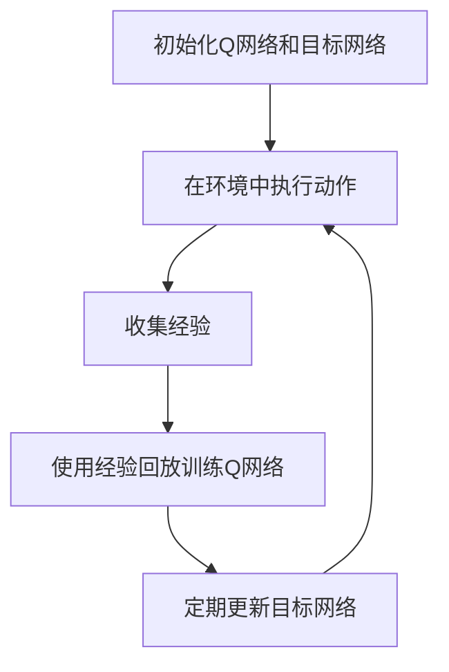

# 一切皆是映射：DQN在智能家居系统中的应用：挑战与机遇

## 1.背景介绍

在当今的科技时代，智能家居系统已经成为现代生活的重要组成部分。智能家居系统通过各种传感器、控制器和网络设备，实现对家庭环境的自动化控制和管理。随着人工智能技术的不断发展，深度强化学习（Deep Reinforcement Learning, DRL）在智能家居系统中的应用也越来越广泛。本文将探讨深度Q网络（Deep Q-Network, DQN）在智能家居系统中的应用，分析其挑战与机遇。

## 2.核心概念与联系

### 2.1 深度强化学习

深度强化学习是一种结合了深度学习和强化学习的技术。强化学习通过与环境的交互来学习最优策略，而深度学习则通过神经网络来处理复杂的输入数据。深度强化学习利用深度神经网络来近似Q值函数，从而实现对复杂环境的决策。

### 2.2 Q学习

Q学习是一种无模型的强化学习算法，通过学习状态-动作对的Q值来找到最优策略。Q值表示在给定状态下采取某一动作的预期回报。Q学习的更新公式为：

$$
Q(s, a) \leftarrow Q(s, a) + \alpha \left[ r + \gamma \max_{a'} Q(s', a') - Q(s, a) \right]
$$

其中，$s$ 和 $a$ 分别表示状态和动作，$r$ 表示即时奖励，$\alpha$ 是学习率，$\gamma$ 是折扣因子。

### 2.3 深度Q网络

深度Q网络（DQN）是将深度神经网络应用于Q学习的一种方法。DQN使用神经网络来近似Q值函数，从而能够处理高维度的状态空间。DQN的核心思想是通过经验回放和目标网络来稳定训练过程。

## 3.核心算法原理具体操作步骤

### 3.1 环境建模

在智能家居系统中，环境建模是DQN应用的第一步。环境包括家庭中的各种设备、传感器和用户行为。我们需要定义状态空间、动作空间和奖励函数。

### 3.2 状态表示

状态表示是DQN的关键步骤之一。在智能家居系统中，状态可以包括设备的当前状态、传感器数据和用户行为等。我们可以使用向量或矩阵来表示状态。

### 3.3 动作选择

动作选择是DQN的另一个关键步骤。在智能家居系统中，动作可以包括控制设备的开关、调整温度和亮度等。我们可以使用$\epsilon$-贪婪策略来选择动作。

### 3.4 奖励函数设计

奖励函数设计是DQN应用的核心。在智能家居系统中，奖励函数可以根据用户的满意度、能源消耗和设备的使用寿命等因素来设计。

### 3.5 训练过程

DQN的训练过程包括以下几个步骤：

1. 初始化Q网络和目标网络。
2. 在环境中执行动作，收集经验。
3. 使用经验回放来训练Q网络。
4. 定期更新目标网络。

以下是DQN训练过程的Mermaid流程图：



## 4.数学模型和公式详细讲解举例说明

### 4.1 Q值函数

Q值函数是DQN的核心。Q值函数表示在给定状态下采取某一动作的预期回报。Q值函数的更新公式为：

$$
Q(s, a) \leftarrow Q(s, a) + \alpha \left[ r + \gamma \max_{a'} Q(s', a') - Q(s, a) \right]
$$

### 4.2 损失函数

DQN使用均方误差（Mean Squared Error, MSE）作为损失函数。损失函数的公式为：

$$
L(\theta) = \mathbb{E}_{(s, a, r, s') \sim D} \left[ \left( r + \gamma \max_{a'} Q(s', a'; \theta^-) - Q(s, a; \theta) \right)^2 \right]
$$

其中，$\theta$ 是Q网络的参数，$\theta^-$ 是目标网络的参数，$D$ 是经验回放缓冲区。

### 4.3 经验回放

经验回放是DQN的关键技术之一。经验回放通过存储和重用过去的经验来打破数据的相关性，从而稳定训练过程。经验回放缓冲区的更新公式为：

$$
D \leftarrow D \cup \{(s, a, r, s')\}
$$

### 4.4 目标网络

目标网络是DQN的另一个关键技术。目标网络通过定期更新来稳定训练过程。目标网络的更新公式为：

$$
\theta^- \leftarrow \theta
$$

## 5.项目实践：代码实例和详细解释说明

### 5.1 环境搭建

首先，我们需要搭建智能家居系统的模拟环境。可以使用OpenAI Gym或其他模拟平台来创建环境。

```python
import gym
import numpy as np

env = gym.make('SmartHome-v0')
state = env.reset()
```

### 5.2 Q网络定义

接下来，我们定义Q网络。可以使用TensorFlow或PyTorch来构建神经网络。

```python
import tensorflow as tf
from tensorflow.keras import layers

def build_q_network(input_shape, output_shape):
    model = tf.keras.Sequential([
        layers.Dense(64, activation='relu', input_shape=input_shape),
        layers.Dense(64, activation='relu'),
        layers.Dense(output_shape)
    ])
    return model

q_network = build_q_network((state.shape[0],), env.action_space.n)
target_network = build_q_network((state.shape[0],), env.action_space.n)
target_network.set_weights(q_network.get_weights())
```

### 5.3 训练过程

然后，我们实现DQN的训练过程。

```python
optimizer = tf.keras.optimizers.Adam(learning_rate=0.001)
loss_fn = tf.keras.losses.MeanSquaredError()

def train_step(state, action, reward, next_state, done):
    with tf.GradientTape() as tape:
        q_values = q_network(state)
        q_value = tf.reduce_sum(q_values * tf.one_hot(action, env.action_space.n), axis=1)
        next_q_values = target_network(next_state)
        max_next_q_value = tf.reduce_max(next_q_values, axis=1)
        target_q_value = reward + (1 - done) * gamma * max_next_q_value
        loss = loss_fn(target_q_value, q_value)
    grads = tape.gradient(loss, q_network.trainable_variables)
    optimizer.apply_gradients(zip(grads, q_network.trainable_variables))

# 训练循环
for episode in range(num_episodes):
    state = env.reset()
    done = False
    while not done:
        action = select_action(state)
        next_state, reward, done, _ = env.step(action)
        train_step(state, action, reward, next_state, done)
        state = next_state
    if episode % target_update_freq == 0:
       