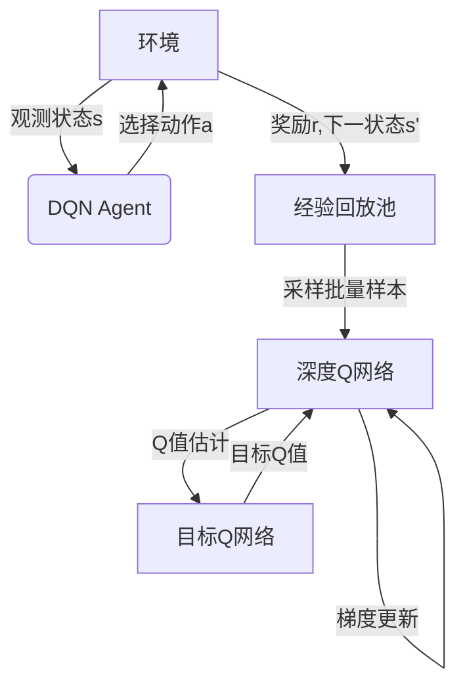

# 一切皆是映射：DQN在机器人领域的实践：挑战与策略

## 1.背景介绍

### 1.1 机器人技术的发展历程

机器人技术的发展始于20世纪中叶,经历了从早期的工业机器人到现代智能机器人的漫长演进过程。随着计算能力的不断提高和人工智能算法的飞速发展,机器人技术正在向着智能化、自主化和通用化的方向快速迈进。

### 1.2 强化学习在机器人领域的应用

强化学习(Reinforcement Learning,RL)作为人工智能的一个重要分支,已经在机器人领域得到了广泛的应用。通过与环境的不断交互,机器人可以学习到最优策略,完成各种复杂任务。深度强化学习(Deep Reinforcement Learning,DRL)则将深度神经网络引入强化学习框架,进一步提高了算法的性能和泛化能力。

### 1.3 DQN算法及其在机器人领域的意义

深度Q网络(Deep Q-Network,DQN)是深度强化学习中的一种经典算法,它利用深度神经网络来近似Q函数,从而解决了传统Q学习在高维状态空间下的困难。DQN算法在机器人领域的应用意义重大,它可以帮助机器人从复杂的环境中学习到最优策略,完成诸如导航、操作、控制等各种任务。

## 2.核心概念与联系

### 2.1 马尔可夫决策过程(MDP)

马尔可夫决策过程(Markov Decision Process,MDP)是强化学习的数学基础。它由一个五元组(S,A,P,R,γ)组成,分别表示状态空间、动作空间、状态转移概率、奖励函数和折现因子。MDP假设环境满足马尔可夫性质,即当前状态完全包含了过去所有信息。

### 2.2 Q函数与Bellman方程

Q函数Q(s,a)表示在状态s下执行动作a,之后能获得的期望累积奖励。Bellman方程描述了Q函数与环境动态之间的递推关系,是求解最优Q函数的基础。

### 2.3 DQN算法框架

DQN算法的核心思想是利用深度神经网络来近似Q函数,从而解决高维状态空间下的困难。它包括以下几个关键组件:

- 深度Q网络:用于近似Q函数的深度神经网络
- 经验回放池:存储过往的状态-动作-奖励-下一状态转换样本
- 目标Q网络:用于计算目标Q值,稳定训练过程
- ε-贪婪策略:在探索和利用之间进行权衡



## 3.核心算法原理具体操作步骤  

DQN算法的核心步骤如下:

1. 初始化深度Q网络和目标Q网络,两个网络的参数相同。
2. 初始化经验回放池为空。
3. 对于每个时间步:
    - 根据当前状态s,利用ε-贪婪策略从深度Q网络中选择动作a。
    - 执行动作a,获得奖励r和下一状态s'。
    - 将(s,a,r,s')转换样本存入经验回放池。
    - 从经验回放池中随机采样一个批量的转换样本。
    - 计算这些样本的目标Q值,利用Bellman方程:

    $$Q_{target}(s,a) = r + \gamma \max_{a'}Q(s',a';\theta^-)$$

    其中$\theta^-$为目标Q网络的参数。
    - 利用均方误差损失函数,计算深度Q网络的输出Q值与目标Q值之间的误差:

    $$L(\theta) = \mathbb{E}_{(s,a,r,s')\sim D}\left[(Q(s,a;\theta) - Q_{target}(s,a))^2\right]$$

    - 利用反向传播算法,更新深度Q网络的参数$\theta$,使得损失函数最小化。
    - 每隔一定步数,将深度Q网络的参数赋值给目标Q网络,即$\theta^- \leftarrow \theta$。

4. 重复第3步,直到收敛。

## 4.数学模型和公式详细讲解举例说明

### 4.1 Bellman方程

Bellman方程是强化学习的核心,它描述了当前状态的价值函数与后继状态的价值函数之间的递推关系。对于Q函数,Bellman方程可以表示为:

$$Q(s,a) = \mathbb{E}_{s' \sim P(s'|s,a)}\left[r(s,a) + \gamma \max_{a'} Q(s',a')\right]$$

其中:

- $s$和$a$分别表示当前状态和动作
- $s'$表示执行动作$a$后到达的下一状态
- $r(s,a)$表示在状态$s$执行动作$a$后获得的即时奖励
- $\gamma \in [0,1]$是折现因子,用于权衡当前奖励和未来奖励的重要性
- $P(s'|s,a)$是状态转移概率,表示从状态$s$执行动作$a$后转移到状态$s'$的概率

Bellman方程揭示了一个重要的事实:当前状态的价值函数可以由后继状态的价值函数递推计算得到。这为求解最优策略奠定了理论基础。

### 4.2 Q-Learning算法

Q-Learning是一种基于Bellman方程的经典强化学习算法,它直接学习Q函数,而不需要先学习状态价值函数。Q-Learning算法的更新规则为:

$$Q(s,a) \leftarrow Q(s,a) + \alpha \left[r + \gamma \max_{a'} Q(s',a') - Q(s,a)\right]$$

其中$\alpha$是学习率,控制着每次更新的步长。Q-Learning算法通过不断与环境交互,逐步更新Q函数,最终收敛到最优Q函数。

然而,在高维状态空间下,Q-Learning算法很难直接对Q函数进行表格存储和更新,因为状态空间过大,导致计算和存储开销巨大。这就需要借助函数逼近的方法,例如利用深度神经网络来近似Q函数,这就是DQN算法的核心思想。

### 4.3 DQN算法目标函数

在DQN算法中,我们利用深度神经网络$Q(s,a;\theta)$来近似Q函数,其中$\theta$表示网络的参数。为了训练这个网络,我们需要定义一个目标函数,使得网络输出的Q值尽可能接近真实的Q值。

DQN算法中的目标函数是均方误差损失函数:

$$L(\theta) = \mathbb{E}_{(s,a,r,s')\sim D}\left[(Q(s,a;\theta) - Q_{target}(s,a))^2\right]$$

其中:

- $D$是经验回放池,用于存储过往的状态-动作-奖励-下一状态转换样本
- $Q_{target}(s,a)$是目标Q值,根据Bellman方程计算得到:

$$Q_{target}(s,a) = r + \gamma \max_{a'}Q(s',a';\theta^-)$$

- $\theta^-$表示目标Q网络的参数,它是深度Q网络参数$\theta$的复制,但是更新频率较低,用于稳定训练过程

通过最小化上述目标函数,我们可以使得深度Q网络的输出Q值逐渐逼近真实的Q值,从而学习到最优的Q函数近似。

### 4.4 示例:机器人导航任务

假设我们有一个机器人导航任务,机器人需要从起点到达终点。状态$s$表示机器人在二维平面上的位置和方向,动作$a$表示机器人的移动方向。我们定义奖励函数$r(s,a)$如下:

- 如果机器人到达终点,给予大的正奖励(例如+100)
- 如果机器人撞墙或者离开有效区域,给予大的负奖励(例如-100)
- 其他情况下,给予小的负奖励(例如-1),鼓励机器人尽快到达终点

在这个任务中,我们可以利用DQN算法训练一个深度Q网络,使其学习到最优的Q函数近似。具体步骤如下:

1. 初始化深度Q网络和目标Q网络,两个网络的参数相同。
2. 初始化经验回放池为空。
3. 对于每个时间步:
    - 根据当前状态$s$,利用$\epsilon$-贪婪策略从深度Q网络中选择动作$a$。
    - 执行动作$a$,获得奖励$r$和下一状态$s'$。
    - 将$(s,a,r,s')$转换样本存入经验回放池。
    - 从经验回放池中随机采样一个批量的转换样本。
    - 计算这些样本的目标Q值,利用Bellman方程:

    $$Q_{target}(s,a) = r + \gamma \max_{a'}Q(s',a';\theta^-)$$

    - 利用均方误差损失函数,计算深度Q网络的输出Q值与目标Q值之间的误差:

    $$L(\theta) = \mathbb{E}_{(s,a,r,s')\sim D}\left[(Q(s,a;\theta) - Q_{target}(s,a))^2\right]$$

    - 利用反向传播算法,更新深度Q网络的参数$\theta$,使得损失函数最小化。
    - 每隔一定步数,将深度Q网络的参数赋值给目标Q网络,即$\theta^- \leftarrow \theta$。

4. 重复第3步,直到收敛。

通过上述训练过程,机器人最终可以学习到一个近似最优的Q函数,从而找到从起点到终点的最佳路径。

## 5.项目实践:代码实例和详细解释说明

为了更好地理解DQN算法在机器人领域的实践,我们将提供一个基于PyTorch的代码示例,实现一个简单的机器人导航任务。

### 5.1 环境设置

首先,我们需要定义机器人导航任务的环境。这里我们使用一个简单的二维网格世界,机器人可以在网格中上下左右移动。我们定义了以下几个关键组件:

- `GridWorld`类:表示网格世界环境,包含障碍物、起点和终点等信息。
- `Robot`类:表示机器人,包含机器人的当前位置和方向。
- `State`类:表示机器人的状态,包括位置和方向。
- `Action`枚举类:定义了机器人可执行的四个动作(上、下、左、右)。

```python
import enum

class Action(enum.Enum):
    UP = 0
    DOWN = 1
    LEFT = 2
    RIGHT = 3

class State:
    def __init__(self, x, y, direction):
        self.x = x
        self.y = y
        self.direction = direction

    def __hash__(self):
        return hash((self.x, self.y, self.direction))

    def __eq__(self, other):
        return (self.x, self.y, self.direction) == (other.x, other.y, other.direction)

class Robot:
    def __init__(self, grid_world, init_state):
        self.grid_world = grid_world
        self.state = init_state

    def move(self, action):
        ...

class GridWorld:
    def __init__(self, width, height, obstacles, start, goal):
        ...

    def get_next_state(self, state, action):
        ...

    def is_terminal(self, state):
        ...

    def get_reward(self, state):
        ...
```

### 5.2 DQN Agent实现

接下来,我们实现DQN Agent,包括深度Q网络、经验回放池和训练逻辑。

```python
import torch
import torch.nn as nn
import torch.optim as optim
import random
from collections import deque

class DQN(nn.Module):
    def __init__(self, state_dim, action_dim):
        super(DQN, self).__init__()
        self.fc1 = nn.Linear(state_dim, 64)
        self.fc2 = nn.Linear(64, action_dim)

    def forward(self, x):
        x = torch.relu(self.fc1(x))
        x = self.fc2(x)
        return x

class ReplayBuffer:
    def __init__(self, capacity):
        self.buffer = deque(maxlen=capacity)

    def push(self, state, action, reward, next_state, done):
        self.buffer.append((state, action, reward, next_state, done))

    def sample(self, batch