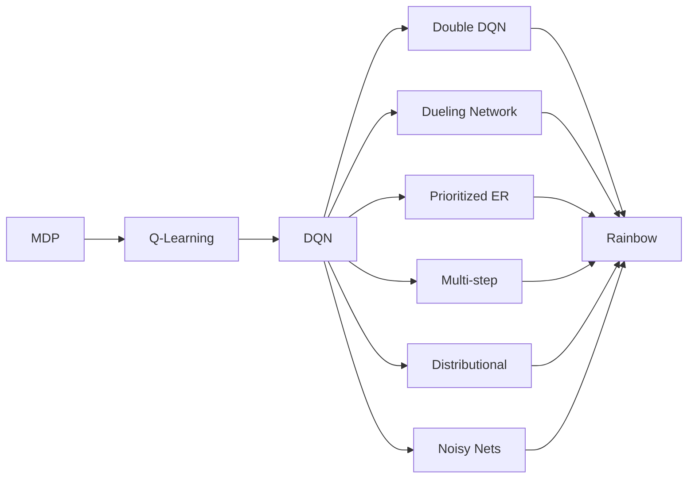

# 一切皆是映射：从DQN到Rainbow：全面指南与实践小结

## 1.背景介绍
### 1.1 强化学习的发展历程
#### 1.1.1 强化学习的起源与定义
#### 1.1.2 强化学习的里程碑
#### 1.1.3 深度强化学习的崛起

### 1.2 深度Q网络(DQN)的诞生
#### 1.2.1 Q-Learning 算法
#### 1.2.2 DQN的创新点
#### 1.2.3 DQN的局限性

### 1.3 后DQN时代的探索
#### 1.3.1 DQN改进算法一览
#### 1.3.2 Rainbow的提出
#### 1.3.3 本文的目标与贡献

## 2.核心概念与联系
### 2.1 MDP与Q-Learning
#### 2.1.1 马尔科夫决策过程(MDP) 
#### 2.1.2 Q-Learning算法详解
#### 2.1.3 Q-Learning的收敛性证明

### 2.2 DQN的核心要素
#### 2.2.1 神经网络作为Q函数近似器
#### 2.2.2 经验回放(Experience Replay)
#### 2.2.3 目标网络(Target Network)

### 2.3 Rainbow的组成部分
#### 2.3.1 Double DQN
#### 2.3.2 Dueling Network
#### 2.3.3 Prioritized Experience Replay
#### 2.3.4 Multi-step Learning 
#### 2.3.5 Distributional RL
#### 2.3.6 Noisy Nets

### 2.4 核心概念之间的联系


## 3.核心算法原理具体操作步骤
### 3.1 DQN算法步骤
#### 3.1.1 初始化经验回放池与Q网络
#### 3.1.2 与环境交互并存储经验
#### 3.1.3 从经验池采样并计算Q学习目标
#### 3.1.4 梯度下降更新网络参数
#### 3.1.5 定期更新目标网络

### 3.2 Double DQN算法步骤 
#### 3.2.1 引入Double Q-Learning思想
#### 3.2.2 修改Q目标计算方式
#### 3.2.3 其他步骤与DQN一致

### 3.3 Dueling Network算法步骤
#### 3.3.1 引入优势函数与状态值函数
#### 3.3.2 网络输出层拆分为两部分
#### 3.3.3 最后再组合成Q值输出
#### 3.3.4 其他步骤与DQN类似

### 3.4 Prioritized ER算法步骤
#### 3.4.1 引入TD误差作为优先级
#### 3.4.2 基于优先级采样
#### 3.4.3 引入importance-sampling权重
#### 3.4.4 更新经验的优先级
#### 3.4.5 其他步骤与DQN类似

### 3.5 Multi-step Learning算法步骤
#### 3.5.1 引入n步回报
#### 3.5.2 修改Q目标计算方式
#### 3.5.3 其他步骤与DQN类似

### 3.6 Distributional RL算法步骤
#### 3.6.1 从期望值估计到分布估计
#### 3.6.2 将网络输出从单值改为原子概率
#### 3.6.3 投影分布并计算分布损失 
#### 3.6.4 其他步骤与DQN类似

### 3.7 Noisy Nets算法步骤
#### 3.7.1 为网络权重引入参数化噪声
#### 3.7.2 重参数化噪声采样
#### 3.7.3 其他步骤与DQN一致

## 4.数学模型和公式详细讲解举例说明
### 4.1 MDP的数学定义
一个MDP可以表示为一个五元组 $\langle S,A,P,R,\gamma \rangle$，其中：
- $S$ 是有限的状态集；
- $A$ 是有限的动作集；  
- $P$是状态转移概率矩阵，$P_{ss'}^a=P[S_{t+1}=s'|S_t=s,A_t=a]$；
- $R$是回报函数，$R_s^a=\mathbb{E}[R_{t+1}|S_t=s,A_t=a]$；
- $\gamma$是折扣因子，$\gamma \in [0,1]$。

求解MDP就是要寻找一个策略$\pi(a|s)$，使得期望总回报最大化：

$$\pi^* = \arg\max_\pi \mathbb{E}[\sum_{t=0}^{\infty} \gamma^t R_{t+1}|S_0,\pi]$$

### 4.2 Q-Learning的数学定义
Q-Learning是一种值迭代方法，通过不断迭代更新状态-动作值函数$Q(s,a)$来逼近最优$Q^*(s,a)$。

$$Q(S_t,A_t) \leftarrow Q(S_t,A_t) + \alpha[R_{t+1} + \gamma \max_a Q(S_{t+1},a) - Q(S_t,A_t)]$$

其中$\alpha$是学习率。Q-Learning算法可以被证明在适当的条件下一定收敛到最优值函数$Q^*$。 

### 4.3 DQN的数学定义
DQN用深度神经网络$Q_\theta(s,a)$来近似$Q^*(s,a)$，其中$\theta$为网络参数。DQN的目标是最小化如下损失函数：

$$L(\theta) = \mathbb{E}_{(s,a,r,s')\sim D}[(r + \gamma \max_{a'}Q_{\theta^-}(s',a') - Q_\theta(s,a))^2]$$

其中$D$为经验回放池，$\theta^-$为目标网络参数，它定期从$\theta$复制而来。

### 4.4 Double DQN的数学定义
Double DQN对Q学习目标做了如下修改，以减少过估计：

$$L(\theta) = \mathbb{E}_{(s,a,r,s')\sim D}[(r + \gamma Q_{\theta^-}(s',\arg\max_{a'}Q_\theta(s',a')) - Q_\theta(s,a))^2]$$

### 4.5 Dueling Network的数学定义
Dueling Network将Q函数分解为状态值函数和优势函数两部分：

$$Q(s,a) = V(s) + A(s,a)$$

其中$V(s)$为状态值函数，$A(s,a)$为优势函数，且满足$\sum_a A(s,a)=0$。网络分别估计$V(s)$和$A(s,a)$。

### 4.6 Prioritized ER的数学定义
Prioritized ER根据TD误差$\delta$的绝对值来定义经验的优先级：

$$p_i = |\delta_i| + \epsilon$$

其中$\epsilon$是一个小的正数，以确保所有经验都有被采样的可能。采样概率为：

$$P(i) = \frac{p_i^\alpha}{\sum_k p_k^\alpha}$$

其中$\alpha$控制了优先级的影响程度。为了抵消优先级采样带来的偏差，在计算损失时引入importance-sampling权重：

$$w_i = (\frac{1}{N} \cdot \frac{1}{P(i)})^\beta$$

其中$N$为经验池大小，$\beta$控制了权重的影响程度。

### 4.7 Multi-step Learning的数学定义
Multi-step Learning使用n步回报来定义Q学习目标：

$$G_t^{(n)} = R_{t+1} + \gamma R_{t+2} + ... + \gamma^{n-1}R_{t+n} + \gamma^n \max_a Q_{\theta^-}(S_{t+n},a)$$

$$L(\theta) = \mathbb{E}_{(s,a,G^{(n)})\sim D}[(G^{(n)} - Q_\theta(s,a))^2]$$

### 4.8 Distributional RL的数学定义
Distributional RL估计值分布而非期望。Q值分布被离散化为一组原子$z_i$，网络输出每个原子的概率$p_i$，即$Z_\theta(s,a) = (z_i, p_i)_{i=1}^N$。

投影算子$\Phi$将分布投影回原子集支撑：

$$(\Phi \mathcal{T} Z_{\theta^-}(s,a))_i = \sum_{j=0}^{N-1} [1 - \frac{\mathcal{T}z_j - z_i}{\Delta z}]_0^1 p_j(s,a)$$

其中$\mathcal{T}$为Bellman算子，$\Delta z$为原子间距。网络的训练目标是最小化分布损失，如Wasserstein距离：

$$L(\theta) = \mathbb{E}_{(s,a,r,s')\sim D}[W_2(r+\gamma Z_{\theta^-}(s',a^*), Z_\theta(s,a))]$$

### 4.9 Noisy Nets的数学定义
Noisy Net在网络权重$w$上添加参数化噪声：

$$w = w + w_{noisy} \odot \epsilon$$

其中$w_{noisy}$为可学习参数，$\epsilon$为噪声，通常取高斯噪声或因式噪声。为了可微，采用重参数化技巧对噪声采样。

## 5.项目实践：代码实例和详细解释说明
下面我们以PyTorch为例，给出Rainbow算法的简要实现。

```python
import torch
import torch.nn as nn
import torch.optim as optim
import numpy as np
import random
from collections import deque

# Q网络，包含Dueling和Noisy机制
class RainbowDQN(nn.Module):
    def __init__(self, state_dim, action_dim, hidden_dim, atom_num, vmin, vmax):
        super().__init__()
        self.atom_num = atom_num
        self.vmin = vmin
        self.vmax = vmax
        self.delta_z = (vmax - vmin) / (atom_num - 1)
        self.register_buffer("z", torch.linspace(vmin, vmax, atom_num)) # 支撑集
        
        # 带噪声的隐藏层
        self.fc_v = NoisyLinear(state_dim, hidden_dim)
        self.fc_a = NoisyLinear(state_dim, hidden_dim)
        self.fc_v2 = NoisyLinear(hidden_dim, atom_num)
        self.fc_a2 = NoisyLinear(hidden_dim, action_dim * atom_num)
        
    def forward(self, x):
        v = self.fc_v2(F.relu(self.fc_v(x)))
        a = self.fc_a2(F.relu(self.fc_a(x)))
        a = a.view(-1, self.action_dim, self.atom_num)
        q = v.unsqueeze(2) + a - a.mean(2, keepdim=True) # 组合v和a，得到每个动作的值分布
        q = F.softmax(q, dim=2) # 每个原子上的概率
        return q
    
    def reset_noise(self):
        self.fc_v.reset_noise()
        self.fc_a.reset_noise()
        self.fc_v2.reset_noise()
        self.fc_a2.reset_noise()

# NoisyLinear层
class NoisyLinear(nn.Module):
    def __init__(self, in_dim, out_dim):
        super().__init__()
        self.in_dim = in_dim
        self.out_dim = out_dim
        self.mu_w = nn.Parameter(torch.zeros(out_dim, in_dim))
        self.sigma_w = nn.Parameter(torch.zeros(out_dim, in_dim))
        self.mu_b = nn.Parameter(torch.zeros(out_dim))
        self.sigma_b = nn.Parameter(torch.zeros(out_dim))
        self.reset_noise()

    def reset_noise(self):
        epsilon_w = torch.randn(self.out_dim, self.in_dim)
        epsilon_b = torch.randn(self.out_dim)
        self.w_noise = torch.sign(epsilon_w) * torch.sqrt(torch.abs(epsilon_w))
        self.b_noise = torch.sign(epsilon_b) * torch.sqrt(torch.abs(epsilon_b))

    def forward(self, x):
        w = self.mu_w + self.sigma_w * self.w_noise
        b = self.mu_b + self.sigma_b * self.b_noise
        return F.linear(x, w, b)
        
# 优先级经验回放
class PrioritizedReplayBuffer:
    def __init__(self, capacity, alpha=0.6, beta=0.4):
        self.capacity = capacity
        self.alpha = alpha
        self.beta = beta
        self.buffer = []
        self.priorities = np.zeros((capacity,), dtype=np.float32)
        self.pos = 0
        
    def push(self, state, action, reward, next_state, done):
        max_prio = self.priorities.max() if self.buffer else 1.0
        if len(self.buffer) < self.capacity:
            self.buffer.append((state, action, rewar