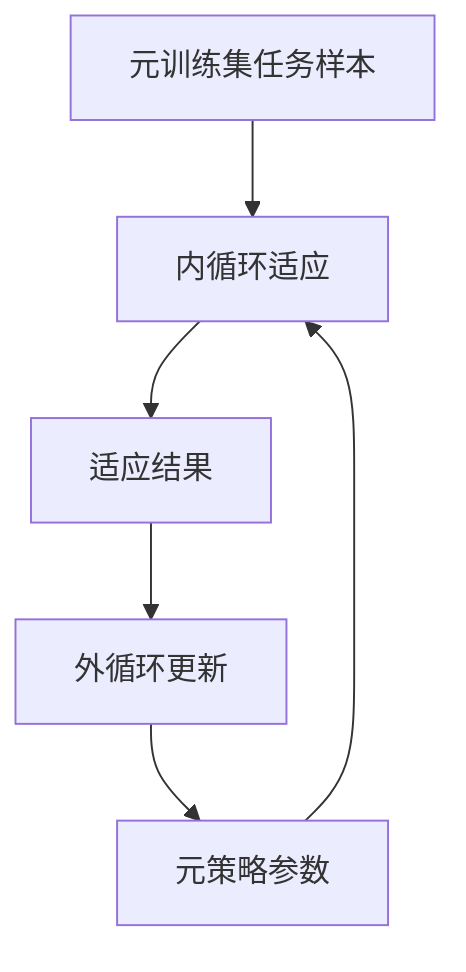
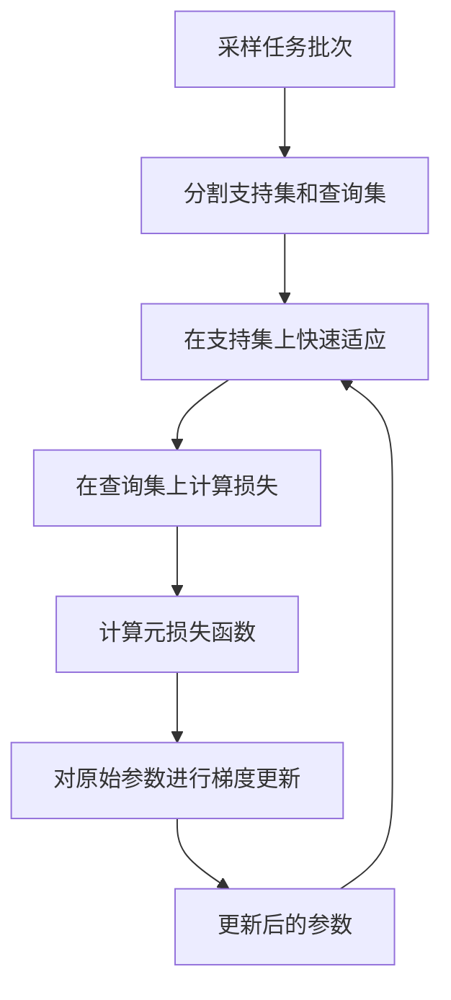

# 一切皆是映射：元学习：从理论到视觉识别的实践

## 1.背景介绍

### 1.1 人工智能的新范式

人工智能领域一直在不断发展和演进。从早期的专家系统到现代的深度学习模型,我们见证了人工智能技术的飞速进步。然而,传统的机器学习方法存在一个主要缺陷:它们需要大量的标记数据和专门设计的特征工程,这使得模型的训练和部署过程变得昂贵且耗时。为了解决这一问题,元学习(Meta-Learning)应运而生,它提供了一种全新的范式,旨在提高模型的学习效率和泛化能力。

### 1.2 元学习的核心思想

元学习的核心思想是"学习如何学习"。与传统的机器学习方法不同,元学习算法不是直接从数据中学习特定任务的模型,而是学习一种能够快速适应新任务的元策略。这种元策略可以被看作是一种高级知识,它能够指导模型如何有效地从少量数据中学习新任务。

### 1.3 元学习在视觉识别中的应用

视觉识别是人工智能领域的一个重要分支,它涉及从图像或视频中识别和理解物体、场景、行为等。由于视觉数据的多样性和复杂性,传统的机器学习方法往往需要大量的标记数据和手工设计的特征,这使得模型的训练和部署过程变得困难。元学习为解决这一挑战提供了一种新的思路,它可以帮助模型从少量数据中快速学习新的视觉识别任务,从而提高模型的泛化能力和适应性。

## 2.核心概念与联系

### 2.1 元学习的核心概念

#### 2.1.1 任务分布

在元学习中,我们假设存在一个任务分布 $\mathcal{P}(\mathcal{T})$,其中每个任务 $\mathcal{T}$ 都是一个独立的学习问题,具有自己的数据分布和目标函数。元学习算法的目标是学习一种能够快速适应新任务的元策略,而不是直接学习每个任务的具体模型。

#### 2.1.2 元训练集和元测试集

为了训练元学习算法,我们需要构建一个元训练集 $\mathcal{D}_{\text{train}}$,它包含了一系列来自任务分布 $\mathcal{P}(\mathcal{T})$ 的任务样本。在训练过程中,元学习算法会在这些任务样本上学习一种元策略。同时,我们还需要一个元测试集 $\mathcal{D}_{\text{test}}$,用于评估元学习算法在新任务上的泛化能力。

```mermaid
graph TD
    A[任务分布 P(T)] --> B[元训练集]
    A --> C[元测试集]
    B --> D[元学习算法]
    D --> E[元策略]
    C --> F[评估]
    E --> F
```

#### 2.1.3 内循环和外循环

元学习算法通常采用一种双循环优化策略,包括内循环和外循环。在内循环中,算法使用来自元训练集的任务样本,根据当前的元策略快速适应该任务。在外循环中,算法会根据内循环的适应结果,更新元策略参数,以提高在新任务上的泛化能力。



### 2.2 元学习与传统机器学习的关系

元学习可以被看作是一种更高层次的学习范式,它与传统的机器学习方法存在一定的关联和区别。

- 相似之处:两者都旨在从数据中学习模型,以解决特定的问题。
- 不同之处:传统机器学习专注于学习单个任务的模型,而元学习则关注学习一种能够快速适应新任务的元策略。

总的来说,元学习提供了一种新的思路,它可以帮助模型更有效地利用少量数据,提高泛化能力和适应性,从而应对复杂和多变的环境。

## 3.核心算法原理具体操作步骤

### 3.1 基于优化的元学习算法

#### 3.1.1 模型不可知元学习 (Model-Agnostic Meta-Learning, MAML)

MAML是一种广为人知的基于优化的元学习算法,它可以应用于各种模型架构和任务类型。MAML的核心思想是通过对元训练集中的任务样本进行快速适应,来学习一种能够快速适应新任务的初始参数。

MAML算法的具体操作步骤如下:

1. 从元训练集 $\mathcal{D}_{\text{train}}$ 中采样一批任务 $\mathcal{T}_i$。
2. 对于每个任务 $\mathcal{T}_i$,将其数据分为支持集 $\mathcal{D}_i^{\text{sup}}$ 和查询集 $\mathcal{D}_i^{\text{query}}$。
3. 使用当前的模型参数 $\theta$ 在支持集 $\mathcal{D}_i^{\text{sup}}$ 上进行几步梯度下降,获得适应后的参数 $\theta_i'$。
4. 使用适应后的参数 $\theta_i'$ 在查询集 $\mathcal{D}_i^{\text{query}}$ 上计算损失函数 $\mathcal{L}_i(\theta_i')$。
5. 对所有任务的损失函数求和,得到元损失函数 $\sum_i \mathcal{L}_i(\theta_i')$。
6. 使用元损失函数对原始参数 $\theta$ 进行梯度更新,以最小化元损失函数。

$$\theta \leftarrow \theta - \alpha \nabla_\theta \sum_i \mathcal{L}_i(\theta_i')$$

其中 $\alpha$ 是学习率。

通过反复执行上述步骤,MAML算法可以学习到一组初始参数 $\theta$,使得在任何新任务上,只需要少量的梯度更新就能够快速适应该任务。



#### 3.1.2 reptile算法

Reptile算法是另一种基于优化的元学习算法,它的思想与MAML类似,但更加简单和高效。Reptile算法的操作步骤如下:

1. 初始化模型参数 $\theta$。
2. 从元训练集 $\mathcal{D}_{\text{train}}$ 中采样一批任务 $\mathcal{T}_i$。
3. 对于每个任务 $\mathcal{T}_i$,使用当前参数 $\theta$ 在该任务的数据上进行几步梯度下降,获得适应后的参数 $\theta_i'$。
4. 计算适应后参数的均值 $\overline{\theta'} = \frac{1}{n} \sum_i \theta_i'$。
5. 使用以下更新规则对原始参数 $\theta$ 进行更新:

$$\theta \leftarrow \theta + \beta (\overline{\theta'} - \theta)$$

其中 $\beta$ 是一个超参数,控制更新步长。

6. 重复步骤2-5,直到模型收敛。

Reptile算法的关键在于将原始参数 $\theta$ 朝着适应后参数的均值 $\overline{\theta'}$ 的方向移动,从而使得参数能够更好地适应新任务。与MAML相比,Reptile算法更加简单和高效,不需要计算二阶导数,因此更加易于实现和优化。

### 3.2 基于度量的元学习算法

#### 3.2.1 匹配网络 (Matching Networks)

匹配网络是一种基于度量的元学习算法,它通过学习一种适当的相似度度量,来解决少样本学习问题。匹配网络的核心思想是将新任务中的样本与支持集中的样本进行匹配,并根据它们的相似度来预测新样本的标签。

匹配网络算法的操作步骤如下:

1. 从元训练集 $\mathcal{D}_{\text{train}}$ 中采样一批任务 $\mathcal{T}_i$。
2. 对于每个任务 $\mathcal{T}_i$,将其数据分为支持集 $\mathcal{D}_i^{\text{sup}}$ 和查询集 $\mathcal{D}_i^{\text{query}}$。
3. 使用编码网络 $f_\phi$ 对支持集和查询集中的样本进行编码,得到特征向量 $\mathbf{x}_k^{(i)}$ 和 $\mathbf{x}_q^{(i)}$。
4. 计算查询样本 $\mathbf{x}_q^{(i)}$ 与所有支持样本 $\mathbf{x}_k^{(i)}$ 之间的相似度,通常使用余弦相似度或欧几里得距离。
5. 根据相似度得分,使用注意力机制或软最大值函数计算查询样本的预测标签分布 $p_\phi(\mathbf{y}_q^{(i)} | \mathbf{x}_q^{(i)}, \mathcal{D}_i^{\text{sup}})$。
6. 计算预测标签与真实标签之间的交叉熵损失,并对编码网络参数 $\phi$ 进行梯度更新。

通过在元训练集上反复训练,匹配网络可以学习到一种有效的相似度度量,使得在新任务上,只需要根据支持集中的少量样本,就能够准确地预测查询样本的标签。

#### 3.2.2 原型网络 (Prototypical Networks)

原型网络是另一种基于度量的元学习算法,它的思想与匹配网络类似,但更加简单和高效。原型网络的核心思想是将每个类别的支持样本编码为一个原型向量,然后根据查询样本与各个原型向量之间的距离来预测其标签。

原型网络算法的操作步骤如下:

1. 从元训练集 $\mathcal{D}_{\text{train}}$ 中采样一批任务 $\mathcal{T}_i$。
2. 对于每个任务 $\mathcal{T}_i$,将其数据分为支持集 $\mathcal{D}_i^{\text{sup}}$ 和查询集 $\mathcal{D}_i^{\text{query}}$。
3. 使用编码网络 $f_\phi$ 对支持集和查询集中的样本进行编码,得到特征向量 $\mathbf{x}_k^{(i)}$ 和 $\mathbf{x}_q^{(i)}$。
4. 计算每个类别的原型向量 $\mathbf{c}_k^{(i)}$,通常为该类别所有支持样本特征向量的均值。
5. 计算查询样本 $\mathbf{x}_q^{(i)}$ 与每个原型向量 $\mathbf{c}_k^{(i)}$ 之间的距离,通常使用欧几里得距离。
6. 根据距离得分,使用软最大值函数计算查询样本的预测标签分布 $p_\phi(\mathbf{y}_q^{(i)} | \mathbf{x}_q^{(i)}, \mathcal{D}_i^{\text{sup}})$。
7. 计算预测标签与真实标签之间的交叉熵损失,并对编码网络参数 $\phi$ 进行梯度更新。

原型网络的优点在于计算简单高效,不需要计算注意力机制,并且具有很好的解释性,因为原型向量可以被视为每个类别的代表性特征。

### 3.3 基于生成模型的元学习算法

#### 3.3.1 元学习生成对抗网络 (Meta-Learning with Generative Adversarial Networks, MLGAN)

MLGAN是一种基于生成模型的元学习算法,它结合了元学习和生成对抗网络(GAN)的思想,旨在学习一种能够快速生成新任务样本的生成模型。

MLGAN算法的操作步骤如下:

1. 从元训练集 $\mathcal{D}_{\text{train}}$ 中采样一批任务 $\mathcal{T}_i$。
2. 对于每个任务 $\mathcal{T}_i$,将其数据分为支持集 $\mathcal{D}_i^{\text{sup}}$ 和查询集 $\mathcal{D