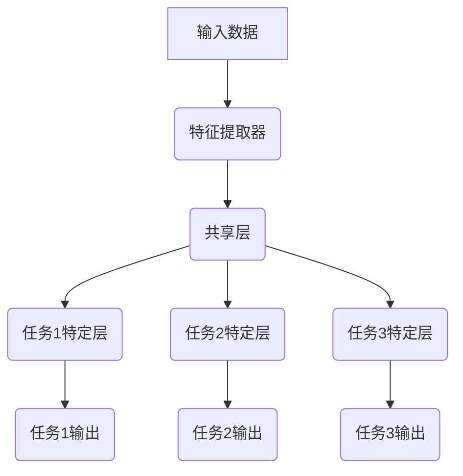
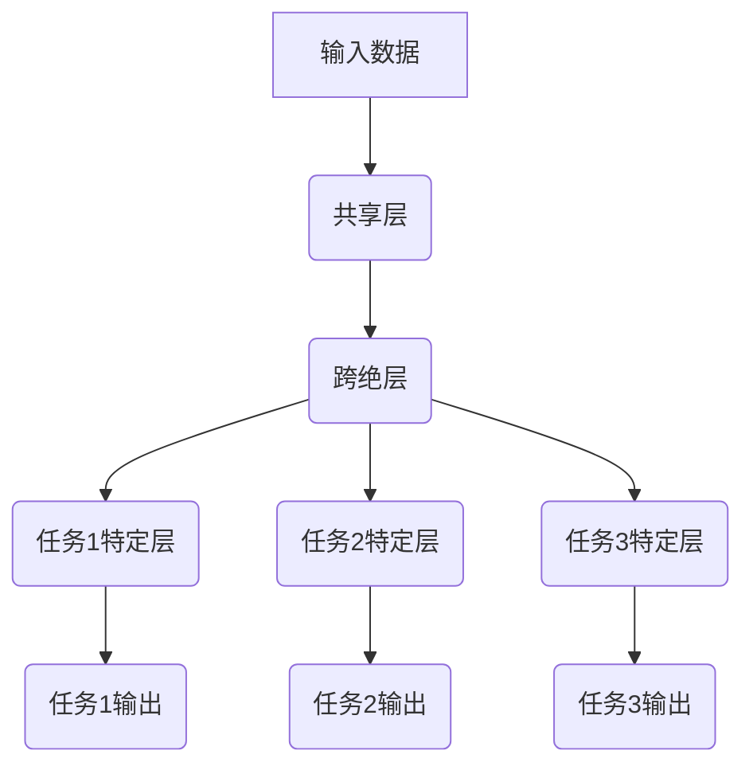

# 一切皆是映射：多任务学习与神经网络的协同训练

## 1. 背景介绍

### 1.1 人工智能的发展历程

人工智能(Artificial Intelligence, AI)是当代科技发展的重要领域之一。自20世纪50年代诞生以来,AI不断发展壮大,已经渗透到我们生活的方方面面。从最初的专家系统、决策树算法,到后来的支持向量机、贝叶斯网络等统计学习方法,再到如今火热的深度学习,AI的能力不断提升,应用领域也在不断扩大。

### 1.2 深度学习的兴起

深度学习(Deep Learning)是机器学习的一个新的研究热点,它模仿人脑的机制来处理数据。通过构建神经网络模型,并使用大量数据进行训练,深度学习能够自动学习数据的特征,并对其进行分类或预测。近年来,由于算力的飞速提升、训练数据的爆炸式增长,以及一些突破性算法的提出,深度学习取得了令人瞩目的成就,在计算机视觉、自然语言处理、语音识别等领域表现优异。

### 1.3 多任务学习的兴起

然而,传统的深度学习模型通常是为单一任务而设计的,这种做法存在一些缺陷:
1) 数据集的局限性,单一任务的数据集往往有限
2) 知识的孤岛效应,单任务模型无法共享和迁移知识
3) 计算资源的浪费,每个任务都需要独立训练一个模型

为了解决这些问题,多任务学习(Multi-Task Learning, MTL)应运而生。多任务学习的核心思想是:在同一个模型中同时学习多个相关任务,使得模型在学习过程中可以共享知识,提高泛化能力。

## 2. 核心概念与联系

### 2.1 多任务学习的定义

多任务学习是机器学习中的一种范式,它通过在同一个模型中共同训练多个相关任务,使得模型可以从这些任务中获益,提高单个任务的性能。形式上,给定 $K$ 个学习任务 $\{T_1, T_2, ..., T_K\}$,每个任务由训练数据 $D_k$ 和学习目标 $L_k$ 组成。多任务学习的目标是通过某种共享机制,使得在优化所有任务的损失函数时,各个任务之间可以相互借鉴、促进。

### 2.2 多任务学习的优势

相比单任务学习,多任务学习具有以下优势:

1. **数据效率**:通过共享参数,多任务学习可以更有效地利用所有任务的数据,缓解单个任务数据不足的问题。

2. **泛化能力**:多个相关任务之间存在一些共享的底层知识,多任务学习可以利用这些共享知识,提高模型的泛化能力。

3. **迁移学习**:训练好的多任务模型可以作为预训练模型,为新任务提供良好的初始化参数,加速新任务的训练。

4. **鲁棒性**:多任务学习可以一定程度上缓解过拟合问题,使模型具有更好的鲁棒性。

### 2.3 多任务学习与单任务学习

多任务学习与传统的单任务学习存在本质区别。单任务学习是为了解决一个特定的问题,而多任务学习则是在同一个模型中同时学习多个相关任务。这种做法使得模型可以共享参数和知识,从而提高了数据利用率和泛化能力。

### 2.4 多任务学习与迁移学习

多任务学习与迁移学习(Transfer Learning)有一定的联系,但也有区别。迁移学习是将在源域学习到的知识迁移到目标域,以加速目标任务的学习。而多任务学习则是在同一个模型中同时学习多个任务,使得各个任务之间可以相互促进。不过,训练好的多任务模型也可以作为预训练模型,为新任务提供良好的初始化参数,从这个角度看,多任务学习可以看作是一种迁移学习的方式。

## 3. 核心算法原理具体操作步骤

### 3.1 多任务学习的基本框架

多任务学习的基本框架如下:

1. **输入数据**:包含了所有任务的训练数据。
2. **特征提取器**:用于从原始输入数据中提取特征,可以是卷积层、LSTM等。
3. **共享层**:多个任务共享的层,用于学习任务之间的共同知识。
4. **任务特定层**:针对每个具体任务的特定层,用于学习该任务的特定知识。
5. **输出层**:每个任务对应一个输出层,用于产生该任务的预测结果。

在训练过程中,通过反向传播算法同时优化所有任务的损失函数,使得模型可以在各个任务之间共享知识。

### 3.2 硬参数共享

硬参数共享是多任务学习中最基本、最常见的参数共享方式。它的做法是:在神经网络的底层,不同任务共享一部分网络层的参数;在顶层则为每个任务保留独立的输出层。

具体来说,假设有 $K$ 个任务 $\{T_1, T_2, ..., T_K\}$,神经网络被分为三部分:

1. **输入层**:接收原始输入数据 $\boldsymbol{x}$。
2. **共享层**:包含 $L$ 层,参数为 $\boldsymbol{\theta}_s$,对所有任务共享。
3. **任务特定层**:对于第 $k$ 个任务,包含 $M_k$ 层,参数为 $\boldsymbol{\theta}_{t_k}$。

对于第 $k$ 个任务,其损失函数为:

$$J_k(\boldsymbol{\theta}_s, \boldsymbol{\theta}_{t_k}) = \mathcal{L}(f_k(\boldsymbol{x}; \boldsymbol{\theta}_s, \boldsymbol{\theta}_{t_k}), \boldsymbol{y}_k)$$

其中 $\mathcal{L}$ 是损失函数, $\boldsymbol{y}_k$ 是第 $k$ 个任务的标签, $f_k$ 是第 $k$ 个任务的模型。

在训练时,需要最小化所有任务损失函数的加权和:

$$\min_{\boldsymbol{\theta}_s, \boldsymbol{\theta}_{t_1}, ..., \boldsymbol{\theta}_{t_K}} \sum_{k=1}^K \alpha_k J_k(\boldsymbol{\theta}_s, \boldsymbol{\theta}_{t_k})$$

其中 $\alpha_k$ 是第 $k$ 个任务的权重系数。通过随机梯度下降等优化算法,可以同时学习共享参数 $\boldsymbol{\theta}_s$ 和任务特定参数 $\boldsymbol{\theta}_{t_k}$。

硬参数共享的优点是结构简单、易于实现;缺点是参数共享方式过于严格,可能会限制模型的表达能力。

### 3.3 软参数共享

软参数共享是硬参数共享的一种扩展,它放松了参数严格共享的约束,允许一定程度上的参数分离。常见的软参数共享方法有:

1. **跨绝层(Cross-stitch)**:在共享层和任务特定层之间插入一个跨绝层,通过可学习的系数控制不同任务对共享层输出的组合。

2. **张量分解**:将共享参数矩阵分解为低秩矩阵的乘积,其中一个矩阵是公共的,另一个是任务特定的。

3. **注意力机制**:使用注意力机制为不同任务分配不同的注意力权重,从而实现软参数共享。

以跨绝层为例,其结构如下所示:

跨绝层的作用是将共享层的输出 $\boldsymbol{h}$ 与每个任务特定层的输入 $\boldsymbol{h}_{t_k}$ 线性组合:

$$\boldsymbol{h}_{t_k} = \boldsymbol{\alpha}_k \odot \boldsymbol{h} + \boldsymbol{\beta}_k \odot \boldsymbol{h}_{t_k}$$

其中 $\odot$ 表示元素乘积, $\boldsymbol{\alpha}_k$ 和 $\boldsymbol{\beta}_k$ 是可学习的参数向量,控制着第 $k$ 个任务对共享层输出和任务特定输入的组合程度。

软参数共享方法相比硬参数共享更加灵活,能够根据任务的相关性动态调整参数共享程度,但同时也增加了模型的复杂性。

### 3.4 其他参数共享方式

除了上述硬、软参数共享方式,还有一些其他的参数共享方法,例如:

1. **层共享**:在网络的某些层共享参数,其他层则完全分离。
2. **子空间共享**:不同任务的参数在一个低维子空间内共享。
3. **网络级共享**:不同任务共享整个网络的参数,但有单独的输出层。
4. **动态权重共享**:根据输入数据动态确定参数共享策略。

不同的参数共享方式适用于不同的场景,需要根据具体任务的特点来选择合适的方法。

## 4. 数学模型和公式详细讲解举例说明

### 4.1 多任务学习的形式化描述

我们可以将多任务学习形式化描述为一个优化问题。假设有 $K$ 个任务 $\{T_1, T_2, ..., T_K\}$,每个任务由训练数据 $D_k$ 和学习目标(损失函数) $L_k$ 组成。多任务学习的目标是找到一个模型 $f$,使得在所有任务的损失函数之和最小化时,各个任务之间可以相互借鉴、促进。数学表示如下:

$$\min_f \sum_{k=1}^K \alpha_k L_k(f, D_k)$$

其中 $\alpha_k$ 是第 $k$ 个任务的权重系数,用于平衡不同任务的重要性。

对于神经网络模型,假设其参数为 $\boldsymbol{\theta}$,则上式可以进一步表示为:

$$\min_{\boldsymbol{\theta}} \sum_{k=1}^K \alpha_k \mathbb{E}_{(\boldsymbol{x}, \boldsymbol{y}) \sim D_k} [\mathcal{L}(f(\boldsymbol{x}; \boldsymbol{\theta}), \boldsymbol{y})]$$

其中 $\mathcal{L}$ 是损失函数, $f(\boldsymbol{x}; \boldsymbol{\theta})$ 是神经网络在输入 $\boldsymbol{x}$ 和参数 $\boldsymbol{\theta}$ 下的输出。

### 4.2 硬参数共享的数学模型

在硬参数共享的多任务学习模型中,神经网络被分为三部分:输入层、共享层和任务特定层。假设共享层的参数为 $\boldsymbol{\theta}_s$,第 $k$ 个任务的任务特定层参数为 $\boldsymbol{\theta}_{t_k}$,则第 $k$ 个任务的损失函数可以表示为:

$$J_k(\boldsymbol{\theta}_s, \boldsymbol{\theta}_{t_k}) = \mathbb{E}_{(\boldsymbol{x}, \boldsymbol{y}) \sim D_k} [\mathcal{L}(f_k(\boldsymbol{x}; \boldsymbol{\theta}_s, \boldsymbol{\theta}_{t_k}), \boldsymbol{y})]$$

其中 $f_k$ 是第 $k$ 个任务的模型。

在训练时,需要最小化所有任务损失函数的加权和:

$$\min_{\boldsymbol{\theta}_s, \boldsymbol{\