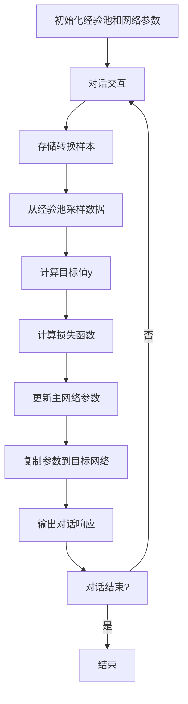

# 一切皆是映射：实现DQN的自然对话系统：挑战与策略

## 1. 背景介绍

### 1.1 自然语言处理的重要性

随着人工智能技术的快速发展,自然语言处理(NLP)已成为当前研究的热点领域之一。作为人机交互的桥梁,NLP旨在使计算机能够理解和生成人类语言,从而实现人机自然交互。在众多NLP任务中,自然对话系统尤为引人关注,它能够与人类进行多轮自然语言对话,在智能助手、客服系统等场景中发挥着重要作用。

### 1.2 对话系统的发展历程

早期的对话系统主要基于规则和模板,缺乏灵活性和上下文理解能力。随着深度学习技术的兴起,基于神经网络的端到端对话模型逐渐占据主导地位。其中,序列到序列(Seq2Seq)模型因其强大的建模能力而备受关注。然而,该模型存在曝光偏差和缺乏交互性等问题。为解决这些问题,研究人员提出了基于强化学习的对话生成方法,将对话过程建模为马尔可夫决策过程(MDP),并采用深度Q网络(DQN)等技术优化对话策略。

### 1.3 DQN在对话系统中的应用

DQN是一种结合深度学习和强化学习的技术,它使用深度神经网络来估计状态-行为值函数,从而学习最优策略。在对话系统中,DQN可以根据对话历史和当前状态,选择最佳的回复动作,从而生成自然、上下文相关的对话响应。与传统的Seq2Seq模型相比,DQN对话系统具有更好的交互性和一致性,能够更好地捕捉对话的长期依赖关系。

## 2. 核心概念与联系

### 2.1 马尔可夫决策过程(MDP)

马尔可夫决策过程是强化学习的基础模型,用于描述一个智能体在环境中进行决策的过程。在对话系统中,MDP可以形式化为:

- 状态(State) $s$: 对话历史和当前上下文信息
- 动作(Action) $a$: 可能的回复句子
- 奖励(Reward) $r$: 根据回复质量给出的奖惩分数
- 状态转移概率(Transition Probability) $P(s'|s,a)$: 在当前状态 $s$ 下执行动作 $a$ 后,转移到新状态 $s'$ 的概率
- 折扣因子(Discount Factor) $\gamma$: 用于权衡即时奖励和长期奖励的重要性

目标是学习一个最优策略 $\pi^*(s)$,使得在给定状态 $s$ 下执行相应动作,可以最大化预期的累积奖励。

### 2.2 深度Q网络(DQN)

深度Q网络是一种结合深度学习和Q学习的强化学习算法,用于估计状态-行为值函数 $Q(s,a)$,从而近似求解最优策略。DQN使用深度神经网络作为函数逼近器,输入状态 $s$,输出所有可能动作的Q值 $Q(s,a)$。通过不断更新网络参数,DQN可以逐步学习最优的Q函数,并据此选择最佳动作。

在对话系统中,DQN的输入通常是对话历史的词嵌入序列,输出是所有可能回复句子的Q值。通过选择具有最大Q值的回复作为输出,DQN可以生成自然、上下文相关的对话响应。

### 2.3 经验回放(Experience Replay)

经验回放是DQN的一个关键技术,用于解决强化学习中的相关性和非平稳性问题。它维护一个经验池,存储智能体与环境交互时产生的转换样本 $(s,a,r,s')$。在训练过程中,DQN从经验池中随机采样小批量数据进行训练,而不是直接使用连续的数据,这样可以打破数据之间的相关性,提高数据利用率,并保证训练的稳定性。

### 2.4 目标网络(Target Network)

为了进一步提高训练稳定性,DQN引入了目标网络的概念。目标网络 $\hat{Q}$ 是主网络 $Q$ 的一个延迟更新的副本,用于计算目标值 $y = r + \gamma \max_{a'} \hat{Q}(s',a')$。主网络 $Q$ 根据目标值 $y$ 进行参数更新,而目标网络 $\hat{Q}$ 则每隔一定步数复制主网络的参数。这种分离目标值计算和参数更新的方式,可以有效缓解Q值过估计的问题,提高训练稳定性。

## 3. 核心算法原理具体操作步骤

DQN算法在对话系统中的具体操作步骤如下:

1. **初始化经验池和网络参数**
   - 创建一个空的经验池
   - 初始化主网络 $Q$ 和目标网络 $\hat{Q}$ 的参数,两者初始时相同

2. **对话交互**
   - 获取当前对话状态 $s$
   - 使用 $\epsilon$-贪婪策略选择动作 $a$:
     - 以概率 $\epsilon$ 随机选择一个动作(探索)
     - 以概率 $1-\epsilon$ 选择 $Q(s,a)$ 最大的动作(利用)
   - 执行动作 $a$,获得奖励 $r$ 和新状态 $s'$
   - 将转换样本 $(s,a,r,s')$ 存入经验池

3. **网络训练**
   - 从经验池中随机采样一个小批量数据 $D$
   - 对于每个样本 $(s,a,r,s')$ 计算目标值 $y$:
     $$y = r + \gamma \max_{a'} \hat{Q}(s',a')$$
   - 计算损失函数:
     $$\text{Loss} = \mathbb{E}_{(s,a,r,s') \sim D} \left[ (y - Q(s,a))^2 \right]$$
   - 使用优化算法(如梯度下降)更新主网络 $Q$ 的参数,最小化损失函数
   - 每隔一定步数,将主网络 $Q$ 的参数复制到目标网络 $\hat{Q}$

4. **对话输出**
   - 根据当前对话状态 $s$,选择 $Q(s,a)$ 最大的动作 $a$ 作为回复

5. **重复步骤2-4,直至对话结束**

通过上述步骤,DQN可以逐步学习到一个最优的对话策略,生成自然、上下文相关的对话响应。

## 4. 数学模型和公式详细讲解举例说明

### 4.1 Q学习

Q学习是强化学习中的一种基于值函数的算法,它旨在直接学习状态-行为值函数 $Q(s,a)$,而不需要先学习状态值函数 $V(s)$。Q值 $Q(s,a)$ 表示在状态 $s$ 下执行动作 $a$,之后能获得��预期累积奖励。Q学习的核心是基于贝尔曼方程迭代更新Q值:

$$Q(s,a) \leftarrow Q(s,a) + \alpha \left[ r + \gamma \max_{a'} Q(s',a') - Q(s,a) \right]$$

其中:

- $\alpha$ 是学习率
- $r$ 是立即奖励
- $\gamma$ 是折扣因子,用于权衡即时奖励和长期奖励的重要性
- $\max_{a'} Q(s',a')$ 是在新状态 $s'$ 下可获得的最大预期累积奖励

通过不断更新Q值,Q学习可以逐步收敛到最优的Q函数 $Q^*(s,a)$,从而得到最优策略 $\pi^*(s) = \arg\max_a Q^*(s,a)$。

### 4.2 深度Q网络(DQN)

传统的Q学习算法使用表格或者简单的函数逼近器来表示Q值,难以处理高维、连续的状态空间。深度Q网络(DQN)则使用深度神经网络作为函数逼近器,可以有效处理高维、复杂的状态输入。

DQN的核心思想是使用一个深度神经网络 $Q(s,a;\theta)$ 来逼近真实的Q函数,其中 $\theta$ 是网络参数。在训练过程中,DQN根据贝尔曼方程最小化损失函数:

$$\mathcal{L}(\theta) = \mathbb{E}_{(s,a,r,s') \sim D} \left[ \left( r + \gamma \max_{a'} Q(s',a';\theta^-) - Q(s,a;\theta) \right)^2 \right]$$

其中:

- $D$ 是经验池,存储智能体与环境交互时产生的转换样本 $(s,a,r,s')$
- $\theta^-$ 是目标网络的参数,用于计算目标值 $y = r + \gamma \max_{a'} Q(s',a';\theta^-)$
- $\theta$ 是主网络的参数,需要通过优化算法(如梯度下降)进行更新

通过不断迭代训练,DQN可以逐步学习到一个近似最优的Q函数 $Q^*(s,a) \approx Q(s,a;\theta^*)$,并据此选择最佳动作。

### 4.3 经验回放和目标网络

为了提高DQN的训练稳定性,引入了经验回放和目标网络两种技术:

1. **经验回放(Experience Replay)**

   经验回放维护一个经验池 $D$,存储智能体与环境交互时产生的转换样本 $(s,a,r,s')$。在训练过程中,DQN从经验池中随机采样小批量数据进行训练,而不是直接使用连续的数据。这样可以打破数据之间的相关性,提高数据利用率,并保证训练的稳定性。

2. **目标网络(Target Network)**

   目标网络 $\hat{Q}$ 是主网络 $Q$ 的一个延迟更新的副本,用于计算目标值 $y = r + \gamma \max_{a'} \hat{Q}(s',a')$。主网络 $Q$ 根据目标值 $y$ 进行参数更新,而目标网络 $\hat{Q}$ 则每隔一定步数复制主网络的参数。这种分离目标值计算和参数更新的方式,可以有效缓解Q值过估计的问题,提高训练稳定性。

通过结合经验回放和目标网络,DQN算法可以更加稳定地学习到一个近似最优的Q函数,从而生成高质量的对话响应。

### 4.4 算法流程图

下面是DQN算法在对话系统中的流程图:



该流程图清晰地展示了DQN算法在对话系统中的工作原理,包括对话交互、经验存储、网络训练和对话输出等关键步骤。通过不断迭代这个过程,DQN可以逐步优化对话策略,生成高质量的自然语言响应。

## 5. 项目实践:代码实例和详细解释说明

为了更好地理解DQN在对话系统中的应用,我们将提供一个基于PyTorch实现的代码示例。该示例包括DQN模型的定义、训练过程以及对话交互的实现。

### 5.1 DQN模型定义

```python
import torch
import torch.nn as nn

class DQN(nn.Module):
    def __init__(self, vocab_size, embedding_dim, hidden_dim, output_dim):
        super(DQN, self).__init__()
        self.embeddings = nn.Embedding(vocab_size, embedding_dim)
        self.lstm = nn.LSTM(embedding_dim, hidden_dim, batch_first=True)
        self.fc1 = nn.Linear(hidden_dim, hidden_dim)
        self.fc2 = nn.Linear(hidden_dim, output_dim)

    def forward(self, input_seq):
        embeds = self.embeddings(input_seq)
        _, (hidden, _) = self.lstm(embeds)
        x = hidden.squeeze(0)
        x = torch.relu(self.fc1(x))
        q_values = self.fc2(x