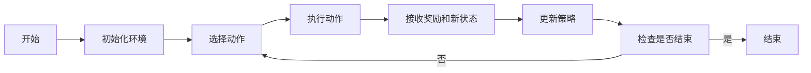
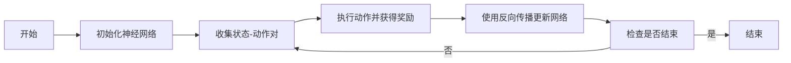

# 一切皆是映射：强化学习基础及其与深度学习的结合

## 1. 背景介绍

在人工智能的众多分支中，强化学习（Reinforcement Learning, RL）以其独特的学习方式在近年来受到了极大的关注。它模拟生物在与环境交互中通过试错来学习的过程，通过奖励（或惩罚）来指导策略的优化。而深度学习（Deep Learning, DL），作为一种能够从海量数据中自动提取高层特征的机器学习方法，与强化学习的结合，即深度强化学习（Deep Reinforcement Learning, DRL），已经在多个领域展现出了惊人的潜力。

## 2. 核心概念与联系

### 2.1 强化学习基础

- **状态（State）**：代表环境的某一瞬间。
- **动作（Action）**：在某状态下智能体可以执行的操作。
- **奖励（Reward）**：执行动作后环境给予的反馈。
- **策略（Policy）**：从状态到动作的映射，决定智能体的行为。
- **价值函数（Value Function）**：预估从某状态开始的长期回报。

### 2.2 深度学习基础

- **神经网络（Neural Networks）**：模拟人脑神经元的计算模型。
- **特征提取（Feature Extraction）**：自动从数据中学习特征。
- **反向传播（Backpropagation）**：优化神经网络参数的算法。

### 2.3 强化学习与深度学习的结合

- **函数逼近（Function Approximation）**：使用深度学习模型近似价值函数或策略。
- **稳定性与收敛（Stability and Convergence）**：深度学习模型在强化学习中的稳定性问题。
- **样本效率（Sample Efficiency）**：如何高效利用交互样本。

## 3. 核心算法原理具体操作步骤

### 3.1 强化学习算法流程

### 3.2 深度学习在强化学习中的应用

## 4. 数学模型和公式详细讲解举例说明

### 4.1 强化学习的贝尔曼方程

$$
V(s) = \max_a \sum_{s'} P(s'|s,a) [R(s,a,s') + \gamma V(s')]
$$

其中，$V(s)$ 是状态 $s$ 的价值函数，$P(s'|s,a)$ 是从状态 $s$ 通过动作 $a$ 转移到状态 $s'$ 的概率，$R(s,a,s')$ 是收到的即时奖励，$\gamma$ 是折扣因子。

### 4.2 深度学习的损失函数

$$
L(\theta) = \frac{1}{N} \sum_{i=1}^{N} (y_i - f(x_i; \theta))^2
$$

其中，$L(\theta)$ 是损失函数，$N$ 是样本数量，$y_i$ 是真实值，$f(x_i; \theta)$ 是神经网络的预测值，$\theta$ 是网络参数。

## 5. 项目实践：代码实例和详细解释说明

由于篇幅限制，此处无法提供完整的代码实例。但可以概述一个简单的深度Q网络（DQN）的实现步骤：

1. 初始化Q网络和目标Q网络。
2. 收集经验并存储在回放缓冲区。
3. 从回放缓冲区随机抽取一批经验。
4. 计算目标Q值和损失函数。
5. 使用梯度下降法更新Q网络。
6. 定期将Q网络的权重复制到目标Q网络。

## 6. 实际应用场景

强化学习和深度学习的结合已经在多个领域取得了显著的成果，例如：

- 游戏（如AlphaGo）
- 自动驾驶
- 机器人控制
- 推荐系统

## 7. 工具和资源推荐

- **TensorFlow** 和 **PyTorch**：两个流行的深度学习框架。
- **OpenAI Gym**：提供了多种强化学习环境的工具包。
- **Stable Baselines**：一系列经过测试的强化学习算法实现。

## 8. 总结：未来发展趋势与挑战

强化学习和深度学习的结合将继续在算法效率、泛化能力和实际应用中取得进展。未来的挑战包括提高样本效率、增强模型的解释性和安全性，以及在复杂环境中的应用。

## 9. 附录：常见问题与解答

- **Q1**: 强化学习和深度学习的主要区别是什么？
- **A1**: 强化学习关注于通过交互学习最优策略，而深度学习关注于从数据中学习表示。

- **Q2**: 深度强化学习的样本效率低是什么意思？
- **A2**: 指的是深度强化学习需要大量的数据才能学到有效的策略。

- **Q3**: 如何提高深度强化学习的稳定性？
- **A3**: 可以通过经验回放、目标网络和更好的探索策略来提高稳定性。

作者：禅与计算机程序设计艺术 / Zen and the Art of Computer Programming