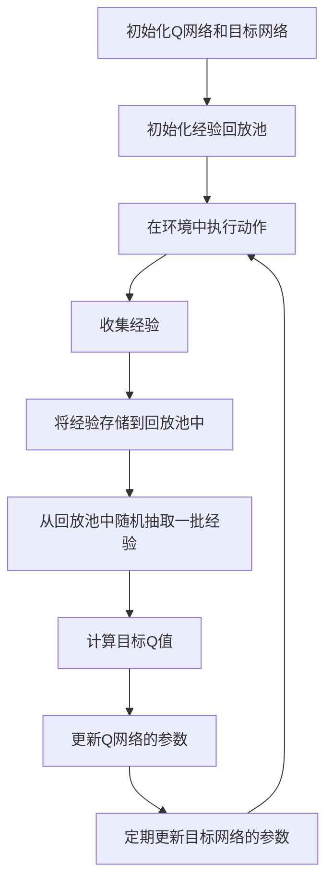

# 一切皆是映射：深度Q网络（DQN）在交通控制系统的应用

## 1.背景介绍

随着城市化进程的加快，交通拥堵问题日益严重。传统的交通控制系统依赖于预设的规则和模型，难以应对复杂多变的交通状况。近年来，人工智能技术，特别是深度强化学习（Deep Reinforcement Learning, DRL），在解决复杂决策问题上展现出了巨大的潜力。深度Q网络（Deep Q-Network, DQN）作为DRL的代表性算法之一，因其在游戏AI中的成功应用而备受关注。本文将探讨DQN在交通控制系统中的应用，旨在通过智能化的交通信号控制，缓解城市交通拥堵问题。

## 2.核心概念与联系

### 2.1 深度强化学习

深度强化学习结合了深度学习和强化学习的优势。深度学习通过神经网络处理高维数据，而强化学习通过试错法学习最优策略。DRL通过深度神经网络估计状态-动作值函数（Q值），从而在复杂环境中找到最优策略。

### 2.2 Q学习

Q学习是一种无模型的强化学习算法，通过更新Q值表来学习最优策略。Q值表示在特定状态下采取某一动作的预期回报。Q学习的更新公式为：

$$
Q(s, a) \leftarrow Q(s, a) + \alpha [r + \gamma \max_{a'} Q(s', a') - Q(s, a)]
$$

其中，$s$ 和 $a$ 分别表示状态和动作，$r$ 是即时奖励，$\alpha$ 是学习率，$\gamma$ 是折扣因子。

### 2.3 深度Q网络（DQN）

DQN通过深度神经网络近似Q值函数，解决了Q学习在高维状态空间中的局限性。DQN引入了经验回放和目标网络，稳定了训练过程。经验回放通过存储和重用过去的经验，打破了数据相关性；目标网络则通过定期更新目标Q值，减小了训练的不稳定性。

### 2.4 交通控制系统

交通控制系统旨在通过优化交通信号灯的控制策略，提高交通流量和减少拥堵。传统方法依赖于预设的规则和模型，难以应对复杂多变的交通状况。通过引入DQN，可以实现自适应的交通信号控制，动态调整信号灯时长，提高交通效率。

## 3.核心算法原理具体操作步骤

### 3.1 环境建模

首先，需要对交通环境进行建模。交通环境可以表示为一个马尔可夫决策过程（Markov Decision Process, MDP），包括状态、动作、奖励和转移函数。

- 状态：交通信号灯的状态、车流量、车速等。
- 动作：改变交通信号灯的时长和相位。
- 奖励：根据交通流量和等待时间计算即时奖励。
- 转移函数：描述状态和动作之间的转移关系。

### 3.2 神经网络设计

设计一个深度神经网络，用于近似Q值函数。网络输入为当前状态，输出为各个动作的Q值。常见的网络结构包括全连接层、卷积层等。

### 3.3 经验回放

构建一个经验回放池，用于存储智能体的经验。每次训练时，从回放池中随机抽取一批经验进行训练，打破数据相关性，提高训练稳定性。

### 3.4 目标网络

引入目标网络，定期更新目标Q值。目标网络的参数固定一段时间，减少训练的不稳定性。

### 3.5 训练过程

训练过程包括以下步骤：

1. 初始化Q网络和目标网络。
2. 初始化经验回放池。
3. 在环境中执行动作，收集经验。
4. 将经验存储到回放池中。
5. 从回放池中随机抽取一批经验，计算目标Q值。
6. 更新Q网络的参数。
7. 定期更新目标网络的参数。

以下是DQN训练过程的Mermaid流程图：



## 4.数学模型和公式详细讲解举例说明

### 4.1 马尔可夫决策过程

交通控制系统可以建模为一个马尔可夫决策过程（MDP），包括状态空间、动作空间、奖励函数和转移函数。

- 状态空间 $S$：交通信号灯的状态、车流量、车速等。
- 动作空间 $A$：改变交通信号灯的时长和相位。
- 奖励函数 $R(s, a)$：根据交通流量和等待时间计算即时奖励。
- 转移函数 $P(s'|s, a)$：描述状态和动作之间的转移关系。

### 4.2 Q值更新公式

Q学习的更新公式为：

$$
Q(s, a) \leftarrow Q(s, a) + \alpha [r + \gamma \max_{a'} Q(s', a') - Q(s, a)]
$$

其中，$s$ 和 $a$ 分别表示状态和动作，$r$ 是即时奖励，$\alpha$ 是学习率，$\gamma$ 是折扣因子。

### 4.3 DQN目标Q值

DQN通过深度神经网络近似Q值函数，目标Q值的计算公式为：

$$
y = r + \gamma \max_{a'} Q'(s', a')
$$

其中，$Q'$ 是目标网络的Q值函数。

### 4.4 损失函数

DQN的损失函数为：

$$
L(\theta) = \mathbb{E}[(y - Q(s, a; \theta))^2]
$$

其中，$\theta$ 是Q网络的参数。

### 4.5 反向传播

通过反向传播算法，最小化损失函数，更新Q网络的参数：

$$
\theta \leftarrow \theta - \alpha \nabla_\theta L(\theta)
$$

### 4.6 举例说明

假设一个简单的交通控制系统，状态包括交通信号灯的状态（红灯、绿灯）、车流量（高、中、低），动作包括改变信号灯的时长（短、中、长）。即时奖励根据车流量和等待时间计算。

- 状态空间 $S$：$\{(红灯, 高), (红灯, 中), (红灯, 低), (绿灯, 高), (绿灯, 中), (绿灯, 低)\}$
- 动作空间 $A$：$\{短, 中, 长\}$
- 奖励函数 $R(s, a)$：根据车流量和等待时间计算即时奖励。
- 转移函数 $P(s'|s, a)$：描述状态和动作之间的转移关系。

通过DQN算法，智能体可以学习到在不同状态下采取最优动作的策略，从而优化交通信号控制，提高交通效率。

## 5.项目实践：代码实例和详细解释说明

### 5.1 环境搭建

首先，搭建一个模拟交通环境。可以使用开源的交通仿真工具，如SUMO（Simulation of Urban MObility），来模拟交通流量和信号灯控制。

### 5.2 代码实例

以下是一个简单的DQN实现示例，使用Python和TensorFlow：

```python
import numpy as np
import tensorflow as tf
from collections import deque
import random

class DQN:
    def __init__(self, state_size, action_size):
        self.state_size = state_size
        self.action_size = action_size
        self.memory = deque(maxlen=2000)
        self