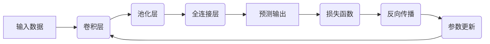

# 一切皆是映射：深度学习在环境监测中的应用

## 1. 背景介绍

### 1.1 环境监测的重要性
环境监测是现代社会可持续发展的重要基础。随着人类活动对自然环境的影响日益加剧,及时准确地监测环境质量,预警环境风险,已成为全球共同关注的焦点。传统的环境监测方法依赖于人工采样和实验室分析,存在效率低、成本高、时效性差等问题。

### 1.2 人工智能技术的发展
近年来,以深度学习为代表的人工智能技术取得了突破性进展。深度学习通过构建多层神经网络,可以自动学习数据中蕴含的复杂模式和规律,在图像识别、语音识别、自然语言处理等领域展现出了超越人类的能力。将深度学习应用于环境监测,有望突破传统方法的局限,实现环境大数据的高效分析和预测。

### 1.3 深度学习在环境监测中的应用前景
深度学习在环境监测领域具有广阔的应用前景。利用深度学习算法分析卫星遥感影像,可以精确识别土地利用类型、植被覆盖状况、水体污染程度等关键环境要素。通过对环境传感器数据进行深度挖掘,可以发现环境质量变化规律,预警突发污染事件。将深度学习与物联网、大数据等技术相结合,有望构建全天候、全方位的智能环境监测网络。

## 2. 核心概念与联系

### 2.1 人工神经网络
人工神经网络(Artificial Neural Network, ANN)是一种模仿生物神经系统结构和功能的计算模型。它由大量的神经元(节点)组成,神经元之间通过权重(连接)进行信息传递和处理。通过调整权重,神经网络可以学习输入和输出之间的映射关系,从而对新的输入做出正确的判断。

### 2.2 深度学习
深度学习(Deep Learning, DL)是一种基于多层神经网络的机器学习方法。与传统的浅层神经网络相比,深度学习网络具有更多的隐藏层,可以学习更加复杂和抽象的特征表示。深度学习在图像识别、语音识别等领域取得了显著的成功,被誉为人工智能的核心驱动力。

### 2.3 卷积神经网络
卷积神经网络(Convolutional Neural Network, CNN)是一种专门用于处理网格拓扑结构数据(如图像)的深度学习模型。它通过卷积层和池化层交替组合,可以自动提取图像中的局部特征,并通过全连接层对特征进行组合和分类。CNN在图像识别领域表现出色,是深度学习的代表性模型之一。

### 2.4 循环神经网络
循环神经网络(Recurrent Neural Network, RNN)是一种适用于处理序列数据的深度学习模型。与前馈神经网络不同,RNN引入了时间维度,每个神经元不仅接收当前时刻的输入,还接收上一时刻神经元的状态。这使得RNN可以捕捉序列数据中的长距离依赖关系,在语音识别、机器翻译等领域有广泛应用。

### 2.5 迁移学习
迁移学习(Transfer Learning)是一种利用已有知识来解决新问题的机器学习方法。它通过将在源领域学习到的模型参数迁移到目标领域,可以显著减少目标领域所需的训练数据和训练时间。在环境监测中,可以利用在其他领域(如计算机视觉)预训练的深度学习模型,快速构建适用于特定环境要素分析的模型。

### 2.6 深度学习与环境监测的联系
深度学习为环境监测提供了一种全新的技术路径。传统的环境监测方法主要依赖人工特征工程,即由专家根据先验知识设计特征并构建分析模型。这一过程往往耗时耗力,且难以发现数据中隐藏的复杂模式。深度学习可以自动学习数据的内在表示,无需人工设计特征,极大地提高了分析效率和精度。同时,深度学习还可以挖掘环境大数据中蕴含的时空关联规律,为环境预测和决策提供支持。

## 3. 核心算法原理具体操作步骤

### 3.1 卷积神经网络(CNN)

#### 3.1.1 卷积层
卷积层通过卷积操作提取输入数据的局部特征。具体步骤如下:
1. 定义卷积核(滤波器),即一组权重参数;
2. 将卷积核在输入数据上滑动,对覆盖区域进行点积并求和,得到一个输出值;
3. 重复步骤2,直到遍历整个输入数据,得到一个二维的卷积特征图;
4. 对卷积特征图应用激活函数(如ReLU),增加模型的非线性表达能力。

#### 3.1.2 池化层
池化层通过降采样操作压缩卷积特征图的尺寸。常见的池化操作包括最大池化和平均池化:
- 最大池化:在池化窗口内选取最大值作为输出
- 平均池化:在池化窗口内计算元素的平均值作为输出

池化可以减少特征图的空间维度,从而减少模型参数数量,提高计算效率,同时还能提高模型的平移不变性。

#### 3.1.3 全连接层
全连接层通过矩阵乘法将卷积和池化得到的特征进行组合,生成最终的预测结果。具体步骤如下:
1. 将卷积和池化得到的特征图展平为一维向量;
2. 定义全连接层的权重矩阵和偏置向量;
3. 将特征向量与权重矩阵相乘,加上偏置向量,得到全连接层的输出;
4. 对输出应用激活函数(如Softmax),得到最终的预测概率分布。

#### 3.1.4 CNN的训练过程
CNN的训练过程通常包括以下步骤:
1. 前向传播:将输入数据通过卷积层、池化层和全连接层,得到预测输出;
2. 计算损失函数:比较预测输出与真实标签,计算预测误差;
3. 反向传播:根据预测误差,利用链式法则计算各层参数的梯度;
4. 参数更新:使用优化算法(如随机梯度下降)更新各层参数,使损失函数最小化;
5. 重复步骤1-4,直到模型收敛或达到预设的训练轮数。

### 3.2 循环神经网络(RNN)

#### 3.2.1 RNN的基本结构
RNN的基本结构如下:
- 输入层:接收当前时刻的输入数据;
- 隐藏层:接收当前时刻的输入和上一时刻的隐藏状态,并计算当前时刻的隐藏状态;
- 输出层:根据当前时刻的隐藏状态计算输出。

RNN通过引入时间维度,可以捕捉序列数据中的长距离依赖关系。

#### 3.2.2 RNN的前向传播
RNN的前向传播过程如下:
1. 将输入序列$\{x_1,x_2,...,x_T\}$逐个输入到RNN;
2. 对于每个时刻$t$,计算隐藏状态$h_t$:

$$h_t=f(W_{ih}x_t+W_{hh}h_{t-1}+b_h)$$

其中,$W_{ih}$是输入到隐藏层的权重矩阵,$W_{hh}$是隐藏层到隐藏层的权重矩阵,$b_h$是隐藏层的偏置向量,$f$是激活函数(如tanh)。

3. 根据隐藏状态$h_t$计算输出$y_t$:

$$y_t=g(W_{ho}h_t+b_o)$$

其中,$W_{ho}$是隐藏层到输出层的权重矩阵,$b_o$是输出层的偏置向量,$g$是输出层的激活函数(如Softmax)。

#### 3.2.3 RNN的训练过程
RNN的训练过程与CNN类似,也包括前向传播、计算损失函数、反向传播和参数更新等步骤。但由于RNN存在时间依赖关系,反向传播过程需要考虑梯度的时间累积,即通过时间的反向传播(Backpropagation Through Time, BPTT)来计算梯度。

BPTT的基本思想是:将RNN在时间维度上展开,得到一个多层前馈神经网络,然后利用标准的反向传播算法计算梯度。但由于时间步数可能很大,导致梯度在传播过程中不断衰减或爆炸,因此实际应用中常采用截断的BPTT(Truncated BPTT)来近似计算梯度。

### 3.3 Mermaid流程图

## 4. 数学模型和公式详细讲解举例说明

### 4.1 卷积操作
卷积操作是CNN的核心组成部分。给定一个输入张量$X\in\mathbb{R}^{H\times W\times C}$和一个卷积核$K\in\mathbb{R}^{h\times w\times C}$,卷积操作可以表示为:

$$(X*K)(i,j)=\sum_{m=0}^{h-1}\sum_{n=0}^{w-1}\sum_{c=0}^{C-1}X(i+m,j+n,c)K(m,n,c)$$

其中,$*$表示卷积操作,$i,j$表示输出特征图上的位置索引。

例如,假设输入张量$X$的尺寸为$4\times 4\times 1$,卷积核$K$的尺寸为$3\times 3\times 1$,则卷积操作可以表示为:

$$
\begin{aligned}
X&=\begin{bmatrix}
1 & 2 & 3 & 4\\
5 & 6 & 7 & 8\\
9 & 10 & 11 & 12\\
13 & 14 & 15 & 16
\end{bmatrix}\\
K&=\begin{bmatrix}
1 & 0 & -1\\
2 & 0 & -2\\
1 & 0 & -1
\end{bmatrix}\\
X*K&=\begin{bmatrix}
12 & 16\\
24 & 28
\end{bmatrix}
\end{aligned}
$$

### 4.2 池化操作
池化操作用于减少特征图的空间维度,提高模型的平移不变性。常见的池化操作包括最大池化和平均池化。

给定一个输入张量$X\in\mathbb{R}^{H\times W\times C}$和池化窗口大小$p\times q$,最大池化操作可以表示为:

$$(MaxPool(X))(i,j,c)=\max_{0\leq m<p,0\leq n<q}X(p\cdot i+m,q\cdot j+n,c)$$

平均池化操作可以表示为:

$$(AvgPool(X))(i,j,c)=\frac{1}{pq}\sum_{m=0}^{p-1}\sum_{n=0}^{q-1}X(p\cdot i+m,q\cdot j+n,c)$$

例如,假设输入张量$X$的尺寸为$4\times 4\times 1$,池化窗口大小为$2\times 2$,则最大池化操作可以表示为:

$$
\begin{aligned}
X&=\begin{bmatrix}
1 & 2 & 3 & 4\\
5 & 6 & 7 & 8\\
9 & 10 & 11 & 12\\
13 & 14 & 15 & 16
\end{bmatrix}\\
MaxPool(X)&=\begin{bmatrix}
6 & 8\\
14 & 16
\end{bmatrix}
\end{aligned}
$$

### 4.3 交叉熵损失函数
交叉熵损失函数常用于衡量分类模型的预测误差。给定一组样本的预测概率分布$\hat{y}_i$和真实标签的one-hot编码$y_i$,交叉熵损失可以表示为:

$$L=-\sum_{i=1}^N\sum_{j=1}^Cy_{ij}\log(\hat{y}_{ij})$$

其中,$N$是样本数量,$C$是