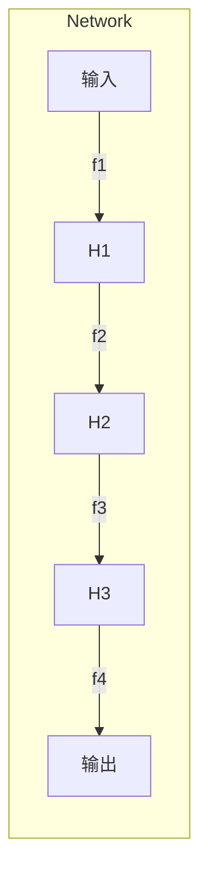
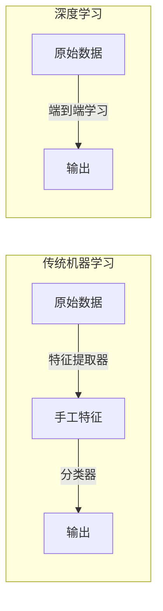
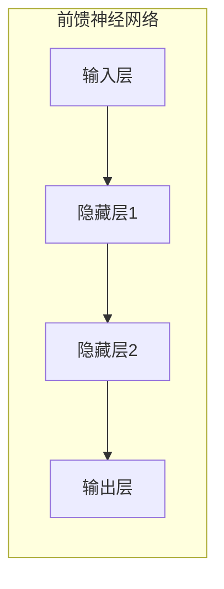
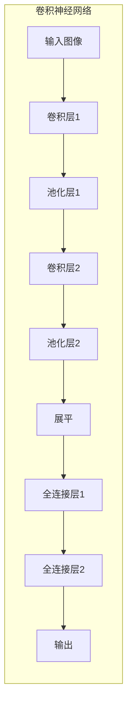
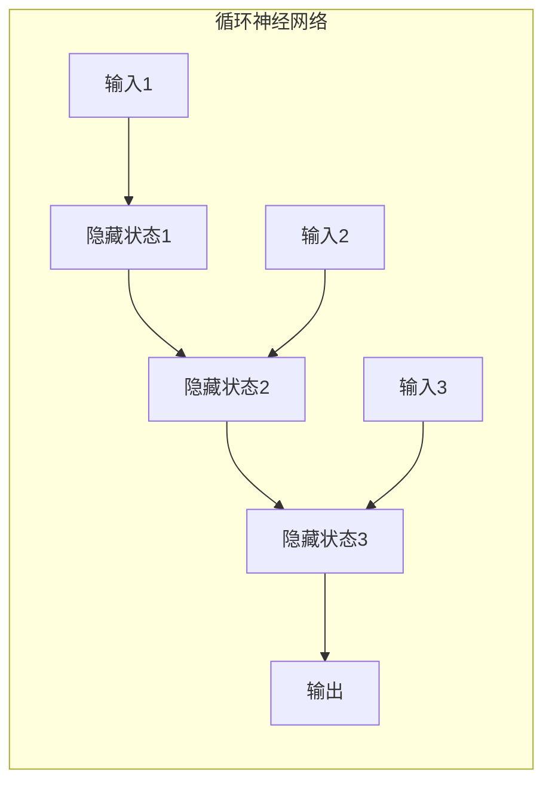
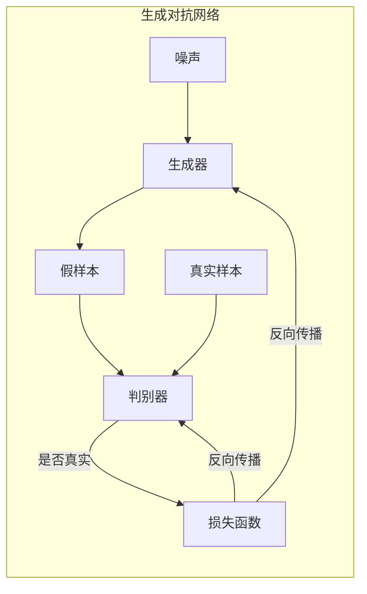

# 一切皆是映射：深度学习在航空航天中的挑战与机会

## 1. 背景介绍

### 1.1 航空航天领域的重要性

航空航天是一个对人类文明发展具有深远影响的战略性行业。它不仅推动了科技创新,还促进了全球化进程,为人类探索未知领域提供了强有力的支持。随着航天技术的不断进步,人类正逐步实现太空探索、行星殖民等宏伟梦想。

### 1.2 航空航天面临的挑战

然而,航空航天领域也面临着诸多挑战:

- 极端环境条件(高温、真空、辐射等)对设备性能提出了苛刻要求
- 复杂的空气动力学和轨道力学问题需要精确建模和计算
- 制造和测试成本高昂,对资源的需求量巨大
- 安全性能至关重要,任何微小失误都可能导致灾难性后果

### 1.3 深度学习的机遇

深度学习作为人工智能的核心技术,正在为航空航天领域带来前所未有的机遇。通过从海量数据中自动学习特征表示,深度学习可以极大提高建模、优化和决策的精度和效率,助力航空航天技术的创新突破。

## 2. 核心概念与联系  

### 2.1 深度学习的本质:一切皆是映射

深度学习的核心思想是通过构建多层非线性变换,从输入数据中学习映射到期望输出的复杂函数。无论是计算机视觉、自然语言处理还是控制系统,都可以被抽象为一个从输入映射到输出的函数逼近问题。

$$f: X \rightarrow Y$$

其中 $X$ 表示输入空间, $Y$ 表示输出空间,目标是找到一个合适的函数 $f$ 能够很好地拟合输入输出之间的映射关系。

### 2.2 深度神经网络:层叠映射的表示

深度神经网络通过层层叠加的方式,将输入数据经过一系列非线性变换,最终映射到输出空间。每一层对应一个子映射函数,多层神经网络相当于将多个子映射函数复合而成。

$$f(x) = f_L \circ f_{L-1} \circ ... \circ f_2 \circ f_1(x)$$

其中 $f_i$ 表示第 $i$ 层的映射函数,通过层层组合,神经网络可以逼近任意的连续函数。



### 2.3 端到端学习:自动特征提取

传统的机器学习算法需要人工设计特征提取器,而深度学习则可以自动从原始数据中学习最优的特征表示。这种端到端的学习方式,使得深度学习可以更好地捕捉数据中的内在规律和复杂模式,从而获得更强的泛化能力。



## 3. 核心算法原理具体操作步骤

### 3.1 前馈神经网络

前馈神经网络是深度学习中最基础和广泛使用的网络结构。它由输入层、隐藏层和输出层组成,每一层的神经元与上一层全部连接,信息只能单向传播。

1. **前向传播**:输入数据经过层层变换,最终得到输出
2. **反向传播**:根据输出与标签的差异,计算误差梯度,并沿着反方向更新网络权重
3. **优化算法**:采用随机梯度下降等优化算法,迭代更新网络参数,最小化损失函数



### 3.2 卷积神经网络

卷积神经网络(CNN)是深度学习在计算机视觉领域的杰出代表,它通过局部连接和权重共享的方式,极大减少了网络参数,同时能有效捕捉数据的局部特征。

1. **卷积层**:使用滤波器对输入数据进行卷积操作,提取局部特征
2. **池化层**:对特征图进行下采样,减少数据量,提高鲁棒性
3. **全连接层**:将特征图展平,输入到全连接层进行分类或回归



### 3.3 循环神经网络

循环神经网络(RNN)擅长处理序列数据,通过内部状态的循环传递,能够有效捕捉序列中的长期依赖关系。

1. **展开计算**:将序列数据一个个输入到网络中,每个时刻的隐藏状态由上一时刻的状态和当前输入计算得到
2. **反向传播through time**:计算每个时刻的误差梯度,并沿着时间反向传播,更新网络参数
3. **门控机制**:LSTM、GRU等门控单元可以更好地捕捉长期依赖,缓解梯度消失/爆炸问题



### 3.4 生成对抗网络

生成对抗网络(GAN)是一种全新的深度学习范式,通过生成器和判别器的对抗训练,可以学习到数据的真实分布,从而生成逼真的样本。

1. **生成器**:从随机噪声中生成假样本,目标是欺骗判别器
2. **判别器**:判断输入是真实样本还是生成样本,目标是正确分类
3. **对抗训练**:生成器和判别器相互对抗,最终达到一个纳什均衡



## 4. 数学模型和公式详细讲解举例说明

### 4.1 神经网络的数学模型

神经网络可以用一系列嵌套的函数来表示,每一层对应一个映射函数。假设一个有 $L$ 层的神经网络,输入为 $x$,输出为 $\hat{y}$,则其数学模型为:

$$\hat{y} = f^{(L)}(f^{(L-1)}(...f^{(2)}(f^{(1)}(x))))$$

其中,第 $l$ 层的映射函数 $f^{(l)}$ 可以表示为:

$$f^{(l)}(z) = \sigma(W^{(l)}z + b^{(l)})$$

- $W^{(l)}$ 为权重矩阵,  $b^{(l)}$ 为偏置向量
- $\sigma$ 为非线性激活函数,如 ReLU、Sigmoid 等

通过对 $W$ 和 $b$ 进行学习,神经网络可以逼近任意的连续函数映射。

### 4.2 损失函数和优化

为了训练神经网络,需要定义一个损失函数 $\mathcal{L}$ 来衡量网络输出与期望输出之间的差异。常用的损失函数包括均方误差、交叉熵等。

$$\mathcal{L}(y, \hat{y}) = \frac{1}{n}\sum_{i=1}^{n}l(y_i, \hat{y}_i)$$

其中 $l$ 为单个样本的损失,  $n$ 为样本数量。

通过反向传播算法,可以计算出网络参数对损失函数的梯度:

$$\frac{\partial \mathcal{L}}{\partial W^{(l)}}, \frac{\partial \mathcal{L}}{\partial b^{(l)}}$$

然后采用优化算法如随机梯度下降(SGD)、Adam等,沿着梯度的反方向更新参数,最小化损失函数:

$$W^{(l)} \leftarrow W^{(l)} - \eta \frac{\partial \mathcal{L}}{\partial W^{(l)}}$$
$$b^{(l)} \leftarrow b^{(l)} - \eta \frac{\partial \mathcal{L}}{\partial b^{(l)}}$$

其中 $\eta$ 为学习率,控制更新的步长。

### 4.3 正则化技术

为了防止过拟合,提高神经网络的泛化能力,通常需要采用正则化技术,在损失函数中引入惩罚项,限制模型的复杂度。

**L1正则化**:

$$\Omega(W) = \lambda \sum_{l=1}^{L}\sum_{i,j}|W_{ij}^{(l)}|$$

**L2正则化**:  

$$\Omega(W) = \lambda \sum_{l=1}^{L}\sum_{i,j}(W_{ij}^{(l)})^2$$

其中 $\lambda$ 为正则化系数,控制惩罚的强度。

**Dropout**:

在训练时,以一定概率随机将神经元的输出设置为0,等价于对网络进行了子采样,可以有效防止过拟合。

### 4.4 示例:用于航空航天的CNN模型

以下是一个用于航天器结构健康监测的卷积神经网络模型示例:

```python
import torch.nn as nn

class AerospaceCNN(nn.Module):
    def __init__(self):
        super(AerospaceCNN, self).__init__()
        self.conv1 = nn.Conv2d(1, 32, kernel_size=3, padding=1)
        self.conv2 = nn.Conv2d(32, 64, kernel_size=3, padding=1)
        self.pool = nn.MaxPool2d(2, 2)
        self.fc1 = nn.Linear(64 * 7 * 7, 128)
        self.fc2 = nn.Linear(128, 64)
        self.fc3 = nn.Linear(64, 2)
        
    def forward(self, x):
        x = self.pool(nn.functional.relu(self.conv1(x)))
        x = self.pool(nn.functional.relu(self.conv2(x)))
        x = x.view(-1, 64 * 7 * 7)
        x = nn.functional.relu(self.fc1(x))
        x = nn.functional.relu(self.fc2(x))
        x = self.fc3(x)
        return x
```

该模型包含两个卷积层、两个池化层和三个全连接层。输入为航天器表面的红外热成像图像,输出为二分类结果(是否存在结构损伤)。通过端到端的训练,CNN可以自动从图像中提取最优的特征表示,实现高精度的结构健康监测。

## 5. 项目实践:代码实例和详细解释说明

### 5.1 用于航空航天的深度学习项目案例

以下是一些应用深度学习技术于航空航天领域的具体项目案例:

1. **航天器视觉导航**:使用CNN对航天器周围环境进行语义分割,实现自主导航和障碍物规避。
2. **航天器结构健康监测**:基于CNN从红外热成像图像中检测航天器表面的结构损伤。
3. **火箭发动机故障诊断**:利用LSTM对发动机测试数据进行序列建模,实现提前故障预测。
4. **航线优化与空中交通管理**:结合强化学习和图神经网络,优化航线路径规划和空中交通流量控制。
5. **航天器设计优化**:采用生成对抗网络,基于有限的样本数据生成满足约束条件的新颖设计方案。

### 5.2 代码示例