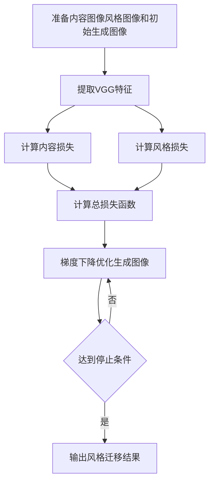

# 一切皆是映射：神经风格迁移和艺术创作中的AI

## 1. 背景介绍
### 1.1 人工智能与艺术创作的融合
人工智能技术的飞速发展正在深刻影响着各行各业，艺术创作领域也不例外。近年来，以神经网络为代表的深度学习技术在图像风格迁移、艺术创作等方面取得了令人瞩目的成果。AI与艺术的结合，正在开启一个全新的创作时代。

### 1.2 神经风格迁移的兴起
神经风格迁移（Neural Style Transfer）作为一种独特的AI艺术创作技术，自2015年由Gatys等人提出以来，迅速成为学术界和产业界关注的焦点。它利用卷积神经网络，将一幅内容图像的内容特征与另一幅风格图像的风格特征融合，生成具有目标风格的艺术作品，为艺术创作提供了新的思路和方法。

### 1.3 艺术创作的新维度
神经风格迁移技术的出现，为艺术创作开辟了一个全新的维度。它不仅可以模仿已有艺术家的风格，还能创造出独特的、前所未见的艺术风格。这一技术的发展，正在挑战传统艺术创作的边界，重新定义艺术与技术的关系。

## 2. 核心概念与联系
### 2.1 卷积神经网络（CNN）
卷积神经网络是神经风格迁移的核心技术基础。CNN通过卷积层和池化层的堆叠，能够自动提取图像的层次化特征。在风格迁移中，CNN被用于提取内容图像的内容特征和风格图像的风格特征。

### 2.2 特征表示
在CNN中，每一层的输出都可以看作是对输入图像的一种特征表示。浅层的特征表示更多地捕捉图像的局部细节和纹理信息，而深层的特征表示则更加抽象，捕捉图像的高级语义内容。

### 2.3 Gram矩阵
Gram矩阵是一种用于描述特征之间相关性的矩阵。在神经风格迁移中，Gram矩阵被用于表示风格图像的风格特征。通过最小化内容图像和风格图像在不同卷积层上的Gram矩阵差异，可以将风格特征迁移到内容图像上。

### 2.4 损失函数
神经风格迁移的目标是生成一幅兼具内容图像内容和风格图像风格的新图像。这一过程通过最小化一个包含内容损失和风格损失的总损失函数来实现。内容损失衡量生成图像与内容图像在内容特征上的差异，风格损失则衡量生成图像与风格图像在风格特征上的差异。

## 3. 核心算法原理与具体操作步骤
### 3.1 VGG网络的使用
神经风格迁移通常采用预训练的VGG网络作为特征提取器。VGG网络是一种经典的CNN结构，在ImageNet图像分类任务上取得了优异的性能。通过在VGG网络的不同卷积层上提取特征，可以获得图像的多尺度内容和风格表示。

### 3.2 算法步骤
1. 准备内容图像、风格图像和初始化的生成图像。
2. 将三个图像输入预训练的VGG网络，提取指定卷积层的特征。
3. 计算内容损失：生成图像与内容图像在内容特征上的均方差。
4. 计算风格损失：生成图像与风格图像在不同卷积层上的Gram矩阵差异的加权和。
5. 计算总损失函数，即内容损失和风格损失的加权和。
6. 通过梯度下降法优化生成图像，最小化总损失函数。
7. 迭代优化过程，直到达到预设的迭代次数或满足一定的停止条件。
8. 输出优化后的生成图像，即风格迁移的结果。

### 3.3 算法流程图


## 4. 数学模型和公式详细讲解举例说明
### 4.1 内容损失
内容损失衡量生成图像 $G$ 与内容图像 $C$ 在内容特征上的差异。设 $F_l(C)$ 和 $F_l(G)$ 分别表示内容图像和生成图像在第 $l$ 层卷积层上的特征图，则内容损失定义为：

$$L_{content}(C,G) = \frac{1}{2} \sum_{i,j} (F_l(C) - F_l(G))^2$$

其中，$i,j$ 表示特征图上的像素位置。

### 4.2 风格损失
风格损失衡量生成图像 $G$ 与风格图像 $S$ 在风格特征上的差异。设 $F_l(S)$ 和 $F_l(G)$ 分别表示风格图像和生成图像在第 $l$ 层卷积层上的特征图，$G_l(S)$ 和 $G_l(G)$ 表示对应的Gram矩阵，则风格损失定义为：

$$L_{style}(S,G) = \sum_{l=0}^L w_l \frac{1}{4N_l^2M_l^2} \sum_{i,j} (G_l(S) - G_l(G))^2$$

其中，$L$ 表示用于计算风格损失的卷积层数，$w_l$ 表示第 $l$ 层的权重，$N_l$ 和 $M_l$ 分别表示第 $l$ 层特征图的高度和宽度。

Gram矩阵 $G_l$ 的计算公式为：

$$G_l(X)_{ij} = \sum_k F_l(X)_{ik} F_l(X)_{jk}$$

其中，$X$ 表示输入图像，$i,j,k$ 表示特征图的通道索引。

### 4.3 总损失函数
神经风格迁移的目标是最小化内容损失和风格损失的加权和，即总损失函数：

$$L_{total}(C,S,G) = \alpha L_{content}(C,G) + \beta L_{style}(S,G)$$

其中，$\alpha$ 和 $\beta$ 分别表示内容损失和风格损失的权重，用于平衡两种损失对总损失的贡献。

通过梯度下降法最小化总损失函数，可以得到最优的生成图像 $G^*$：

$$G^* = \arg\min_G L_{total}(C,S,G)$$

## 5. 项目实践：代码实例和详细解释说明
以下是使用PyTorch实现神经风格迁移的简化代码示例：

```python
import torch
import torch.nn as nn
import torch.optim as optim
from torchvision import models, transforms

# 加载预训练的VGG19网络
vgg = models.vgg19(pretrained=True).features

# 定义内容损失和风格损失
class ContentLoss(nn.Module):
    def __init__(self, target):
        super(ContentLoss, self).__init__()
        self.target = target.detach()
        
    def forward(self, input):
        self.loss = F.mse_loss(input, self.target)
        return input

class StyleLoss(nn.Module):
    def __init__(self, target):
        super(StyleLoss, self).__init__()
        self.target = self.gram_matrix(target).detach()
        
    def forward(self, input):
        G = self.gram_matrix(input)
        self.loss = F.mse_loss(G, self.target)
        return input
    
    def gram_matrix(self, input):
        a, b, c, d = input.size()
        features = input.view(a * b, c * d)
        G = torch.mm(features, features.t())
        return G.div(a * b * c * d)

# 图像预处理
prep = transforms.Compose([
    transforms.Resize(512),
    transforms.ToTensor(),
    transforms.Normalize(mean=[0.485, 0.456, 0.406], 
                         std=[0.229, 0.224, 0.225])
])

# 加载内容图像和风格图像
content_img = prep(Image.open("content.jpg")).unsqueeze(0)
style_img = prep(Image.open("style.jpg")).unsqueeze(0)

# 初始化生成图像
gen_img = content_img.clone().requires_grad_(True)

# 定义优化器
optimizer = optim.LBFGS([gen_img])

# 设置内容损失和风格损失的权重
content_weight = 1
style_weight = 1e6

# 指定用于计算内容损失和风格损失的卷积层
content_layers = ['conv_4']
style_layers = ['conv_1', 'conv_2', 'conv_3', 'conv_4', 'conv_5']

# 迭代优化
for i in range(300):
    def closure():
        gen_img.data.clamp_(0, 1)
        
        content_losses = []
        style_losses = []
        
        model = nn.Sequential()
        model.add_module('prep', prep)
        
        for name, layer in vgg.named_children():
            model.add_module(name, layer)
            
            if name in content_layers:
                target = model(content_img).detach()
                content_loss = ContentLoss(target)
                model.add_module(f'content_loss_{name}', content_loss)
                content_losses.append(content_loss)
                
            if name in style_layers:
                target = model(style_img).detach()
                style_loss = StyleLoss(target)
                model.add_module(f'style_loss_{name}', style_loss)
                style_losses.append(style_loss)
                
        model(gen_img)
        
        content_loss = sum(cl.loss for cl in content_losses)
        style_loss = sum(sl.loss for sl in style_losses)
        
        total_loss = content_weight * content_loss + style_weight * style_loss
        total_loss.backward()
        
        return total_loss
    
    optimizer.step(closure)

# 保存生成的风格迁移图像
gen_img.data.clamp_(0, 1)
save_image(gen_img, "generated.jpg")
```

代码解释：
1. 加载预训练的VGG19网络作为特征提取器。
2. 定义内容损失和风格损失，分别使用均方误差计算生成图像与目标图像在内容特征和风格特征上的差异。
3. 对输入图像进行预处理，包括调整大小、转换为张量和归一化。
4. 加载内容图像和风格图像，并初始化生成图像为内容图像的副本。
5. 定义优化器，使用L-BFGS算法优化生成图像。
6. 设置内容损失和风格损失的权重，以及用于计算损失的卷积层。
7. 迭代优化过程，在每次迭代中，前向传播计算内容损失和风格损失，并计算总损失函数的梯度。
8. 使用优化器更新生成图像，最小化总损失函数。
9. 迭代指定次数后，保存生成的风格迁移图像。

通过调整内容损失和风格损失的权重，以及选择不同的卷积层计算损失，可以控制生成图像的内容保真度和风格迁移强度。

## 6. 实际应用场景
神经风格迁移技术在多个领域有广泛的应用前景，包括：

### 6.1 艺术创作
- 为艺术家提供新的创作工具和思路，生成独特的艺术作品。
- 将现有艺术作品转换为不同风格，如将照片转换为油画、水彩画等。

### 6.2 游戏和虚拟现实
- 为游戏和虚拟现实环境生成风格化的场景和角色。
- 实时将用户输入的内容转换为特定风格的虚拟形象。

### 6.3 电影和视频制作
- 为电影和视频添加艺术特效，生成独特的视觉风格。
- 对不同场景和镜头应用一致的艺术风格，增强视觉连贯性。

### 6.4 用户界面设计
- 为应用程序和网站生成风格化的用户界面元素，提升视觉吸引力。
- 根据用户喜好自动调整界面风格，提供个性化的用户体验。

### 6.5 时尚和设计
- 为服装、配饰等产品生成创新的设计方案，融合不同风格元素。
- 为室内设计和建筑设计提供灵感，生成独特的装饰和建筑风格。

## 7. 工具和资源推荐
以下是一些用于神经风格迁移的常