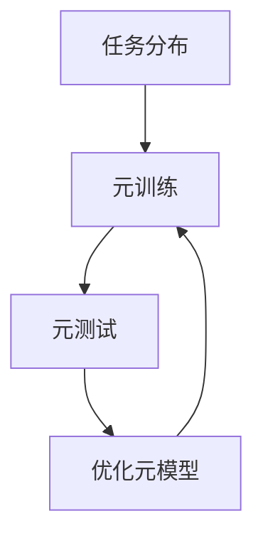

# 一切皆是映射：虚拟现实(VR)中基于元学习的交互系统设计

## 1.背景介绍

虚拟现实（VR）技术近年来取得了显著进展，广泛应用于游戏、教育、医疗等领域。然而，传统的VR交互系统往往依赖于预定义的规则和固定的交互模式，难以适应用户的个性化需求和复杂的交互场景。元学习（Meta-Learning）作为一种新兴的机器学习方法，能够通过学习如何学习来快速适应新任务和新环境，为VR交互系统的设计提供了新的思路。

元学习的核心思想是通过训练一个模型，使其能够在少量数据和有限时间内快速学习新任务。这种方法在VR交互系统中具有重要意义，因为VR环境中的交互场景和用户需求是多变且复杂的。通过引入元学习，VR交互系统可以更好地适应用户的个性化需求，提高交互体验的自然性和流畅性。

## 2.核心概念与联系

### 2.1 虚拟现实（VR）

虚拟现实是一种通过计算机技术生成的虚拟环境，用户可以通过视觉、听觉、触觉等多种感官与虚拟环境进行交互。VR技术的核心在于提供沉浸式体验，使用户感觉自己身处于虚拟世界中。

### 2.2 元学习（Meta-Learning）

元学习是一种机器学习方法，旨在通过学习如何学习来提高模型在新任务上的表现。元学习的基本思想是通过训练一个元模型，使其能够在少量数据和有限时间内快速适应新任务。元学习通常包括三个主要步骤：任务分布、元训练和元测试。

### 2.3 VR与元学习的结合

在VR交互系统中引入元学习，可以通过学习用户的交互习惯和偏好，快速适应不同用户和不同场景的需求。元学习可以帮助VR系统在有限的数据和时间内，快速调整交互模式，提高用户体验的个性化和自然性。

## 3.核心算法原理具体操作步骤

### 3.1 任务分布

任务分布是元学习的第一步，旨在定义一组相关任务的分布。在VR交互系统中，任务分布可以表示为不同用户的交互习惯和偏好。通过收集大量用户的交互数据，可以构建一个任务分布，用于训练元模型。

### 3.2 元训练

元训练是元学习的核心步骤，旨在通过任务分布中的任务来训练元模型。在VR交互系统中，元训练可以通过模拟不同用户的交互场景，训练一个能够快速适应新用户和新场景的元模型。元训练的目标是使元模型能够在少量数据和有限时间内，快速学习新任务。

### 3.3 元测试

元测试是元学习的最后一步，旨在评估元模型在新任务上的表现。在VR交互系统中，元测试可以通过实际用户的交互数据来评估元模型的适应能力和表现。元测试的结果可以用于进一步优化元模型，提高其在实际应用中的表现。

以下是元学习在VR交互系统中的流程图：



## 4.数学模型和公式详细讲解举例说明

### 4.1 元学习的数学模型

元学习的数学模型可以表示为一个三元组 $(\mathcal{T}, \mathcal{L}, \mathcal{M})$，其中 $\mathcal{T}$ 表示任务分布，$\mathcal{L}$ 表示损失函数，$\mathcal{M}$ 表示元模型。元学习的目标是通过最小化元损失函数 $\mathcal{L}_{meta}$ 来优化元模型 $\mathcal{M}$。

### 4.2 元损失函数

元损失函数 $\mathcal{L}_{meta}$ 可以表示为：

$$
\mathcal{L}_{meta} = \mathbb{E}_{\mathcal{T} \sim p(\mathcal{T})} \left[ \mathcal{L}(\mathcal{M}(\mathcal{T})) \right]
$$

其中，$p(\mathcal{T})$ 表示任务分布，$\mathcal{L}(\mathcal{M}(\mathcal{T}))$ 表示元模型在任务 $\mathcal{T}$ 上的损失。

### 4.3 元训练过程

元训练过程可以表示为：

$$
\theta^{*} = \arg \min_{\theta} \mathbb{E}_{\mathcal{T} \sim p(\mathcal{T})} \left[ \mathcal{L}(\mathcal{M}_{\theta}(\mathcal{T})) \right]
$$

其中，$\theta$ 表示元模型的参数，$\mathcal{M}_{\theta}$ 表示参数为 $\theta$ 的元模型。

### 4.4 举例说明

假设我们有一个简单的VR交互任务，用户需要在虚拟环境中选择物体。我们可以定义一个任务分布 $\mathcal{T}$，表示不同用户的选择习惯。通过收集大量用户的选择数据，我们可以构建一个任务分布，用于训练元模型。

在元训练过程中，我们可以通过模拟不同用户的选择场景，训练一个能够快速适应新用户选择习惯的元模型。元训练的目标是使元模型能够在少量数据和有限时间内，快速学习新用户的选择习惯。

在元测试过程中，我们可以通过实际用户的选择数据来评估元模型的适应能力和表现。元测试的结果可以用于进一步优化元模型，提高其在实际应用中的表现。

## 5.项目实践：代码实例和详细解释说明

### 5.1 环境配置

在开始项目实践之前，我们需要配置开发环境。以下是所需的工具和库：

- Python 3.8+
- TensorFlow 2.0+
- NumPy
- Matplotlib

### 5.2 数据准备

首先，我们需要准备用户的交互数据。假设我们有一个包含用户选择数据的CSV文件，每行表示一个用户的选择记录。我们可以使用Pandas库来加载和处理数据。

```python
import pandas as pd

# 加载数据
data = pd.read_csv('user_interactions.csv')

# 查看数据
print(data.head())
```

### 5.3 模型定义

接下来，我们定义一个简单的元模型。这里我们使用一个两层的全连接神经网络作为元模型。

```python
import tensorflow as tf
from tensorflow.keras import layers

# 定义元模型
class MetaModel(tf.keras.Model):
    def __init__(self):
        super(MetaModel, self).__init__()
        self.dense1 = layers.Dense(64, activation='relu')
        self.dense2 = layers.Dense(1, activation='sigmoid')

    def call(self, inputs):
        x = self.dense1(inputs)
        return self.dense2(x)

# 实例化元模型
meta_model = MetaModel()
```

### 5.4 元训练

在元训练过程中，我们使用用户的交互数据来训练元模型。这里我们使用Adam优化器和二元交叉熵损失函数。

```python
# 定义损失函数和优化器
loss_fn = tf.keras.losses.BinaryCrossentropy()
optimizer = tf.keras.optimizers.Adam()

# 训练元模型
for epoch in range(10):
    for batch in data:
        with tf.GradientTape() as tape:
            predictions = meta_model(batch['inputs'])
            loss = loss_fn(batch['labels'], predictions)
        gradients = tape.gradient(loss, meta_model.trainable_variables)
        optimizer.apply_gradients(zip(gradients, meta_model.trainable_variables))
    print(f'Epoch {epoch}, Loss: {loss.numpy()}')
```

### 5.5 元测试

在元测试过程中，我们使用新的用户交互数据来评估元模型的表现。

```python
# 加载测试数据
test_data = pd.read_csv('new_user_interactions.csv')

# 评估元模型
for batch in test_data:
    predictions = meta_model(batch['inputs'])
    loss = loss_fn(batch['labels'], predictions)
    print(f'Test Loss: {loss.numpy()}')
```

## 6.实际应用场景

### 6.1 游戏

在游戏中，VR交互系统可以通过元学习快速适应不同玩家的操作习惯和偏好，提高游戏体验的个性化和沉浸感。例如，元学习可以帮助游戏系统根据玩家的操作习惯，自动调整游戏难度和交互方式。

### 6.2 教育

在教育领域，VR交互系统可以通过元学习快速适应不同学生的学习习惯和需求，提高教学效果和学习体验。例如，元学习可以帮助教育系统根据学生的学习进度和兴趣，自动调整教学内容和交互方式。

### 6.3 医疗

在医疗领域，VR交互系统可以通过元学习快速适应不同患者的需求和状况，提高医疗效果和患者体验。例如，元学习可以帮助医疗系统根据患者的病情和反应，自动调整治疗方案和交互方式。

## 7.工具和资源推荐

### 7.1 开发工具

- **Unity**：一款强大的游戏引擎，广泛用于VR应用的开发。
- **Unreal Engine**：另一款流行的游戏引擎，具有强大的图形渲染能力。
- **TensorFlow**：一个开源的机器学习框架，支持元学习模型的开发和训练。

### 7.2 学习资源

- **《Deep Learning》**：一本经典的深度学习教材，涵盖了元学习的基本概念和方法。
- **Coursera上的元学习课程**：提供了系统的元学习理论和实践课程。
- **GitHub上的开源项目**：可以参考和学习其他开发者的元学习项目和代码。

## 8.总结：未来发展趋势与挑战

### 8.1 未来发展趋势

随着VR技术和元学习方法的不断进步，基于元学习的VR交互系统将会在更多领域得到应用和发展。未来，VR交互系统将更加智能化和个性化，能够更好地适应用户的需求和场景的变化。

### 8.2 挑战

尽管基于元学习的VR交互系统具有广阔的应用前景，但仍面临一些挑战。例如，如何高效地收集和处理用户的交互数据，如何设计和优化元模型以提高其适应能力和表现，都是需要进一步研究和解决的问题。

## 9.附录：常见问题与解答

### 9.1 什么是元学习？

元学习是一种机器学习方法，旨在通过学习如何学习来提高模型在新任务上的表现。元学习的基本思想是通过训练一个元模型，使其能够在少量数据和有限时间内快速适应新任务。

### 9.2 元学习在VR交互系统中的应用有哪些优势？

元学习在VR交互系统中的应用具有以下优势：
- 能够快速适应不同用户和不同场景的需求，提高交互体验的个性化和自然性。
- 能够通过学习用户的交互习惯和偏好，自动调整交互模式，提高用户体验的流畅性和沉浸感。

### 9.3 如何开始学习和应用元学习？

可以通过以下步骤开始学习和应用元学习：
- 学习元学习的基本概念和方法，可以参考相关教材和在线课程。
- 选择一个合适的开发工具和框架，如TensorFlow，进行元学习模型的开发和训练。
- 通过实际项目实践，积累经验和提高技能。

作者：禅与计算机程序设计艺术 / Zen and the Art of Computer Programming